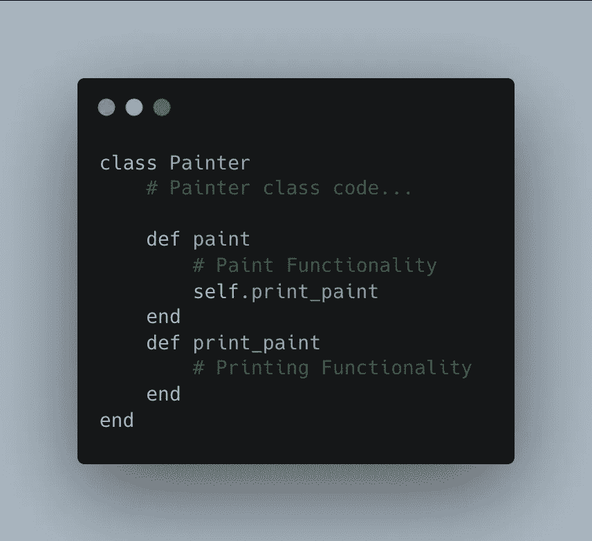
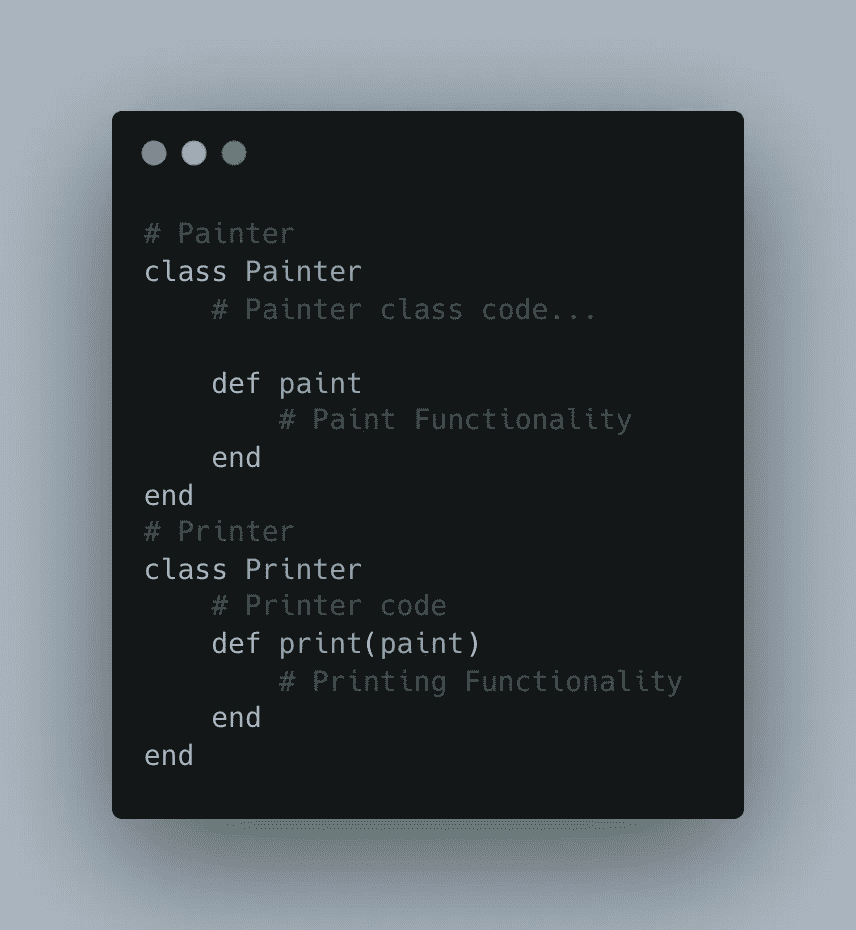
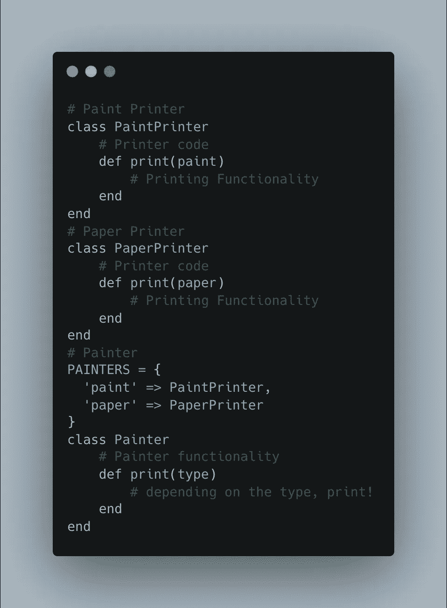
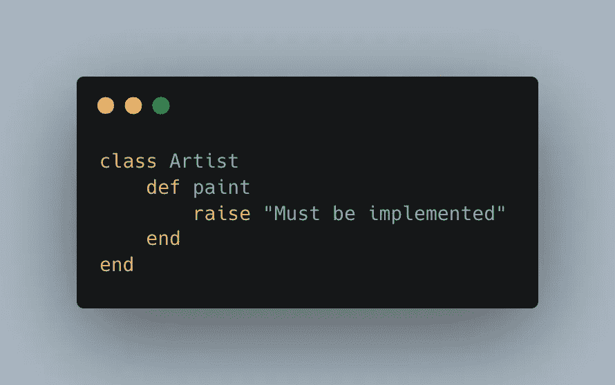
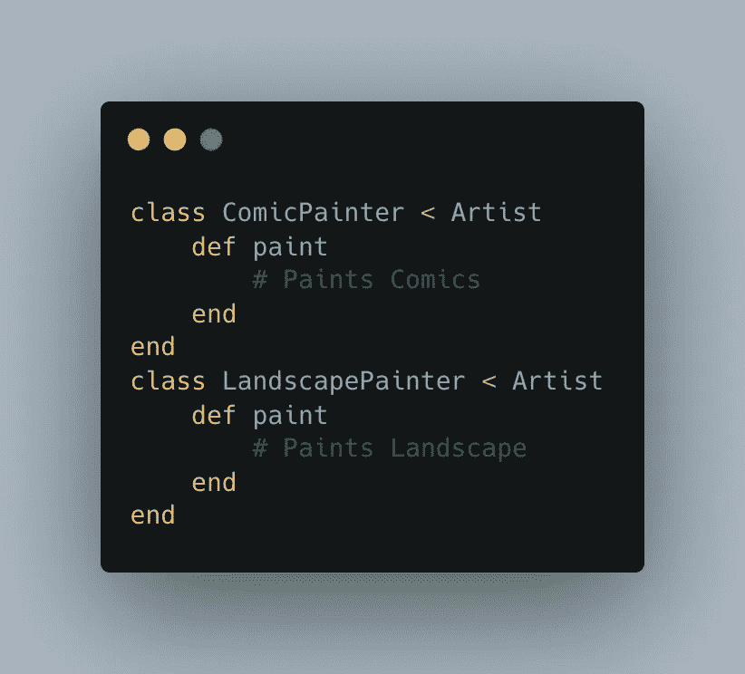
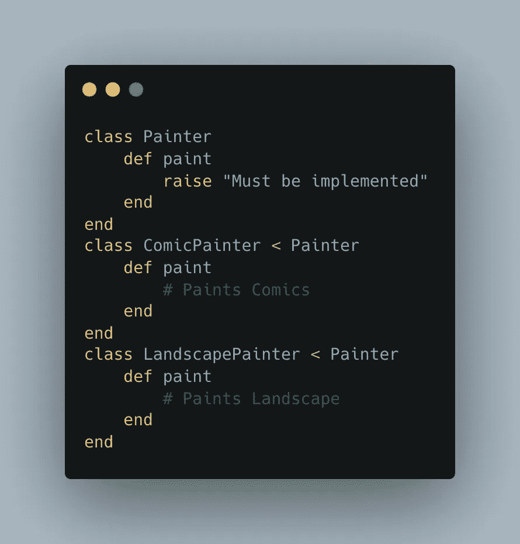
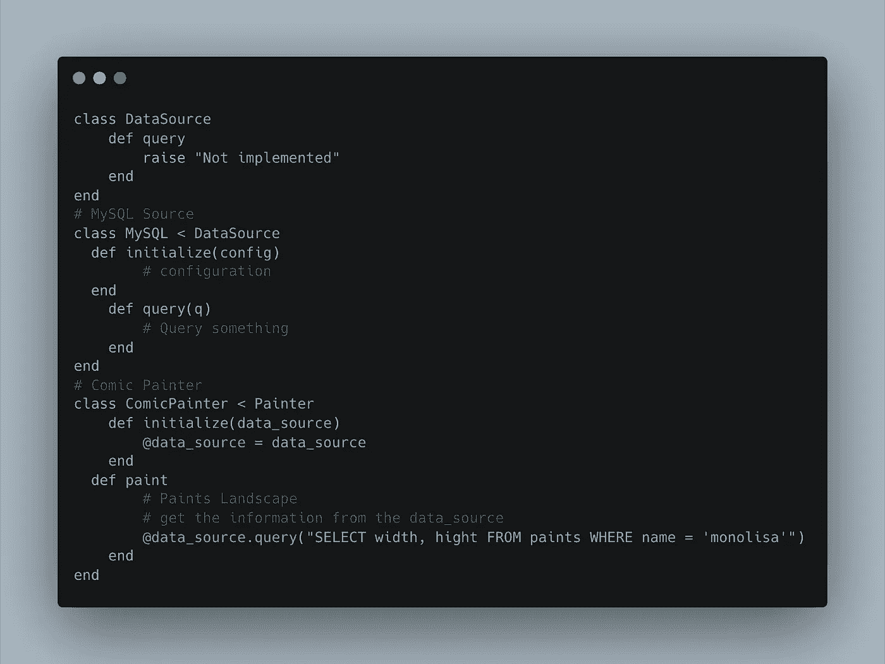

# Ruby 的坚实原则

> 原文：<https://blog.devgenius.io/solid-principles-with-ruby-%EF%B8%8F-6adfbe1f6481?source=collection_archive---------4----------------------->

在这篇文章中，我们将学习坚实的原则以及如何在 Ruby 中使用它们💎。

S **OLID** 原则是面向对象设计中与软件开发相关的概念。单一责任原则、开闭原则、利斯科夫替代原则、界面分离原则和依赖倒置原则都是固体的缩写。

# 单一责任原则

> 一个班级应该有且只有一个改变的理由——罗伯特·c·马丁

E 非常班应该有一个**单**任务要完成。说得更具体一点，应该只有一个理由可以换课。下面是一个 Ruby 类违反单一责任(SRP)原则的例子:

但是，该代码**违反了**单一责任原则；为了避免破坏东西，我们必须**将**这些逻辑分成单独的类:

这种方法有助于分离责任，并确保可预测的变化。如果我们只需要改变打印功能，我们可以在不改变绘画功能的情况下改变打印功能。它还有助于预测功能的任何变化。

# 开闭原理

> 面向对象设计最重要的原则——罗伯特·马丁

S 软件实体(如类、模块、函数)对于**扩展**应*打开*，对于**修改**应*关闭*。

它指导您以这样一种方式编写代码，即您可以在不更改现有代码的情况下添加新功能。如前面的例子所示，我们有打印功能，但它非常普通；如果我们想打印一张 A4 纸呢？

我们可以改变相同的类和方法，但这是一个不好的模式，因为它违反了开放/封闭原则。通过修改类，我们有可能做出意想不到的改变。当某些东西被更改或添加时，可能会导致现有代码中出现未知问题。

我们可以扩展功能来添加功能，同时避免改变实体。所以，让我们为每一个都制作一个类。我们可以扩展功能来添加功能，同时避免改变实体。因此，对于其中的每一个，让我们创建一个单独的类:

# 利斯科夫替代原理

里斯科夫替换原则(LSP)适用于继承层次结构，因此派生类必须完全可以替换它们的基类。

要理解这个原理，首先要理解问题。根据开放/封闭原则，我们将软件设计成可扩展的。我们开发了一个执行特定功能的子类`printer`。调用方不知道被调用的类。这些类的行为必须一致，这样调用者就不能区分它们。通过行为，我们的意思是类的方法应该是一致的。这些类的方法应该具有以下特征:

*   采用相同数量的参数和数据类型。
*   应该返回相同的数据类型。
*   同姓

假设我们有一个漫画画家和一个风景画家，我们想演示绘画功能:

首先，我们来定义一下我们的基类。

现在我们有了基类，让我们创建漫画和风景画家:

paint 方法必须出现在继承基类的任何子类中。如果不存在，将生成一个错误，指示必须实现该方法。我们可以通过这种方式确保子类是一致的。调用者总是可以确定`paint`方法存在。

这个原则有助于容易地替换任何子类，而不会破坏东西，也不需要做很多改变。

# 接口隔离原则(ISP)

> 客户不应该被迫依赖他们不使用的接口。罗伯特·马丁

不应该强迫客户依赖他们不使用的接口成员，换句话说，不要强迫任何客户实现与他们不相关的接口；ISP 只适用于静态语言，Ruby 是动态语言，没有接口的概念。接口定义了类抽象的规则(契约)。

虽然 Ruby 没有接口，但是我们可以使用类和子类的概念来创建类似的东西。

子类`LandscapePainter`继承自用于里斯科夫替换原理的例子中的一般类`Artist`。然而，`Artist`是一个非常通用的类，它可能包含额外的方法。如果我们需要另一个功能，比如`Sketch`，它必须是`Painter`的子类。`Sketch`不一定要有`paint`方法，但是会依赖于它。因此，我们可以为此创建一个特定的类，而不是一个通用类:

# 从属倒置原则

T 何**依赖倒置原则(DIP)** 声明我们应该依赖抽象(接口和抽象类)而不是具体的实现(类)。**抽象不应该依赖于细节；相反，细节应该取决于抽象**。

任何具有单一责任的类都需要其它类的项目才能运行。为了绘制下一个 monolisa，我们需要从数据库中获取信息并绘制到一个文件中。我们试图使用单一责任原则，让每个班级只有一项工作。但是，从数据库中读取数据和向文件中写入数据必须在同一个类中完成。

消除这些依赖性并分离主要业务逻辑至关重要。这使得代码在变化过程中更加流畅，并且变化变得更加可预测。依赖关系必须反转，并且模块的调用方必须对依赖关系拥有控制权。

让我们看一个例子来理解我的意思:

通过这样做，我们分离了类，并删除了任何硬编码的值。

# 摘要

可靠的设计有助于分离代码，使修改更容易。构建解耦的、可重用的、响应变化的程序是至关重要的。所有五项坚实的原则应该共存，因为它们相辅相成。一个设计良好的代码库适应性强，修改简单，使用愉快。任何新开发人员都可以很快上手并掌握代码。

我希望你觉得这篇文章有趣，❤️！