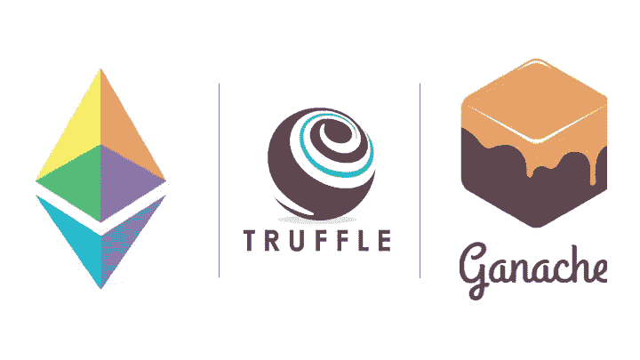

# 初学者坚实度指南

> 原文：<https://blog.devgenius.io/solidity-guide-for-beginners-66115787f8ef?source=collection_archive---------9----------------------->

**以太坊编程初学者。**

以太坊因其在区块链编程中的广泛应用而闻名。尤其是 Solidity 被用来编写今天已知的大多数区块链应用程序。在这里，我将帮助你毫不费力地学会稳健。

## 1-学习 JavaScript

因为您同时与互联网和以太坊节点交互，所以学习 JavaScript 对于理解 solidity 的数据结构是必要的。甚至，以太坊节点与 nodej 交互。此外，solidity 是用 JavaScript 编写的，它需要对 JavaScript 有一个基本的理解才能在以太坊环境中工作。

## 2-寻找课程(在线/离线)

当我开始学习 solidity 时，我的第一门课程是免费面授的，因为我俱乐部的关系。但我从未停止，并决定进一步购买 udemy 课程，并在 YouTube 上寻找高质量的课程，你可以通过练习提高你的扎实技能。关于线下课程，它们对你来说可能很贵，而在线课程可以让你看视频，终身提问。

## 3-记笔记并练习

在我之前的帖子中提到过，用手记笔记可以让你在很长时间不练习的时候不容易忘记。更重要的是，记住数据结构可以帮助你分析代码，即使是可以想象的最大的项目。尽管我是初学者，我还是设法在以太坊的加速项目中找到了大多数错误。

## 4-设置文本编辑器(可选)

如果你更喜欢在项目中使用 remix IDE，你就不必这样做了。但是您可能需要考虑某些文本编辑器，以便在以太坊上编程时获得最佳结果。但是，它们要求你在开始在这些文本编辑器上编写代码之前下载某些包，以便在你的计算机上编译 solidity 代码。

## 5-学习使用松露和 infura(如果你使用以太坊的混音，松露是可选的)

块菌是一种土壤。计算机中用于与智能合约交互的编译器(用于编译 solidity 程序)。Infura 是一个 web API，用于使用您的帐户地址与以太坊网络的智能合约进行交互。而且需要下载 truffle、ganache、brew 才能让所有以太坊程序作为一个整体工作。或者，你可以通过下载 chrome 和激活 metamask 扩展来使用 remix IDE，而不用担心删除和编译它们。但是这需要在部署代码之前进行自动化测试。

*你觉得初学者的坚实度指南怎么样？请在下面的评论区分享你的经历。*