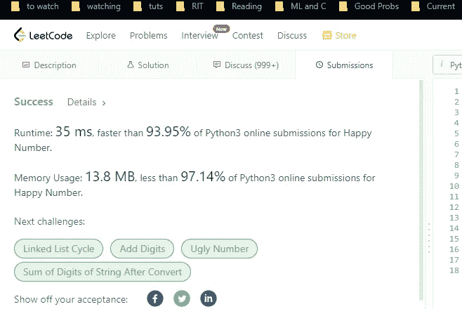
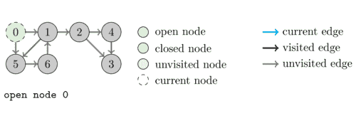
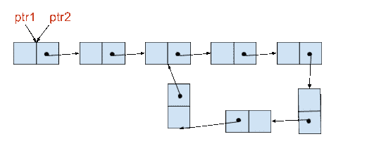

# [解决方案]快乐数字[IBM]

> 原文：<https://blog.devgenius.io/solution-happy-number-ibm-c5c6974c1515?source=collection_archive---------12----------------------->

## 这个 Leetcode 问题的 Python 代码

以下是我对 Leetcode 问题的解决方案，快乐数字。这是从我的时事通讯《技术变得简单》中摘录的。更多信息在最后。



这个问题可以被发现为问题 **202。** Leetcode 上的快乐数字。

# 问题

写一个算法，判断一个数字`n`是否快乐。

一个**快乐数字**是由以下过程定义的数字:

*   从任意正整数开始，用数字的平方和替换数字。
*   重复这个过程，直到数字等于 1(它将停留在那里)，或者它**在不包括 1 的循环**中无休止地循环。
*   这个过程**以 1** 结束的那些数字是快乐的。

如果 `n` *是喜数则返回`true` *，如果不是*则返回* `false`。

**例 1:**

```
Input: n = 19
Output: true
Explanation:
1^2 + 9^2 = 82
8^2 + 2^2 = 68
6^2 + 8^2 = 100
1^2 + 0^2 + 0^2 = 1
```

**例二:**

```
Input: n = 2
Output: false
```

**约束:**

*   `1 <= n <= 2^(31) - 1`

你可以在这里测试你的解决方案


照片由 [Mikita Yo](https://unsplash.com/@mikitayo?utm_source=medium&utm_medium=referral) 在 [Unsplash](https://unsplash.com?utm_source=medium&utm_medium=referral) 上拍摄

# 步骤 1:分析定义

在这种情况下，我认为最好是通过尝试分解问题中给出的定义来进行攻击。通过清楚地定义问题和所有的定义，我们可以获得许多对问题的洞察力。在许多情况下，它可以帮助你想出数学规则和公式，让你比一般人更快地解决问题。这可能只是我的数学学位，并在人工智能领域工作，但这种方法绝对是一种竞争优势。没有多少软件人员积极尝试寻找模式或数学/算法语句。即使你不能想出完整的函数来生成输出，你也会对如何解决/优化这个问题有所了解。

当攻击定义时，我喜欢自下而上，从最简单的开始。经常阅读的人都知道低挂水果有多强大，尤其是在像面试这样的场合，你需要以连贯的方式交流你的想法。所以我们来攻击一下我们能看到的最小定义——*一个数无休止的循环是什么意思？*

这对你们来说似乎是显而易见的，但是请后退一步。你如何定义一个无限循环？有些数字可能需要很长很长的时间才能收敛到快乐，但他们并不快乐。称他们不开心是错误的，可能会伤害他们的感情。

所以，让我们绞尽脑汁，看看是否能想出点什么来。回想一下你如何判断我们是否陷入了一个循环。常用的定义有哪些？

# 骑自行车

请注意这个问题。给定一个数 x，只能去另外一个 y，比如给定 2，只能生成 4。由于给定的规则，我们不能在给定一个输入的情况下找到不同的数字。**我们的解决方案是确定性的**(这只是一个花哨的数学术语，适用于那些真正想在面试官面前展现自己优势的人)。

这意味着，如果我们在一次运行中已经看到一个数字，我们就陷入了一个循环。我们已经知道我们将何去何从，我们最终会回到这一点。我们会在原地打转。



顺便说一下，注意这是一个非常简单的图循环检测问题。很漂亮吧？[图片来源](https://inginious.org/course/competitive-programming/graphs-dfs?lang=fr)

如果你在这之前发现了这一点，给自己一个鼓励。很有洞察力。如果你做不到，不要太自责。做好这一点需要时间和努力。既然你来了，就去工作吧。你的结果是有保证的。现在让我们回到问题上来。

因此，我们可以应用标准的循环检测算法来快速完成任务。最好的方法是保存一个集合来跟踪被访问的节点。虽然使用弗洛伊德的算法可以做到这一点，但这种方法在实践中似乎表现不太好。这是因为，对于大周期，收敛相对较慢。我们的解决方案使用了更多一点的内存，但是将总是在第一个公共节点处停止。弗洛伊德的循环检测不会这样做(但需要更少的内存)。



使用快速指针和慢速指针是一项非常方便的技能。走过这段路没什么不好。[来源](https://www.codesdope.com/blog/article/detect-a-loop-in-linked-list-using-floyds-cycle/)

确保你在面试中探索这种权衡。两种解决方案都有相同的时间复杂度，但是使用集合通常会更快。问你的面试官他们更喜欢哪一个(这真的显示了你的知识和考虑选择的能力)。我将使用一套来分享解决方案，但请确保您两者都练习了。如果你们中的任何人想要其他的解决方案，只要回复这封邮件(或者使用下面的链接)让我知道。然而，首先我建议你自己建立一个替代方案来获得最大的收益。

# 密码

一旦我们知道检测周期，代码就相对简单了。看看下面。

```
class Solution:
    def isHappy(self, n: int) -> bool:

        def squareDigits(old_n):
            new_n = 0
            while old_n > 0:
                digit = old_n % 10
                new_n += pow(digit, 2)
                old_n //= 10
            return new_n

        seen = set()
        while n!=1 and n not in seen:
            seen.add(n)
            n = squareDigits(n)

        return n==1
```

## 时间复杂度- O(n)。

## 空间复杂度- O(n)


如果你喜欢这篇文章，你会喜欢我的每日电子邮件简讯[技术使之变得简单](https://codinginterviewsmadesimple.substack.com/)。它涵盖了算法设计、数学、人工智能、数据科学、最近的技术事件、软件工程等主题，让你成为更好的开发人员。 [**我目前正在进行全年八折优惠，所以一定要去看看。**](https://codinginterviewsmadesimple.substack.com/subscribe?coupon=1e0532f2) 使用此折扣会降低价格-

***每月 800 印度卢比(10 美元)→ 533 印度卢比(8 美元)***

***每年 8000 印度卢比(100 美元)→6400 印度卢比(80 美元)***

[你可以在这里了解更多关于时事通讯的信息](https://codinginterviewsmadesimple.substack.com/about)


# 向我伸出手

使用下面的链接查看我的其他内容，了解更多关于辅导的信息，或者只是打个招呼。另外，查看免费的罗宾汉推荐链接。我们都得到一个免费的股票(你不用放任何钱)，对你没有任何风险。**所以不使用它只是失去免费的钱。**

为了帮助我了解你[填写这份调查(匿名)](https://forms.gle/7MfQmKhEhyBTMDUD7)

查看我在 Medium 上的其他文章。https://rb.gy/zn1aiu

我的 YouTube:[https://rb.gy/88iwdd](https://rb.gy/88iwdd)

在 LinkedIn 上联系我。我们来连线:[https://rb.gy/m5ok2y](https://rb.gy/f7ltuj)

我的 insta gram:[https://rb.gy/gmvuy9](https://rb.gy/gmvuy9)

我的推特:[https://twitter.com/Machine01776819](https://twitter.com/Machine01776819)

如果你想在科技领域发展事业:[https://codinginterviewsmadesimple.substack.com/](https://codinginterviewsmadesimple.substack.com/)

获得罗宾汉的免费股票:[https://join.robinhood.com/fnud75](https://join.robinhood.com/fnud75/)