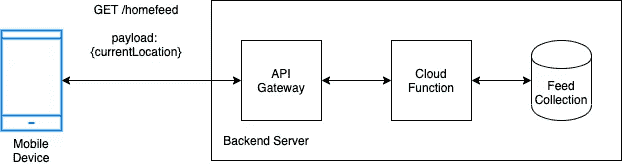
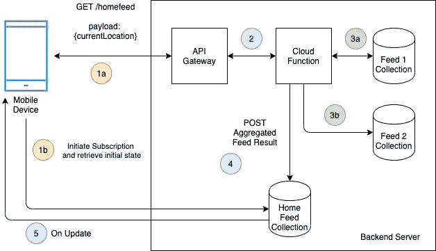

# 解决方案架构师反应:简介和新闻提要架构

> 原文：<https://blog.devgenius.io/solutions-architect-reacts-introduction-and-newsfeed-architecture-b1fa633efa07?source=collection_archive---------21----------------------->

在 Toggled，我们有一个优秀的创新思想家团队，他们不仅以快速交付为荣，而且以规模为荣。我们在 IT 行业 20 多年的共同经验教会了我们许多经验，告诉我们如何解决客户的问题并设计出能够带来最大价值的解决方案。

这一系列文章将致力于帮助您更快交付的固执己见的参考架构。我们将详述的解决方案是我们在现实生活中遇到的事情，以及我们如何着手解决它们(因此标题为“解决方案架构师的反应”)。我们可能会在某些方面钻研代码，但我们的目标是理解设计概念，而不是底层实现。

所以让我们言归正传。

戴维·特拉维斯在 [Unsplash](https://unsplash.com?utm_source=medium&utm_medium=referral) 上拍摄的照片

作为一名解决方案架构师，我总是从高层次的愿景开始。我们想达到什么目的？(我们将在另一篇文章中详述我们的**切换** **框架**用于问题分解)我将以我们最近在 [UpForThat](http://upforthat.co) 应用中遇到的挑战开始第一篇文章。

# **视觉**

一个移动应用程序，根据用户的位置为用户提供最新的本地信息。

我们最新的应用程序 upfor that([upforthat.co](http://upforthat.co))

# 进一步要求

*   我需要应用程序来拾取和显示与用户当前位置相关的 feed 项目(如新闻、事件、广告)。
*   我有多个信息源，需要汇总到一个“主源”中。
*   “Home Feed”需要高性能和快速加载。
*   即使当手机离线时,“主页订阅源”仍然应该填充有订阅源项目。

# 相似的实现

*   脸书饲料
*   Instagram Feed
*   其他新闻聚合器，如 Feedly

# 技术

*   反应自然
*   火基地([https://firebase.google.com/](https://firebase.google.com/))

正如简介中所解释的，技术并不重要。但是，我将详细介绍我们正在利用的特定功能，这可能会指导您自己的实现和技术选择。

对于任何问题，我们首先需要把它分解成小块。我们对这一过程的想法将是另一个切换后框架的主题。

# 单级馈电

我们的简单案例可以归结为:

> 我想检索并显示基于用户当前位置的相关数据。在最简单的情况下，我们可以采取一个饲料。

单馈架构

这可以通过一个简单的 *GET* 请求来完成，将用户的位置作为参数传入。

一般来说，API 网关是我们后端服务的接口，通常它也处理用户认证。 [React Native Firebase](https://rnfirebase.io) 为我们自动处理认证。

云函数处理 *GET* 请求，并对集合进行查询。然后，云功能返回与用户位置相关的提要条目，这些条目随后被转发回设备。云功能是 GCP/Firebase 版本的无服务器功能。

到目前为止一切顺利。就整体愿景而言，我们仍然缺少一些东西。该实现不满足三个要求:

*   目前我们只提供一种饲料。我们希望将多个提要聚合成一个“主提要”
*   每次我们在设备上启动“Home Feed”视图时，我们都需要等待请求完成后再显示结果。这可能需要很长时间，具体取决于在数据库上执行的查询。
*   当请求被执行时，我们必须等待回复，如果我们离线，那么 *GET* 请求将不会收到回复。这意味着用户界面可能是空白的，或者最多显示一个装载微调器，直到我们重新上线。

# 复馈

让我们把简单的例子变得更复杂:

> 我想检索并显示基于用户当前位置的相关数据。该提要将是多个提要的集合。

多馈电结构

扩展我们的单馈架构。我们将在组合中添加一个额外的饲料。

这一点的关键是让云功能为我们做繁重的工作。原则上，我们希望后端服务器做尽可能多的计算，以允许客户端(移动设备)专注于可视化，而不用担心对象操作。

考虑到这一点，云函数查询每个集合并将数据聚合到一个对象中。

为了提高效率，我在 NodeJS 中使用 Promise.all 并行化了数据库查询。有几种方法可以组合来自不同数据源的数据，但我将重点介绍两种方法:

*   交错是组合来自不同数据源的数据的最简单方法。所有这一切意味着将不同的数据源均匀分布，以形成一个单一的数据源。

> 例如，对于坐标数据，`x0 y0 z0 w0 x1 y1 z1 w1 x2 y2 z2 w2`是交错的，而`x0 x1 x2 x3 y0 y1 y2 y3 z0 z1 z2 z3 w0 w1 w2 w3`不是。— [维基百科](https://en.wikipedia.org/wiki/Interleaving_(data))

*   算法方法是一种更复杂的方法，它可能不会向用户呈现特定的模式。但可能取决于许多用户特定的因素，比如 Instagram feed。

> 新的 Instagram 算法决定了用户在滚动订阅源时看到的帖子的顺序。
> 
> 根据特定的信号，它对帖子进行优先排序，将最相关的帖子推到顶部，并给予它们最大的可见性，而其他内容最终会被放在订阅源的更下方。— [购物](https://www.shopify.com/blog/instagram-algorithm)

这是我们最初设计的一个很好的迭代，所以让我们继续吧。就我们的整体愿景而言，我们仍然没有解决“主数据源”的异步加载问题。每次加载提要时，我们都必须等待响应。这可能会导致糟糕的用户体验，并且不符合以下要求:

*   “Home Feed”需要高性能和快速加载。
*   即使当手机离线时,“主页订阅源”仍然应该填充有订阅源项目。

# 高性能和用户友好的加载

再次让我们首先用最简单的形式来描述我们的问题:

> 我希望以一种高效的方式从后端检索和显示数据，这种方式可以最大限度地减少长时间等待的需要，并让用户无论在线还是离线都有一致的用户体验。

高性能和用户友好的加载架构

这是我利用一些特定的 Firebase 功能的地方，也是我给你如何替代你自己的技术的提示的地方。在我解释这个架构之前，有一些事情需要了解:

*   Firebase 为客户端(React Native app)提供了订阅 Firestore (Firebase 的集合数据库)中特定集合和文档的更改的能力。为了实现这一点，他们可能会实现自己的长轮询或 web 套接字解决方案，或者使用其他可能提供相同功能的技术。
*   Firestore 支持离线数据持久性。此功能会缓存您的应用程序正在使用的 Firestore 数据的副本，以便您的应用程序可以在设备离线时访问这些数据。您可以写、读、听和查询缓存的数据。当设备恢复在线时，云 Firestore 会将您的应用程序所做的任何本地更改同步到云 Firestore 后端。同样，为了实现这一点，您可以实现自己的解决方案或使用其他技术。

考虑到这一点，我将浏览上述架构:

1a。和以前一样，移动设备向我们的 API 网关发送一个 GET 请求以及用户的当前位置，以启动提要聚合过程。提醒一下，这是我们可以识别用户的地方。这是步骤 4 所必需的。

1b。然而，与此同时，我们的移动设备创建了对“Home Feed”集合中的用户文档的订阅。作为自动操作，除了接收后续更新之外，我的客户端还从缓存(离线)或实时收藏本身(在线)加载以前的“主页订阅”项目。设置我异步显示信息。

2.和以前一样，我启动了一个云函数来聚合提要。

3a + 3b。和以前一样，我查询相关的集合并聚合结果。

4.一旦创建了结果“Home Feed”对象，我*将结果发布*到“Home Feed”集合中，特别是引用首先开始该过程的用户(在步骤 1a 中检索)。)

5.因为在步骤 1b 中客户端订阅了用户的“Home Feed”文档，所以我自动被推送到一个新的“Home Feed”对象的更新。然后，客户端向用户显示这一信息。

# 结论

暂时就这样吧！希望这能让你知道如何解决类似的问题，并提供一些参考架构，作为你自己设计的基础。

请记住，所有的设计都是迭代的，因此我们很想听听您可能希望如何改进我们的架构，或者您如何实现类似的解决方案。

请完整查看我们的 UpForThat，看看我们最近在做些什么:

 [## 向上

### 只需快速点击三下，你就可以选择今天或明天要做什么活动。留在圈子里…

upforthat.co](https://upforthat.co/) 

这是我们的第一个帖子，所以我们鼓励你发表评论，如果有具体的问题，你希望看到我们的团队在 Toggled 铲球，请告诉我们。Toggled 的每个人都祝你一切顺利，下一篇文章再见！