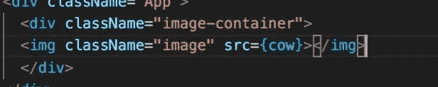
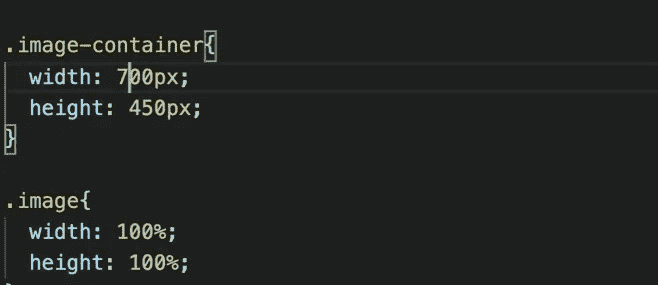
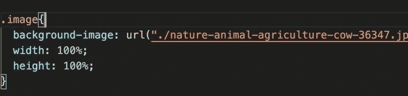
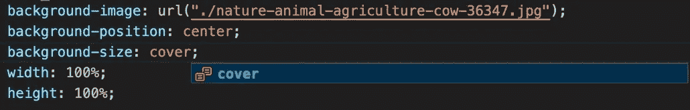
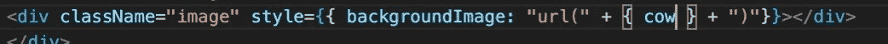

# 永远解决您的图像大小和定位问题。

> 原文：<https://blog.devgenius.io/solve-your-image-sizing-and-positioning-problems-forever-7859e24118ce?source=collection_archive---------0----------------------->

## 反应


# 你准备好停止怪异尺寸问题的暴政了吗？

你老板买了一些照片。他们希望您将图片塞进某个 UI 组件中，并希望它在任何地方看起来都很完美(大写的 E)。两个月后，他们在手机上打开他们的网站，看到他们的图像被切割成一个小盒子，或者图像被不成比例地压扁了。

## 有一种方法可以解决所有屏幕尺寸、所有卡片尺寸或任何其他用例的问题。让我们弄清楚。

# 默认行为



将图像导入我们的组件，并将其放在页面上。这就是发生的事情。

假设你制作了一个相对于视口大小的容器。我把研究留给你。各种消费设备有超过 10，000 种不同的屏幕尺寸。有小到 360px 宽的手机。有 5k 的 iMacs。也许一个人正在 4k 电视上使用他们的计算机。我都看过了。更好的是，您的用户可以简单地调整浏览器窗口的大小来查看其他内容。

您的图片将永远不会匹配的比例视口。你的浏览器会相应地放大图片，造成这种拉伸的样子。

# 如果我们把容器正常化呢？

我们可以制作一个具有硬编码尺寸的图像容器，它不会偏离图像尺寸的比例。



这已经做了一些事情。图像在调整大小时不再扩大，但我们可以看到，如果视窗比尺寸更窄，它会水平向下扩大图像，使其再次拉伸。如果视窗太短，它会切掉图像的底部。

此外，如果用户使用的是大屏幕，该图像不会自动放大或缩小，因此最终的设计可能会有过大或过小的图像。

# CSS 有一些内置的特性来帮助我们

让我们尝试一种不同的方法。我们可以直接在 CSS 文件中引用它，而不是将图像导入到组件中，这样我们就可以将它用作“背景图像”



默认情况下,“背景图像”不会缩小图像以适应 div，所以我们只能看到图像的顶角。

# CSS 有更多的内置特性

在 CSS 中我们有背景图片选项。



```
background-position: center
```

这告诉浏览器将图像放在 div 的中心。

```
background-size: cover
```

这告诉浏览器自动缩小图像以适合 div 的大小。

这个很好用。

我们的奶牛看起来很开心，平静，而且很专注。它将保持这种方式，其容器具有动态尺寸。你可以把这个容器放在任何地方。它可以是一张卡片的一半，也可以是一个屏幕宽度的横幅，就像我们在 bing.com 看到的那样。

# 如果我们从其他地方获取图片，并且不容易在存储库中将其作为兄弟文件引用，该怎么办？

您可以从任何地方获取图像的链接，并通过内联样式将其作为背景图像传递。



只要你在 CSS 文件中完成了其他的 CSS 设置，它将会同样工作。使用它，你甚至可以构建逻辑来拥有某种轮播，它可以加载你想要的任意数量的图像，并将它们应用于各种 CSS 类。

下次见。