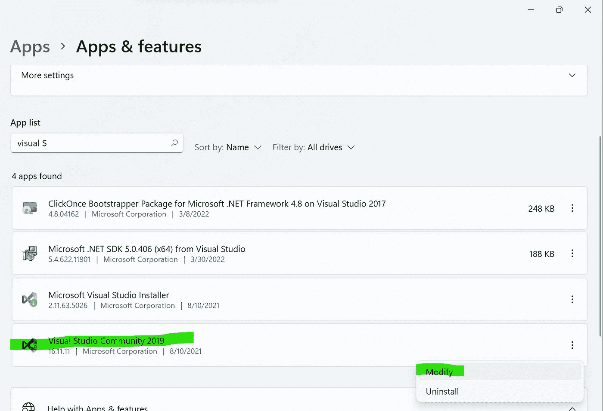
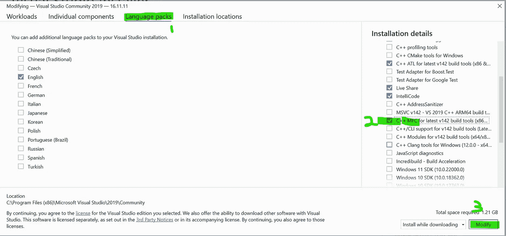
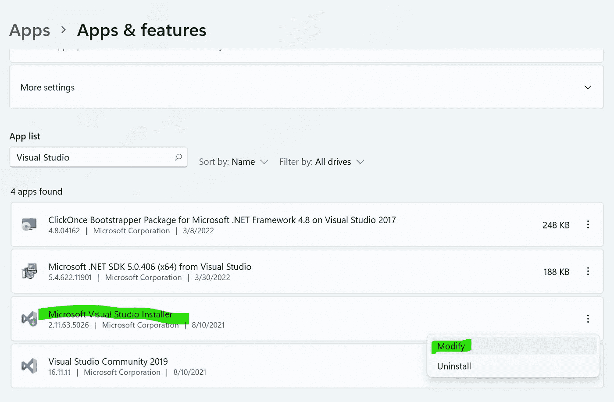
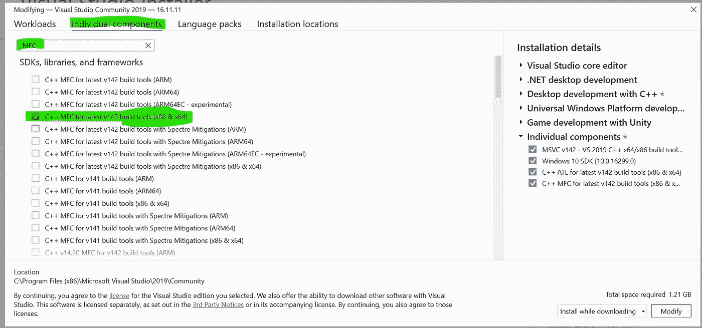
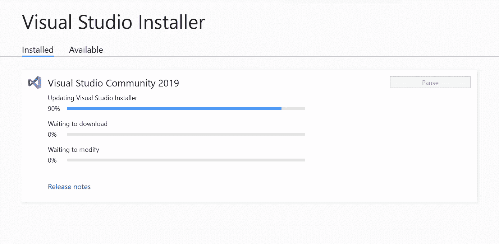

# [已解决]此项目需要 MSB8041 MFC 库错误。对于正在使用的任何工具集和体系结构，从 Visual Studio 安装程序(单个组件选项卡)安装它们。测试 C:\ Program Files(x86)\ Microsoft Visual Studio \ 2019 \ Community \ MSBuild \ Microsoft \ VC \ v 160 \ Microsoft。CppBuild.targets 479

> 原文：<https://blog.devgenius.io/solved-error-msb8041-mfc-libraries-are-required-for-this-project-2a25e43951d9?source=collection_archive---------1----------------------->

## 错误代码和解决方案

首先，什么是 MFC 库？

## 这是什么？

Microsoft Foundation Class (MFC)库在大部分 Win32 和 COM APIs 上提供了面向对象的包装。虽然它可以用来创建非常简单的桌面应用程序，但当您需要开发具有多个控件的更复杂的用户界面时，它是最有用的。您可以使用 MFC 创建具有 Office 风格用户界面的应用程序。

## 装置

在 Visual Studio 2013 和更高版本中安装 Visual Studio 时，对 MFC 及其多字节字符集(MBCS)库的支持需要一个额外的步骤。[2]

Visual Studio 2013:默认情况下，Visual Studio 2013 中安装的 MFC 库只支持 Unicode 开发。您需要 MBCS dll 以便在 Visual Studio 2013 中生成一个 MFC 项目，该项目的字符集属性设置为使用多字节字符集或不设置。在[Visual Studio 2013 多字节 MFC 库](https://www.microsoft.com/download/details.aspx?id=40770)下载 DLL。[2]

Visual Studio 2015:Unicode 和 MBCS MFC dll 都包含在 Visual C++安装程序组件中，但默认情况下不安装对 MFC 的支持。Visual C++和 MFC 是 Visual Studio 安装程序中的可选安装配置。若要确保安装了 MFC，请在“安装”中选择“自定义”,并在“编程语言”下，确保选择了“Visual C++和 Microsoft Foundation class for c++”。如果您已经安装了 Visual Studio，当您尝试创建 MFC 项目时，将提示您安装 Visual C++和/或 MFC。[2]

Visual Studio 2017 及更高版本:当您从 Visual Studio 安装程序的“可选组件”窗格中选择“MFC 和 ATL 支持”时，Unicode 和 MBCS MFC dll 会随桌面开发和 C++工作负载一起安装。如果您的安装不包括这些组件，请导航到“文件|新建项目”对话框，然后单击“打开 Visual Studio 安装程序”链接。更多信息请参见[安装 Visual Studio](https://docs.microsoft.com/en-us/visualstudio/install/install-visual-studio) 。[2]



转到“应用和功能”并找到 Visual Studio



在语言包->安装详细信息下，选择“C++ MFC for latest v142 build tools”



选择用于 x86 和 x64 的 MFC 构建工具后，单击“修改”按钮开始安装



一些进度条会显示进度

请重新启动 Visual Studio 并重新生成。

我的新构建输出:

```
Build started...1>------ Build started: Project: test, Configuration: Debug Win32 ------1>cl : command line warning D9035: option 'Gm' has been deprecated and will be removed in a future release1>stdafx.cpp1>cl : command line warning D9035: option 'Gm' has been deprecated and will be removed in a future release1>Attribute.obj : warning LNK4075: ignoring '/EDITANDCONTINUE' due to '/SAFESEH' specification1>test.vcxproj -> C:\Users\ashle\Downloads\xml_demo\xml1\Debug\test.exe1>Done building project "test.vcxproj".========== Build: 1 succeeded, 0 failed, 0 up-to-date, 0 skipped ==========
```

# 参考

[1] MFC 桌面应用程序。[https://docs . Microsoft . com/en-us/CPP/MFC/MFC-desktop-applications？view=msvc-170](https://docs.microsoft.com/en-us/cpp/mfc/mfc-desktop-applications?view=msvc-170)

[2] MFC MBCS DLL 附加组件。[https://docs . Microsoft . com/en-us/CPP/MFC/MFC-mbcs-dll-add-on？view=msvc-170](https://docs.microsoft.com/en-us/cpp/mfc/mfc-mbcs-dll-add-on?view=msvc-170)