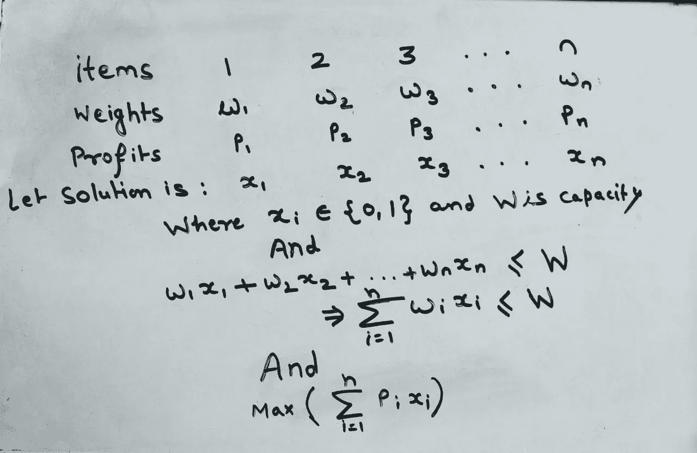

# 用动态规划法求解 0-1 背包问题

> 原文：<https://blog.devgenius.io/solving-0-1-knapsack-problem-using-dynamic-programming-acebe94521a7?source=collection_archive---------4----------------------->

一个人发现了一个魔法洞穴，里面有各种各样的珠宝、标有价格标签和重量的钻石，但是这个人只有一个容量为 W kg 的 beg，一旦他出去就不能进入这个洞穴。所以，这个人想选择能给他带来最大利润的商品。这个问题被称为背包问题。


简单地说，我们有一个物品列表，上面有它们的重量和利润，还有一个容量有限的背包。并且我们想要选择总重量小于或等于 beg 容量的物品，并且想要最大化利润。这里有一个例子。

```
Items   1      2     3     4    5
weight  2kg    5kg   3kg   8kg  1kg
profit  3      5     5     9    3Capacity of beg: 8kg 
```

数学形式:设第 I 个物品的重量为 w_i kg，第 I 个物品的价格为 p_i，背包的容量为 W kg。



所以为什么这个问题很难。让我们通过为给定的例子找到所有可能的方法来理解它

```
Items            1   2   3   4   5
combination-1    0   0   0   0   1  (we take only item 5) profit: 3
combination-2    0   0   0   1   1  (this is not possible because total weight is 9 which greater than the capacity. So in this way if we find all the conbinations and check which is maximum, it will take exponential time. Because there are total 2^n combinations. This is why, the problem is NP-Complete. There is no polinomial solution is available for the 0-1 knapsack. 
```

在这篇博客中，我们将讨论在伪多项式时间内解决 0–1 背包问题的动态规划方法。

在这种方法中，我们没有直接找到权重 W 的解，而是从容量 0 开始，这意味着如果背包大小为 0，那么最大利润是多少，然后是 1，以此类推。我们通过一个例子来理解一下:

```
item    1    2   3    4
weight  5    3   4    2
profit  5    6   8    3
And the size of knapsack is 8.
```

为了存储所有的值，我们将创建一个大小为 n*W 的表，其中 n 是物品的数量，W 是背包的大小。因此，让我们创建表格:

```
 1\. When Capacity is 0 then the profit will be 0 in all cases.
   2\. When Number of items is 0 then also profit will be 0, no matter what is capacity.   items     0   1   2   3   4   5   6   7   8   <- capacity    
     0       0   0   0   0   0   0   0   0   0 
     1       0
     2       0
     3       0
     4       0 3\. when item 1 is taken the minimum weight is 5 that means if capacity is 5 then we get profit 5, if capacity is less than 5 then profit would be 0\.  
   4\. If capacity is greater than 5 then the profit is still 5. items     0   1   2   3   4   5   6   7   8   <- capacity    
     0       0   0   0   0   0   0   0   0   0 
     1       0   0   0   0   0   5   5   5   5
     2       0  
     3       0
     4       0 5\. When we are at item 2, we can choose both item 1 as well as item-2\. And weight of item 2 is 3 kg means mimimum capacity 3 is required to get profit equals to six.
   6\. If we take both items 1 & 2 then the capacity required is 8 to get profit = 11. items     0   1   2   3   4   5   6   7   8   <- capacity    
     0       0   0   0   0   0   0   0   0   0 
     1       0   0   0   0   0   5   5   5   5
     2       0   0   0   6   6   6   6   6   11 
     3       0
     4       0

  7\. If we are at item 3, we can choose item 1 and item2 as well. If we take only item 3, then the profit would be 8\. If we choose item 2 & 3 then profit would be 14. items     0   1   2   3   4   5   6   7   8   <- capacity    
     0       0   0   0   0   0   0   0   0   0 
     1       0   0   0   0   0   5   5   5   5
     2       0   0   0   6   6   6   6   6   11 
     3       0   0   0   6   8   8   8   14  14
     4       0   8\.  When we are at item 4,we can choose also choose item 1,2 & 3. items     0   1   2   3   4   5   6   7   8   <- capacity    
     0       0   0   0   0   0   0   0   0   0 
     1       0   0   0   0   0   5   5   5   5
     2       0   0   0   6   6   6   6   6   11 
     3       0   0   0   6   8   8   8   14  14
     4       0   0   3   6   8   9   11  14  14 
```

表中的最后一个元素是我们的解决方案，其中考虑了所有项目，容量等于 w。

我们可以用给定的公式计算表中的任何元素。

```
V[i,w] = max {V[i-1, w], V[ i-1, w - w[i] ] + p[i]
where i is item and w is capacity. 
```

例如，当我们在项目 3，能力是 7，然后

```
w[3] = 4 and p[i] = 8 So V[3,7] = max{ V[3-1,7],V[3-1,7-4] + 8}
          = max{ V[2,7], V[2,3]+8 }from the table V[2,7] = 6 and V[2,3] = 6  
   V[3,7] = max{6,6+8} = max{6,14} = 14
   V[3,7] = 14 (same as we calculated in table)
```

让我们为给定的方法编写伪代码。

```
for w = 0 to W:
   V[0, w] = 0for i = 0 to n:
   V[i, 0] = 0for i = 1 to n: 
   for w = 1 to W: 
      if w[i] ≤ w and p[i] + V[i-1, w-w[i] ] > V [i -1,w] then:
            V[i, w] = p[i] + c[i-1, w-w[i] ] 
      else 
         c[i, w] = c[i-1, w]
```

该算法的时间复杂度为 O(n*W)。