# 解决代码战争问题:奇数三角形的行，用 Java 和 Python 实现

> 原文：<https://blog.devgenius.io/solving-codewars-problem-row-of-the-odd-triangle-implemented-in-java-and-python-2c04c937f6d0?source=collection_archive---------7----------------------->

昨天，我在[codewars.com](https://www.codewars.com/)发现了一个好问题。对于那些不知道的人来说，coders 是一个训练编程技能的平台，通过使用某种不同的编程语言来解决编程问题。对于那些梦想成为软件工程师的人来说，这是一个很好的练习。

好吧，让我们回到我们的主要讨论。我发现的代码挑战(codewars 称之为“kata”)被命名为“奇数三角形的行”。

[](https://www.codewars.com/kata/5d5a7525207a674b71aa25b5) [## 奇数三角形的行

### Codewars 是开发人员通过挑战掌握代码的地方。在道场训练形，达到你的最高境界…

www.codewars.com](https://www.codewars.com/kata/5d5a7525207a674b71aa25b5) 

在这个问题中，给我们一个由连续奇数组成的三角形。像下面这样的三角形叫做连续奇数三角形:

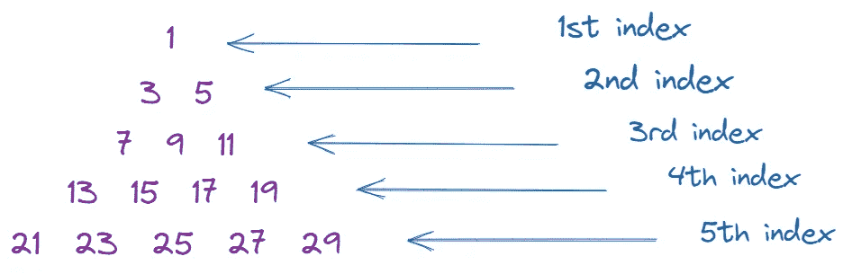

三角形和索引系统

挑战在于，如果索引已知，我们被要求找出三角形的行(在这个问题中，三角形的索引从 1 开始，而不是从 0 开始)。假设我们的指数= 1。然后，我们必须产生输出[1]。如果给定我们 index = 2，那么我们应该产生 output [3，5]等等(请阅读上面链接中更详细的问题说明)。我们的代码大概是这样工作的:

```
odd_row(1)  ==  [1]
odd_row(2)  ==  [3, 5]
odd_row(3)  ==  [7, 9, 11]
```

上面的问题也说明了最重要的一点是，我们创建的代码必须足够优化，以处理非常大的数字形式的输入。如何解决这个问题？

如果你仔细观察，你会发现三角形中一行的长度等于该行的索引。例如，第三行的长度是 3。以及其他线路。第 7 行的元素数是 7，第 8 行的元素数是 8，第 9 行的元素数是 9，依此类推。

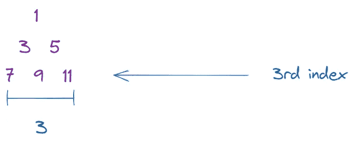

我们先保存这些信息。我们现在需要做的是生成奇数，这些数字将被放置在上面的三角形中。如何生成奇数？这很简单。如果我们从数字 1 开始连续计数，然后加上 2，那么我们产生的每个数字都是奇数。这样，我们可以产生数字 1、3、5、7、9……等等。另一个事实是第 n 行的最后一个元素和第(n+1)行的第一个元素之差是 2。例如，第 2 行的最后一个元素与第 3 行的第一个元素之差为 2。

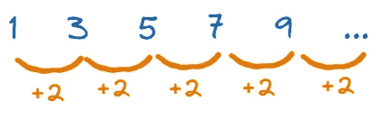

从这里我们可以获得两条重要的信息:

1.  同一行中最近的元素之间的距离是 2。
2.  一行的最后一个元素和下一行的第一个元素之间的距离是 2。换句话说，第 n 行的最后一个元素和第 n+1 行的第一个元素之间的距离是 2。

所以，如果我们想要生成一个包含奇数的列表/数组，我们只需要重复执行数字 1 和 2 之间的加法运算。如果我们想要生成前 3 个奇数，那么这是使用 python 实现的算法:

```
row = []
a = 1
for i range(3):
   row = row + [a]
   a = a + 2print(row)
```

现在的问题是，像上面描述的问题，我们怎么做一个三角形？

我们需要做的过程和上面的过程类似。我们需要创建一个包含奇数的列表/数组，并使用 for 循环将这个过程应用于三角形中的所有行。不同之处在于，在这种情况下，每当奇数生成过程在一行上完成时，我们都必须将 row_temp 值再次设置为空列表/数组。需要这样做，以便前一行中的值不在当前行中。如果我们不这样做，那么我们产生的三角形将是这样的:

```
[1]
[[1], [3], [5]]
[[1], [3], [5], [7], [9], [11], [13]]
```

在这个过程中，我们使用了 2 次使用`for loop`的循环过程。在第一个过程中，我们循环的值和问题给出的索引一样多(姑且称之为`n`)，所以可以写成`for i in range(n+1)`。然而，在第二个过程中，我们循环`i`次，其中`i`表示我们在哪一行。简单来说，在这个算法中我们要声明，对于第 I 条线，线的长度也必须是`i`。我们根据本文开头获得的信息执行这一步。如果我们使用 python 应用上述算法，我们将找到以下解决方案:

```
row = []
row_temp = []

a = 1
for i in range(n+1): # n is the index of row
    row_temp = []
    for j in range(i):
        row_temp = row_temp + [a]
        a = a + 2
    print(row_temp)
    row = row + [row_temp]
print(row)
```

我们完了。上面的代码可以解决上面的 codewars 问题。然而，该代码仅适用于少量输入。为什么？

对于那些非常熟悉算法和数据结构的人来说，你可能熟悉术语 **big-O 符号**。这个符号显示了算法的时间复杂度。在时间复杂度方面，Big-O 符号显示了输入大小对我们算法的速度有多大影响。我上面写的算法的 Big-O 符号是 O(n)。也就是说，随着输入大小的增加，该算法所需的时间以二次方的方式增加。这就是我们在上面的算法中所做的嵌套循环的效果(也许我会在下一篇文章中深入讨论这一点)。

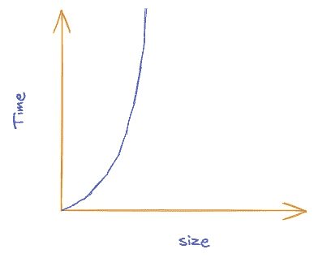

我们算法的时间复杂度图

上图说明了输入大小如何影响我们之前编写的算法。根据上图，我们知道该算法效率非常低。所以，我们需要一个更好的解决方案。

# 更好的解决方案

导致先前算法低效工作的因素是执行了太多的循环过程。为了避免这种情况，让我们尝试用数学方法来解决上面的问题。先把上面问题的条件描述的更清楚一点。

给我们出了一个包含奇数集合的三角形形式的问题(见上图图解)。然后，要求我们确定三角形中一列所包含的所有数字，按照正确的顺序和次序。最重要的是，我们制作的算法必须能够在大输入下运行良好。

为了解决这个问题，我们需要做的就是找到一种方法来计算三角形中每一行的第一个元素。为什么我们只需要第一个元素？通过知道一行中的第一个元素，我们可以通过添加数字 2 来找出其他元素。例如，我们知道第三行的第一个元素是 7。从前面的描述中我们还知道，第三行中有许多元素是 3。因此，第三行中的元素是 7、`7+2, 7+2+2`或`7, 9, 11`。另一个例子是第 5 排。第五行的第一个元素是 21。因为第 5 行有 5 个元素，那么第 5 行的所有元素都是`21, 21+2, 21+2+2, 21+2+2+2, 21+ 2+2+2+2`或`21, 23, 25, 27, 29`。所以，如果我们已经知道一行三角形的第一个元素，那么我们就不难知道那一行中的其他元素。简单吧？

# 公式推导

让我们看看下面的演示:

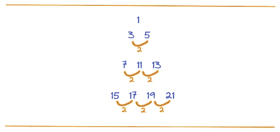

基于上述演示，我们将实现以下内容:

1.  第一行只有 1 个元素，是 1。
2.  第二行的第一个元素是 1+2 = 3(第一行的最后一个元素加 2)
3.  第三行的第一个元素是 5+2 = 7(第二行的最后一个元素是 5+2)
4.  第 4 行的第一个元素是 13+2 = 15(第 3 行的最后一个元素是 13+2)

如果我们将第 n 行的第一个元素表示为 a_n，将第 n 行的最后一个元素表示为 z_n，那么按照上面的模式我们可以发现:

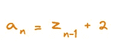

因为一行中最近的元素之间的距离是 2，第 n 行的长度是 n，那么:

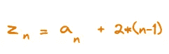

这样，我们可以将三角形中每一行的关系显示为:

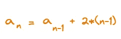

应用相同的规则，我们可以得出以下公式:

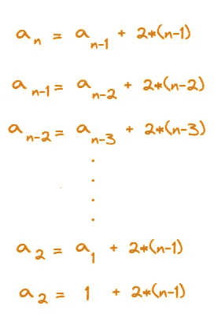

这就像一个递归函数。很简单，不是吗？

现在我们要做的是排列上面的公式，使它形成一个只依赖于自变量 n 的函数 a_n。

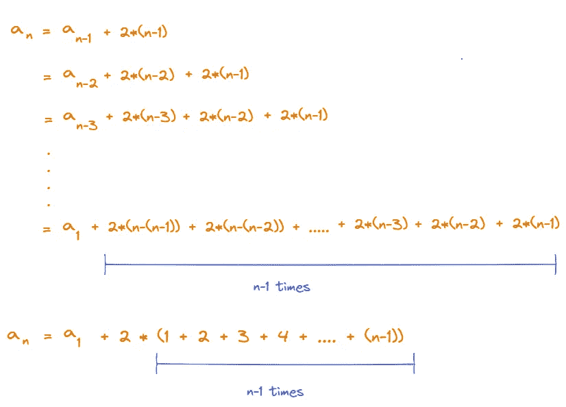

从高中的课堂上，你知道了 1+2+3+4+…+n 等于 n*(n+1)/2。那么，在这种情况下，上述各项之和等于 n*(n-1)/2。

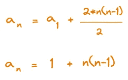

好了，这是我们的最终公式。利用这个公式，我们可以找到三角形中每一行的第一个元素。例如，第一行(a_1)的第一个元素是 1+1 *(1–1)= 1。第二行的第一个元素是 1+2 *(2–1)= 3。第三行的第一个元素是 1+3 *(3–1)= 7，依此类推。

# 确定一行的另一个元素

正如我前面提到的，使用上面的公式，我们还可以找出相关行中的其他元素。但是，怎么做呢？嗯，你还记得下面的图片吗？


上图解释了一行中最近的两个元素之间的距离是 2。因为我们知道了第一个元素，有了这个概念我们还可以确定第二个、第三个等等。假设一行的第一个元素是 b，那么第二个元素是 b+2，第三个元素是 b+2+2，第四个元素是 b+2+2+2，以此类推。所以，一般来说我们可以得出结论，上面三角形中一行的每个元素都可以表示为:

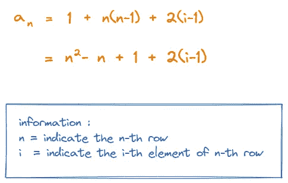

但是，由于大多数编程语言(包括 java 和 python)中的索引系统都是从 0 开始的，那么上面的公式就需要修改为:

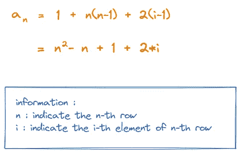

# 现在一切都很容易了！

相信我，这个问题唯一的难点就是找到上面的公式。如果你找到了上面的公式，你应该高兴，因为这个问题会容易很多。

## Java 实现

当你在 codewars 中打开这个问题页面并选择`Java`作为你的语言时，你会得到下面的代码模板:

```
public class UserSolution {
  public static long[] oddRow(int n) {

    return ;
  }
}
```

现在，我们可以更早地实现公式。正如我在开头提到的，第 n 行包含 n 个元素。我们可以通过键入`long[] result = new long[n];`来创建一个表示这一行的数组。接下来，我们可以使用上面的公式为该行中的每个元素分配适当的值。下面是实现过程:

```
public class UserSolution {
  public static long[] oddRow(int n) {
    long[] result = new long[n];
    for (int i=0;i<n;i++) {
      result[i] = (long) n*n-n+1 + 2*i;
    }
    return result;
  }
}
```

看，即使使用以复杂语法著称的 Java 语言，我们也只需要添加 3 行代码。这种方法比前一种方法效率高得多。在语法方面更有效，在时间复杂度方面也更有效。

## Python 实现

当你在 codewars 中打开这个问题页面，选择`python`作为你的语言，那么你会看到下面的代码模板:

```
def odd_row(n):
    return
```

我们可以使用 python 语言实现相同的方法，但是语法略有不同。由于我们使用的是以语法简单著称的 python，我们可以通过键入`result = []`将三角形中的行表示为一个数组(python list)。然后，我们可以使用上面的公式来处理结果数组中每个元素的赋值。下面是实现过程:

```
def odd_row(n):
    result = []
    for i in range(0,n):
        result.append(n*n-n+1 + 2*i)
    return result
```

事实上，如果你看看其他参与者给出的解决方案，你会发现更精彩的解决方案:

```
odd_row = lambda n:list(range(n*(n-1)+1,n*(n+1),2))
```

是的，只有一行代码！通过使用数学，我们可以节省几行代码并提高程序的效率。说到效率，上面算法的时间复杂度呢？因为我们只做一次`for loop`，所以上述算法的时间复杂度为 O(n)。好多了，对吧？