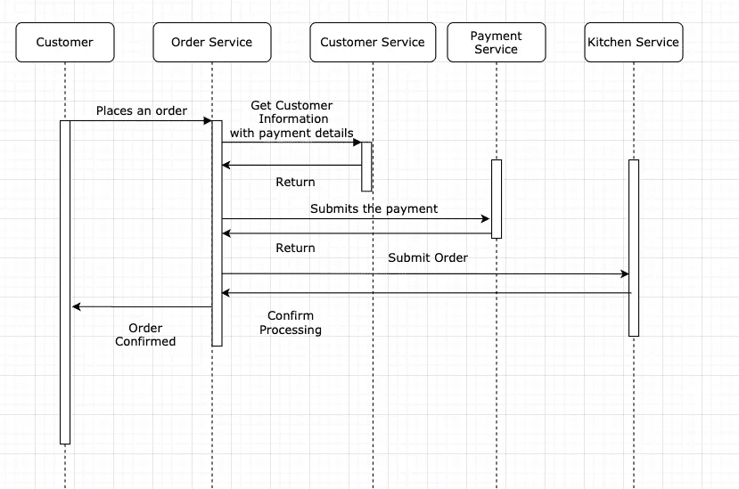
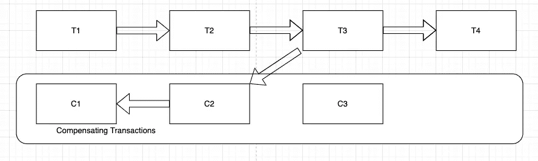

# 使用 Sagas 解决数据一致性问题

> 原文：<https://blog.devgenius.io/solving-data-consistency-using-sagas-80c00b311e45?source=collection_archive---------6----------------------->

[活动发起人](https://unsplash.com/@campaign_creators?utm_source=medium&utm_medium=referral)在 [Unsplash](https://unsplash.com?utm_source=medium&utm_medium=referral) 上的照片

毫无疑问，微服务架构模式是这十年流行的模式之一。这种模式已经被许多大大小小的高效技术公司所接受。但是这种模式带来了一些新的挑战，这些挑战在构建整体应用程序时是不存在的。一个主要的挑战是在多个服务之间保持**数据的一致性**。在我之前的[文章](https://medium.com/dev-genius/data-consistency-in-a-microservice-architecture-e7d21b6ccdd1)中，我已经讨论了如何使用分布式事务来维护数据一致性，以及它的缺陷。在这篇文章中，我将描述如何使用**传奇来实现这一点。**

传奇是一系列本地事务。每个本地事务局限于服务，并且符合 ACID。如果任何本地事务失败，saga 负责执行一系列补偿事务来回滚更改。让我们讨论一个例子来理解它是如何工作的。在这个例子中，我们讨论在网上咖啡店里点一杯咖啡。咖啡店有订单服务、付款服务、客户服务和厨房服务。下面的 UML 显示了下订单时所涉及的各种服务之间的各种交互。

该系列包括以下 4 笔本地交易(T1、T2、T3、T4)

1.  订单服务-订单服务接收新订单。它创建一个新订单，并将状态标记为待定。我们将该事务标记为 T1。
2.  客户服务——订单服务传递带有支付细节的客户信息。客户服务验证客户信息。我们将此交易标记为 T2。
3.  支付服务—使用客户的支付信息进行支付。这可能是为了授权客户的信用卡信息，也可能是为了从客户的 Paypal/Venmo 帐户中提款。我们将该事务标记为 T3。
4.  厨房服务——根据订单行项目创建票据。我们将此交易标记为 T4。
5.  一旦 4 笔交易都成功，我们将订单状态标记为成功。

上面的序列显示了幸福的道路。但是，如果在一个本地事务中发生了事务失败，会发生什么呢？这是我们使用补偿事务回滚我们所做的更改的时候。 **Sagas 不保证酸性，但保证 ACD** 。应用应确保隔离。当我们实现它时，有各种各样的技术可以使用。

**什么是补偿交易？**

这些是撤销在传奇中执行的工作的那些事务。简单地用故事开始前的状态替换系统的当前状态是不容易的。需要特别注意不要覆盖应用程序的其他并发实例所做的更改。补偿事务应该能够理解并发实例所做的工作，并回滚仅由 saga 的原始事务所做的更改。下图显示了补偿事务是如何工作的。服务中的每个事务 T *i* 都有一个等价的补偿事务 C *i* 。C *i* 的职责是撤销 T *i* 所做的更改。在下面的场景中，让我们假设 T3 出现故障。这将触发补偿交易 C2。C3 随后触发了 C1。这就是回滚的实现方式。这确保了所有事务都被撤消。注意，并不是所有的事务都需要一个补偿事务。例如，在我们前面订购咖啡的例子中，客户信息(T2)的验证没有补偿事务，因为它没有对本地数据库进行任何更改。

既然我们已经讨论了**补偿交易**，让我们看一下同样的订购咖啡的例子，我们在支付服务中遇到了一个错误。在以下示例中，当订单到达厨房服务部时，它会因厨房关闭而拒绝订单。

1.  订单服务-订单服务接收新订单。它创建一个新订单，并将状态标记为待定。我们将该事务标记为 T1。
2.  客户服务——订单服务传递带有支付细节的客户信息。客户服务验证客户信息。我们将此交易标记为 T2。
3.  支付服务—使用客户的支付信息进行支付。它授权客户付款。我们将该事务标记为 T3。
4.  厨房服务——由于厨房已经关门，它拒绝订单，并且无法创建与订单相对应的票据。此时，我们需要执行 2 次回滚。一个是作为 T3 一部分的客户付款。因此，我们将有一个 C3 来撤销 T3 的变化。另一个是创建订单 T1 的补偿事务，即 C1。在 C1，订单状态被标记为失败。

在本文中，我们介绍了 saga 如何实现 ACD。我们仍然要讨论如何在传奇故事中处理隔离，这将在以后讨论。

参考

1.  [https://docs . Microsoft . com/en-us/azure/architecture/patterns/compensating-transaction](https://docs.microsoft.com/en-us/azure/architecture/patterns/compensating-transaction)
2.  https://microservices.io/patterns/data/saga.html
3.  微服务模式— Chris Richardson