# 使用卷积神经网络和 OpenCV 实时求解数独

> 原文：<https://blog.devgenius.io/solving-sudoku-in-real-time-using-a-convolutional-neural-network-and-opencv-e47a92478dce?source=collection_archive---------1----------------------->

有一次，我决定用机器学习和图像处理来检验是否有可能实时解决数独问题。我最初认为这可以在 2-3 小时内完成，因为可以找到现成的库来满足各种需求。剧透:我的估计大错特错，但它最终成为了一个有趣的教程。

数独是一种基于逻辑的游戏。这个游戏的想法是将数字放在 9x9 的网格上，这样每一列、每一行和每一个 3x3 的子网格都包含从 1 到 9 的所有数字。实时寻找数独解需要几个步骤，本文将对此进行描述:

*   从网络摄像头实时获取图像帧。我希望通过将摄像机对准数独板找到解决方案。这也提出了一些性能要求，例如，视频帧速率不应低于 15 fps。
*   在每一帧上寻找数独板的轮廓。有现成的算法可以检测轮廓，但图像可能包含许多额外的细节，其中一些是不需要的，我们需要过滤它们。
*   从棋盘上提取单个数字图像并识别它们。神经网络可以识别图像上的数字，但我们需要为它准备数据。
*   如果可能的话，为董事会寻找解决方案。
*   将数字放回显示的图像上。我们在屏幕上看到的是一个网络摄像头。为了使这个过程更有趣，我们将把丢失的数字放在原来板上它们应该在的地方。

# 寻找数独板

在第一次测试中，我简单地从维基媒体的网页上截取了随机数独板的截图:

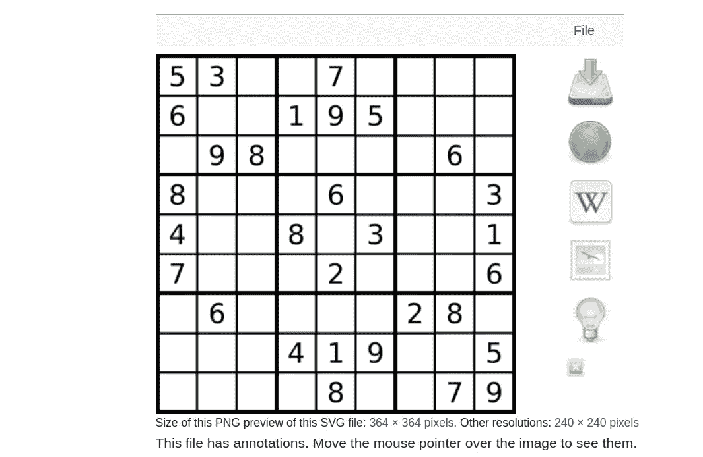

数独板截图(图片由作者提供)

让我们使用 OpenCV 加载图像:

```
import cv2img = cv2.imread("sudoku.png")
```

预处理有两个步骤。首先，我需要**得到数独板的轮廓**。为此，我使用 OpenCV 的 [Canny 边缘检测](https://docs.opencv.org/4.x/da/d22/tutorial_py_canny.html)和 *findContours* 方法:

```
img_gray = cv2.cvtColor(img, cv2.COLOR_BGR2GRAY)
edged = cv2.Canny(img_gray, 170, 490)
contours, _ = cv2.findContours(edged, cv2.RETR_EXTERNAL, 
                               cv2.CHAIN_APPROX_SIMPLE)
```

结果将是这样的:

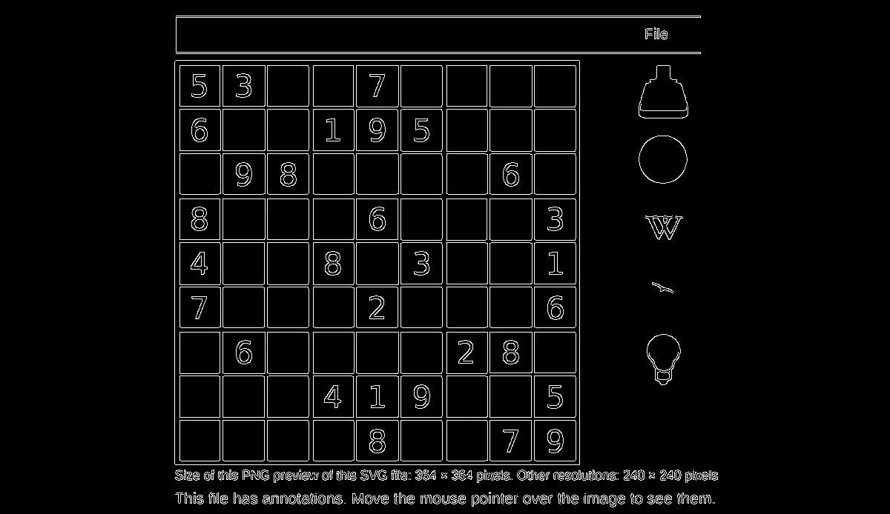

边缘检测后的图像(图片由作者提供)

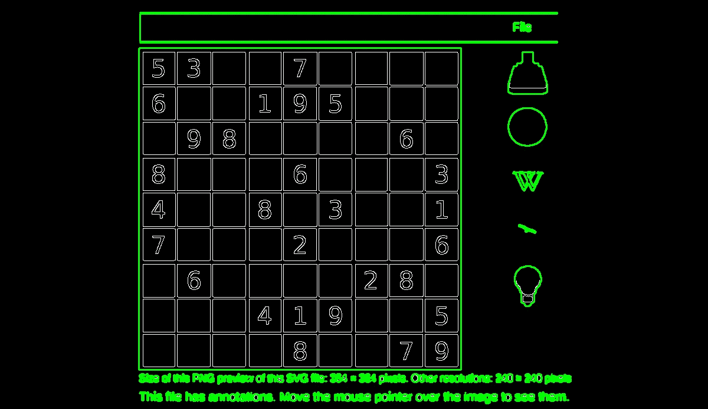

检测轮廓后的图像(图片由作者提供)

轮廓将用于寻找数独板。但是正如我们所看到的，有许多小轮廓我们必须忽略，我们稍后将在代码中添加一些规则。

其次，我创建了图像的**单色副本**，用于 OCR:

```
blurred = cv2.GaussianBlur(img_gray, (11, 11), 0)
img_bw = cv2.adaptiveThreshold(blurred, 255, 
                               cv2.ADAPTIVE_THRESH_GAUSSIAN_C,
                               cv2.THRESH_BINARY, 11, 2)
```

这对于截图来说并不重要，但对于处理实时流摄像机图像却很重要——使用*自适应阈值*方法，我们可以将图像转换为单色，这些图像具有更高的对比度，更适合 OCR:

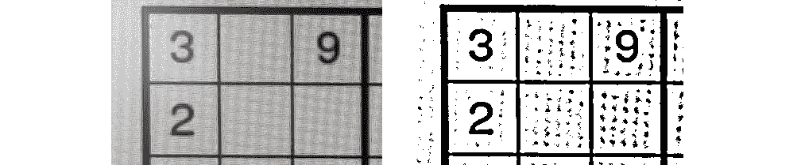

自适应阈值前后的图像(图片由作者提供)

现在我们准备从图像中检测轮廓。数独板是矩形的，所以我们只检查不太小、不太窄且有 4 个点的轮廓:

```
img_out = img.copy()w, h = img.shape[1], img.shape[0]
for cntr in contours:
  imgx, imgy, imgw, imgh = cv2.boundingRect(cntr)
  if imgw < w/5 or imgw < h/5 or \
     imgw/imgh < 0.25 or imgw/imgh > 1.5:
        continue *# Approximate the contour with 4 points* peri = cv2.arcLength(cntr, True)
  frm = cv2.approxPolyDP(cntr, 0.1*peri, True)
  if len(frm) != 4:
    continue

  *# Converted image should fit into the original size* board_size = max(imgw, imgh)
  if imgx + board_size >= w or imgy + board_size >= h:
    continue
  *# Points should not be too close to each other 
  # (use euclidian distance)* if cv2.norm(frm[0][0] - frm[1][0], cv2.NORM_L2) < 0.1*peri or \
     cv2.norm(frm[2][0] - frm[1][0], cv2.NORM_L2) < 0.1*peri or \
     cv2.norm(frm[3][0] - frm[1][0], cv2.NORM_L2) < 0.1*peri or \
     cv2.norm(frm[3][0] - frm[2][0], cv2.NORM_L2) < 0.1*peri:
      continue
```

还发现 OpenCV 返回的一些轮廓是三角形的，但有 4 个点，其中 2 个点彼此靠得太近。添加了额外的欧几里德距离检查来避免这种情况。

出于调试目的，在输出图像上绘制轮廓并检查结果很方便:

```
 *# Draw sudoku contour using lines and points* cv2.line(img_out, frm[0][0], frm[1][0], (0, 200, 0), thickness=3)
  cv2.line(img_out, frm[1][0], frm[2][0], (0, 200, 0), thickness=3)
  cv2.line(img_out, frm[2][0], frm[3][0], (0, 200, 0), thickness=3)
  cv2.line(img_out, frm[0][0], frm[3][0], (0, 200, 0), thickness=3)
  cv2.drawContours(img_out, frm, -1, (0, 255, 255), 10) cv2.imshow('image', img_out)
  cv2.waitKey(0)
```

最终结果应该是这样的:

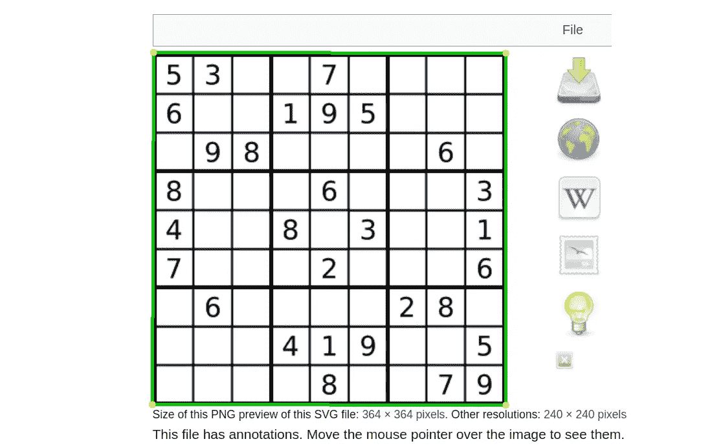

最后的数独板检测(图片由作者提供)

如果需要，也可以将图像保存到临时文件中:

```
 cv2.imwrite("img_out.png", img_out)
```

下一个重要的步骤是应用**透视变换**。它是可选的，但对于像这样的扭曲或旋转的图像，它可以使识别过程更好:

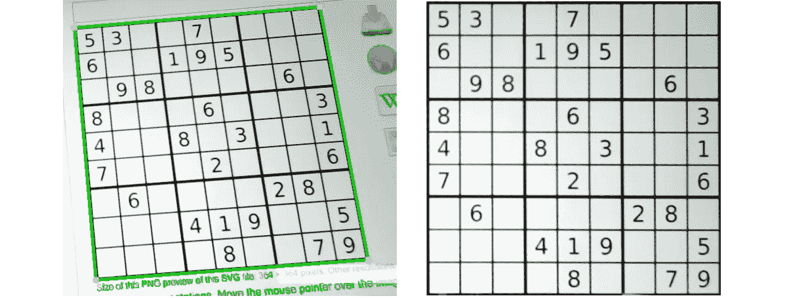

透视校正结果(图片由作者提供)

在这段代码中，我们创建了一个从原始轮廓坐标到矩形框架的透视变换:

```
 def normalize_points(pts):
    rect = np.zeros((4, 2), dtype="float32")
    s = pts.sum(axis=1)
    rect[0] = pts[np.argmin(s)]
    rect[2] = pts[np.argmax(s)]
    diff = np.diff(pts, axis=1)
    rect[1] = pts[np.argmin(diff)]
    rect[3] = pts[np.argmax(diff)]
    return rect *# Source and destination points for the perspective transform*
  src_pts = normalize_points(frm.reshape((4, 2)))
  dst_pts = np.array([[0, 0], [board_size, 0], 
                      [board_size, board_size], [0, board_size]],
                     dtype=np.float32)
  t_matrix = cv2.getPerspectiveTransform(approx__, dst_pts)
  _, t_matrix_inv = cv2.invert(t_matrix) *# Convert images, colored and monochrome* warped_disp = cv2.warpPerspective(img, t_matrix, 
                                    (board_size, board_size))
  warped_bw = cv2.warpPerspective(img_bw, t_matrix, 
                                  (board_size, board_size))
```

通过使用 *getPerspectiveTransform* 方法进行转换，这需要两个输入和输出点数组。原来，轮廓中的点有时从左到右保存，有时从右到左保存，添加了 *normalize_points* 方法来解决这个问题——没有这个方法，输出图像可以被镜像。使用这种变换，我转换了两幅图像——彩色的用于显示，单色的用于光学识别过程。

# 提取数字

上一步结束时，我们有一个正方形大小的数独板，现在我们可以将它分成 9 个单元，并提取所有数字。方法大体上是相同的——我得到每个数字的轮廓并检查它们的大小，以便只得到数字并跳过不想要的纹理或噪声:

```
 images = []
  cell_w, cell_h = board_size//9, board_size//9
  for x in range(9):
    for y in range(9):
      x1, y1 = x*cell_w, y*cell_h 
      x2, y2 = (x + 1)*cell_w, (y + 1)*cell_h
      cx, cy = (x1 + x2)//2, (y1 + y2)//2 
      w2, h2 = cell_w, cell_h

      *# Find the contour of the digit* crop = warped_bw[y1:y2, x1:x2]
      cntrs, _ = cv2.findContours(crop, cv2.RETR_LIST, 
                                  cv2.CHAIN_APPROX_SIMPLE)
      for dc in cntrs:
          *# w2, h2 = x2 - x1, y2 - y1* imgx2, imgy2, imgw2, imgh2 = cv2.boundingRect(dc)
          if 0.2*w2 < imgw2 < 0.8*w2 and 0.4*h2 < imgh2 < 0.8*h2:
            digit_img = crop[imgy2:imgy2 + imgh2, 
                             imgx2:imgx2 + imgw2]
            images.append((x, y, cx, cy, digit_img))
            break
```

结果应该是一组分离的图像，如下所示:


提取的数字样本(图片由作者提供)

现在我们得到了所有的图像，我们已经为下一步做好了准备——光学识别。

# 使用宇宙魔方的 OCR

我的第一个方法是使用 [Tesseract](https://github.com/tesseract-ocr/tesseract) ，一个用于文本识别的开源库。使用[pyTesseract](https://pypi.org/project/pytesseract/)库将 tesserac 与 Python 绑定很容易:

```
def predict_tesseract(images):
  results = []
  for x, y, img_x, img_y, digit_img in images:
    value = predict_digit_tesseract(digit_img, x, y)
    results.append(value)
  return results

def predict_digit_tesseract(digit_img, x, y):
  w, h = digit_img.shape
  if w > h:  *# Convert image to square size* digit_img = cv2.copyMakeBorder(digit_img, 0, 0, 
                       (w - h)//2, w - h - (w - h)//2,
                       cv2.BORDER_CONSTANT, value=(255,))
  digit_img = cv2.copyMakeBorder(digit_img, 
                       w//10, w//10, w//10, w//10, 
                       cv2.BORDER_CONSTANT, value=(255,))
 *# Run OCR
  cf*='-l eng --psm 8 --dpi 70 -c tessedit_char_whitelist=0123456789'res = pytesseract.image_to_string(digit_img, 
                                    config=cf).strip()
  return int(res[0:1]) if len(res) > 0 else None
```

将识别出的数字放在数独板上会很有趣。为此，我使用透视变换的逆矩阵:

```
 res = predict_tesseract(images) board = [0]*(9*9)
  for (x, y, img_x, img_y, digit_img), result in zip(images, res):
    if result:
      board[9*x + y] = result

      *# Calculate coordinates on the original image* orig = cv2.perspectiveTransform(np.array([[[img_x, img_y]]], 
                                               dtype=np.float32),
                    t_matrix_inv).reshape((2,)).astype(np.int32)
      cv2.putText(img_out, str(result), orig,
                    cv2.FONT_HERSHEY_SIMPLEX, 1, 
                    (128, 0, 0), 2, cv2.LINE_AA, False)
```

运行代码后，我们得到以下结果:

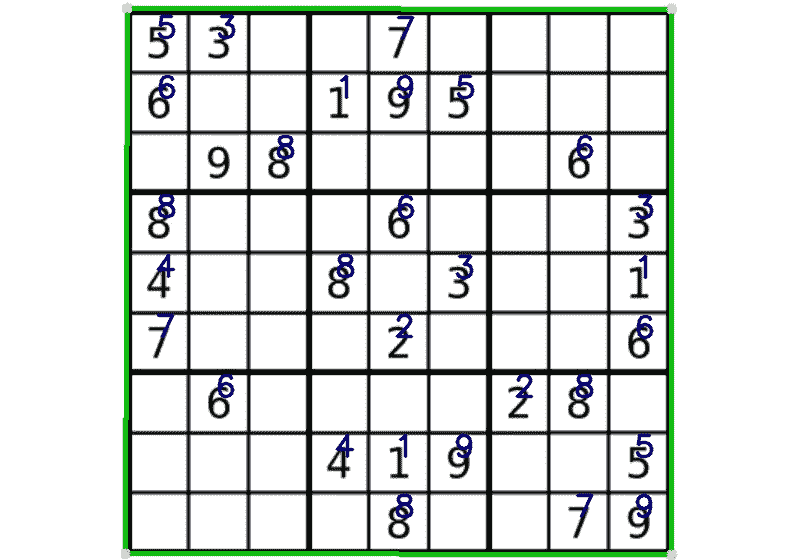

使用 Tesseract 进行 OCR 的结果(图片由作者提供)

嗯，有点效果。结果还不错，虽然计算真的很慢。首先，Tesseract 是一个相当“笨重”的库，为识别扫描图像进行了优化。其次，pyteserract 中没有批处理，所以无法将 OCR 的所有数字作为一个批处理发送。结果，在锐龙 9 CPU 上识别数独棋盘上的所有数字需要 2.1 秒。最后但同样重要的是，Teserract 无法识别第三行中的数字“9”。好了，是时候找点乐子自己做 OCR 了。

# 使用 PyTorch 和 CNN 的 OCR

## 神经网络

我将使用卷积神经网络(CNN)，正如我们所知，CNN 非常适合识别图像。那些不熟悉 CNN 架构的人可以读一篇关于这个的好文章。

让我们创建一个神经网络模型:

```
import torch
import torch.nn as nn
import torch.nn.functional as F
import torch.optim as optim IMG_SIZE = 32class Model(nn.Module):
    def __init__(self):
        super(Model, self).__init__()
        kernel_size = 5
        self.conv1 = nn.Conv2d(in_channels=1, out_channels=32,
                               kernel_size=kernel_size, stride=1,
                               padding=0)
        self.conv2 = nn.Conv2d(in_channels=32, out_channels=64,
                               kernel_size=kernel_size, stride=1,
                               padding=0)
        out_layer_size = ((IMG_SIZE-kernel_size+1)-kernel_size+1)//2
        self.dropout1 = nn.Dropout(0.25)
        self.dropout2 = nn.Dropout(0.5)
        self.fc1 = nn.Linear(64*out_layer_size*out_layer_size, 256)
        self.fc2 = nn.Linear(256, 10)

    def forward(self, x):
        x = self.conv1(x) x = F.relu(x)
        x = self.conv2(x) x = F.relu(x)
        x = F.max_pool2d(x, 2)  x = self.dropout1(x)
        x = torch.flatten(x, 1)
        x = self.fc1(x)
        x = F.relu(x)
        x = self.dropout2(x)
        x = self.fc2(x)
        return F.log_softmax(x, dim=1)
```

显然，在使用一个模型之前，我们必须训练它，为此，我们需要一个数据集。

## 资料组

对于深度学习来说，识别数字是一项简单的任务，有很多关于这方面的教程。但是大多数作者使用的是 [MNIST](http://yann.lecun.com/exdb/mnist/) 手写数字数据集:

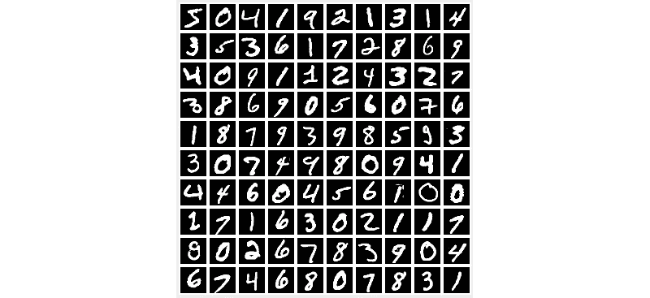

MNIST 数据集渲染(图片由作者提供)

这对自我教育来说是不错的，但我从未见过数独板，用这样的字体印刷。因此，我们可以使用这个数据集来训练神经网络，但很容易预测结果将不是最好的。

幸运的是，我们只需要位于图片中心的 0 到 9 的数字。创建数据集类很容易，它将生成不同的数字:

```
class DigitsDataset(torch.utils.data.Dataset):
    def __init__(self):
        # TTF files should be placed in the 'fonts' folder
        self.fonts = glob.glob("fonts/*.ttf")
        self.fonts_dict = {}
        self.digits_ = [None] * self.__len__()
self.generate_all()

    def __len__(self):
        return 60000

    def __getitem__(self, index):
        return self.digits_[index]

    def generate_all(self):
        print("Generating the digits dataset...")
        t_start = time.monotonic()
        for p in range(self.__len__()):
            if p % 10000 == 0:
                print(f"  {p} of {self.__len__()}...")
            self.digits_[p] = self.generate_digit()
        print(f"Done, dT={time.monotonic() - t_start}s\n")

    def generate_digit(self):
        digit = random.randint(0, 9)
        data = self.generate_digit_pil(digit)return data, digit

    def generate_digit_pil(self, digit: int):
        text = str(digit)
        area_size = 2*IMG_SIZE
        img = Image.new("L", (area_size, area_size), (0,))
        draw = ImageDraw.Draw(img)
        f_name, f_size = random.choice(self.fonts), 
                         random.randint(48, 64)
        key = f"{f_name}-{f_size}"
        if font_key not in self.fonts_dict:
            self.fonts_dict[key] = ImageFont.truetype(f_name,
                                                      f_size)
        font = self.fonts_dict[key]
        text_x = area_size//2 + random.randint(-2, 2)
        text_y = area_size//2 - random.randint(-1, 1)
        draw.text((text_x, text_y), text, (255,), 
                  font=font, anchor="mm")
        transform = transforms.Compose([transforms.Resize([IMG_SIZE,
                                                         IMG_SIZE]),
                                     transforms.ToTensor(), 
                                     transforms.Normalize((0.1307,), 
                                                       (0.3081,))])
        resized = transform(img)[0].unsqueeze(0)
        return resized
```

从代码中可以看出，我使用不同的字体、不同的大小和位置生成数字，这有助于更好地训练网络。生成数字是一个缓慢的过程，缓存图像可以提高训练的速度。

我们可以通过显示数字来轻松验证生成:

```
ds = DigitsDataset()
images = []
for r in range(10):
  hor_images = []
  for d in range(10):
    img = ds[10*r+d][0].reshape(IMG_SIZE, IMG_SIZE).detach().numpy()
    digit_img = cv2.copyMakeBorder(img, 2, 2, 2, 2, 
                                cv2.BORDER_CONSTANT, value=(128,))
    hor_images.append(digit_img)
  images.append(np.concatenate(hor_images, axis=1))cv2.imshow("Dataset", np.concatenate(images, axis=0))
cv2.waitKey(0)
```

很明显，结果看起来比手写数字更好:

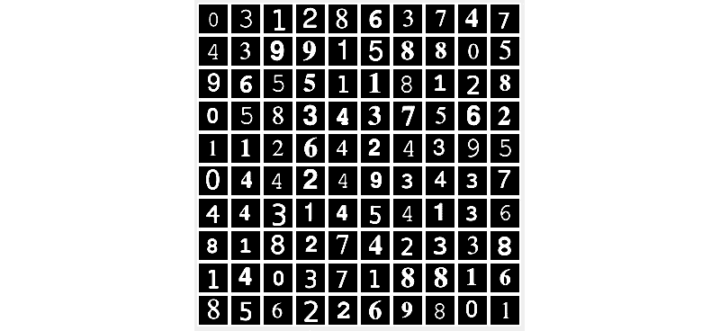

由 DigitsDataset 类生成的图像(图片由作者提供)

## 训练模型

现在我们有了一个数据集，我们可以训练这个模型:

```
import time max_epochs = 12
batch_size_train = 10
log_interval = 600
model_file_name = "ocr_model.pt"
use_cuda = torch.cuda.is_available()
device = torch.device("cuda" if use_cuda else "cpu")# Dataset instance
dataset = DigitsDataset()
train_loader = torch.utils.data.DataLoader(dataset,
                         batch_size=batch_size_train, shuffle=True)*# Create the model* model = Model().to(device)
 *# Train* model.train()
print("Training the model, use CUDA:", use_cuda)
optimizer = optim.Adadelta(model.parameters(), lr=0.01)
for epoch in range(max_epochs):
    print(f"Epoch: {epoch + 1} of {max_epochs}")
    t1 = time.monotonic()
    total_loss = 0
    for batch_idx, (data, target) in enumerate(train_loader):
        data, target = data.to(device), target.to(device)
        optimizer.zero_grad()
        output = model(data)
        loss = F.nll_loss(output, target)
        loss.backward()
        optimizer.step()
        if batch_idx % log_interval == 0:
            print('  Train [{}/{} ({:.0f}%)] Loss: {:.6f}'.format(batch_idx * len(data), len(train_loader.dataset),                                                                  100 * batch_idx / len(train_loader), loss.item()))
        total_loss += loss.item()
print(f"  Total loss: {total_loss}, dT={time.monotonic() - t1}s")

torch.save(model.state_dict(), model_file_name)
print("Model saved to", model_file_name)
```

每个训练历元使用 CUDA 需要 12s 左右，使用 CPU 需要 80s，所以强烈推荐使用好的显卡。如果没有支持 CUDA 的 GPU 可用(这里我对 Mac 用户说“你好”；)，一个[谷歌 Colab](https://colab.research.google.com) 是一个不错的免费替代品，它可以支持 GPU，运行速度相当快。要在 Colab 笔记本中使用外部文件，我们可以将文件(Python 源代码和 TTF 字体)放到 Google Drive 中，并使用以下代码挂载这个驱动器:

```
from google.colab import drivedrive.mount('/content/drive')
```

之后，Google Drive 文件夹将可以从代码中访问(文件路径也应该更改为类似于*/content/Drive/my Drive/Colab Notebooks/…)*。这很有效——在 Google Colab 设置中启用 GPU 后，训练时间花了 21 秒。它比我的 16 核 CPU 快 4 倍，只比 GPU 慢 2 倍，考虑到谷歌 Colab 服务是免费的，我为我的 GPU 支付了大约 1200 美元，这令人惊讶地不算差。

## 承认

在之前的步骤中，创建了“ocr_model.pt ”,现在我们可以使用经过训练的模型来识别数字。首先，让我们加载模型:

```
model_file_name = "ocr_model.pt"model = Model()
device = "cpu"
model.load_state_dict(torch.load(model_file_name, 
                                 map_location=torch.device(device)))
```

我们可以看到，设备被设置为“CPU”——识别过程很快，我这里不需要 GPU。实际上，所有 GPU 库的初始化和数据交换可能比基于 CPU 的识别花费更多的时间。

我已经有了一个*预测 _ 宇宙魔方*方法，我将创建一个类似的方法来使用我们的 PyTorch 模型预测数字:

```
def predict_pytorch(model: Model, images: List):
    transform = transforms.Compose([transforms.ToPILImage(),
                  transforms.Resize([IMG_SIZE, IMG_SIZE]),
                  transforms.ToTensor(),
                  transforms.Normalize((0.1307,), (0.3081,))]) *# Prepare images for the recognition* images_ = []
    for x, y, img_x, img_y, digit_img in images:
      w, h = digit_img.shape
      *# Convert image to square size* if w > h:
        img_square = cv2.copyMakeBorder(digit_img, 
               10, 10, 10 + (w - h)//2, 10 + w - h - (w - h)//2,
               cv2.BORDER_CONSTANT, value=(255,))
      else:
        img_square = cv2.copyMakeBorder(digit_img, 
               10 + (h - w)//2, 10 + h - w - (h - w)//2, 10, 10,
               cv2.BORDER_CONSTANT, value=(255,))
data = transform(~img_square).unsqueeze(0)
      images_.append(data) if len(images_) == 0:
      return []
    *# Convert separated images to the single Pytorch tensor*    
    data = torch.cat(images_)
    *# Run OCR model* model.eval()
    with torch.no_grad():
      out = model(data.to(device))
      p = out.data.max(1, keepdim=True)[1].reshape((len(images_), ))
      return p.tolist()
```

现在我们只需要用新的方法替换旧的方法，不再需要修改代码。之后我们可以得到结果:

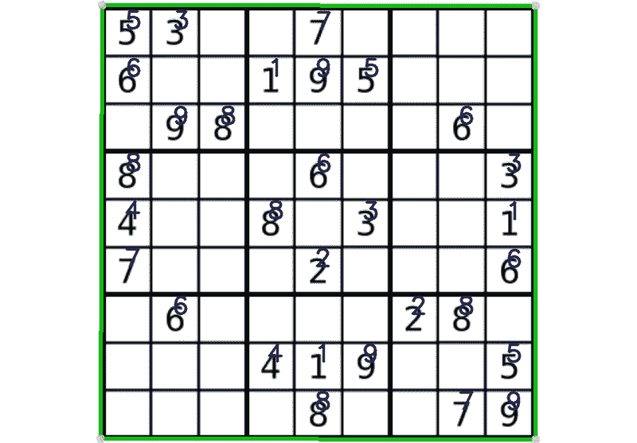

使用训练好的神经网络进行 OCR 的结果(图片由作者提供)

非常好——所有的数字都被识别，总时间只有 0.01 秒，而不是宇宙魔方的 2.1 秒！

顺便说一下，对于那些想要测试 **MNIST 数据集**进行识别的人来说，这很容易做到。只需要用*数据集替换训练代码中的 *DigitsDataset()* 实例即可。MNIST* 类:

```
dataset = datasets.MNIST(mnist_folder, train=True, download=True,   
                         transform=transforms.Compose(
                           [transforms.Resize([IMG_SIZE, IMG_SIZE]),
                            transforms.ToTensor(),
                            transforms.Normalize((0.1307,),
                                                 (0.3081,))]))
```

我们可以以同样的方式可视化和使用数据集，不需要修改代码。有趣的是，结果出人意料地并不太糟糕，大多数数字仍然可以被正确识别。这是由 MNIST 训练的同一个神经网络的结果:

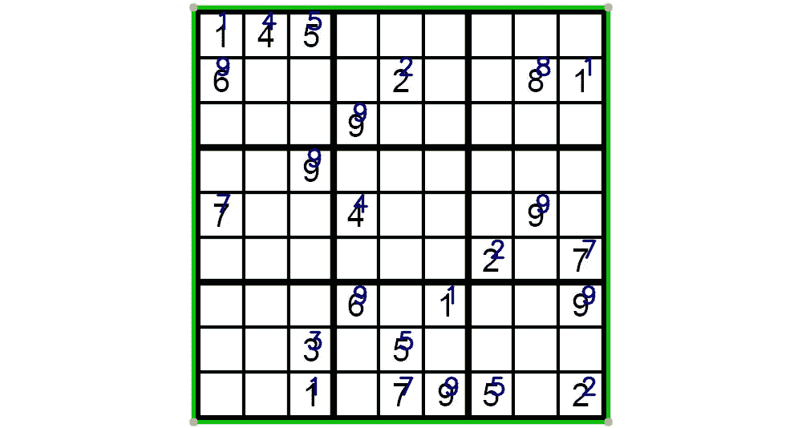

使用经过 MNIST 训练的神经网络进行 OCR 的结果(图片由作者提供)

正如我们所看到的，只有一个数字没有被正确识别，一个数字“9”被识别，而不是“6”。

# 解决数独游戏

我们几乎准备好完成挑战了——我们已经识别了所有的数字，现在我们可以找到数独板的解决方案了。我不是数独专家，所以我在一个[数独 GUI-Solver](https://github.com/techwithtim/Sudoku-GUI-Solver) 项目中发现了这个算法的想法。有点效果。代码正在使用一种[回溯算法](https://en.wikipedia.org/wiki/Sudoku_solving_algorithms)来寻找解决方案，但问题是 Python 擅长数据的高级操作，但它不太擅长处理数字——每块板的处理时间约为 10 秒，这绝对不是实时的！简单的解决方案是使用[Numba](https://numba.pydata.org)——一个 Python 编译器。从技术上来说，这是一个简单的修复方法，在大多数情况下，只需要将“ *@njit* ”指令添加到方法定义中。这很有效，处理时间从 10 秒减少到了 0.8 秒，这本身很好，但对于我们的任务来说仍然不够。

更有效的方法是用 C 语言重写算法，我确实这么做了，代码本身只有大约 50 行代码。可以使用 *ctypes* 从 Python 中调用 c 函数:

```
import ctypeslib = Nonedef solve_c(bo: List) -> bool:
global lib
    if lib is None:
        lib = ctypes.CDLL('solver_lib.so')
        lib.solve.argtypes = [ctypes.POINTER(ctypes.c_int)]

    board_data = (ctypes.c_int * len(bo))(*bo)
    res = lib.solve(board_data)
    if res:
        bo[:] = list(board_data)
    return resboard = [1, 6, 0, 0, .... ]
res = solve_c(board)
print("Solution found:", res)
```

正如我们所见，我使用 *ctypes* 将 Python 列表转换为 C 数组，并在计算后取回数据。C 文件包含了所有的“魔法”:

```
DLL_EXPORT int solve(int *bo) {
 ...
}
```

使用 C-binding 的唯一缺点是，在使用程序之前，应该为所需的平台编译库:

```
*# Linux:* gcc -shared -Wl,-soname,solver_lib -o solver_lib.so -fPIC solver_lib.c# OSX:
gcc -shared -Wl,-install_name,solver_lib.so -o solver_lib.so -fPIC solver_lib.c# Windows: should be doable via the Visual Studio DLL Project
```

而且现在速度还好——计算时间大概 0.01s，我们准备实时出发。

在测试过程中，增加了对算法的另一个改变。原来，原始算法在输入时期望得到正确的值*和*，但 OCR 并不总是这样。有时，数字 7 可能会被错误地识别为 1，或者 8 被识别为 0，如果输入值错误，算法就会陷入无限循环。添加了一个简单的检查，它验证输入数据中没有重复的数字，如果发现了这样的数字，那么显然不能解决棋盘问题。

# 实时运行

我们的最后一步是把所有的片段组合在一起，用一个摄像机流运行这个代码。使用 OpenCV 很容易做到这一点:

```
model = Model()
device = "cpu"
model_file_name = "ocr_model.pt"
model.load_state_dict(torch.load(model_file_name, 
                                 map_location=torch.device(device)))
model.eval()cap = cv2.VideoCapture(0)
width, height, fps = 1280, 720, 15
cap.set(cv2.CAP_PROP_FRAME_WIDTH, width)
cap.set(cv2.CAP_PROP_FRAME_HEIGHT, height)
cap.set(cv2.CAP_PROP_FPS, fps)
print(f"Starting the video stream: {width}x{height}")

while True:
    *# Capture images frame-by-frame* ret, frame = cap.read()
    frame_orig = frame.copy()
    try:
        *# Process* res, img_out = process_image(model, frame)
        *# Display* cv2.imshow('Frame', img_out)
    except Exception as e:
        # If something was wrong, save frame for debugging
        cv2.imwrite("crash.png", frame_orig)
        break

    *# Process key codes* key_code = cv2.waitKey(1)
    if key_code & 0xFF == ESC_KEY:
        break

cap.release()
cv2.destroyAllWindows()
```

正如我们所看到的，代码相对较少，我们从网络摄像头获取帧，并将它们发送到包含所有逻辑的 *process_image* 方法，这在前面已经描述过了。我还添加了数独板的缩略图预览，这有助于评估透视变换和数字提取的质量。动画显示最终结果相当准确:

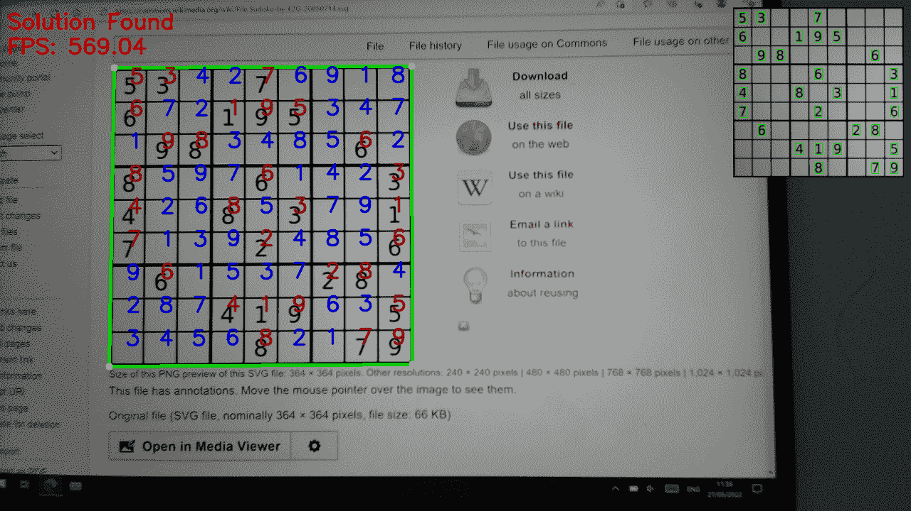

使用网络摄像头流实时解决数独棋盘(图片由作者提供)

# 结论

与数据和神经网络打交道可能会很有趣。正如我们所看到的，数字识别本身是一个相对容易和众所周知的问题，但将所有东西结合在一起并将其“投入生产”可能需要许多额外的步骤、优化和改进。无论如何，我最初估计这样的任务可以在 2-4 小时内完成，这是非常错误的，但它使挑战更加有趣。

希望自己做实验的人可以从 GitHub 下载[代码。](https://github.com/dmitryelj/Sudoku-RealTime)

感谢阅读。