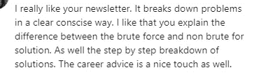
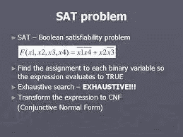
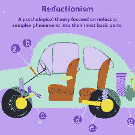
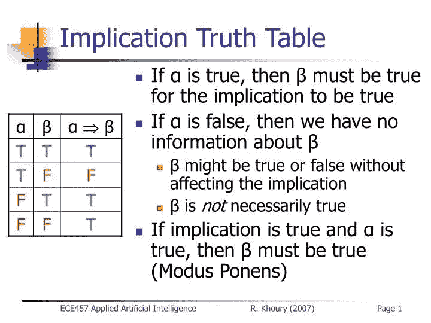
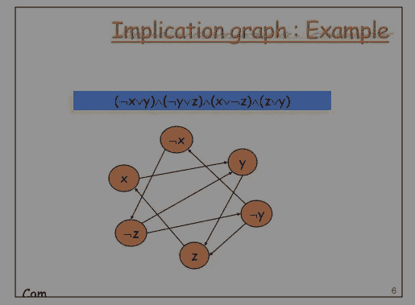
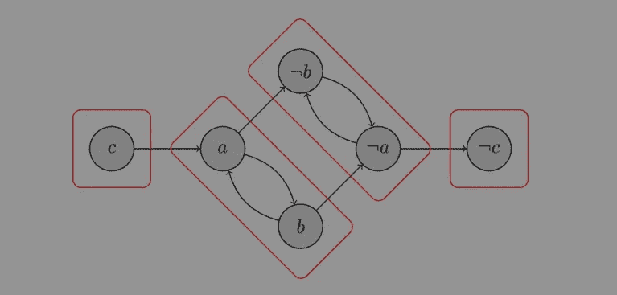
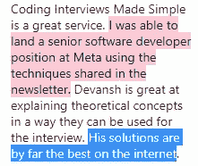

# 用 Python 解决 2SAT 问题

> 原文：<https://blog.devgenius.io/solving-the-2sat-problem-e36b6a14aa60?source=collection_archive---------4----------------------->

## 这是编码面试中最难回答的问题之一

下面是一个 Leetcode 风格的问题的解决方案，我在我的时事通讯[编码访谈中提到过。我已经复制了解决方案，并按原样与大家分享，这样你就可以了解时事通讯的内容了。欲了解更多此类解决方案，请订阅时事通讯。通过使用此链接](https://codinginterviewsmadesimple.substack.com/)，您可以获得 30 天的免费试用。万一你不喜欢它，退订需要一秒钟。所以不要错过这个特别优惠。现在谈这个问题



# 问题

如果有一种方法将真值赋给每个变量，使得整个公式的值为真，那么可以说布尔公式是可满足的。

例如，假设我们有下面的公式，其中符号`¬`用于表示否定:

`(¬c OR b) AND (b OR c) AND (¬b OR c) AND (¬c OR ¬a)`

满足这个公式的一个方法是让`a = False`、`b = True`和`c = True`。

这种类型的公式，用`AND`语句连接恰好包含一个`OR`的元组，称为`2-CNF`。

给定一个`2-CNF`公式，想办法分配真值来满足它，如果不可能，返回`False`。

# 步骤 0:了解背景

这可能是一个很难理解的问题。而且理由很充分。这个问题就像布尔可满足性问题的一个非常具体的版本。SAT 问题是计算机科学中最难的问题之一，至今仍未解决。这非常重要，找到一个有效的解决方案实际上会给你带来一百万美元，让你成为真正的摇滚明星。也将是很多领域的突破。



如果你们谁解决了这个问题，记得记得我

幸运的是，这个问题的特殊版本(称为 2SAT)是可以有效解决的。这真的很棘手。我选择了这个问题，因为它可以教会我们很多如何以正确的方式构建解决方案。有了这个背景，让我们开始解决方案

# 步骤 1:分解组件

像这样的难题，很容易被所有的组成部分和细节所困扰。解决这个问题的最好方法就是简单地分解问题的不同组成部分。然后，我们只需用简单的语言陈述问题。

让我们来解决这个问题:

1.  我们有一个合乎逻辑的陈述。该语句由任意数量的变量(a、b、c……)及其否定(`¬a,¬b,…`)组成。我们将把变量和它们的取反统称为文字。我们的文字本质上是布尔型的(它们可以是真或假)。
2.  给出的语句遵循特定的结构。结构如下:我们取两个字面值并用 OR 将它们连接起来。我们称之为元组。我们的语句是一组由 and 链接在一起的元组。这是两个 CNF 的形式。
3.  我们希望以一种一致的方式(a 和`¬a can’t both be true`)分配我们的文字值，并且以一种我们的整体陈述为真的方式。否则我们返回 False。

你们中的一些人可能想跳过这一步。但是不要那么做。这样做有几个好处。首先，这种重构可以让你在面试中消除任何误解。这也可以让你从面试官那里得到一些提示。这也是展示你的沟通能力和连贯性的一种非凡方式。最棒的是，你做得越多，你就会变得越好。



最后，重构会让你获得一些解决问题的洞察力。例如，这个问题没有明确提到文字必须一致。虽然当我明确地陈述时，这看起来似乎是显而易见的，但这种洞察力实际上会帮助我们解决问题。

# 步骤 2:布尔代数

是时候来点数学了。当我们看到两个文字之间的 OR 语句时，我们也知道我们可以推导出它们之间的逻辑关系。事实上，a →b (a 隐含 b)等于 a 或 b，我们记住这一点。

```
P→Q === ¬P∨Q
```



现在是我们把数学推向下一个层次的时候了。我们可能有一个元组(x 或 y)。那可以转换成下面的语句(这对于确保你遵循这一步是至关重要的)。

```
(¬x -> y) AND (¬y -> x) (if one of the two variables is false, then the other one must be true).
```

我们为什么要做这些？我要让你大吃一惊了

# 第三步:蕴涵图

一旦我们将元组转换成这种新形式，我们就可以创造一些奇迹。蕴涵是各种关系。因此，如果 a →b，那么我们可以画一个有向图，从 a 到 b 有一条边。



上面的语句是(x 或 y) AND ( y 或 z)AND ( z 或 x)AND (y 或 z)。利用(x 或 y)==(x -> y)和(y -> x)

我们可以把我们给定的语句变成:

```
[(x -> y) AND (¬y -> ¬x)]AND [(y -> z) AND (¬z -> ¬y)]AND [(y -> z) AND (¬z -> ¬y)]AND [(¬y -> z) AND (¬z -> y)]
```

该语句由上面的图像表示。

那么……*这是做什么的？*

当我们有一个图表时，我们会得到一个很酷的属性。假设你从顶点 x 开始，你可以沿着边到达 x，你可以从 x 开始到达 x，然后你知道你的图(因此你的语句)没有解。我们可以返回 False。


这可能会诱使您简单地运行 DFS 并以这种方式测试可达性。这是一个解决方案。这不是最佳解决方案。为此，我们想进入一些图论。我们将讨论编码面试图论中最重要的概念之一。所以要确保你一直都在跟进。

# 步骤 4:强连接的组件

我们已经说过，如果对于任何变量`x`，我们发现`x`和`¬x`都是彼此可达的，那么就会有一个解。换句话说，如果`x`和`¬x are in`是同一个**强连通分量**，那么这个图无解。



因此，我们只需要找到所有的 SCC(并验证 x 和`¬x are in different comps`)。为此，我们可以使用 Kosaraju 的算法，该算法使用深度优先搜索按照拓扑顺序访问我们的图的转置。每个组件都有一个关联值，其中较低的值表示“较早”的组件。

```
def dfs1(node, graph, visited, order):
    visited.add(node) for next_node in graph.get(node, []):
        if next_node not in visited:
            dfs1(next_node, graph, visited, order) order.append(node)def toposort(graph):
    order = [] 
    visited = set() for node in graph: 
        if node not in visited: 
            dfs1(node, graph, visited, order)return reversed(order) def get_transpose(graph):
    transpose = defaultdict(list) for key, values in graph.items():
        for v in values:
            transpose[v].append(key) return transposedef dfs2(node, graph, visited, components, i):
    visited.add(node) components[node] = i for next_node in graph.get(node, []):
        if next_node not in components:
            dfs2(next_node, graph, visited, components, i)def get_connected_components(graph, order): 
    transpose = get_transpose(graph)
    visited = set()
    components = defaultdict(list)
    i = -1 for i, node in enumerate(reversed(order)):
        if node not in visited:
            dfs2(node, transpose, visited, components, i) return components
```

最后，我们准备解决这个问题。如果对于任何变量，我们发现`x`和`¬x`都在同一个组件中，这意味着它们相互暗示，所以不可能有解。

否则，我们将在组件字典中为每个变量分配一个较大的真值。

我们可以把这些联系起来:

```
def negate(x):
    if x[0] == '¬':
        return x[1:]
    else:
        return '¬' + xdef satisfy(variables, *args):
    graph = defaultdict(list) for a, b in args:
        graph[negate(a)].append(b)
        graph[negate(b)].append(a) order = toposort(dict(graph))
    transpose = get_transpose(graph)
    components = get_connected_components(transpose, order) if any(components[v] == components[negate(v)] for v in variables):
        return False
    else:
        return set([max(v, negate(v), key=lambda x: components[x]) for v in variables])
```

对图进行拓扑排序和查找 SCC 都依赖于 DFS，这需要`O(V + E)`时间。因此，代码将在 O(N + M)中运行，其中我们有 N 个文字和 M 个子句。

该图及其转置都需要将所有变量存储为键，因此我们也需要`O(N)`空间。

PS:不用担心记住这个问题的一切。很可能你不会被期望给出完整的解决方案。相反，关注我们如何得到蕴涵图并识别 SCC 规则。此外，确保您可以实现 DFS 算法。

要获得更多这样的高质量解决方案，请查看《编码访谈变得简单》。我的每日时事通讯，[code interview make simpled](https://codinginterviewsmadesimple.substack.com/)涵盖了算法设计、数学、最近的技术事件、软件工程等主题，让你成为更好的开发人员。 [**我目前正在进行一整年的八折优惠，一定要去看看。**](https://codinginterviewsmadesimple.substack.com/subscribe?coupon=1e0532f2)



我创建了[编码面试，使用通过指导多人进入顶级科技公司而发现的新技术，使面试变得简单](https://codinginterviewsmadesimple.substack.com/p/faqs-and-about-this-newsletter?r=4tnbw&s=w&utm_campaign=post&utm_medium=web)。时事通讯旨在帮助你成功，避免你在 Leetcode 上浪费时间。[你可以在这里阅读常见问题并了解更多信息](https://codinginterviewsmadesimple.substack.com/p/faqs-and-about-this-newsletter?r=4tnbw&s=w&utm_campaign=post&utm_medium=web)

如果你也有任何有趣的工作/项目/想法给我，请随时联系我。总是很乐意听你说完。

以下是我的 Venmo 和 Paypal 对我工作的金钱支持。任何数额都值得赞赏，并有很大帮助。捐赠解锁独家内容，如论文分析、特殊代码、咨询和特定辅导:

https://account.venmo.com/u/FNU-Devansh

贝宝:[paypal.me/ISeeThings](https://www.paypal.com/paypalme/ISeeThings)

# 向我伸出手

使用下面的链接查看我的其他内容，了解更多关于辅导的信息，或者只是打个招呼。另外，查看免费的罗宾汉推荐链接。我们都得到一个免费的股票(你不用放任何钱)，对你没有任何风险。**所以不使用它只是失去免费的钱。**

查看我在 Medium 上的其他文章。:[https://rb.gy/zn1aiu](https://rb.gy/oaojch)

我的 YouTube:[https://rb.gy/88iwdd](https://rb.gy/88iwdd)

在 LinkedIn 上联系我。我们来连线:[https://rb.gy/m5ok2y](https://rb.gy/f7ltuj)

我的 insta gram:[https://rb.gy/gmvuy9](https://rb.gy/gmvuy9)

我的推特:[https://twitter.com/Machine01776819](https://twitter.com/Machine01776819)

如果你正在准备编码/技术面试:[https://codinginterviewsmadesimple.substack.com/](https://codinginterviewsmadesimple.substack.com/)

获得罗宾汉的免费股票:[https://join.robinhood.com/fnud75](https://www.youtube.com/redirect?redir_token=QUFFLUhqa0xDdC1jTW9nSU91WXlCSFhEVkJ0emJvN1FaUXxBQ3Jtc0ttWkRObUdfem1DZzIyZElfcXVZNGlVNE1xSUc4aVhSVkxBVGtHMWpmei1lWWVKNzlDUXVJR24ydHBtWG1PSXNaMlBMWDQycnlIVXNMYjJZWjdXcHNZQWNnaFBnQUhCV2dNVERQajFLTTVNMV9NVnA3UQ%3D%3D&q=https%3A%2F%2Fjoin.robinhood.com%2Ffnud75&v=WAYRtSj0ces&event=video_description)