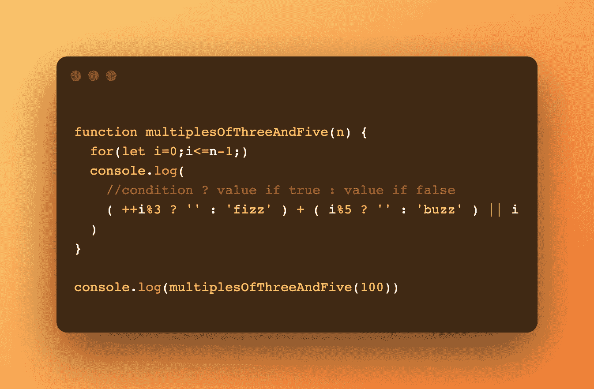

# 使用 JavaScript 以多种方式解决经典的 Fizzbuzz 问题

> 原文：<https://blog.devgenius.io/solving-the-classic-fizzbuzz-problem-multiple-ways-using-javascript-e5e7cf2015c3?source=collection_archive---------2----------------------->

## 我是如何在一次面试后学会使用循环和三元运算来重构代码的

最近，我参加了一个带回家的编码挑战，这是 x 公司初级开发人员面试筛选过程的一部分。除了“fizzbuzz”这几个字，我不得不打印出公司名称。

```
*// --- Directions for Fizzbuzz**// Write a program that console logs the numbers**// from 1 to n. But for multiples of three print**// “fizz” instead of the number and for the multiples**// of five print “buzz”. For numbers which are multiples**// of both three and five print “fizzbuzz”.*
```

到目前为止，这是我必须做的最简单的带回家的挑战，或者我是这么认为的。事实上，我不久前刚刚解决了这个算法，并且仍然在我的 VS 代码上有注释。我很快写出了解决方案，在每一行添加了解释我的思考过程的注释，多次测试代码(必须确保它能工作)，并提交给评审。几天后，我收到一封电子邮件，说我进入了下一轮，并在两周后安排了一次正式面试。🙌🏻


阿什利·巴茨在 [Unsplash](https://unsplash.com/s/photos/thinking?utm_source=unsplash&utm_medium=referral&utm_content=creditCopyText) 上的照片

这里的**大** **错误**是认为我再也见不到 *fizzbuzz* 了，因为在面试期间，有一次意外的代码审查，我们交叉检查了我提交的代码。解释部分很简单，因为我自己解决了。但是……(未完待续)

# 我最初的解决方案

*很容易阅读，而且很有效*


原溶液，不是很干

我建立了一个基本的 for 循环，从 1 到 n 进行迭代。然后我创建了几个 if else 语句来确定打印哪些单词。首先，我使用 modulos 检查是否有 3 和 5 的倍数(15)，如果没有，检查 3 的倍数，然后检查 5 的倍数。如果所有条件都不满足，那么我打印出当前的数字。一旦所有这些条件都得到满足，并且打印出适当的结果，循环再次开始，并且 I 增加 1。(i++)。循环将继续，直到 I 等于 n(在这种情况下输入 100)。

# 我解决了，现在怎么办？

我的面试官问有没有办法让代码更干巴巴。他说，虽然代码工作很好，但他注意到重复很少(四个 if else 语句和 modulos ),并说当处理非常大的数据集时，函数会变得非常昂贵。我明白他的意思。但问题是，我能当场找到重构它的方法吗？？🤦🏻‍♀️，这时候我慌了。

我的大脑决定要进入飞行模式，无论我多么努力，这些神经脑细胞的突触都没有信号。一阵尴尬的沉默后，我道歉说我一时想不出办法。尽管如此，面试的其余部分仍然进行得很顺利。我的面试官很有同情心，当我没有答案时，他们会给我有用的答案。

结束采访后，我立即打开了我的 VS 代码，开始测试一些替代解决方案。我在谷歌上搜索了不同的方法(有很多)，试图找出对我来说最有意义的方法。到目前为止，下面使用循环和三元运算符的两种解决方案对我来说是最有意义的。

## 重述 MDN 中的[条件(三元)运算符](https://developer.mozilla.org/en-US/docs/Web/JavaScript/Reference/Operators/Conditional_Operator)

> `condition ? exprIfTrue : exprIfFalse`
> 
> `condition`其值用作条件的表达式。`exprIfTrue`一个表达式，如果`condition`的计算结果为[真值](https://developer.mozilla.org/en-US/docs/Glossary/Truthy)(等于或可转换为`true`的值)，则该表达式被求值。`exprIfFalse`当`condition`为 [falsy](https://developer.mozilla.org/en-US/docs/Glossary/Falsy) 时执行的表达式(即具有可转换为`false`的值)。

# 替代解决方案 1


创建一个 for 循环来产生 1 到 n 个数字。在 console.log 中，写出整个三元条件。如果 i % 15 为 0 (0 为假值)，我们打印“fizzbuzz”，如果不是，我们继续检查 i % 5 是否为 0，如果是，我们打印“buzz”。如果不是，最后，我们检查 i % 3 是否为 0，如果是，我们打印' fizz ',如果不是，我们打印 I 并使 I 递增 1。

# 替代解决方案 2



这种方法不是在 for 循环中增加 I，而是在 console.log 中增加 I，在这里我写出了整个条件操作符。我觉得如果在 for 循环里面做 i++，也不会有什么区别。

这里我们不用写第三个模，而是使用+运算符来组合两个条件:

```
(++i%3 ? '' : 'fizz') + (i%5 '' : 'buzz') 
```

*   如果 I 是 3 的倍数，打印‘fizz’—如果不是，打印空字符串
*   如果 I 是 5 的倍数，则打印‘buzz’—否则，打印空字符串
*   将这两个条件句组合起来(15 的倍数)，打印“fizz”+“buzz”=“fizz buzz”

```
|| i
```

*   或者(如果左值为假)打印 I

# 我学到了什么？

就在这个时候，我意识到我对这次面试毫无准备。傲慢地认为我提交的代码就是解决方案，没有人敢质疑它。我希望现在你已经意识到，这篇文章的目的不是简单地分享一个 algo 类问题的几个解决方案(你可以很容易地在一秒钟内搜索到)，而是把我的故事作为一个**警示故事**分享给那些像我一样可能没有深入思考他/她提交的代码就走进面试的人。😱

即使你知道你的代码可以工作，*怀疑*，**怀疑** 。试着用另一种方法解决它。如果你的代码挑战接受一种方法，准备好亲自谈论替代解决方案**。**

祝每个人在面试中好运

快乐编码我的朋友👋🏻