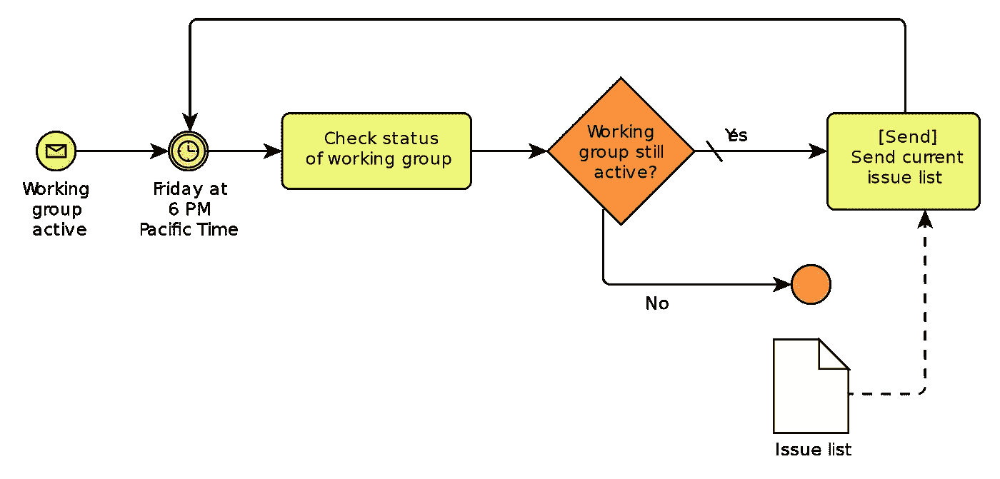
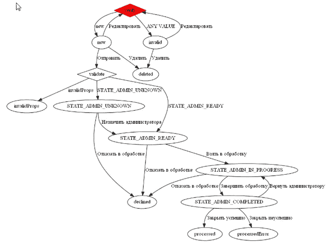
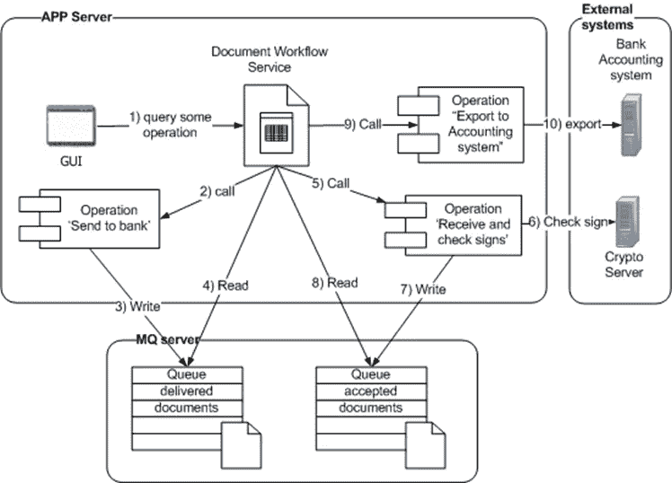

# 关于基于 BPM 的应用程序的一些随笔。甲骨文、卡蒙达等…

> 原文：<https://blog.devgenius.io/some-casual-notes-about-bpm-based-applications-oracle-camunda-and-others-38ffca053957?source=collection_archive---------7----------------------->

**只为了吸引注意力；)**

本文致力于开发人员面临的一些基本选择，他们已经决定将业务流程的实现从单个工件中的分布式源代码中分离出来。

在我看来，其中最重要的有以下几点:

*   “BPM 整体”与“每项服务的引擎”
*   “远程引擎”与“嵌入式引擎”
*   “来自知名供应商的企业级解决方案(例如 Oracle BPM)”与“开源解决方案(Camunda / Activity)”和“自制引擎”

我会试着对每一点提供正反两方面的论据，并指出每一个机会的重要特征。

# “BPM 整体”与“每项服务的引擎”

很长一段时间以来，有一种“BPM 即服务”的方法，这意味着部署一个由所有其他服务共享的服务器(服务器集群)，即“BPM monolith”。

**尽管这种方法被认为是常见的和“企业就绪的”，但它也有许多相当大的缺点。**

部署和管理这样的集中式服务需要大量额外的工作。

它引发了一个瀑布式的项目组织，最终不可避免地会发生大爆炸。

*   业务分析师试图尽可能彻底地描述所有流程，以免遗漏任何东西，从而获得一个美丽的流程景观。
*   与此同时，IT 部门仔细地设计和实现了一个服务存储库，它在真空中抽象地美丽，并且满足所有的 SOA 原则，正如它们在厚厚的书籍中所描述的那样。
*   然后，在最后，这两个优雅的抽象相遇，突然发现一个和另一个很不匹配。

在开发过程中，有必要在相互干扰的单个开发人员之间以某种方式共享这个大资源。由开发人员和 CI 启动测试的类似问题

通常，部署在一起的基于 BPMN 的描述和支持代码/库根本不提供，或者仅以脚本的形式提供(例如，基于 groovy)

*   一方面，这种代码很难在脱离服务器本身的情况下开发和测试。他们可以使用一组非常有限的工具和 API。
*   另一方面，这种“基于文本”的方法提供了过程本身和代码的自动协同版本控制，实现了它的任务，这是非常吸引人的

通常，考虑到安全性和事务上下文，主应用程序与此类服务的集成并不简单。

监控的一些问题——它是由供应商提供的唯一标准的预定义非扩展非标准特性集。与它们集成通常需要支持复杂的特定于供应商的、描述糟糕的和过时的库栈。

对引擎本身和可执行流程实例的外部访问只能通过专有 API 进行

*   这可能非常重要，而且这些可能是目前没有被广泛使用的 web 服务。
*   类似的问题还有交易、安全、监控、无能等等…

另一方面，这些是远程实现的 BPM 引擎的常见问题。

在不同类型的进程和一个进程内的不同任务之间划分服务器资源存在一些问题:

*   通常，只有一个调度程序，所有活动共享一个线程池。因此，如果有一个缓慢的过程或者一个包含一些缓慢任务的过程，每个人都会受到影响
*   如果我们有一个服务器集群，可能不会很痛苦。

这样一个庞然大物属于每个人，这意味着没有人对任何事情负责。

幸运的是，现在有像 Activity / Camunda 这样的轻量级解决方案，允许我们为系统的每个服务提供一个专用的嵌入式流程引擎及其数据库——“每个服务一个引擎”。

## 优势:

*   更好地划分概念
*   在技术、引擎本身的版本/其数据库/特定设置、服务本身的生命周期、部署、管理等方面，每个服务都相互独立。
*   一项服务的性能问题不会影响其他服务
*   每个服务的数据都是独立存储的。这更加安全，降低了意外更改/故意攻击/错误更改的风险。
*   在管理过程中，只有与一个服务相关的数据/过程是可见的。不需要在单个界面中区分各个服务的管理员之间的数据。降低了可能出错的风险。

## 缺点:

*   有必要执行几个引擎而不是一个引擎的部署/管理。如果我们使用嵌入式选项，那就简单多了，嵌入式选项本身是自动部署的。当突出显示的“按服务”引擎被单独部署时，当然会更加困难，例如，如果服务不是基于 JVM 的。码头集装箱化在这种情况下会有所帮助。
*   全球业务流程被划分到不同的引擎中。管理、收集和汇总用于监控等的信息变得非常困难，因为没有中央访问点。它可以帮助在每个流程中实现数据提供者进行集中存储，例如，基于 ELK 堆栈。不过必须自己写，不会像直接访问引擎的数据存档那么详细。另一方面，它迟早会被实现，尤其是在与任务的外部执行者一起工作的情况下。

如果多个“每服务”引擎都使用单个集中式数据库，则可以部分解决多个“每服务”引擎的问题，但是每个服务运行其引擎实例。单个 UI 可用于管理/监控所有流程，所有内容都是可见的。这既是有利的一面，也是不利的一面。

Camunda 为这种方法提供了一些特定的工具。

*   **部署感知** —每个“按服务”引擎只能看到与服务部署的流程相关的任务，并且服务具有实现服务任务的适当类来支持这些任务
*   可以保证任何两个“连续”版本的引擎都能够使用相同的数据库结构。通过这种方式，可以在不同版本之间逐步迁移，在服务准备就绪时切换不同的服务。
*   **多租户** —通常用于单独存储和处理单个组织的数据。但是没有人阻止您使用它来分离不同客户服务的数据/过程。数据分离可以在“表级”和“模式级”实现。

当然，这种混合方法也有一些缺点:微服务之间的隔离更少。他们变得更加依赖于 BPM 引擎及其版本和数据库的实现细节。

# 部署:远程与嵌入式

## 在“嵌入式部署”的情况下，我们将引擎用作序数库:

*   只有基于 JVM 的服务才有可能吗
*   它允许我们在两个方向上关闭并几乎无缝地与它集成，在启动期间执行引擎的配置，存储作为服务源代码的一部分描述的流程或以编程方式生成它，添加自定义重试策略，通过 Java Melody type 等高级工具执行简单的监控。
*   很容易参与事务/安全上下文，并将它们传递给被调用的服务
*   通常，我们可以将引擎的特定表放在应用程序的数据库模式中，并获得所有业务数据一致性备份的好处。
*   这是很容易测试，模拟与服务和许多其他奖金的必要过程
*   主要缺点是:正确的引导需要大量的工作，因为它必须与应用服务器正确集成，至少提供引擎:数据源、事务管理器和线程池。这对于性能调优尤其重要。
*   当基于 BPM 的流程以同步模式(编排模式)调用应用程序的其他服务时，它主要在传统模式下才有意义。

接近这种变体的是“容器管理的引擎”的 Camunda 架构，当 BPM 引擎“按服务器”部署并与几个服务共享时，每个服务提供其流程描述和实现任务、监听器和其他业务逻辑的后端 java beans

*   在 tomcat、wildfly 和其他应用服务器上可用。与应用程序服务器的正确集成是现成的，但仅限于商业版本
*   通过在集中的 JMX 库中注册，web 应用程序可以使用该引擎。顺便说一下，即使每场战争都启动了引擎，所有的引擎都将在那里可见，并可用于军种间的通信。
*   最近，为了支持 Docker 容器化，不推荐在一个应用服务器上联合部署几个服务 WAR，所以这种方法已经成为过去。

## 在远程部署的情况下:

*   当服务本身不是基于 Java 时，这是唯一的选择。相应地，我们通过 REST API 调用 BPM 引擎。
*   这是一个很好的概念分离的例子。引擎存在于一个独立的进程中，因此更容易识别和隔离错误。流程有其独立的生命周期。

不幸的是，这意味着一个额外的工件，从服务中分离出来，带有流程的描述，可能还有一些额外的脚本——服务部署/管理过程的两倍。

远程调用的一些常见问题:

*   共享事务不可用。也就是说，不可能让整个事务包括一些服务、BPM 引擎和一些将从流程中依次调用的服务。
*   传递安全上下文、对呼叫链的端到端监控等等也存在问题
*   我们必须更多地考虑远程调用的无效性和重试策略。Camunda / Zeebe 提供了特殊的客户端库，但是它仍然比以前更复杂

测试不可避免的复杂性。尤其是当涉及到其他服务的模拟时，以及当测试需要从一个服务的中间运行流程时。

然而，这是一个相当常见的选择。特别是在高性能系统的情况下，不是 BPM 调用服务，相反，BPM 是由服务通过外部任务 API 调用的。

# 来自知名供应商的基本企业就绪解决方案的一些问题

在大多数情况下，它是一个“BPM 即服务”产品，意味着作为一个单独的服务器进行集中安装，并带来已经描述过的缺点，但不仅仅是这些。

首先，它的进入成本很高:

*   现有开发人员的技能(例如 java 开发人员技能)不太适用
*   培训通常很昂贵，而且并非所有员工都渴望学习
*   已经训练有素的专门研究这些技术的开发人员在市场上很少见，价格昂贵，而且在整个辖区内不可能总是 100%加载
*   公司现有的开发实践(CI、测试、版本/发布管理、代码审查)应该重新设计并适应新解决方案的细节
*   不仅对开发人员，而且对维护解决方案的团队来说，入门成本都很高。

解决方案越通用、越基本，就越难以与当前的应用程序技术相集成。此类解决方案不可互换，因此我们依赖于当前的供应商:

*   不仅是在 BPMN 的特定部分，在该解决方案所需的基础架构的其余部分也是如此，而不是我们购买(并依赖)的工具，而是整个开发和管理体系
*   这种方法对于公司的辅助业务过程是可接受的，但是对于公司的主要业务过程是不可接受的
*   如果供应商离开市场或停止积极开发解决方案，就会出现大问题。如果你不是大客户，这一点尤为重要

这种解决方案通常使用专用的数据库存储，因此我们会遇到所有业务数据的一致性备份问题。您还经常会遇到这种情况，即这种存储崩溃或更新不成功会导致严重的数据不一致。这种存储器的结构通常非常复杂，并且不可能用它来执行手动操作。

通常(例如，Oracle BPM)这样的软件包包括一些高级的专用 IDE，允许“在没有程序员参与的情况下”开发流程:

*   承诺的“零代码”从一开始就是一个骗局，因为业务分析师根本无法应对开发的复杂性和大量的技术细节。这种方法对大多数程序员来说是陌生的，难以使用，并且不透明。因此，试图强迫他们将通常的通用开发风格改变为图形专有风格注定会失败。
*   通过 3-5 级对话和向导的开发(“属性面板死亡”)本身是复杂而缓慢的。对于大型项目，每个下一个对话框的打开时间大约是几秒钟。通常(自定义代码只能与只能在引擎内部运行和测试的脚本一起添加，并且可用 API 的列表受到严格限制。
*   元数据和描述通常保存在一组 XML 中(这仍然是一件好事，因为它们至少在某种程度上是可以理解的)，如果没有特殊的 IDE，就无法对其进行编辑。源代码的总大小超过 100 倍。许多附加文件，其目的是不透明的。用这种方式实现的代码审查、合并、逆向工程和其他类似的标准开发操作过程的调试是相当复杂和耗时的。
*   提供的测试工具需要具有复杂基础设施的专用服务器，不允许模拟所需的外部服务，并且与现有的测试库和 CI 工具不兼容。
*   这种 IDE 通常也是按照“全有或全无”的范式组织的，因此它强制在这个 IDE 中开发所有与 BPM 项目相关的代码。因此，一个项目至少有两个 ide。

无法访问源代码，这有助于更快地发现问题，尤其是与性能/带宽相关的问题。定制引擎相当困难，甚至不可能。无法执行正常的调试操作，尤其是在故障情况下。

当然，还有相当可观的价格。此外，由于常见的部署案例是“BPM 即服务”,因此价格通常会随着处理器数量的增加而增加。

简而言之，这种类型的解决方案非常适合在现有基础设施上一次性解决简单任务，但绝对不适合作为独立开发复杂和负责任的系统的基础。

# 国产发动机

在许多情况下，使用完整的 BPMN 描述进行业务流程建模是多余的，我们可以使用简单的状态机。

当然，一些功能将不得不减少，例如:一个流程实例的嵌套和多个状态、异步计时器/消息中断/继续、带有补偿动作的业务事务、重用(调用活动)一些公共片段、描述的版本化等等。然而，在需要高性能、高吞吐量和高并发性的情况下，对于足够简单的服务来说，它是一个简单而有效的工具。

作者在为一天处理几百万个文档的银行实现类似的金融文档流应用程序的解决方案方面有着非常积极的经验。组织此类应用程序的原则通常非常简单:

*   该文档包含对流程实例的引用
*   UI 要求一个可能的文档操作列表，作为当前状态的输出转换列表
*   所有业务操作都只在流程实例上调用(UI = >流程实例= >业务代码)。业务代码可以执行一些操作(本地或远程)，并将下一个转换名称或另一个标准结果返回给流程实例
*   在外部系统异步调用的情况下，业务代码发送一条消息，并将流程实例切换到某种中间状态，从 UI 无法访问该状态。在收到来自外部系统的应答后，消息处理程序调用流程实例上的相应操作，这将流程转移到下一个状态。

有很多开源项目可以作为这种方法的基础:Spring StateMachine、EasyFSM、Akka FSM、状态机编译器、Stateless4j、StatefulJ、JState。它们都提供了描述模式的 API，但是从作者的角度来看，最好的组合是基于 groovy 的 DSL，它反过来调用状态机构建器的底层 API。类似的 DSL 允许将状态/转换的元描述与可执行代码结合在一个文档中，并提供以下好处:

*   逃离 XML/CDATA 的地狱
*   避免经常在具有流程布局的 XML 文件和具有业务回调的 java 文件之间切换
*   组织良好的可折叠描述符，保持代码搜索和导航，重构和调试能力，其他 IDE 糖
*   代码可以和描述放在一起，也可以分开，这取决于复杂性和方便性
*   可以自动提取所有文本属性以进行本地化
*   在定制/模块化过程中，可以替换或修改业务代码的任何片段

一些常见的缺点

*   与现有的业务分析和流程设计工具不兼容。
*   起初，这种解决方案的成本似乎微不足道，但随着成本的增加，当我们不得不自己实现大部分高级功能时，就会存在风险。
*   监控功能、SLA / KPI 计算等必须独立实现)
*   BPMN 符号中的生成过程描述足够复杂，但是以一般方式将 Graphviz 应用于可视化是相当容易的:

## 基于事件的方法

这意味着使用 JMS 之类的基础设施进行异步状态切换。业务操作的每次执行都可以在专用队列中发送一条消息，由负责执行业务操作的另一个消息处理程序继续进行异步处理。

这种方法的实施可以基于大约 50-100 个班级，大约需要 1-2 个人/月。

**优点:**

*   轻量级、透明的方法，行为易于预测
*   从一开始就成熟的集群—可扩展性+故障保护
*   灵活的性能控制:我们运行多少服务器，我们为每个处理器/操作分配多少线程
*   通过控制每个业务操作的队列长度，很容易监控性能
*   与基于数据库+调度程序的解决方案相比，即使没有接收到新的文档进行处理，也不存在连续查询流的问题。此外，当处理过程中同时涉及大量文件并且相应的桌子过于拥挤时，不会经常出现问题
*   不同“复杂度”的任务不会竞争同一调度器流池。

**缺点:**

*   用于部署、监控等的附加基础设施
*   基于事件的架构并不总是为架构师和业务分析师以及开发人员所熟知
*   最简单的实现需要共享数据库和 JMS 事务。

在实现状态机时反对使用 JMS 的主要原因是它不能保持消息的顺序。然而，在这种情况下，这是完全不相关的，因为每个转换只能由前一个状态发送的事件来启动。因此队列中只有一条消息同时发送给流程实例。在这种情况下，发送到不同实例的消息的相对顺序并不重要。

## 基于数据库的方法

在这种情况下，处理可以基于具有未完成状态的专用表来实现，并且处理过程被实现为“选择用于更新跳过锁定”查询。

只要每个操作的持续时间不超过 10 毫秒(长事务会降低数据库性能)，它就非常简单、灵活和可靠，每秒大约可以处理 1000 次操作。

如果同时活动的进程数量不多，数据库服务器会将它们都保存在内存中，几乎像真正的消息代理一样工作。因此，建议通过此表传输所需的最小数据量。

**优点:**

*   我们可以实现非常灵活的消息优先级策略，不仅基于时间戳，还基于一些与业务相关的属性
*   数据处理一方面是多线程的，另一方面是严格的事务性的
*   出现异常时自动重试
*   我们得到了强大的单点持久性和众所周知的编程模型

**缺点:**

*   每个过渡都必须非常快速地处理。这意味着无法在事务或复杂的处理逻辑中进行远程调用，因为存在中间状态和锁超时
*   即使消息队列为空，也不断重新请求数据的消费者。

单表模式在吞吐量和参与者数量方面不太容易扩展。

*   通过特定于供应商的选项对表进行调优和分区，这种情况可以得到改善。例如，可以将单个表拆分成几个表，放在不同的物理服务器上，并通过类似 Oracle 的“dblink”或 PostgreSQL 的“外部数据包装器”之类的东西进行逻辑连接。
*   幸运的是，对于不同类型的文档(甚至对于不同的转换组)，我们可以使用不同的数据库实例，因此结果是高度可伸缩的。