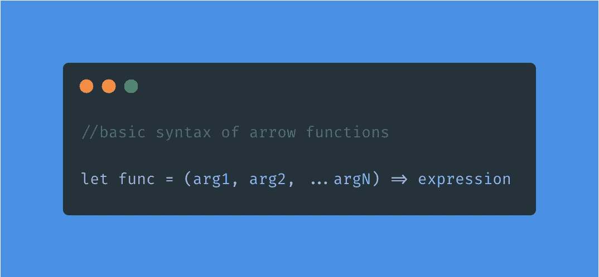
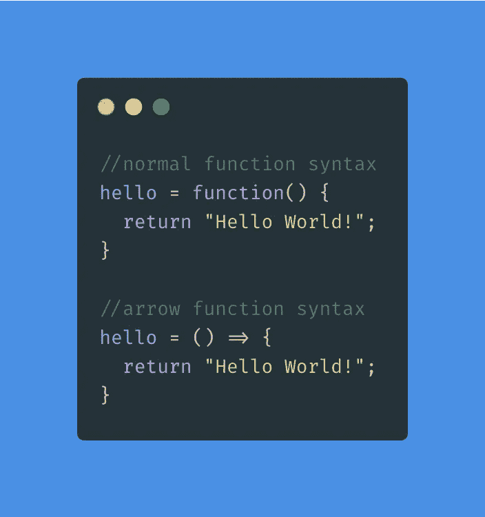
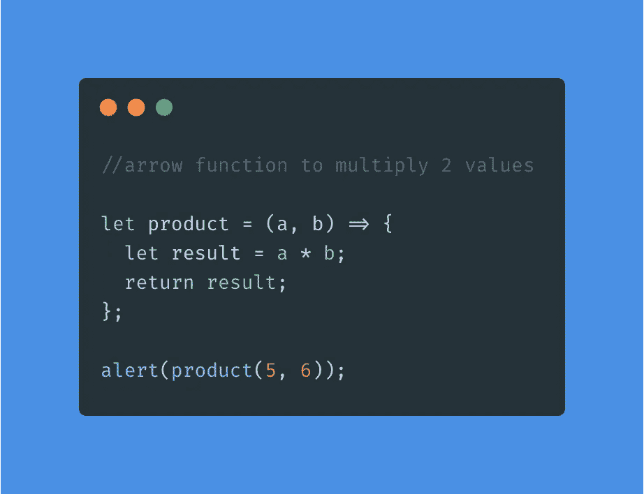
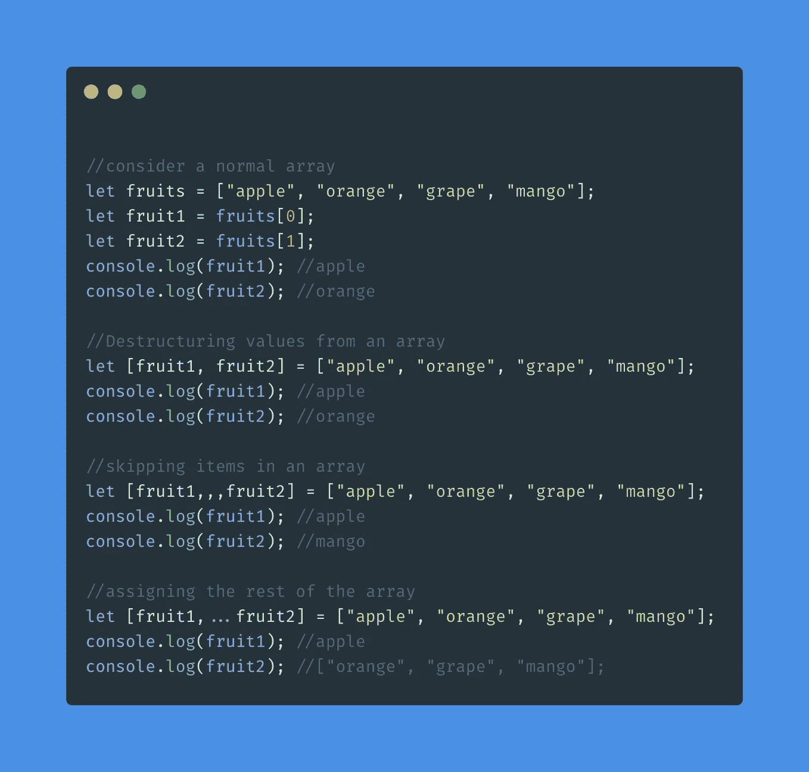
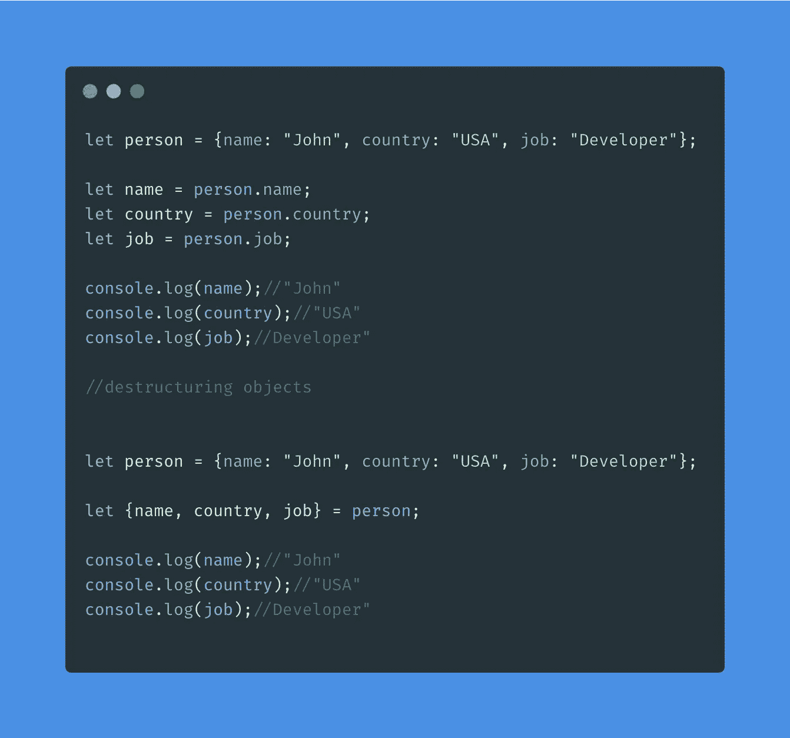
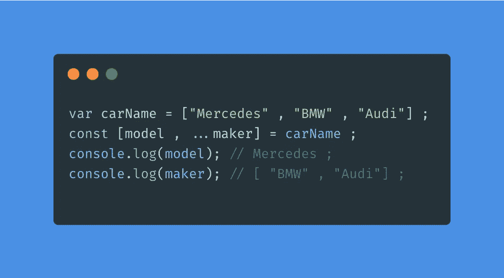
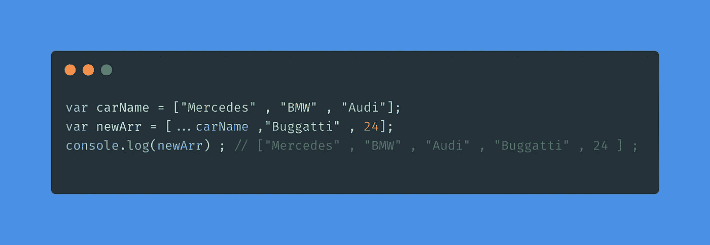

# 开始 React 之旅之前的一些先决条件第 1 部分

> 原文：<https://blog.devgenius.io/some-prerequisites-before-you-start-your-react-journey-part-1-fbb7c556a001?source=collection_archive---------26----------------------->

所以从今天开始，我开始学习 React，一个用于构建用户界面的开源 JavaScript 库。因为它是一个 JavaScript 库，所以我们需要了解 JavaScript 的一些先决条件，以便简化我们的 React 之旅。这些是其中的一些。

因此，在我们进入先决条件本身之前，我们需要了解一些关于 React 的事情，以及为什么使用它。

# **那么 React JS 是什么？**

如前所述，它是一个 JavaScript 框架库。为了更清楚地理解它，我将采用一种不同的方法。

考虑一个普通的网页。它有不同的组件，如标题，侧边栏，导航栏，图片画廊等。所有这些都是网页的不同组成部分。

因此，React 所做的就是采用这种想法或概念，将我们的网页分成不同的组件，并允许我们使用 JavaScript 构建这些组件，以便所有这些组件都可以重用。因此，它保存了 HTML 代码和一些 JavaScript 逻辑，这些逻辑可以监听用户操作，动态显示内容，以便在我们需要更新 UI 时更新它，而不必通过服务器获取新视图。正如 React 的官方网页所说，它是一个用于创建用户界面的库。

现在我们已经对 React 的工作原理有了一个简单的概念，让我们在开始 React 之旅之前，先来看看需要掌握的一些 JavaScript 先决条件。所以我决定将先决条件分成两部分。

在第一部分中，我们将了解以下内容:

1.  箭头功能
2.  对象和数组重构
3.  表达式 vs 语句
4.  休息和传播运算符

既然我们已经全部列出来了，那就让我们分别来看一看。

# **箭头功能**

箭头函数是一种编写更短函数语法的方法。让我们来看看箭头函数的基本语法。

箭头函数和正则函数表达式是一样的，但是当我们必须动态地或者在一行中写一个函数时，它们更方便。

让我们来看一个示例代码，它展示了正则函数表达式和箭头函数表达式之间的区别:

现在我们来看另一个例子:

这里，arrow 函数使用两个参数 a 和 b 来计算它的乘积。大括号内是函数对传递的参数进行的操作。在这种情况下，它将两个数字相乘并存储在一个名为 result 的变量中，然后返回结果。

用分号(；)在花括号结束之后。

# **对象和数组析构**

析构是一个 JavaScript 表达式，用于从对象中解包数组或属性，并允许我们将它们赋给变量。

让我们看看下面示例中的数组。

在上面的例子中，我们演示了不同的方法来破坏我们的数组。由于代码非常简单，我认为不需要任何进一步的解释。添加了注释，以便我们可以理解每个析构方法的作用以及输出的方式。让我们了解更多关于对象的析构是如何发生的。

看看下面的例子

在这种情况下，代码也非常容易理解。

# **表情 Vs 语句**

JavaScript 强烈区分表达式和语句。

表达式是一段产生值的代码，可以放在任何需要的地方，比如函数调用中的参数。

语句是执行操作的一段代码。本质上，每个程序都是一系列的语句。

那么表达式和语句的关键区别是什么呢？嗯，有一种方法可以帮助我们更好地理解这两者。

只要 JavaScript 需要一个语句，我们也可以写一个表达式。这叫做*表情语句*。反过来就不成立了，只要 JavaScript 需要表达式，我们就不能写语句。

更多的差异将帮助我们更好地理解它，但目前来看，这将做得很好。

# **休息和展开操作员**

Rest 顾名思义，就是将所有剩余的项集合成一个数组。

让我们看看下面的例子

如示例所示，这三个点将剩余的元素收集到一个新的子数组中，这就是所谓的析构，将我的数组或对象分解成更小的部分。

使用 rest 参数进行析构帮助我们将数组分解成一个可以直接调用的主参数，如 *model* ，并将其余的收集到另一个数组中，如 *maker。*

现在让我们看看下面的例子，看看 spread 操作符是如何工作的。

我们可以看到，这两个数组已经连接起来，并将 carName 解包为单个元素。正如我们所见， *spread* 操作符可用于将一个数组复制到另一个数组中，或将两个数组连接在一起。

这是我们开始 React 之旅之前的先决条件之一。其余的将在第 2 部分中讨论，我们将探讨不可变和可变更新、导入/导出等主题，并尝试理解巴别塔。