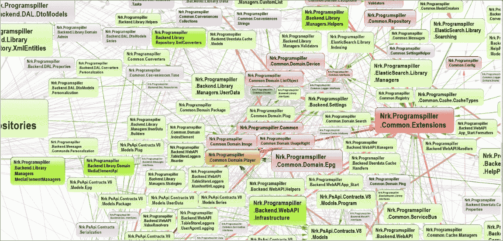
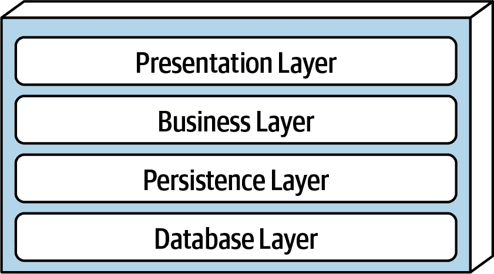
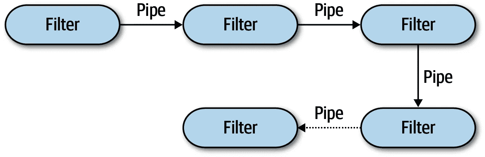
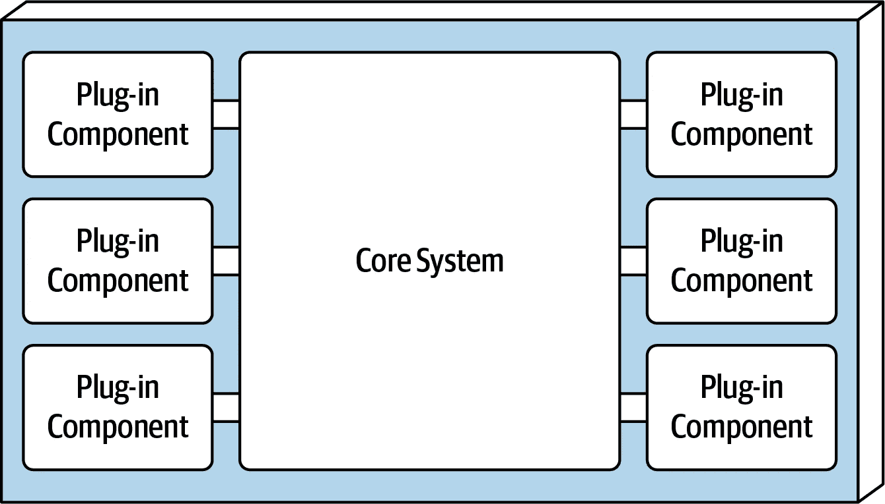
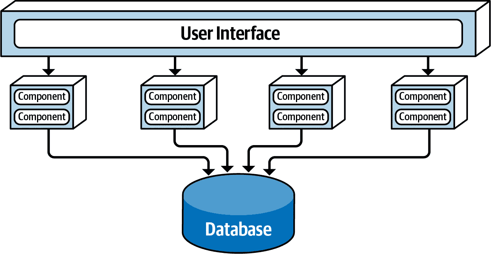
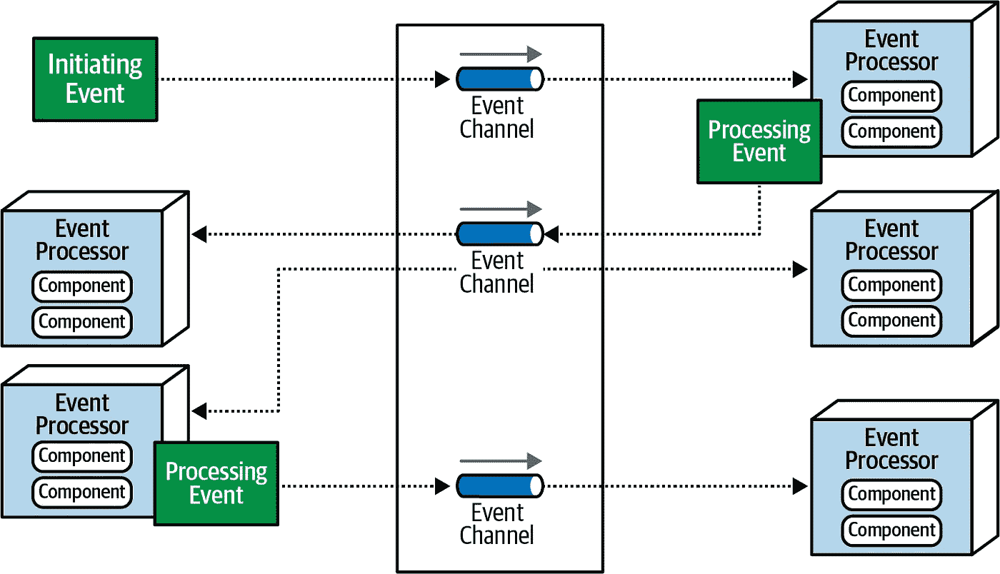
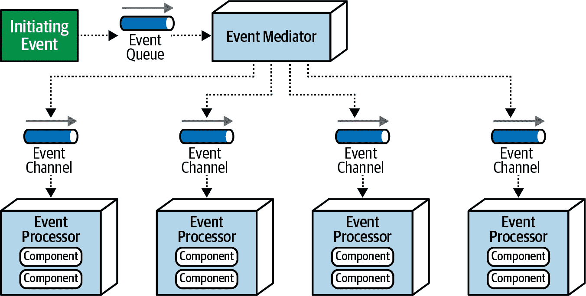
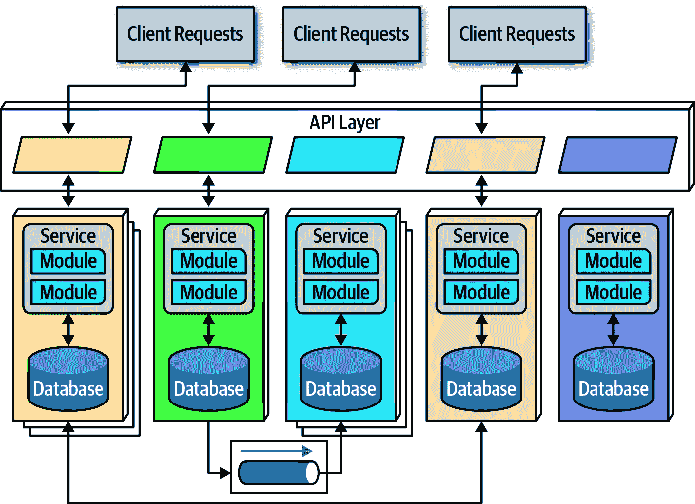

# 一些软件架构风格

> 原文：<https://blog.devgenius.io/some-software-architecture-styles-fbb57f7716b9?source=collection_archive---------0----------------------->

## 各种历史和现代软件架构风格的快速总结。

在 [Unsplash](https://unsplash.com?utm_source=medium&utm_medium=referral) 上由 [Austin Distel](https://unsplash.com/@austindistel?utm_source=medium&utm_medium=referral) 拍摄的照片

每个软件项目都是不同的，但这并不意味着没有我们可以挑选出的趋势。

# 大泥球

当你没有选择一个架构时，这就是你最终得到的架构。mud 的“大球”指的是无结构的、意大利面条式的代码库，这些代码库来自一个没有计划如何构建他们的解决方案的团队。

“泥巴大球”的名称来自于无组织的耦合和调用模式的网络，它们代表了没有清晰架构的项目

系统的不同部分通常是高度耦合的，维护非常困难，向陌生人解释一切是如何组合在一起的几乎是不可能的。无论如何都要避免这种情况。

# 分层架构

最简单和最常见的架构风格之一是分层架构。代码被技术领域划分成离散的层。这清楚地表明了代码的归属。

典型的代码层分解

一个典型的规则是每一层都是封闭的，这意味着它只能被它旁边的层访问，这有助于防止耦合。每一层都可以整体部署在一起，也可以单独部署。通常，表示层(UI)和数据库将分别部署到代码的其余部分。

# 流水线架构

管道架构以两种类型的装置为中心；管道和过滤器:

**过滤器**是独立的无状态计算单元。他们应该专注于做一件特定的任务。过滤器可以产生、测试、转换或消耗数据。

**管道**是过滤器之间的通信通道。它们是一种方式，用于构建过滤器的管道。

## 微内核架构(插件架构)

微内核架构基于构建核心系统的思想，该核心系统包含系统实现其核心目的所需的最少功能。然后通过独立的插件提供额外的功能。想象一下 VS Code:基本的应用程序非常有限，但是通过添加插件，你可以使应用程序非常强大，并且适合你和你的项目。

通常，插件是相互隔离的，因此相互之间是不耦合的。他们也有独立的存储空间。插件可以是核心系统整体的一部分，也可以单独部署。如果与插件的通信是通过某种标准化的消息传递形式完成的，比如 REST，那么就不需要要求所有的东西都用同一种语言编写。

## 基于服务的架构

在这种架构中，功能由基于域的服务来划分。该服务可以共享数据库和用户界面，但彼此独立运行。

服务可以彼此独立地部署。需求较高的服务可以获得更多的资源或被复制。还可能有一个 API 代理将请求从 UI 路由到正确的服务。

## 事件驱动架构

事件驱动系统对用户界面或内部发生的事件做出“反应”。这种系统是由事件处理器构建的；小型独立计算单元。系统中的事件流可以通过两种不同的方式发生。

**在代理拓扑下，**没有对事件处理的集中控制。每个处理器可以广播它自己的事件来触发另一个处理器，形成一个事件链。不需要管理特定事件处理器或执行步骤之间的连接。

**在中介拓扑**下有一些中央控制。当事件进入系统时，事件调解器控制调用哪些处理器以及调用的顺序。可能有多个并行或分层工作的事件调解器。

## **微服务架构**

微服务系统是由许多可独立部署的、专注于领域的服务构建而成的。“微”来自于这样一个事实，即每个服务应该只专注于做一件事。微服务通常使用 REST 之类的东西进行通信(可能通过 API 网关)，用不同的语言编写，并且有独立的存储。

微服务通常是独立部署的。这是一种“云原生”架构，使用弹性来提供性能和可用性。

# 更多来自我

如果你想更多地了解决定使用哪种架构的人，我推荐我的文章[什么是软件架构师？](/what-is-a-software-architect-5f1e441cdb2f)。

如果您想更深入地了解微服务架构，请阅读[微服务的陷阱和问题](/the-pitfalls-and-problems-with-microservices-a41ffcc19c38)

我还在我的抖音上制作了这个主题的视频