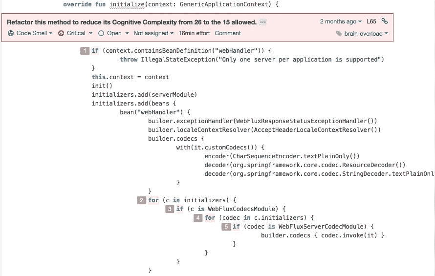
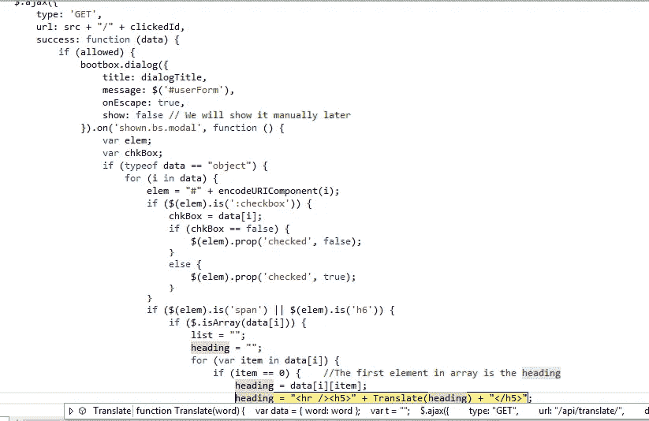

# 认知复杂性

> 原文：<https://blog.devgenius.io/sonarqube-cognitive-complexity-265640dbad3e?source=collection_archive---------2----------------------->

有时一个方法中的条件太多。


Sonar 应用对开发者发现 bug、冗余的地方和很多重构的动力都有极大的帮助。有时候可能会很烦，但是…

第一部分:SonarQube

SonarQube 是一个非常有用的工具。它包含了许多最流行的编程语言的规则。

在特殊情况下，SonarQube 会检查一个块中有多少个嵌套循环和条件。他开始争论这个数字是否超过了最大复杂度的极限 15。

这是给开发人员的一个信号，是时候重构代码了。

**认知复杂性法则。**



声纳认知复杂性的例子

SonarQube 将他在嵌套块或整个方法中找到的条件数计算为圈复杂度。当它达到极限时，SonarQube **会阻止你认为**构建已经完成。

如果您的项目将 SonarQube 与 Bitbucket、Github、Gitlab 和类似的存储库同步，它将阻止您与主分支进行合并。

所以我们得到了 SonarQube 的回应:

*“重构这个函数，将其认知复杂度从 26 降低到允许的 15。”*认知复杂性是衡量一个功能的控制流理解起来有多难的一个指标。认知复杂性高的功能将难以维持。

SonarQube 计算“if”条件、嵌套循环(如“for”、“forEach”、“do-while”)以及“&&”和“||”的数量。

假设我们有一个在 Java 代码中充满条件的肮脏方法:

```
public static final String *NEWLINE* = "\n";
private String buildPriceInformation(DetailCharge charge) { String totalRate = calculateTheRate(); List<String> lines = *newArrayList*();
  lines.add(totalRate); **if (charge.hasIdentifiers() && hasDocumentPrice(charge)) {
    lines.add(*EMPTY*);
  }**

  if (charge.getLocation() != null) {
    lines.add(*EMPTY*);
  }

  if (charge.isFlagCharge()) {
    lines.add(*EMPTY*);
  }
  return Joiner.*on*(*NEWLINE*).join(lines);
}
```

所以，我们这里有 4 个条件的复杂性。可能的解决方案之一—将 **& &** 条件的逻辑移到另一个单独的方法中。

```
private boolean isChargeHasDocumentPrice(DetailCharge charge) {
    return charge.hasIdentifiers() && hasDocumentPrice(charge);
}
```

它在 SonarQube 分析中减少了 1 个数的复杂度。所以现在我们可以在我们的主方法中这样调用它:

```
if (isChargeHasDocumentPrice(charge)) {
    lines.add(*EMPTY*);
}
```

这使得我们的源代码可读性更好。避免在一个函数中使用许多嵌套循环和条件。声纳激励我们重构我们的想法和思维方式。有时候修改旧的稳定代码是很不容易的。

**第二部分。“如果”语句的替代项。**



只是嵌套循环和 if 语句的一个示例

“如果”语句的替代方案有哪些？

1.  **三进制记数法** : result = A？如果 A 为真或不为空，则返回 B 否则返回 c。

```
private boolean invertBoolean(boolean b) {
  return b ? false : true;
}
private int getMinValue(int i, int j) {
  return (i < j) ? i : j;
}
```

2.**开关**声明。

```
int i = 10;
switch (i) {
  case 5:
    System.out.println("i = 5");
    break;
  case 10:
    System.out.println("i = 10");
    break;
  default:
    System.out.println("i does not equals 5 or 10");
}
```

3.**函数式编程**方法来自 Java 8、Kotlin、RxJava、RxKotlin 或 RxJs。

例如，我们有一个集合，需要检查布尔条件:

```
List<ChargeCode> charges = getChargeCodes();
for(ChargeCode c: charges) {
  if(c.isResolved()) {
    c.printLabel();
  }
}
```

函数式方法让我们将这些行重构为一个句子:

```
var result = rules.stream().filter(ChargeCode::isResolved)
              .forEach(ChargeCode::printLabel);
```

4.**可选**。不要在 if/else 之前声明变量就进行检查。

```
List<String> names = Arrays.asList("A", "B", "", "C", "", "D");
Optional<List<String>> optionalList = Optional.of(names);int length = optionalList.map(List::size).orElse(0);
```


华金·索罗拉，1915 年“圣塞巴斯蒂安的海浪”

**结论**

SonarQube 支持多种语言的规则。检查的逻辑总是相同的。不管你用什么——Java，Kotlin，Typescript，或者其他语言。可以重构源代码以获得更好的性能和可读性。

**链接**

 [## if-then 和 if-then-else 语句

### if-then 语句是所有控制流语句中最基本的。它告诉你的程序执行某个…

docs.oracle.com](https://docs.oracle.com/javase/tutorial/java/nutsandbolts/if.html) [](https://stackoverflow.com/questions/52741725/what-is-cognitive-complexity-in-sonar-report) [## 声纳报告中的认知复杂性是什么？

### 在搜索了一些博客并与声纳团队交谈后，我发现了一个简单的认知定义和计算…

stackoverflow.com](https://stackoverflow.com/questions/52741725/what-is-cognitive-complexity-in-sonar-report) [](https://www.sonarsource.com/java/) [## Java | SonarSource 的代码质量和代码安全性

### SonarSource 提供了可能是你能找到的最好的 Java 静态代码分析。它使用最先进的…

www.sonarsource.com](https://www.sonarsource.com/java/)