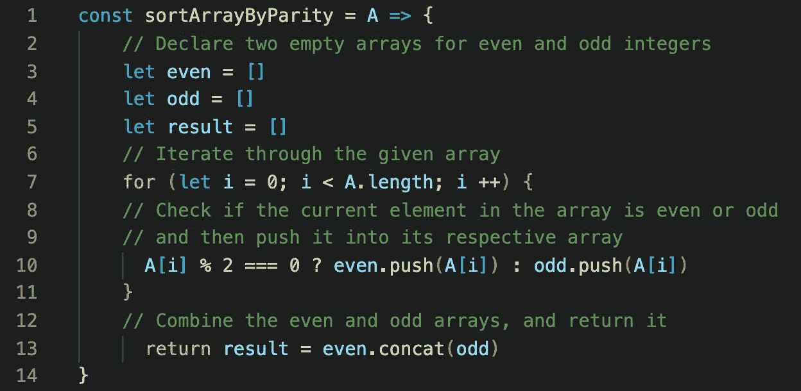
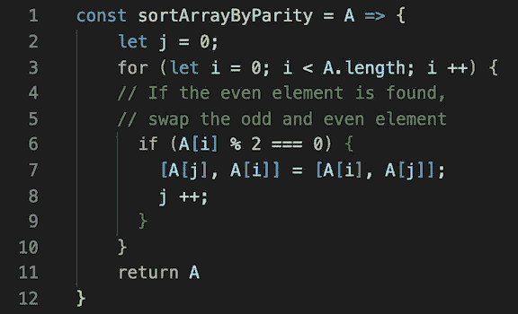
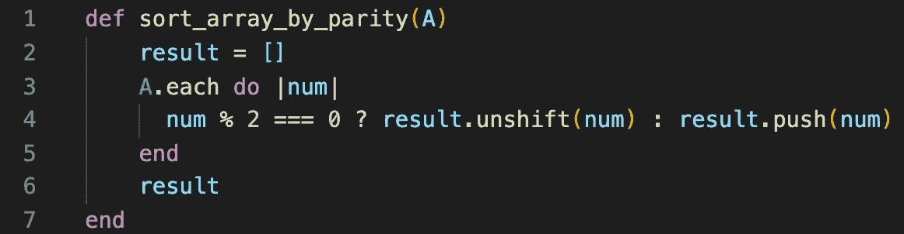

# 按奇偶问题排序数组

> 原文：<https://blog.devgenius.io/sort-array-by-parity-problem-584bfbf861a1?source=collection_archive---------8----------------------->

## 解释了 JavaScript 和 Ruby 中的两种方法


图片来自 [Pixabay](https://pixabay.com/?utm_source=link-attribution&utm_medium=referral&utm_campaign=image&utm_content=4014181) 的 [_Alicja_](https://pixabay.com/users/_Alicja_-5975425/?utm_source=link-attribution&utm_medium=referral&utm_campaign=image&utm_content=4014181)

在这篇文章中，我将讲述我是如何在 [LeetCode](https://leetcode.com/problems/sort-array-by-parity/) 上解决“按奇偶校验排序数组”问题的。

*给定一个非负整数的数组* `*A*` *，返回一个由* `*A*` *的所有偶数元素组成的数组，后跟* `*A*` *的所有奇数元素。*

您可以返回满足此条件的任何答案数组。

```
**Example:****Input:** [3,1,2,4]
**Output:** [2,4,3,1]
The outputs [4,2,3,1], [2,4,1,3], and [4,2,1,3] would also be accepted.
```

这个问题有多种公认的解决方案，我将与您分享其中的两种:

## 我的第一次尝试

以下是我得出第一个解决方案的步骤:

1.  定义一个函数，它接受一个名为`A`的数组作为参数。
2.  创建两个空数组；一个存储`even`数字，另一个存储`odd`数字。
3.  遍历给定的数组；`A`。
4.  通过执行模数运算(`A[i] % 2 === 0`)检查`A`的当前元素是偶数还是奇数。
5.  将`A`的每个元素推到其对应的数组中:偶数元素放入偶数数组，奇数元素放入奇数数组。
6.  将奇数数组的元素追加到偶数元素的数组中，并返回该数组。

让我们通过查看 JavaScript 中的以下实现来更好地理解:



给定的数组；`A`，被分割成两个独立的数组；`even`，包含所有偶数，`odd`，包含所有奇数。然后，这两个数组以偶数元素后跟奇数元素的方式组合。

## 时间和空间复杂性

给定数组的每个元素无论发生什么都需要检查，所以**这个方案的** **时间复杂度**为 **O(n)** ，其中`n`为`A`的长度。引入新的数组来存储偶数和奇数会导致额外的空间，因此**空间复杂度**也是 **O(n)，**但它可以在 O(1)空间复杂度内完成，而不需要使用额外的空间，这将在下一部分中看到。

## 我的第二个方法

与我的第一个解决方案相比，这个解决方案有点复杂，但是不需要额外的空间来存放任何东西。对于这种方法，我将采取以下步骤:

1.  创建一个索引`j`，并将其设置为`0`。
2.  遍历给定的数组；`A`。
3.  如果遇到偶数元素，交换`A`的元素和`j`的索引元素。
4.  将`j`增加`1`。
5.  继续直到`A`结束，然后返回数组。

以下是 JavaScript 代码的实现:



在我的第二种方法中使用了两个指针技术，其中两个指针都从数组的开头开始，以执行**就地**排序，这种解决方案不再需要 O(n)空间复杂度。

如果数组的元素不是偶数，我们只增加一个指针；`i`。如果是偶数，我们交换奇数和偶数元素，然后增加指针`j`和`i`。如果元素不在适当的位置，该过程交换元素，直到`A`中的所有偶数元素出现在`A`的所有奇数元素之前。

## 时间和空间复杂性

**空间复杂度**通过编写就地解决方案，从 O(n)进一步优化到 **O(1)** 。**该方案的时间复杂度**仍与第一种方案一样为 **O(n)** ，其中`n`为`A`的长度。

## 奖金！

我通常喜欢用不同的语言解决同一个问题，下面是我在 Ruby 中解决这个问题的方法，类似于我的第一个解决方案:



## 结论

声明新的数组并遍历给定的数组以将其偶数和奇数元素存储在它们各自的新数组中是解决这个问题的简单方法，但是第一种方法需要 O(n)的额外空间复杂度。在第二部分中，通过维护两个指针来执行就地排序，以 O(1)空间复杂度而不是 O(n)来解决该问题。

希望这篇文章能帮你想出解决这个常见算法的办法，谢谢阅读！

## 关于算法的更多信息:

*   [删除相邻重复项问题](https://medium.com/swlh/remove-adjacent-duplicates-problem-5b9ac4abe87f?source=friends_link&sk=bdf036762719e49fc1bd7e8d5b736535)
*   [减积求和问题](https://medium.com/dev-genius/subtract-product-and-sum-problem-6d4d39a3c91e?source=friends_link&sk=8f84a47a3a6255359f6fdf19f8bd4868)
*   [独特的出现次数问题](https://medium.com/swlh/unique-number-of-occurrences-problem-cf25bd3fab4f?source=friends_link&sk=739488a111b56958aeaea75847f48832)
*   [JavaScript:用堆栈检查有效的括号](https://medium.com/analytics-vidhya/javascript-check-valid-parentheses-with-a-stack-bc7b1bab26c2?source=friends_link&sk=47981315af12a900d66f148ed482fc8a)
*   [JavaScript:使用递归调用对对象进行深度比较](https://medium.com/analytics-vidhya/javascript-deep-comparison-of-objects-with-a-recursive-call-f67a8f37a343?source=friends_link&sk=1dd4f4ef81e3cbea796827fd7d59187f)