# 排序算法:冒泡 vs 选择 vs 插入 vs 合并，哪个最好？

> 原文：<https://blog.devgenius.io/sorting-algorithm-bubble-selection-vs-insertion-vs-merge-which-one-is-the-best-c30ea1a58629?source=collection_archive---------5----------------------->

在本文中，我将通过比较每种排序算法来讨论排序算法。让我们开始吧！

# 冒泡排序

冒泡排序是比较索引 I 和 i+1 处的每个元素的排序算法之一。如果我们想对一个列表进行排序，这是我们首先会想到的算法。我们可以通过使用循环来实现冒泡排序。

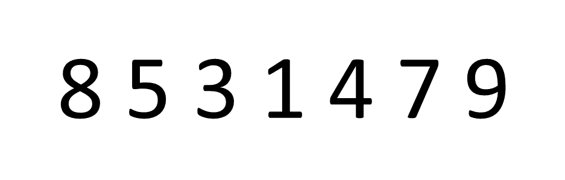

冒泡排序动画

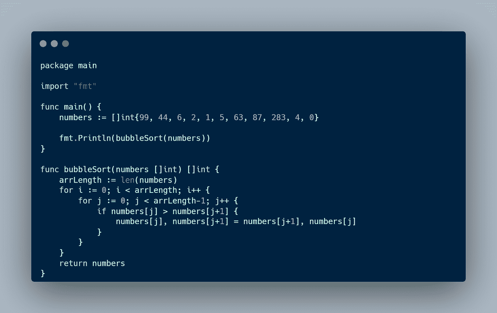

冒泡排序实现

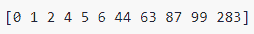

输出

那么，冒泡排序的时间复杂度和空间复杂度是多少？下表解释了

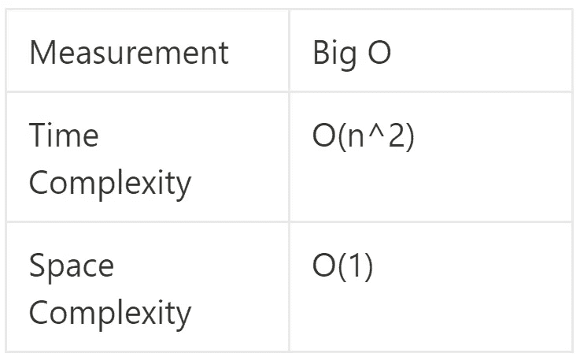

冒泡排序的时间复杂度为 O(n ),这不是真正的高性能排序。原因是我们有一个嵌套循环来比较每个元素。因此，如果我们有 5 个元素，我们将有 25 个操作来排序一个列表。对于空间复杂性，冒泡排序的 O(1)非常有效，因为我们将结果存储在同一个数组中。

# 选择排序

选择排序是指我们找到/选择最低(如果是升序)或最高(如果是降序)的元素，它们的索引大于当前索引。然后我们交换元素。我们可以通过使用循环来实现选择排序。

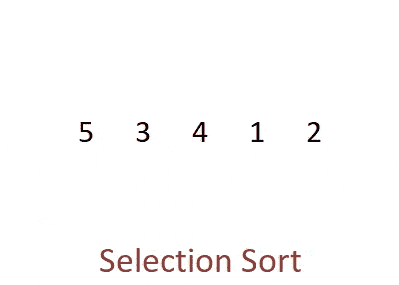

选择排序动画

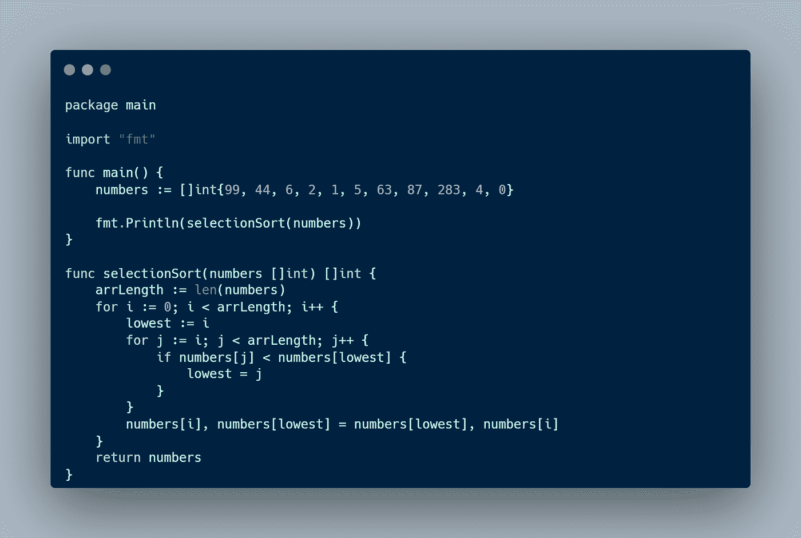

选择排序实现

输出

那么，选择排序的时间复杂度和空间复杂度是多少？下表解释了。

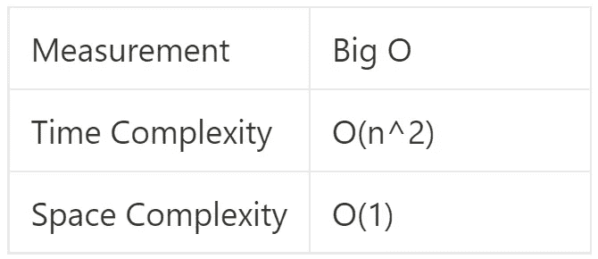

选择排序的时间复杂度与冒泡排序相同，因为我们比较每个元素。空间复杂度也是如此，因为我们将元素存储在同一个数组中。

# 插入排序

插入排序是指我们将元素插入到一个新数组中，并将它放在正确的位置。当数字非常确定地排序或者我们有小的数据集时，使用插入排序。我们可以通过使用循环来实现插入排序。

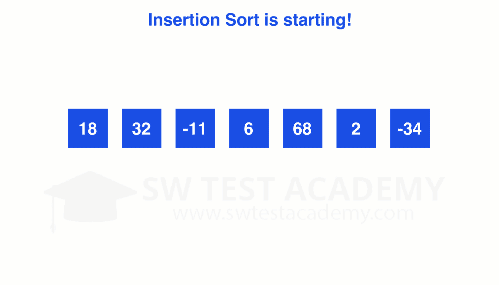

插入排序动画

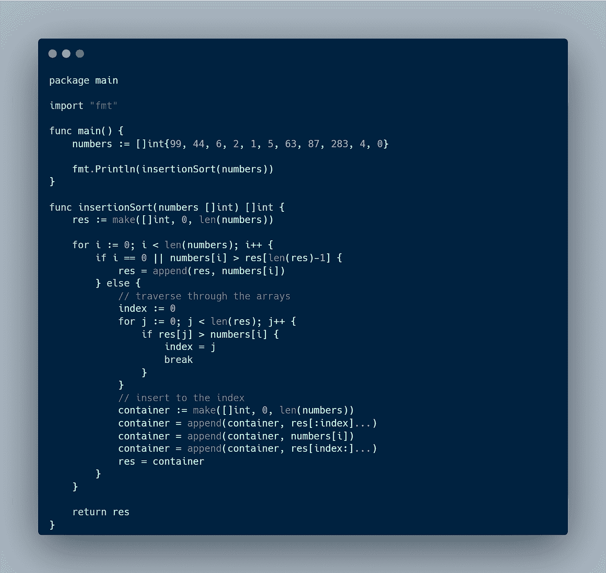

插入排序实现

输出

插入排序的时间复杂度和空间复杂度是多少？下表解释了。

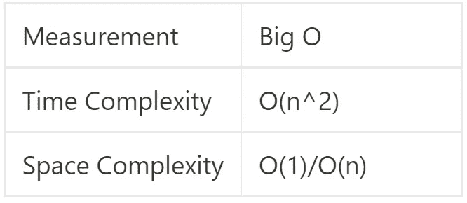

选择排序的时间复杂度与冒泡排序相同，因为我们比较每个元素。空间复杂度是有条件的，如果我们把它存储在一个新的数组中，那么我们得到 O(n)，如果我们把它存储在同一个数组中，那么我们得到 O(1)。

# 合并排序

合并排序使用分而治之，就像在一棵树上，我们把数组分成更小的数组，并互相比较。我们可以通过使用递归来实现合并排序。

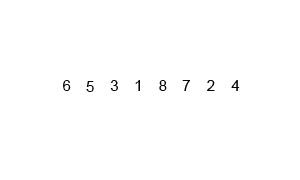

合并排序动画

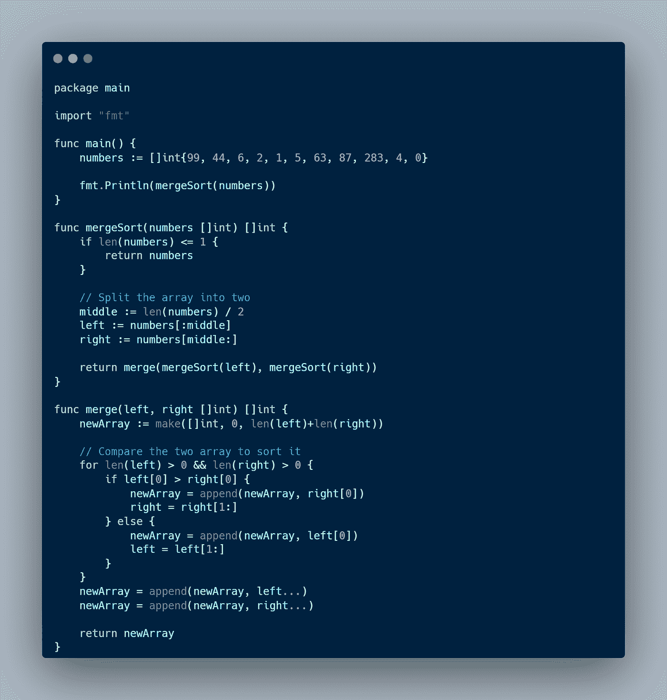

合并排序实现

输出

合并排序的时间复杂度和空间复杂度是多少？下表解释了。

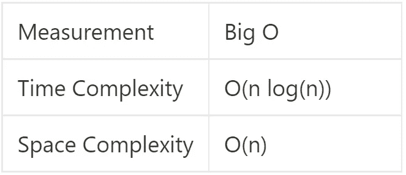

合并排序的时间复杂度是 O(n log(n))，比上面的其他排序算法更有效，因此如果我们想要实现一个排序算法，通常使用它。但是这里关键的一点是合并排序的空间复杂度是 O(n ),因为我们每次比较都要创建一个新的数组。此外，如果我们使用递归，那么我们将有很多函数调用，最坏的情况是我们将有一个堆栈溢出。

# 结论

因此，我们已经知道如何实现不同的排序算法及其性能。下表是各种排序算法之间的比较。

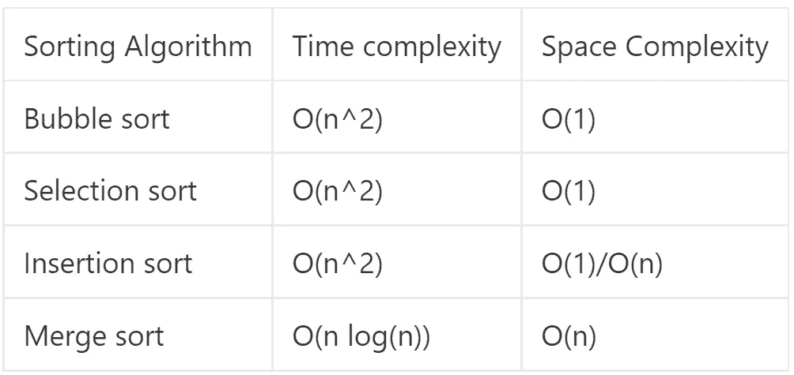

通过查看大的 O cheatsheet，合并排序是我们拥有的最有效的排序算法，因为时间复杂度是 O(n log(n))，空间复杂度是 O(n)。还有更有效的排序算法，你可以在这里看到。

选择使用哪种算法很重要。想象一下，如果我们在谷歌工作，我们必须实现一个排序算法来对网站进行排序。如果我们选择了错误的算法，那么公司可能会损失大量资金和资源。