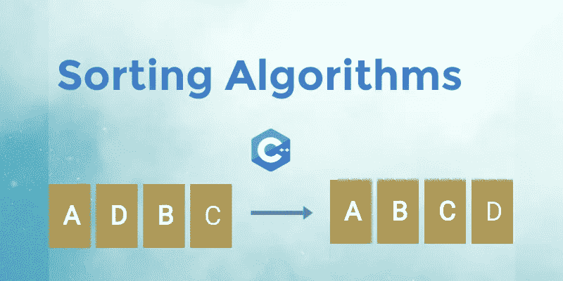

# 面试中问到的排序算法

> 原文：<https://blog.devgenius.io/sorting-algorithms-asked-in-interviews-b4f164b55bff?source=collection_archive---------9----------------------->



# 整理

排序算法用于根据元素上的比较运算符重新排列给定的元素数组或列表。比较运算符用于决定各个数据结构中元素的新顺序。

**比较**

如果元素以特定的顺序排列，那么它们之间的比较就完成了。在集合中的两个项目之间进行比较，以决定它们最终被保存的顺序。

**递归或非递归**

递归是用来排序数组的吗？

如果是，则该算法是递归算法

**在位还是不在位**

我们在你的代码中需要额外的空间来排序一个数组吗？

如果不是这样，则该算法是就地算法

**稳定或不稳定**

具有相同值的项目在排序后会保留其原始顺序吗？

如果是这样，那就叫稳定

**自适应或非自适应**

性能是否会因项目最初的排列方式而有所不同？

如果是，那就叫自适应。

# 排序算法的类型

有许多技术可以对属于上述类别的数组或元素列表进行排序。在这里，我们来看看在技术访谈中经常被问到的算法。

# 冒泡排序

> 元素的比较和排列方式是最大的元素出现在列表的末尾。

*   比较两个连续的元素。如果第一个大于第二个，就会发生交换
*   继续这个过程，直到至少剩下两个元素
*   最后，最大的元素会浮到顶部，即最后一个位置
*   从该过程中排除最后一个元素，并通过对剩余元素执行第 1 点和第 2 点来开始下一次迭代，直到至少剩下两个元素

```
void bubbleSort(vector<int> &arr , int n){
    for(int i=0;i<n-1;i++){
        for(int j=0;j<n-i-1;j++){
            if(arr[j]>arr[j+1]){
                swap(arr[j],arr[j+1]);
            }
        }
    }
}
```

*   我们运行第二个循环直到 n-i-1，因为在每次迭代中，数组的最后一部分被排序。
*   原地算法
*   非递归的
*   时间复杂度=> O(N)
*   空间复杂度=> O(1)

# 选择排序

> 元素的比较和排列方式是，在每次迭代中，最小的元素将出现在列表的开头。

*   固定一个元素并开始与其他元素比较，如果发现比第一个元素小元素，交换它们
*   对整个数组继续这样做，直到我们在开始时得到最小的元素
*   继续第一点和第二点中提到的过程，直到我们得到我们的数组排序

```
void selectinSort(vector<int> &arr , int n){
    for(int i=0;i<n;i++){
        for(int j=i+1;j<n;j++){
            if(arr[j]<arr[i]){
                swap(arr[j],arr[i]);
            }
        }
    } 
```

*   原地算法
*   非递归的
*   时间复杂度=> O(N)
*   空间复杂度=> O(1)

# 插入排序

> 它将一个元素插入到已经排序的列表中，搜索正确的位置。插入后，会形成一个更大的排序列表

*   选择列表中的一个元素，并以相反的顺序与它之前的所有元素进行比较
*   如果元素比比较的元素小，则后者右移。否则该元素被插入到被比较元素的旁边。

```
void insertionSort(vector<int> &arr , int n){

    for(int i=1;i<n;i++){
          int curr = arr[i];
          int j=i-1;

          while(j>=0 && curr<arr[j]){
            arr[j+1] = arr[j];
            j--;
          }

          arr[j+1] = curr;

    }
}
```

*   原地算法
*   非递归的
*   时间复杂度=> O(N)
*   空间复杂度=> O(1)

# 快速排序

> 一个元素被排列在正确的位置，这样左边的元素比这个元素小，右边的元素比这个元素大。

*   该算法使用分治法。
*   选择一个枢轴元素并检查其正确位置，使得右侧的元素比该元素大，而左侧的元素比该元素小
*   然后，将相同的方法应用于阵列的左侧和右侧部分

```
int findPivot(vector<int> &arr , int low , int high){
    int i = low;
    int j = high;

    int pivot = arr[low];

    while(i<j){
        while(arr[i]<=pivot ) i++;
        while(arr[j]>pivot) j--;

        if(i<j) swap(arr[i],arr[j]);
    }

    swap(arr[low] , arr[j]);
    return j;
}void quickSortAlgo(vector<int> &arr , int s ,int e){

    if(s>=e) return;

    int pivot = findPivot(arr , s , e);

    quickSortAlgo(arr, s , pivot-1);
    quickSortAlgo(arr , pivot+1 , e);

}void quickSort(vector<int> &arr , int n){
    quickSortAlgo(arr , 0 , n-1);
}
```

*   在这段代码中，我们使用 arr[low]作为枢纽，但我们也可以将 arr[high]或某个随机元素作为枢纽，并相应地进行求解。
*   原地算法
*   递归的
*   时间复杂度= >平均 O(NlogN)最坏 O(N)
*   空间复杂度=> O(1)

# 合并排序

> 将两个排序列表合并得到一个排序列表

*   它使用分而治之和递归方法
*   列表被分成相等的两半。每一半进行一次递归
*   在递归结束时，应该有两个排序的子列表
*   合并两个排序的子列表，形成一个完全排序的列表。

```
void merge(vector<int> &arr , int s , int e){
    int mid = (s+e)/2;

    int len1 = mid-s+1;   //length for 1st list
    int len2 = e-mid;      //length for 2st list
    int first[len1];
    int second[len2];

    // copy values
    int mainIndex = s;

    for(int i=0;i<len1;i++){
        first[i]  = arr[mainIndex++];
    }

    mainIndex  = mid+1;
    for(int i=0;i<len2;i++){
        second[i] = arr[mainIndex++];
    }

    // merge two sorted array
    int index1 =0;
    int index2=0;
    mainIndex =s;

    while(index1<len1 && index2<len2){
        if(first[index1] < second[index2] ){
            arr[mainIndex++] = first[index1++];
        }
        else{
            arr[mainIndex++] = second[index2++];
        }
    }

    while(index1<len1){
        arr[mainIndex++] = first[index1++];

    }
     while(index2<len2){
        arr[mainIndex++] = second[index2++];

    }
}void mergerSortAlgo(vector<int> &arr , int s , int e){

    if(s>=e) return;

    // find mid
    int mid = (s+e)/2;

    mergerSortAlgo(arr , s , mid);
    mergerSortAlgo(arr , mid+1 , e);

    merge(arr,s,e);

}void mergeSort(vector<int>&arr , int n){
    mergerSortAlgo(arr , 0 , n-1);
}
```

*   不合时宜
*   递归的
*   时间复杂度— O(NlogN)
*   空间复杂度——O(N)

# 堆排序

> 元素根据堆数据结构进行排序

*   元素保存在最小堆或最大堆中
*   根与最右边的子节点交换，然后从堆中移除。
*   然后堆被堆化，并且这个过程继续直到堆变空

```
void heapify(int arr[], int N, int i)
{
    // Find largest among root, left child and right child

    // Initialize largest as root
    int largest = i;

    // left = 2*i + 1
    int left = 2 * i + 1;

    // right = 2*i + 2
    int right = 2 * i + 2;

    // If left child is larger than root
    if (left < N && arr[left] > arr[largest])

        largest = left;

    // If right child is larger than largest
    // so far
    if (right < N && arr[right] > arr[largest])

        largest = right;

    // Swap and continue heapifying if root is not largest
    // If largest is not root
    if (largest != i) {

        swap(&arr[i], &arr[largest]);

        // Recursively heapify the affected
        // sub-tree
        heapify(arr, N, largest);
    }
}void heapSort(int arr[], int N)
{

    // Build max heap
    for (int i = N / 2 - 1; i >= 0; i--)

        heapify(arr, N, i);

    // Heap sort
    for (int i = N - 1; i >= 0; i--) {

        swap(&arr[0], &arr[i]);

        // heapify root element to get highest element at
        // root again
        heapify(arr, i, 0);
    }
}
```

*   原地算法
*   递归的
*   时间复杂度— O(NlogN)
*   空间复杂性— O(1)

# 技术面试中排序算法的常见问题

**在 c++中，sort()方法使用的是哪种排序算法？**

> c++中的 sort()方法混合使用了快速排序、堆排序和插入排序。默认情况下，它使用快速排序，但如果这个算法花费的时间超过 nlogn，那么它使用堆排序，如果数组的大小是两个小它使用插入排序。

**快速排序和合并排序的用例？**

> 快速排序可用于较小的数组，而合并排序的工作方式类似于所有大小的数组。

**在哪种情况下快速排序算法给出 O(n)时间复杂度？**

> 我们的数组已经按升序或降序排序的情况。在这种情况下，为了找到枢轴元素的位置，它给出 O(N)时间复杂度。

**为什么数组优先选择快速排序，而链表优先选择合并排序？**

> 快速排序高度依赖于随机访问数据集中的数据元素和交换元素。由于链表的内存分配不一定是连续的，我们不能有效地随机访问链表的元素。这也使得链表中的交换非常昂贵。在这种情况下，合并排序更快，因为它按顺序读取数据。如果给我们前一个节点的引用，那么在链表的任何部分插入数据也是非常有效的，这样合并操作就可以就地实现。因此，归并排序成为链表的理想排序算法。