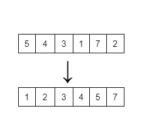

# Python #Python 系列-10 中的排序算法

> 原文：<https://blog.devgenius.io/sorting-algos-in-python-python-series-10-32b1587f2ee7?source=collection_archive---------7----------------------->

作为编程概念中的 for，排序算法及其应用在面试、竞争性编程和开发方面发挥着重要作用。因此，对于有抱负的软件开发人员来说，理清排序背后的概念非常重要。


由[索菲·埃尔维斯](https://unsplash.com/@thetechnomaid?utm_source=medium&utm_medium=referral)在 [Unsplash](https://unsplash.com?utm_source=medium&utm_medium=referral) 上拍摄的照片

那么，什么是排序？为什么实际上需要它？

让我从给你挑战的角度来解释你。我需要你教室里第三高的人。你怎么找到这个？。例如，假设你们班有 35 名学生，需要找出你们班第三高的人。你会怎么做？

我所做的只是让我的同学站成一排，然后通过比较其他同学的身高，根据他们的身高重新排列。那正好叫“**排序**”。你根据身高重新排列/分类了你的同学。

在程序设计语言中，排序是按升序/降序排列数字，或者按字母顺序排列字符，等等。



未排序列表到排序列表

现在，你明白什么是排序了。

在编程界，我们很少有排序算法是相当有名的，也是技术面试中经常被问到的。

> ***选择排序、插入排序、冒泡排序、合并排序、快速排序***

每种排序算法都有自己的优缺点。一旦我们理解了每种排序算法的工作原理，我们将在后面讨论。

> **注意:**所有排序算法的最终结果都是一样的，唯一的区别是它们如何排序。


**选择排序算法**

这种排序数字的方法太天真了。所以，我给你 7 个数字，它们随机排列，你的工作是按升序排列。你会怎么做？

你取第一个数字，并与其他元素比较，如果元素小于第一个数字，你只需更新变量中的小值索引，这样做，直到你到达列表的末尾。这样，我们得到了最小的元素，现在你只需要用第一个元素的变量索引值来交换它。对下一个元素做完全相同的操作。当你第六次继续这个过程时，你就完成了列表的排序。

在对元素的第一次迭代中，你得到第一个最小的元素索引，然后把它和第 0 个索引交换。

在对元素的第二次迭代中，你得到第二个最小的元素索引，并与第一个索引交换。

当你完成第 6 次迭代时，你的列表已经排序了，因为在第 7 次迭代时，没有元素可以和第 6 次索引进行比较。

一般来说，对于 n 个元素。你迭代(n-1)次。

让我们深入研究选择排序算法的 Python 代码

```
def selection_sort(my_list):
    if len(my_list) == 1:
        return my_list
    for i in range(len(my_list) - 1):
        smallest_value_index = i
        # for comparing all elements next to i
        for j in range(i + 1, len(my_list)):
            if my_list[smallest_value_index] > my_list[j]:
                smallest_value_index = j

        # At this point, I got the smallest value that can fit in index-i
        my_list[i], my_list[smallest_value_index] = my_list[smallest_value_index], my_list[i]

if __name__ == "__main__":
    my_list = [5, 4, 3, 1, 7, 2, 6]
    selection_sort(my_list)
    print(my_list)
```

**冒泡排序算法**

用简单的话来定义冒泡排序，在一个列表中，比较当前元素和下一个元素。如果当前元素大于下一个元素，你交换这些元素，否则你只需在其他元素上继续这个过程。就是这样。

在冒泡排序中要注意的要点是，在一次完整的迭代中，最后一个元素将到达它的正确位置(意味着最高值元素到达它的索引)。在第二次迭代中，你不需要迭代直到最后一个元素在每次迭代中都到达它的索引。

在第一次迭代时；[5，4，3，1，7，2，6] → [4，3，1，5，2，6， **7**

在第二次迭代时:[4，3，1，5，2，6，7] [1，3，2，4，5， **6，7]**

将有 7 个元素，将有 6 次迭代。那么，对于 n 个元素，将有(n-1)个元素。

为了更好地理解，让我们看看冒泡排序算法 Python 代码

```
def bubble_sort(my_list):
    if len(my_list) == 1:
        return my_list

    length = len(my_list)
    for i in range(length - 1):
        j = 0
        end_index = length - i - 1
        while j < end_index:
            if my_list[j] > my_list[j + 1]:
                my_list[j], my_list[j + 1] = my_list[j + 1], my_list[j]
            j = j + 1
        print(my_list)

if __name__ == "__main__":
    my_list = [5, 4, 3, 1, 7, 2, 6]
    bubble_sort(my_list)
    print(my_list)
```

**插入排序算法**

这种算法也很简单，但理解和编码起来相当棘手。我们来详细了解一下 algo。

在插入排序中，我们将考虑两个部分，一个→排序部分，另一个→未排序部分。首先，在 7 个元素中，让我们考虑仅第 0 个索引元素被排序，并且从第 1 到第 6 个索引作为未排序的索引。

我们从第 1 个索引开始迭代，因为第 0 个索引被视为排序部分。现在，我们迭代未排序部分中的每个元素，并将它们放在排序列表中的正确位置。

在列表中[5，4，3，1，7，2，6]。已排序部分为[5]，未排序部分= [4，3，1，7，2，6]。我们迭代未排序列表中的每个元素。假设未排序部分中的 4 与排序部分中的元素进行比较。As 4 < 5, 5 is moved to next element position and 4 sits in 0th index

As result of 1st Iteration: Sorted part: [4,5] , Unsorted part: [3,1,7,2,6]

As result of 2nd Iteration: Sorted part: [3,4,5] , Unsorted part: [1, 7, 2, 6]

As result of 3rd Iteration: Sorted part: [1,3,4,5] , Unsorted part: [7,2,6]

As result of 4th Iteration: Sorted part: [1,3,4,5,7] , Unsorted part: [2,6]

As result of 5th Iteration: Sorted part: [1,3,4,5,7] , Unsorted part: [2,6]

As result of 5th Iteration: Sorted part: [1,2,3,4,5,7] , Unsorted part: [6]

As result of 6th Iteration: Sorted part: [1,2,3,4,5,6,7] , Unsorted part: []

The list is sorted. We move till the final element in the list and put them on the correct index in sorted list.

Here is your

```
def insertion_sort(my_list):
    if len(my_list) == 1:
        return my_list
    length = len(my_list)
    for i in range(1,length):
        current_element = my_list[i]
        j = i - 1
        while j >= 0:
            if my_list[j]>current_element:
                my_list[j+1] = my_list[j]
                j = j - 1
            else:
                break
        my_list[j+1] = current_element

if __name__ == "__main__":
    my_list = [5, 4, 5, 1, 7, 2, 6]
    insertion_sort(my_list)
    print(my_list)
```

As, the next two sorting algorithms (**归并排序** & **快速排序**处理递归。在下一篇文章中，我们将看到递归是如何工作的，以及递归过程背后的工作原理，然后我们将使用合并和快速排序算法…

在那之前，祝编程愉快😉。我的**大**感谢人们欣赏我以前的文章，如果你错过了这个系列，你可以查看这个 [**链接**](https://medium.com/@psmohammedali) ，在那里你可以以初学者友好的方式阅读我以前的 8+篇关于 python 基本概念的文章。