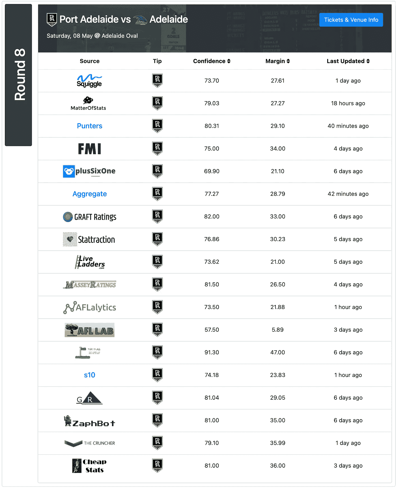
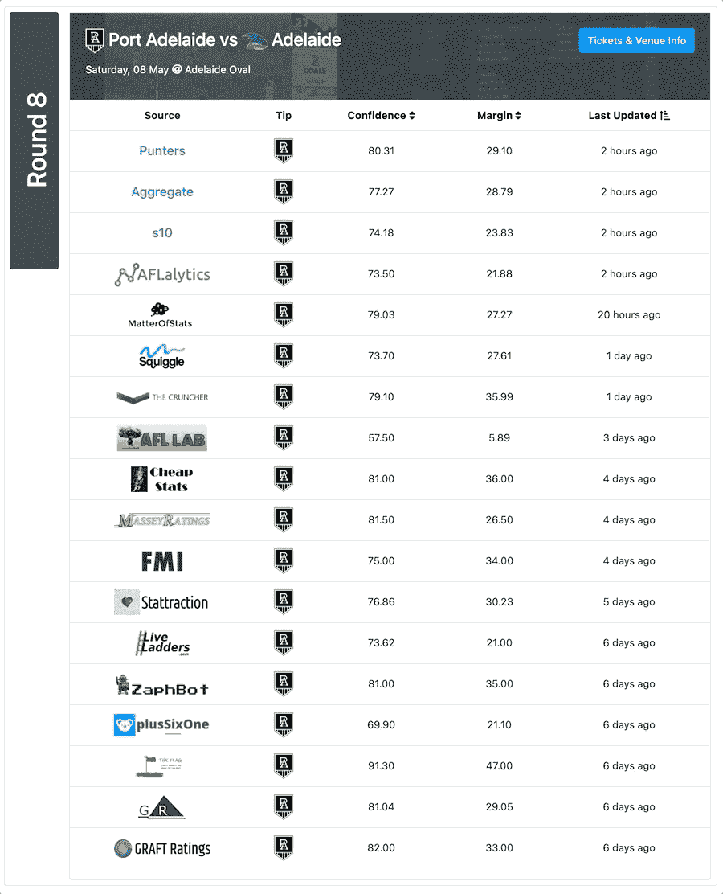

# 用 RxJS 在 Angular 中排序表格

> 原文：<https://blog.devgenius.io/sorting-tables-in-angularjs-with-rxjs-87f9b1674c60?source=collection_archive---------1----------------------->

## 使用可观测量来处理不断变化的数据！



我正在做一个大学作业，使用来自 Squiggle API(api.squiggle.com)的澳大利亚足球联盟(AFL)数据在 Angular 建立一个网站，其中一个用户故事要求我显示一个预测列表，表明你的球队将会获胜。所以，很自然地，我做了一张桌子。作为一个超常发挥者，我想知道，“是否有可能对表中的一些列进行排序？”答案显然是肯定的。但是这是一个简单的任务吗？

见鬼。没有。

我的背景主要是 React，我试图采取一种非常 React 的方法，但失败了。所以，我求助于谷歌，男孩，我不开心。有很多解决方案，但都是针对旧版本的 Angular。所以，在花了一点时间(也许还流了一些眼泪)看完这些文件后，我想明白了，并想在这里与大家分享。

在我开始之前:

如果你是一个有角度的开发者，请给予反馈！出于对自己诚实的考虑，在我提交作业之前，我不会使用它，但之后我会考虑它，并实施任何改进。:)

另外…这只是我对这些部分如何组合在一起的理解。不要只相信我的话！在 [angular.io](http://angular.io) 和 [learnrxjs.io](http://learnrxjs.io) 处检查文档！

现在开始主秀…

首先让我们来看看最新的 Angular CLI:

```
npm install -g @angular/cli
```

接下来，我们想创建一个简单的项目，使用`ng` CLI 命令对此进行测试:

```
ng new table-sorter-app
```

在那之后`cd`进入你的项目并创建一个新的组件:

```
ng generate component table
```

我们将在`table.component.[ts|html]`文件中做我们所有的工作。在很大程度上，我将主要谈论打字稿方面的事情。我假设您可以制作自己的表格，所以将只显示 HTML 代码的一个基本片段。

让我们看看`table.component.ts`会是什么样子

分解一下，我们将使用来自`rxjs`的`BehaviorSubject`、`combineLatest`、`Observable`和`of`，以及来自`rxjs/operators`的`map`和`scan`

我们将变量`table$`设置为`Observable`，这样，如果表格数据发生变化，我们可以轻松地更新 HTML。当您有一些来自实时提要或只是一些随机 API 的数据时，这是很好的。

每当`sortableColumn$`可观察值改变时，我们使用`BehaviorSubject`作为事件发射器来更新表的排序。

`sortDirections$`是另一个可观察到的`pipes`、`sortableColumn$`并使用`scan`作为减速器，每当`sortableColumn$`改变时返回正确的`sortConfig`。

在`constructor`中，我们只需要将`table$`设置为某个值，以阻止 TypeScript 抱怨。你可以用一种更有意义的方式来做这件事，但是对于本教程来说，这样做很好。

在`ngOnInit`方法中`combineLatest`用于组合`table`数据和`sortDirection$`观察值。我们将`table`包装在`of`中，将其转换为可观察的序列。这样，无论任何一个值发生变化，它都会更新前面提到的`table$`可观察值。我们使用`combineLatest.pipe()`将`sort`函数应用于表数据，有效地在每次更新时对其进行排序。最后，我们`subscribe`到`sortDirections$`可观测值，并且每当值改变时更新我们的`sortConfig`。这最后一部分是可选的，但是你会在后面看到为什么这对我的作业很重要。

接下来，我们有一个`setSortColumn`函数，每当我们选择一个列作为排序依据时，它就更新`sortableColumn$`可观察值(您将在 HTML 代码片段中看到这一点),还有一个`sort`函数，它用于根据所选的列和之前的排序顺序来确定表应该按什么顺序排序。

继续我们的`table.component.html`文件，我们可以像这样使用我们的`table$`可观察对象和`setSortColumn`函数:

在这里，我们可以使用`(click)`事件绑定来调用`setSortColumn`,只要点击一个表格标题。这将通过列排序到`sortDirection$`可观察值，并在`descending`和`ascending`顺序之间切换。为了生成行，我们使用`*ngFor`来遍历`table$`可观测数据中的数据，并使用`async`管道来订阅`table$`以确保我们获得最新的数据。

当该说的都说了，该做的都做了，你会得到这样的东西:



我没有在上面的 HTML 中展示，但是在我的作业中，我使用了表格中的`sortConfig`值来切换图标。每当`sortConfig.column`匹配当前选择的列进行排序时，我会从默认图标切换到`ascending`或`descending`图标。如果您选择不同的列进行排序，那么它会将先前选择的列图标恢复为默认状态。

以这种方式排序的另一个好处是，当你使用 observables 时，你可以连接实时数据，你的表将自动更新！

嗯……就这样吧！我希望这能帮助一些人！我花了几个小时才弄明白这些东西，我对结果非常满意。如果你有任何意见，请留下！