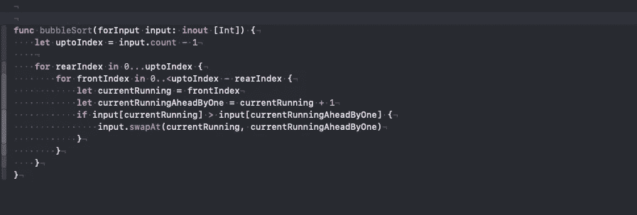
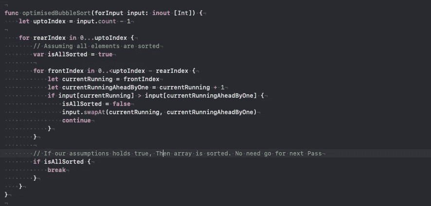

# 冒泡排序

> 原文：<https://blog.devgenius.io/sorting-techniques-ce79a2cc75?source=collection_archive---------2----------------------->

**定义:**
[**冒泡排序**，有时也称为**下沉排序**，是一种简单的排序算法，反复遍历列表，比较相邻的元素，如果顺序不对就交换。重复遍历列表，直到列表被排序。该算法是一种比较排序算法，因较小或较大的元素“冒泡”到列表顶部而得名。](https://en.wikipedia.org/wiki/Bubble_sort)

冒泡排序:

```
**var** unOrderArray = [5,2,13,7,11,3]
Suppose we have array of unordered numbers(In this case Prime number, subset of natural numbers)
We have two option to sort this.
1\. Ascending order.
2\. Descending order.
```



冒泡排序(升序)

但是如果所有元素都是自己排序的呢？
例如:var sortedArray = [2，3，5，7，11，13]
它将对所有已排序的元素进行排序😂。
这种情况可以通过假设所有元素都已排序来处理，如果它成立，那么我们将打破循环。✌🏼



冒泡排序(升序)

支持代码:

感谢阅读。如果您有任何疑问或疑问，请告诉我。

roshankumar350@gmail.com
罗山·库马尔·萨。