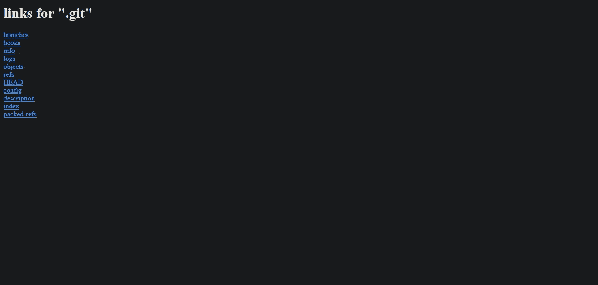

# 通过暴露的源代码泄露。git 文件夹

> 原文：<https://blog.devgenius.io/source-code-disclosure-via-exposed-git-folder-24993c7561f1?source=collection_archive---------2----------------------->


潘卡杰·帕特尔在 [Unsplash](https://unsplash.com?utm_source=medium&utm_medium=referral) 上的照片

问候！所有人，

我希望你们都过得很好。今天我要写关于源代码公开的文章。网站/工作环境中的 git 文件夹。这对于程序员/web 开发人员了解和保护他们开发环境中的源代码也很重要。所以，没有任何拖延，让我们直奔主题。现在，第一个问题出现了，为什么你应该关心或了解你的网站/工作环境中的打开 git 文件夹？因为:

1.  很容易察觉。
2.  分析源代码可以揭示其他更严重的漏洞。
3.  任何人都可以出于恶意使用你的源代码，给你造成经济/名誉损失。
4.  查找包含敏感信息(如凭据、令牌、新端点等)的文件


## 什么是。git 文件夹？

我在这里假设你知道 Git，如果不知道，那么检查这里的[和这里的](https://en.wikipedia.org/wiki/Git)。那么，什么是. git 文件夹呢？根据 [stackoverflow](https://stackoverflow.com/questions/29217859/what-is-the-git-folder) 的说法，它是一个文件夹，包含了你的项目在版本控制中所必需的所有信息，以及关于提交、远程存储库地址等所有信息。所有这些都在这个文件夹中。它还包含一个存储提交历史的日志，以便您可以回滚到历史。

## 为什么在 Web 开发中使用 Git？

当你在自己的电脑上创建网站，并使用 Git 将这些文件的副本推送到 web 服务器时，通常会用到 Git。如果您的计算机发生任何问题，您在 web 服务器上仍有一份完整的副本。然后，您可以配置此 web 服务器存储库，将实时更改推送到您的网站。这为开发人员提供了优势，使他们易于开发。此外，您可能想要检查[这个](https://www.webdesignerdepot.com/2009/03/intro-to-git-for-web-designers/)。暴露 git 文件夹的威胁在开始时已经讨论过了(参见“为什么你应该关心或了解你的网站/工作环境中的开放 git 文件夹？”)


让乐趣开始；)

## 真正有趣的时间到了:

你记得我说过很容易找到一个暴露的。git 文件夹？但是怎么做呢？让我们看看。请注意，我将在本文中使用三种不同的谷歌呆子，它们可以在谷歌黑客数据库(GHDB)上找到[这里](https://www.exploit-db.com/ghdb/3988)，这里[这里](https://www.exploit-db.com/ghdb/4914)，这里[这里](https://www.exploit-db.com/ghdb/5228)。但是，在继续之前，请注意:

1.  如果你得到一个 **404 错误**，那么。服务器上不存在 git/但是如果你得到一个 **403 禁止错误**，它就存在。如果在服务器上禁用了目录列表，将无法直接访问文件夹的根目录。
2.  如果幸运的话，并且启用了目录列表，那么您可以直接浏览。git 文件夹的内容如下图所示。
3.  对某个网站使用 Google dorks，看看它是否泄露了源代码。
4.  这个指南也可以被各种 bug 赏金项目中的 bug 猎人使用。

*   通过手动浏览来确认错误。git 文件夹。
*   确认。git 文件夹的内容是可访问的(即使。git/本身不是)通过尝试打开这些不同的通用文件名，例如:

[https://example.com/.git/HEAD](https://example.com/.git/HEAD)

[https://example.com/.git/logs/HEAD](https://example.com/.git/logs/HEAD)

[https://example.com/.git/index](https://example.com/.git/index)

[https://example.com/git/config](https://example.com/.git/config)

*   确认 Git 文件夹的存在并启用目录列表后，只需使用以下命令使用 *wget* 下载即可:

```
wget -r http://www.example.com/.git/
```

现在，打开你选择的网络浏览器，打开 google.com，使用本文提到的谷歌傻瓜。

**Google Dork 1** → *显示可公开访问的 Git 目录，并允许直接访问代码。*


可公开访问的 Git 目录


目录列表已启用，并允许直接访问。git 目录。


直接访问。git 目录内容


web 应用程序的更新流程脚本的代码

**Google Dork 2** → *包含与目标用作 IDE 的内容相关的信息，以及许多其他与开发相关的软件。非常适合足迹。*


各种网站提供关于他们开发环境的信息。


注意 db/文件夹


启用目录列表和访问。git 文件夹提供对 SQLite 数据库的访问。


其他有用的信息。

**Google Dork 3** → *服务于 git 存储库的 web 服务器。这一潜在缺陷可用于从 web 服务器下载内容，否则这些内容可能是私有的。*



注意那些被公开泄露的重要文件夹。


可以访问的各种脚本。


可以下载的材料/脚本。

## 让我们来实现自动化:

这是有趣的部分！浏览。git/ manually 有利于概念验证，但也是一项繁琐的工作。如果您想要检索尽可能多的文件，即使禁用了目录列表，要使用的工具是 [GitTools](https://github.com/internetwache/GitTools) 。

*   您必须手动分析本地存储库。

## Hackerone 报道:

1.  [https://hackerone.com/reports/248693](https://hackerone.com/reports/248693)
2.  [https://hackerone.com/reports/173811](https://hackerone.com/reports/173811)
3.  [https://hackerone.com/reports/218465](https://hackerone.com/reports/218465)
4.  [https://hackerone.com/reports/221298](https://hackerone.com/reports/221298)

## 缓解措施:

1.  不要离开你的。git 文件夹在生产环境中！或者至少将它移出根目录。
2.  通过禁用目录列表来阻止直接访问。

*   当您设置规则来阻止对以“.”开头的文件和文件夹的访问时您应该考虑以下例外情况:

Nginx:

`location ~ /\.(?!well-known\/) {
deny all;
}

Apache:
<Directory ~ "/\.(?!well-known\/)">
Order deny,allow
Deny from all
</Directory>`

如果你想了解激发这篇博文的更多研究，请看[https://lynt.cz/blog/global-scan-exposed-git-repos/](https://lynt.cz/blog/global-scan-exposed-git-repos/)。我希望你喜欢这篇博文。更多类似这样的精彩内容敬请期待。保持快乐。