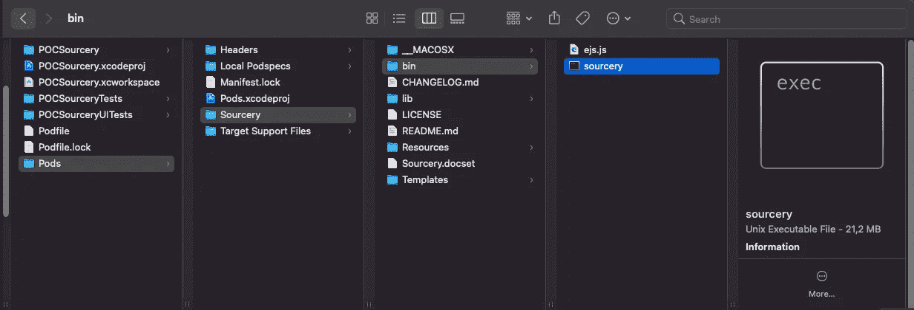
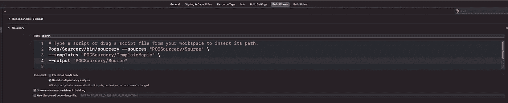

# iOS 中的 Sourcery

> 原文：<https://blog.devgenius.io/sourcery-in-ios-10e93c822223?source=collection_archive---------3----------------------->


准备好成为消息来源了吗？🪄

[Sourcery](https://github.com/krzysztofzablocki/Sourcery) 是 Swift 语言的代码生成器，保证能为您节省时间。它被用于 iOS 和 macOS 上的超过 40，000 个项目中，并为你使用过的一些最受欢迎、最受好评的应用程序提供动力(包括 Airbnb、Bumble、纽约时报)

# **使用情形:**

我们用一点小魔法改变了这个:

进入这个🪄:

我们都知道单元测试时模拟有多重要。
作为开发人员，我们不想花时间编写样板代码。
在上述情况下，sourcery 被指示为一个协议创建一个模拟实现。但你可以做得更多。

# 了解如何使用 Sourcery

> 有趣的事实:你可以比看哈利波特电影更快地理解和设置 Sourcery。🍿

## 1.下载源

我们将下载 Sourcery 和 cocoapods。

将`pod 'Sourcery'`添加到您的`Podfile`中，然后添加`pod install`

请记住:Sourcery 不是项目源代码中的依赖项，它不会被发送到最终的存档应用程序中。就像雨燕绒一样。所以 Cocoapods 只会为我们下载可执行文件，然后我们就可以使用它了。没有它，我们不能做魔术🪄



Sourcery 可执行文件 Cocoapods 为我们下载。

## 2.使用来源

既然我们有了变魔术的工具(可执行)，我们应该知道如何运行它。

```
Pods/Sourcery/bin/sourcery --sources "PROJECT_NAME/Source" \--templates "PROJECT_NAME/TemplateMagic" \--output "PROJECT_NAME/Source"
```

*   源 Sourcery 为了创建其他文件而读取的输入文件。(例如，在上面的示例中，FooProtocol.swift 位于 PROJECT_NAME/Source 内部)
*   模板→是 Sourcery 知道为哪些类/枚举创建代码和什么代码的说明。
*   输出→是 sourcery 将保存生成文件的文件夹。

> 提示:如果您希望 Sourcery 在每个构建中运行，您可以在构建阶段添加它。



在构建阶段添加了 Sourcery

## 3.学习如何编写自己的模板(法术)

[模板](https://github.com/stencilproject/Stencil)是最流行的模板语言来编写您的自定义模板。
现在让我们创建自己的定制模板，让《哈利·波特与⚡️》引以为豪:)

> 提示:介于 **** 之间的是模板代码。
> 
> 提示:首先，使用注释/注释 my IRST 法术迭代所有协议

每个魔术师都从简单的法术开始，将物体变成青蛙🐸

现在让我们运行🪄

> 观察:第一行注释是必要的，否则我们就没有输出(没有青蛙函数)。

在咒语之后:

生成的文件。

你做到了🎉。你真好。你正式成为一名新魔术师了。我希望能从你身上看到更多的魔法。

在这里了解更多关于如何写更强大的咒语:
[https://www.youtube.com/watch?v=GNmLVq14LC8](https://www.youtube.com/watch?v=GNmLVq14LC8)

如果你觉得这篇文章很有帮助，别忘了留下一些掌声👏，你帮一个魔术师同行继续写这样的文章！

我差点忘了..这里有一些我一直在用的咒语，想和大家分享一下。

## 自动锁定

## 自动等值:

转换枚举以符合等效协议。

*更多内容尽在*[*blog . dev genius . io*](http://blog.devgenius.io)*。*