# Spark 架构 101 |概念和应用

> 原文：<https://blog.devgenius.io/spark-architecture-101-concepts-application-f5260783ac9d?source=collection_archive---------2----------------------->


在这篇博文中，我们将了解 Apache spark 的架构。本文将帮助您全面理解 apache spark 是如何工作的。我们将涵盖所有关于 spark 架构的基本主题。

# 本博客涵盖的主题:

1.  火花介绍
2.  火花部件
3.  阶段
4.  洗牌
5.  Spark 生命周期。

# 火花介绍:

Spark 是跨集群并行处理的统一计算引擎。可以把 spark 想象成一种类似 python 或 java 的编程语言，它允许我们在不同的 CPU 之间划分进程。也就是说，Spark 支持多种广泛使用的编程语言(Python、Java、Scala 和 R)，包括从 SQL 到流和机器学习等各种任务的库，可以在从笔记本电脑到数千个服务器的集群的任何地方运行。

**类比:**为了更好地理解 Spark 架构的细节，我们将使用一个类比。假设你经营一家餐馆，有一袋子苹果，你的任务是把它们切成小块。假设袋子里有 10 个苹果，一个人可以在 10 分钟内切开袋子里的苹果。如果有 100 个这样的袋子，切完所有的苹果需要 1000 分钟(16.6 小时)。因此，我们需要将这项工作分配给更多的人，让他们平行地切苹果，这样你就可以准备美味的沙拉了。这正是 spark 所做的。

# **火花元件:**

理解了类比之后，让我们用同样的想法来理解 spark 组件。

司机:将司机视为餐厅的主厨/经理，他将工作分配给其他厨师。

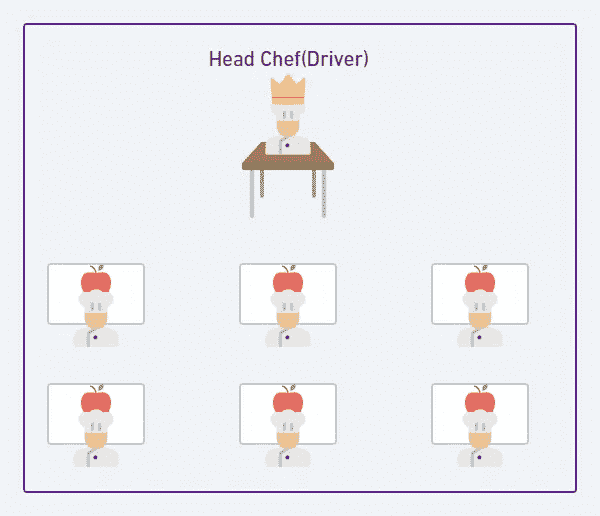

在 spark 中，驱动程序负责将**任务**分配给执行器。从数据工程师的角度来看，如果我们想要过滤一个包含 1000 行的表，这些行将被**驱动程序划分并分布在执行器上。**注意，不允许驾驶员查看数据。

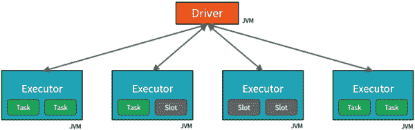

驱动程序和执行器架构(来源:[数据学院](https://datacadamia.com/db/spark/cluster/core)

**执行者**:把执行者看成是厨师执行任务(切苹果)的工作站/案板。

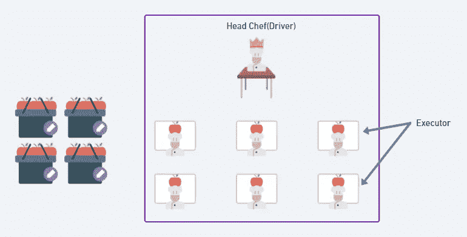

在 spark 中，执行器是执行任务的 Java 虚拟机。执行者负责运行单个任务，并将结果发送给驱动程序。

**槽/核:**槽或核是指执行切苹果任务的厨师。执行器由核心/插槽组成。一个执行器(工作站)可以由一个或多个核心/插槽组成。

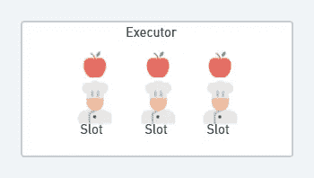

在 spark 中，核心/插槽是执行实际任务的 CPU。存在的核心总数负责并行执行更多的任务。

**作业、任务、数据集、分区:**

**数据集**是篮子里苹果的集合。

**分区**是将数据集分割成更小部分的过程。分区是由驱动程序完成的。

**任务**通常是需要处理的分区总数，例如，如果我们有 4 个篮子，每个篮子中有 3 个苹果，那么我们有 12 个苹果(数据集)要切。这被驱动程序分成 12 个分区，因此总共需要执行 12 个任务。每个任务由每个内核执行。因此，如果我们有 3 个执行器，每个执行器有 2 个内核，那么我们总共有 6 个内核，因此最多只能有 6 个任务可以并行执行。

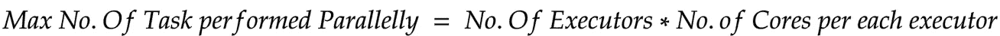

**作业**是驾驶员接受的总体指令。在这种情况下，我们需要切 4 篮苹果，每篮 3 个。

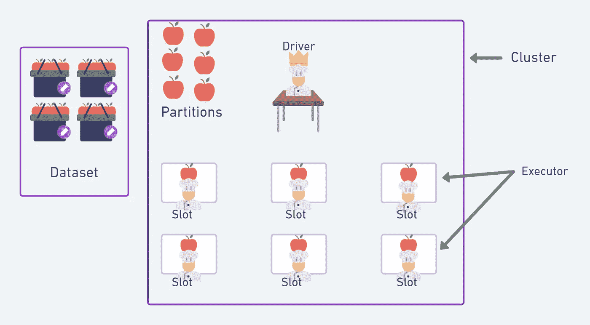

# 阶段:

Spark 中的阶段表示可以在多台机器上一起执行以计算相同操作的任务组。我们已经知道不允许驱动程序查看数据集，那么您是否想知道驱动程序如何知道数据集或我们示例中的苹果的总行数？Spark 通过在执行者之间分发数据集并向他们询问计数来解决这个问题。让我们通过两个阶段来了解整个过程。

**阶段 1:** 在这个阶段中，驱动程序对数据集进行划分，并将它们分配给一组执行器。驱动程序现在要求执行器计算数据集中的行数。在这个阶段，执行者的工作是找出每个篮子里苹果的数量。现在，计数存储在磁盘上的每个执行器中，以供稍后阶段使用，这也称为**混洗数据**。

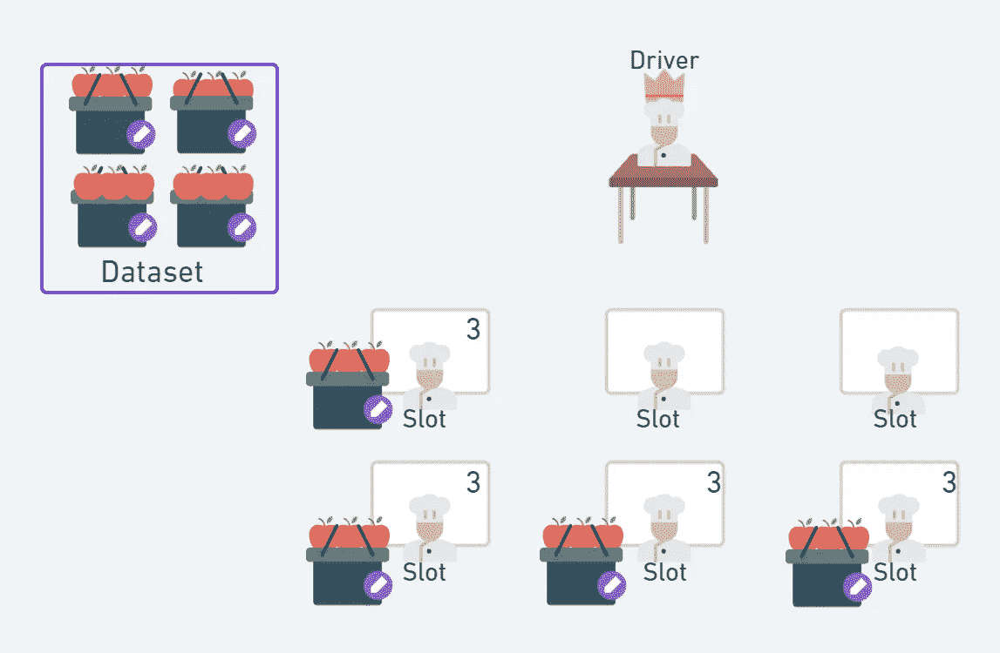

**第二阶段:**即使是现在每个执行者也不能直接把结果给司机，让它算总数。因此，将来自每个执行者的苹果计数相加的过程是由另一个执行者执行的，最后将总数交给驱动程序。

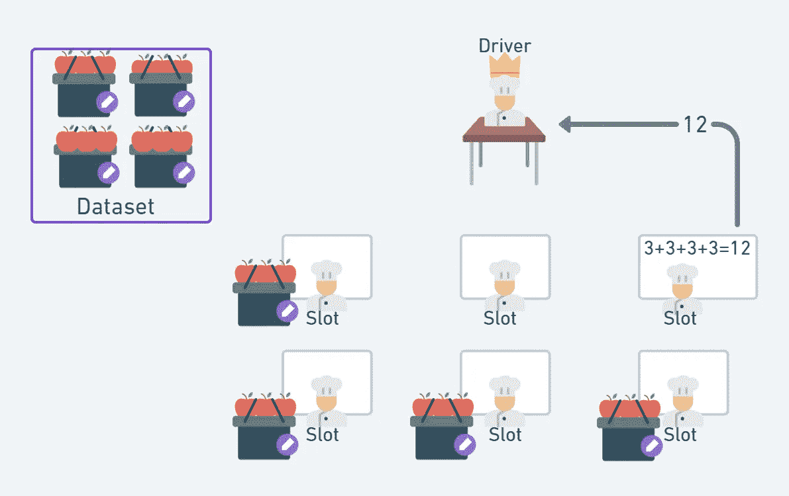

由于一个执行者需要从所有其他执行者那里收集信息，这些操作被称为**宽转换。转换**是 spark 给出的指令，用于从现有数据帧产生新的数据帧。

每当执行者之间有数据交换时，我们就有一个宽转换，如果没有数据交换，那么它被称为**窄转换。**更多改造细节可以在这里[找到。](https://sparkbyexamples.com/apache-spark-rdd/spark-rdd-transformations/)

现在这两个阶段完成后，我们现在总共有 12 个苹果。现在司机完全知道如何在其他厨师中分配这些苹果。现在让我们把我们的理解转化为阶段。

**第一阶段:**将篮子分给执行者
**第二阶段:**统计总数并将结果交给执行者
**第三阶段:**司机将苹果分给执行者，执行者将苹果切成片。
**阶段 4:** 指派一个执行者从其他执行者那里收集所有的碎片，并将结果交付给驱动程序。

# 洗牌:

洗牌是指在不同阶段之间重新排列群集中的数据的过程。为了更好地理解 shuffle，我们将举一个例子，现在我们的任务是计算篮子中不同的()水果类型。和以前一样，现在这个任务分两个阶段完成。

**阶段 1:** 篮子分发给遗嘱执行人。现在每个执行者都在数篮子里不同的水果。这些数据现在存储在每个执行器的磁盘中。

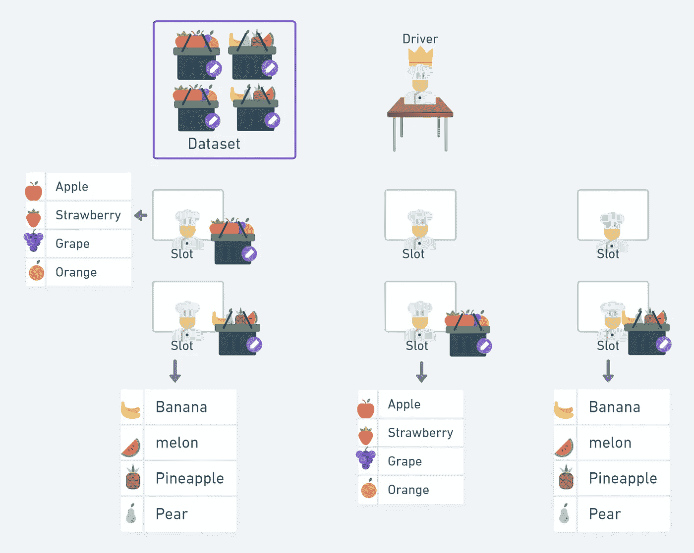

**阶段 2:** 现在，每个执行程序读取存储在另一个执行程序中的数据，以找到所有不同的结果。这个在执行者之间共享数据的过程被称为**洗牌**。就架构而言，洗牌是一个昂贵的过程。因此，最好尽可能减少宽转换的数量。大多数情况下，spark 自己完成，这个过程被称为**流水线**。

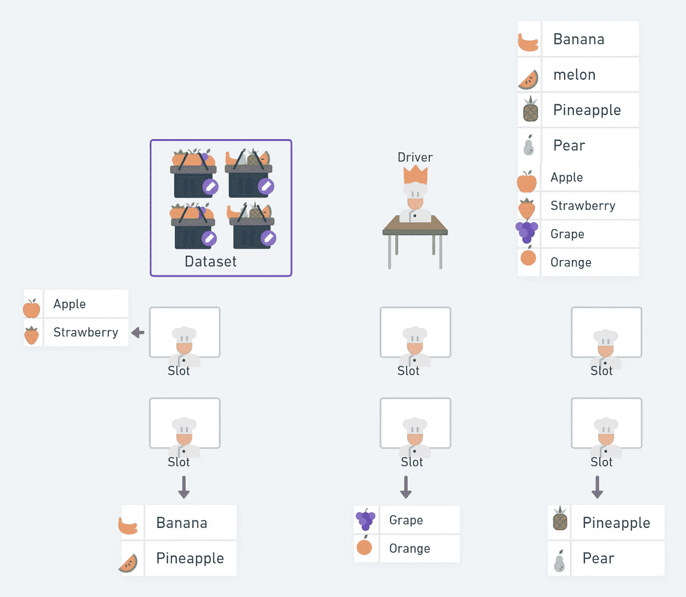

# Spark 生命周期:

现在我们已经了解了 Spark 的重要概念，让我们了解一下它的整个生命周期。


**集群管理器**负责维护驱动程序和执行器。目前，有三个可用的集群管理器独立集群管理器，Apache Mesos 和 Hadoop YARN。

**第一步:**用户将提交一个 spark 应用程序。这里，我们请求集群管理器接受我们的请求，并为我们的应用程序分配资源。你可以在这里找到更多关于如何编写 spark-submit 应用程序的例子[。](https://sparkbyexamples.com/spark/spark-submit-command/)

步骤 2: 现在你的应用程序应该创建一个 **SparkSession** 。这将初始化集群中的驱动程序和执行器。SparkSession 随后将与集群管理器通信，请求它在集群中启动 Spark executor 进程。执行器的数量及其相关配置由用户通过最初的 **spark-submit** 调用中的命令行参数来设置。

**步骤 3:** 现在代码的实际执行开始了。让我们通过在数据帧上运行一个简单的计数操作来理解它。

创建数据帧:

```
orders_df=spark.read.csv('dbfs:/FileStore/tables/Data/orders/part_00000',schema="""order_id INT,order_date DATE,order_customer_id INT,order_status STRING""")
```

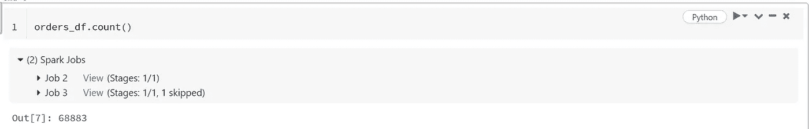

这里计数操作分两个阶段完成。

**阶段 1:** 本地统计记录数量。

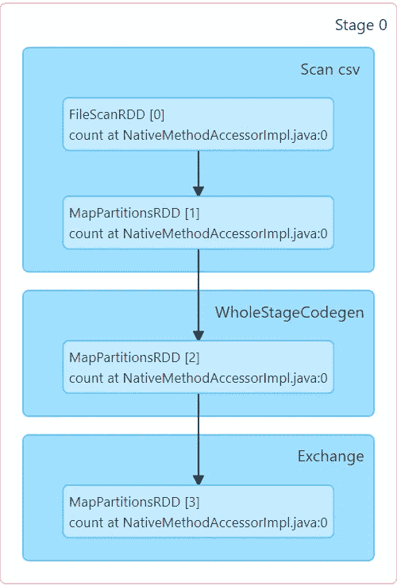

**阶段 2:** 洗牌阶段，洗牌发生。

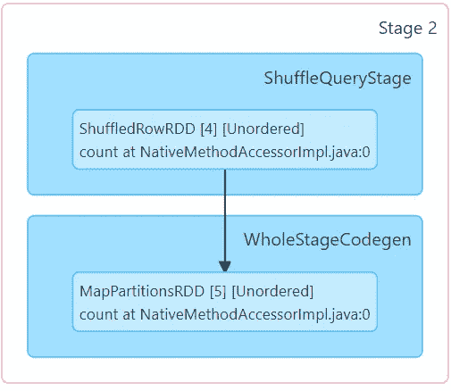

> 这个执行计划是一个转换的有向无环图(DAG ),每个转换产生一个新的不可变数据帧，我们在其上调用一个动作来产生一个结果。

# **结论:**

我希望在阅读完这篇文章后，您会对 apache spark 的工作原理以及我们运行 spark 应用程序时会发生什么有一个基本的了解。在 [medium](https://medium.com/@sidharth.ramalingam) 上关注我，了解更多关于 spark 和数据工程的东西。如有任何问题，请随时通过 LinkedIn 与我联系。