# 火花集群与虚拟盒，蟒蛇和 Jupyter 指南

> 原文：<https://blog.devgenius.io/spark-cluster-with-virtual-box-anaconda-and-jupyter-the-guide-dd0007cd5895?source=collection_archive---------3----------------------->

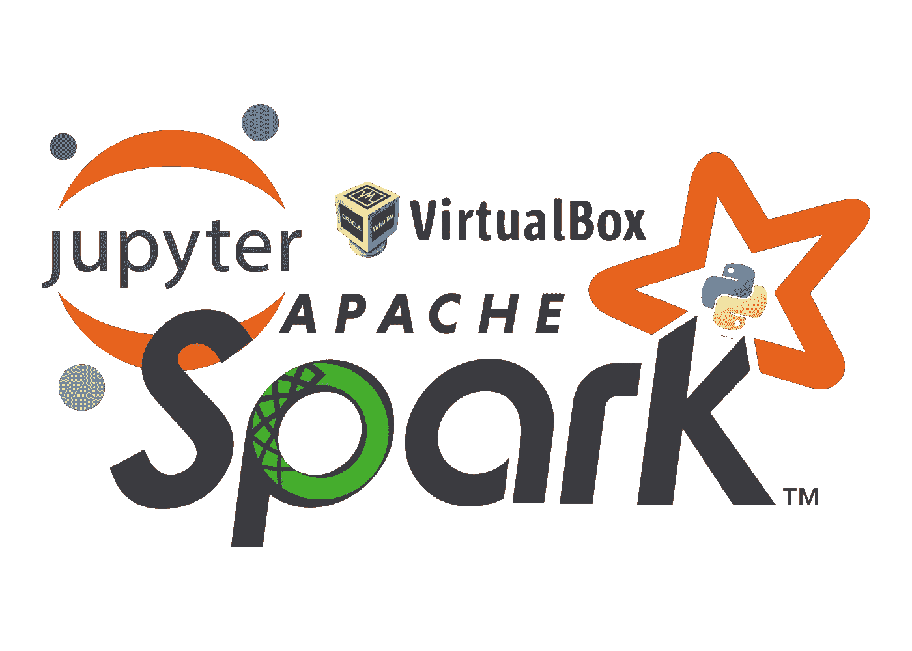

—火花—

# 放弃

> 我不会更新这个博客，相反，我的 github 上的文档会随着我的任何改变而更新

[Github](https://github.com/produdez/sparkimental) = >转至`docs/spark-cluster-setup.md`🍡

***(我也认为在 markdown 上阅读更好，因为 medium 缺少这么多基本的编辑布局功能)***

# 序

如果您在进入数据科学的旅程中遇到过`Spark`，那么当您第一次遇到它时，可能会有一些基本问题挥之不去，例如:

*   如何设置`Spark`(本地机还是虚拟机？)(集群还是只是本地进程？)
*   如何在上面运行代码？直接？通过 python 脚本？`jupyter`？
*   哪个版本适用于哪个版本？`Java` `Python` `Spark` `Scala`
*   这整件事为什么没有一个超级详细的教程？大多数教程

1.  只要确保 Spark 能够运行(本地或分布式都没关系)
2.  安装 Spark 集群，但没有展示如何在其上运行代码
3.  不包括如何与 Spark 用户界面交互(历史、主用户界面、从用户界面、作业监控用户界面等)
4.  没有 python 虚拟环境设置来管理 Spark 的 python 包
5.  没有提到如何充分利用虚拟机(如`VirtualBox`虚拟机)来帮助我们的开发过程

所以在这篇博文中，在为我的分布式数据处理任务进行研究时，我已经*(尽我最大的能力)*记录了我是如何

1.  在由虚拟机箱管理的虚拟机上设置我的 Spark 集群
2.  使用 Anaconda 设置 python 环境(虚拟环境)来管理这些虚拟机上的 python 包
3.  运行/提交 python 代码到我正在运行 spark 集群*(我们不想要任何本地进程 Spark)*
4.  解决我一路上遇到的所有小问题/陷阱

> *本指南旨在汇集我对该主题的所有研究参考资料，同时也旨在完全避免被愚弄🐪像我这样的人🙈*

*所以请原谅我的冗长的帖子📣我们走吧👟🪜*

# 目录

[前言](#165c)
[虚框](#8aba)
[创建基础 Linux](#b09e)
[Linux 设置](#0761)
∘ [规格](#6e30)
∘ [步骤](#5ece)
∘ [我们在哪里](#3b05)
∘ [为什么？](#fdc7)
[安装火花](#cef6)
∘ [步骤](#34b3)
∘ [进度如何](#0ea6)
[新节点](#827c)
∘ [克隆](#024a)
∘ [重命名机器](#aad7)
∘ [联网](#cee9)
[从设置](#90e4)
[主设置](#58d0)

# 虚拟盒子

> *虚拟机管理器*

*   6.1.38(最稳定的版本)(⁉️不要安装 7.0 以上，因为它有很多错误和不稳定)

[参考](https://download.virtualbox.org/virtualbox/6.1.38/VirtualBox-6.1.38-153438-Win.exe)，[下载](https://download.virtualbox.org/virtualbox/6.1.38/VirtualBox-6.1.38-153438-Win.exe)

# 创建基本 Linux

> *这将是我们的* `*building block*` *虚拟机，我们将对其进行克隆，然后进一步调整为我们的主节点和工作节点*

# Linux 设置

## 规范

*   Ubuntu 18.04 LTS ( [Ref](https://releases.ubuntu.com/18.04/) ，[下载 64 位](https://releases.ubuntu.com/18.04/ubuntu-18.04.6-desktop-amd64.iso))
*   建议的虚拟机存储大小:20GB (❗You'll 已经为所有基本软件包安装使用了大约 10GB)
*   RAM/CPU →你的选择，我的选择:
    -主节点 2 个 CPU，4GB RAM
    -从节点默认(workers)

> Ram/Cpu 可以很容易地改变以后，所以没什么大不了的！

## 步伐

> *为了方便起见，我将我的 ubuntu 机器名命名为我的虚拟机器名*

1.  在 virtual box 上运行安装程序，创建一个符合上述规格的新的空虚拟机

> 注意🗒️:我给这台机器取名`base-clean`

[详细教程](https://medium.com/dfclub/create-a-virtual-machine-on-virtualbox-47e7ce10b21)(这个对我来说太简单了，涵盖不了)

> *请注意，您应该使用动态分配*

2.将虚拟机的网络设置到本地主机

*   右键单击机器>设置>网络
*   确保`Adapter 2`有这些配置(为什么？[参考号](https://serverfault.com/questions/225155/virtualbox-how-to-set-up-networking-so-both-host-and-guest-can-access-internet)

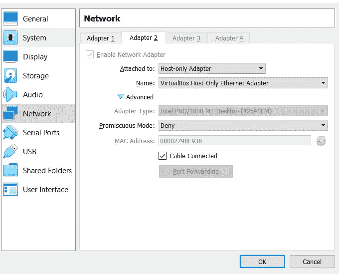

3.运行新的虚拟机，选择我们的`Ubuntu` ISO 并开始安装(这一步耗时最长😷)

*   请输入简单的用户名和密码🙏
*   不需要关心机器名，我们总是可以改变它

> 注意🗒️:我的设置的用户名是`prod`

4.（⏰可选)更新内核/系统(这可能是一个屏幕 UI 提示)

5.（⏰可选)安装`Guest Addition CD Image`

*   这样我们就可以在主机(*您的 pc)* 和虚拟机之间使用双向剪贴板

*下面第 5 步的详细信息*🔽

a)安装光盘

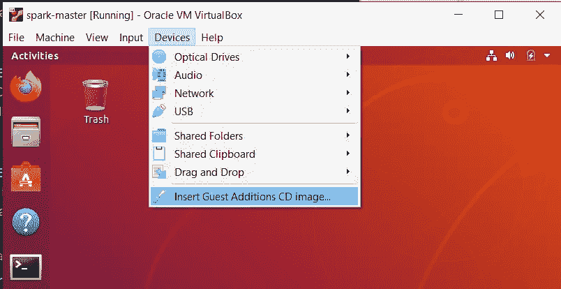

b)等待安装 CD+弹出安装窗口


c)点击运行，等到完成，如果你是绅士，弹出光盘🎩

d)重新启动虚拟机并确保共享剪贴板正常工作

> 测试前不要忘记选择共享剪贴板选项😉

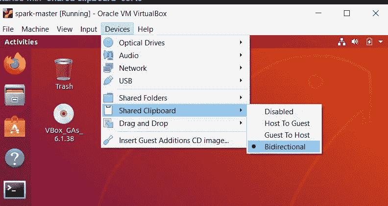

*完成第五步*

6.（⏰可选)更新包管理器`apt-get`

```
sudo apt-get upgrade
```

7.获取虚拟机的`ip address`

```
ip addr
```

> 前两个 IP 用于互联网连接，应该有第三个 IP 指示我们的主机本地网络中的虚拟机 IP(如果缺少一个条目，请重新检查适配器 2 网络设置)

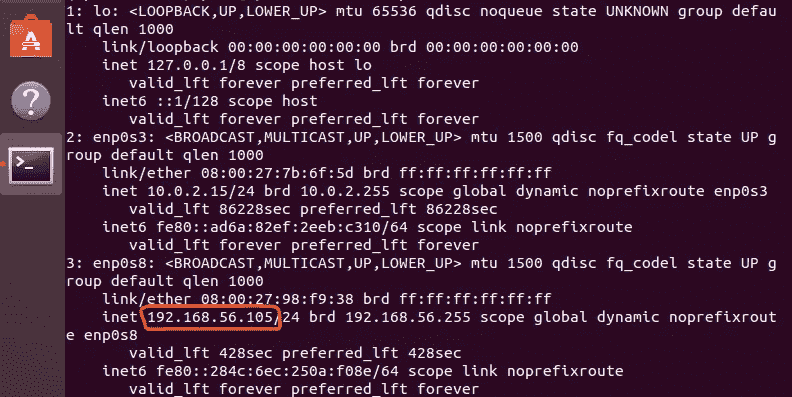

本地网络上虚拟机的 IP

记下本地网络上虚拟机的 IP，以便以后进行配置

> 请注意，🗒️:我的基本清理虚拟机的 IP 地址是 192.168.56.105

8.安装`SSH`

*   [计] 下载

```
sudo apt-get install openssh-server openssh-client
```

*   用`ssh-keygen`生成密钥

> 或者使用`mkdir ~/.ssh`创建`.ssh`文件夹，如果您不希望您的虚拟机在克隆时有重复的 SSH 密钥

*   （⏰可选)将主机的 SSH 密钥复制到虚拟机，以便以后快速进行 SSH 访问，而无需每次都重新键入密码

```
# assuming you already have you ssh key generated on your host machine 
cat C:\Users\USER\.ssh\id_rsa.pub | ssh prod@192.168.56.105 “cat >> .ssh/authorized_keys”
```

*   用`ssh <username>@<ip-addr>`测试(不应该询问密码)

9.安装`curl`(用于以后下载文件)

```
sudo apt-get install curl
```

10.关闭机器电源，🥂

11.克隆当前机器(`base-clean`)作为备份，命名为`base-installed`(用于下一步)

> *⚡总是克隆 MAC 地址策略设置为* `*Generate new MAC address for all network adapters*` *(避免 IP 重复)*

## 我们在哪里

我们现在有了一个`base-clean` Linux 虚拟机

*   具有基本的网络设置
*   安装并更新了 Ubuntu
*   没有额外包装的完全清洁状态
*   SSH 设置便于从本地机器的外壳访问

## 为什么？

*   这种干净的状态有助于回滚，以防我们后面的`Spark/Python/Java/Scala/…`包安装失败💀
*   SSH 设置允许我们稍后在`headless`模式下运行这些机器(没有 UI ),并使用`ssh`从本地机器 shell 中轻松访问它们

# 安装 Spark

> *下一步我们将继续在* `*base-installed*` *虚拟机*上安装所需的软件包

## 步伐

⚠️:这些步骤需要花费相当多的时间👿

> *⚡应该在正常启动(GUI)模式下运行您新克隆的虚拟机一次，以获取其 IP，然后使用 SSH shell 进行无头运行，以便于管理*

1.  连接到机器`ssh <username>:<base-installed-VM-IP>`

> 注意🗒️:我的`base-installed`虚拟机的 IP 是`192.168.56.106`

2.Java，Scala

```
sudo apt install default-jdk scala # Verify 
java -version; javac -version; scala -version;
```

安装的版本应该是

```
openjdk version “11.0.16” 2022–07–19 OpenJDK Runtime Environment (build 11.0.16+8-post-Ubuntu-0ubuntu118.04) OpenJDK 64-Bit Server VM (build 11.0.16+8-post-Ubuntu-0ubuntu118.04, mixed mode, sharing) javac 11.0.16 Scala code runner version 2.11.12 — Copyright 2002–2017, LAMP/EPFL
```

3.（⏰可选)Git

```
sudo apt-get install git git — version
```

> 安装的⚡ Git 应该是 2.17.1，比 2.23 要旧。所以用`checkout`代替`switch` ( [参考](https://stackoverflow.com/questions/60754571/why-does-git-switch-checkout-not-switch-branch))

4.蟒蛇

```
# download 
curl -O [https://repo.anaconda.com/archive/Anaconda3-2022.10-Linux-x86_64.sh](https://repo.anaconda.com/archive/Anaconda3-2022.10-Linux-x86_64.sh) # validate download 
sha256sum Anaconda3–2022.10-Linux-x86_64.sh # install (follow the instructions) 
bash Anaconda3–2022.10-Linux-x86_64.sh
```

如果显示以下选项，接受它

```
Do you wish the installer to initialize Anaconda3 by running conda init? # Answer yes :v
```

完成后，用`source ~/.bashrc`重新加载 bash，并确保可以运行`conda`和`python`

```
which python #should return 
/home/prod/anaconda3/bin/python
```

5.Spark ( [首页](https://www.apache.org/dyn/closer.lua/spark/spark-3.3.1/spark-3.3.1-bin-hadoop3.tgz)，[下载站点](https://www.apache.org/dyn/closer.lua/spark/spark-3.3.1/spark-3.3.1-bin-hadoop3.tgz)，[下载链接](https://dlcdn.apache.org/spark/spark-3.3.1/spark-3.3.1-bin-hadoop3.tgz))

```
curl -O [https://dlcdn.apache.org/spark/spark-3.3.1/spark-3.3.1-bin-hadoop3.tgz](https://dlcdn.apache.org/spark/spark-3.3.1/spark-3.3.1-bin-hadoop3.tgz) sha256sum spark-3.3.1-bin-hadoop3.tgz sudo tar xvf spark-3.3.1-bin-hadoop3.tgz
```

> 注意🗒️:还记得 SPARK 的安装文件夹，目前`~/spark-3.3.1-bin-hadoop3/`

6.创建 Anaconda 环境(管理我们的 python 包)

> 参考额外部分中的“创建`conda`环境”部分
> 
> 注意🗒️:我的`conda`环境被命名为`sparkimental`，它的 python 路径是`/home/prod/anaconda3/envs/sparkimental/bin/python`

7.火花☣️的配置环境

*   打开`bashrc`

```
sudo nano ~/.bashrc
```

*   将这些附加到文件的末尾

```
# 1 
export SPARK_HOME=~/spark-3.3.1-bin-hadoop3 
# 2 
export PATH=$PATH:$SPARK_HOME/bin 
export PATH=$PATH:$SPARK_HOME/sbin 
# 3 
export PATH=$PATH:~/anaconda3/bin 
# 4 
export PATH=$PATH:$JAVA_HOME/jre/bin 
# 5 
export PYTHONPATH=<path-to-python-binary-in-your-conda-env> #ex: /home/prod/anaconda3/envs/sparkimental/bin/python 
export PYSPARK_PYTHON=$PYTHONPATH 
export PYSPARK_DRIVER_PYTHON=$PYTHONPATH 
# 6 optional 
conda activate <your-conda-env-name> #ex: sparkimental
```

*   重装猛击`source ~/.bashrc`

> **🤔为什么是这些配置？** `**Explanation**`

下面是我对上面每一行的简单解释

1.  这就是我们安装 Spark 的地方
2.  添加 Spark 的二进制文件以便于访问
3.  Anaconda 二进制文件
4.  JRE 二进制
5.  为`PySpark`驱动程序(主)和工作程序(从)设置 python

> ❗Very:重要的是，驱动程序的 python 版本与工作程序的版本相同

6.这是可选的，以确保您想要的`conda`虚拟环境总是在 shell 中被激活

*完成第 7 步*

8.测试火花

运行下面的一些命令，确保没有遇到错误
*但是可能会有一些警告~*

*   `pyspark` →确保`pyspark`在`sparkimental`(也就是我们首选的`conda`环境)中使用 python 的匹配版本

应该使用`python=3.10`(正如我们在创建 python 环境时配置的那样- `sparkimental`)

```
Using Python version 3.10.6 (main, Oct 24 2022 16:07:47)
```

⚠️ Ubuntu 18.04 默认预装的 python 版本是 3.6 Anaconda base python 版本是 3.9
——所以如果这两个版本中的任何一个出现，你的`.bashrc`很可能配置不良
——*参考最后的陷阱部分*

*   `spark-shell` →应该没有错误
*   运行集群测试
    — `start-all.sh` (⚠️如果有权限错误只需更改文件夹的权限)
    —运行`jps`并确保 worker + master 可用

```
# Expected output 
3907 Jps 
3723 Master 
3851 Worker
```

*   运行示例 python 代码( [Ref](https://stackoverflow.com/questions/25585194/standalone-apache-spark-what-to-put-as-slave-ip-and-port) )

```
# run from anywhere 
spark-submit - master spark://base-clean:7077 /home/prod/spark-3.3.1-bin-hadoop3/examples/src/main/python/pi.py 10
```

输出预期为:
— *运行 10 个任务(我们需要 10 个作业)*

```
………… 
22/11/01 23:13:57 INFO TaskSchedulerImpl: Adding task set 0.0 with 10 tasks resource profile 0 
22/11/01 23:14:00 INFO CoarseGrainedSchedulerBackend$DriverEndpoint: Registered executor NettyRpcEndpointRef(spark-client://Executor) (10.0.2.15:35918) with ID 0, ResourceProfileId 0 
22/11/01 23:14:00 INFO BlockManagerMasterEndpoint: Registering block manager 10.0.2.15:36705 with 413.9 MiB RAM, BlockManagerId(0, 10.0.2.15, 36705, None) 
22/11/01 23:14:01 INFO TaskSetManager: Starting task 0.0 in stage 0.0 (TID 0) (10.0.2.15, executor 0, partition 0, PROCESS_LOCAL, 4437 bytes) taskResourceAssignments Map() 
22/11/01 23:14:01 INFO BlockManagerInfo: Added broadcast_0_piece0 in memory on 10.0.2.15:36705 (size: 8.6 KiB, free: 413.9 MiB) 
22/11/01 23:14:03 INFO TaskSetManager: Starting task 1.0 in stage 0.0 (TID 1) (10.0.2.15, executor 0, partition 1, PROCESS_LOCAL, 4437 bytes) taskResourceAssignments Map() 
…………
```

—没有 Java 异常
—获取 Pi 的结果

```
………… 
22/11/01 23:14:04 INFO DAGScheduler: Job 0 finished: reduce at /home/prod/spark-3.3.1-bin-hadoop3/examples/src/main/python/pi.py:42, took 8.446990 s Pi is roughly 3.143960 
…………
```

> 注意🗒️: `base-clean`这里是当前机器的名称(可以使用`hostname`命令检查)

*完成第 8 步*

9.（⏰可选)`gparted`(以防以后需要调整磁盘大小) [Ref](https://askubuntu.com/questions/101715/resizing-virtual-drive)

```
sudo apt-get install gparted
```

10.关机🎊

## 我们在哪里

*   在这一点上，我们应该有一个支持 spark 的 VM ( `spark-installed`)，它可以:
    -运行`pyspark`
    -运行`spark-submit`示例
    -具有兼容的`python/ java/ scala/ spark`版本
    -以及配置好的`conda`环境，如果出现任何问题，可以轻松进行包管理
*   我们现在需要做的就是向 spark 网络添加主/从节点，并完善我们的主/从设置

# 新节点

> *对于添加的每个新节点，无论是从节点还是主节点，都必须配置这些步骤*

1.  从`base-installed`克隆新的虚拟机
2.  （⏰可选)重命名机器
3.  网络安装程序

*下面详细介绍* ⬇️

## 克隆

> *❗Every 时间您需要向我们的集群添加一台新机器(即一个新的从机)只需克隆我们全功能的* `*base-install*` *虚拟机并继续*

1.  决定是要在`full`模式还是`linked`模式下克隆

> ⚡:就我个人而言，我会推荐链接克隆，只要确保你链接的原始虚拟存储磁盘有足够的空间

2.克隆它(如果选择了`full clone`，准备等待一段时间)

3.在 GUI 模式下启动机器，并记下机器的 IP/名称(`ip addr`)

> 请注意，🗒️:，从现在开始，您可以使用 IP 对机器进行操作

4.（⏰可选)如果需要，调整存储大小*(参考最后的缺陷部分)*

## 重命名机器

重命名机器以便与`cli`区分开来(因为我们将从`shell/bash`通过`ssh`访问它们)

[re f1](https://www.cyberciti.biz/faq/ubuntu-change-hostname-command/)re F2

> *显示在 bash 和网络通讯上的名字(不是 Virtua Box UI 上的名字*
> 
> *注意🗒️:我将使用* `*spark-master*` *作为我的主节点，使用* `*spark-slave-1 (2,3, ..)*` *作为我的从节点*

1.  `sudo nano /etc/hostname` →删除`<old-name>`，换成你的`<new-name>`
2.  `sudo nano /etc/hosts` →将`127.0.1.1 <old-name>`改为`127.0.1.1 <new-name>`
3.  `sudo hostname <new-name>`
4.  用`hostnamectl`命令和`hostname`命令验证
5.  重装机器
6.  现在，您应该能够使用机器的名称对其进行`ssh`操作

```
# Ex (from local machine) 
ssh prod@spark-master # Instead of 
ssh prod@<a-long-ip-addr>
```

`ip addr`还应输出与机器名称匹配的地址

## 建立工作关系网

1.  配置网络/IP 列表📵

*   `sudo nano /etc/hosts` 文件应包含

```
127.0.0.1 localhost # Remove this entry below 
127.0.1.1 <this-current-machine-name> # ex: spark-master
```

*   删除 IP 为`127.0.1.1`的条目，因为这是一个回环，会干扰以后从浏览器对 Spark UI 的访问*(参考最后的陷阱部分)*
*   将网络中所有机器的 IP 和名称添加到该文件中(包括当前机器的 IP 本身)

```
# example 
192.168.56.107 spark-master 
192.168.56.108 spark-slave-1
```

> ‼️记得在添加新节点时更新这个列表

2.（⏰可选)您可以`ssh`从当前机器到其他机器使用他们的名字以确保他们在网络上相互识别

```
# from the spark-master's shell 
ssh prod@spark-slave-1 # should prompt for access and password
```

3.继续下一步，配置主/从细节

# 从属设置

> *此时，从机已经完成配置👷‍♂️，下面的两个步骤对于一个正常工作的从节点*(我们已经经历过了)已经足够了

*   火花安装
*   IP 配置

只需转到主节点*(下一步)*并在那里更新 spark 的网络配置(`spark-master`)

# 主设置

> *在这里，我们在主设备上完善了我们的 spark 设置👑*

1.  确保主人的`/etc/hosts`中所有的奴隶都可用
2.  设置 spark master 环境

```
cd $SPARK_HOME/conf 
cp spark-env.sh.template spark-env.sh 
sudo nano spark-env.sh # Add 
export SPARK_MASTER_HOST= <master-ip-addr> # Ex: 192.168.56.107 
export JAVA_HOME='/usr'
```

❓如何找到爪哇 path❓`which java`复制路径前`/bin`

3.将从设备添加到 spark 配置

```
cd $SPARK_HOME/conf 
sudo nano slaves #notice the 's' # add slave name from our network settings here spark-master 
spark-slave-1
```

> ⚡我也在我的主节点上启动了一个工作进程！(不要混淆)

4.如果还没有生成`ssh`键

```
ssh-keygen
```

5.将`ssh`钥匙复制给所有其他工人

```
ssh-copy-id prod@spark-master 
ssh-copy-id prod@spark-slave-1
```

> ‼️记得在你添加新奴隶时更新`$SPARK_HOME/conf/slaves`。然后把主人的`ssh`钥匙抄过来

*同样，可以从主机到从机测试* `*ssh*` *以确保没有给出密码提示*

6.（⏰可选)设置`history-server`来管理所有完成的应用程序的日志

*   创建一个包含日志的文件夹

```
mkdir ~/spark-logs
```

*   配置

```
cd $SPARK_HOME/conf 
cp spark-defaults.conf.template spark-defaults.conf sudo nano spark-defaults.conf # add these lines 
spark.eventLog.enabled true 
spark.eventLog.dir file://~/spark-logs 
spark.history.fs.logDirectory file://~/spark-logs
```

*   运行`start-history-server.sh`
*   `jps`应显示`HistoryServer`作为输入
*   通过转至`spark-master:18080`或`<master-ip>:18080`进行验证

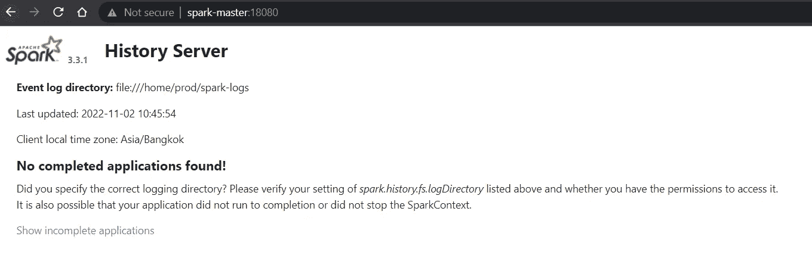

7.测试 Spark 的集群设置

*   运行集群(主+所有从)

```
start-all.sh
```

*   `jps`输出应该有`Worker`和`Master`过程

```
3645 Worker 
3533 Master
```

*   在浏览器上验证链接`spark-master:8080`

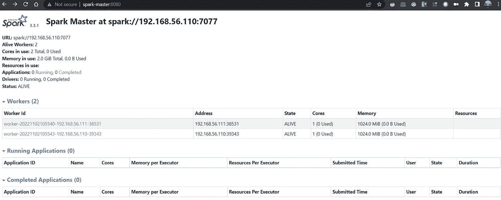

请注意我们的员工各自的 IP 地址

没有应用程序，因为现在还没有测试任何东西

8.运行示例并查看结果

> 我们将运行 spark 安装中可用的简单 Pi 计算示例，以验证我们的集群是否正常运行

*   确保主服务器/从服务器正在运行(如果您配置了历史服务器，它也在运行)

```
jps # expected output 
4658 Jps 
4396 HistoryServer 
3886 Master 
3999 Worker
```

*   运行`spark-submit`到我们正在运行的集群

```
cd $SPARK_HOME 
spark-submit - master spark://spark-master:7077 ./examples/src/main/python/pi.py 10
```

*   (如果有历史服务器)转到历史服务器(`spark-master:18080` )
    -该日志应该存在


我们的示例 PythonPi 运行日志

深入了解工作的更多细节

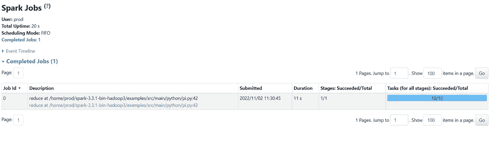

点击 AppId 后

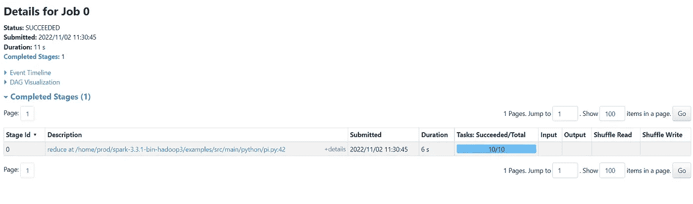

点击职位描述后

一路走到细节，你会看到我们的工作与 10 个任务分布在我们的两个配置工人

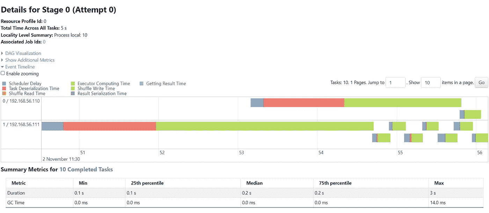

任务日程表

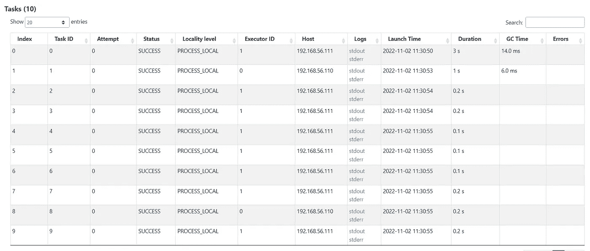

任务列表及其运行进程位置(从属 ips)

您可以到其他选项卡了解更多详情
执行程序选项卡显示 1 个驱动程序和 2 个工人执行程序

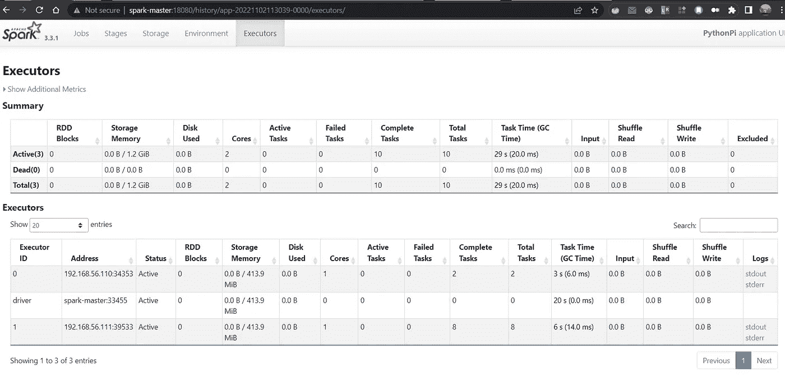

🎉这就是我们随时可以使用的火花簇🎉

> *🍖额外:如果您不想每次运行* `*spark-submit*` *时都必须指定主节点选项* `*--master spark://...*` *，只需在* `*$SPARK_HOME/conf/spark-defaults.conf*`中追加
> `*spark.master spark://spark-master:7077*` *来设置主节点即可*

# 如何为集群编写代码

## 使用 spark-提交

简单，只是

```
import pyspark# do your code
```

并与`spark-submit <path-to-py-file>`一起提交

## 使用 python

> `*python*` *二进制不知道我们本地安装了* `*pyspark*` *所以我们需要一个名为* `*findspark*`的支持包

```
# this first
import findspark
findspark.init()
findspark.find()# then import pyspark
import pyspark# your codes
```

用`python <path-to-py-file>`运行

❗Note:记住将主节点设置为集群中当前运行的主节点，方法是

*   在`$SPARK_HOME/config/spark-defaults.conf`中将`spark.master`设置为默认值
*   使用`SparkConf` ( [Ref](https://spark.apache.org/docs/3.1.1/api/python/reference/api/pyspark.SparkConf.html#pyspark.SparkConf) )在您的脚本(`.py`)中设置它

```
conf = SparkConf() 
conf.setMaster("spark://spark-master:7077") 
sc = SparkContext.getOrCreate(conf)
```

⚠️如果你不这样配置，你的代码将在主节点上新创建的(临时的)进程上运行，而不是被添加到你当前运行的集群中

## 使用笔记本

> `*Jupyter*` *应仅用于开发/调试目的，实际生产代码应通过* `*spark-submit*`汇总至集群

1.  确保安装了`jupyter`
2.  从主节点(`spark-master`)用`jupyter notebook`启动`jupyter`笔记本进程
3.  打开从本地机器到`spark-master`的`ssh`隧道

```
ssh -N -L 8888:localhost:8888 prod@spark-master 
# this makes anyone accessing localhost:8888 be tunneled to prod@spark-master:8888
```

🌀或者只需通过`jupyter notebook --ip 0.0.0.0`启动`0.0.0.0`上的`jupyter`，并在`spark-master:8888`从本地机器的浏览器直接访问它

4.在您的本地机器上，转到`localhost:8888`并输入访问令牌/密码开始工作

5.(🗒️注)确保在笔记本中选择您想要的 python 环境作为内核( [Ref](https://towardsdatascience.com/get-your-conda-environment-to-show-in-jupyter-notebooks-the-easy-way-17010b76e874) )

```
conda activate spakimental # if not already 
ipython kernel install - user - name=sparkimental# then select "sparkimental" in notebook
```

6.类似于直接使用`python` bin 运行，我们的代码需要这些步骤

*   寻找火花

```
import findspark 
findspark.init() 
findspark.find()
```

*   安装ˌ使成形

```
from pyspark import SparkConf 
conf = SparkConf() 
# if not already configured in spark-defaults.conf 
conf.setMaster('spark://spark-master:7077') 
# if you dont set app name, our jupyter job will be named `spark-shell` 
conf.setAppName('jupyter job');
```

*   创造火花情境，疯狂

```
sc = SparkContext.getOrCreate(conf)
```

在执行完上面一行之后，`spark-master:8080`的`spark-master` web UI 应该会显示一个新的正在运行的应用程序

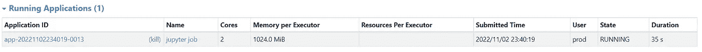

# 临时演员

## 创造`conda`环境

> *来自一个* `*config.yml*` *文件*

```
# example conda.env.yml config file content
name: sparkimental # this is environment name
dependencies: # and the packages we need
	# must have these 2
	- python=3.10
	- conda-forge::findspark
	# NOTE! don't install pyspark and java here since we already installed them
	# ones below are optional
	- jupyter
	- ipython
	- nltk
	- ipykernel
	- numpy
```

*   从配置文件
    创建环境`conda env create -f conda.env.yml` ❗Careful 关于`yml`文件( [ref](https://stackoverflow.com/questions/57381678/how-to-create-conda-environment-with-yml-file-without-this-error) )
*   请在任何其他步骤之前激活环境，始终确保您正在正确的`conda`环境
    `conda activate sparkimental`中执行代码
*   如果要清除环境
    `conda activate base
    conda env remove -n sparkimental -y`

# 陷阱

*   用尽存储空间→ [(如何调整大小)](https://askubuntu.com/questions/101715/resizing-virtual-drive)
*   运行 spark 时不允许创建日志→只更改被拒绝访问的文件夹的权限`chmod -R 777 dirname`
*   spark master 监听的默认服务端口是什么？`7077` ( [参考 1](https://spark.apache.org/docs/latest/spark-standalone.html) ，[参考 2](https://stackoverflow.com/questions/25585194/standalone-apache-spark-what-to-put-as-slave-ip-and-port) )
*   worker 和 driver 之间的 Python 不匹配→只需确保两者都设置为相同的 python(建议使用绝对路径)
    - [不匹配 Ref](https://stackoverflow.com/questions/54115290/mismatch-between-python-version-in-spark-worker-and-spark-driver)-[如何在 Linux 上检查所有 python 版本](https://stackoverflow.com/questions/30464980/how-to-check-all-versions-of-python-installed-on-osx-and-centos)
*   火花回送 IP 问题([问题描述](https://support.datastax.com/s/article/Spark-hostname-resolving-to-loopback-address-warning-in-spark-worker-logs))

```
Your hostname, … resolves to a loopback address: 127.0.0.1; using 10.1.2.1 instead
```

通过从`/etc/hosts`中删除`127.0.1.1`条目来解决

# 参考

> *本文主要基于以下观点/指导🙇，我感谢所有其他作者❣️*

*   基础【https://www.guru99.com/pyspark-tutorial.html#4】教程:[基础](https://www.guru99.com/pyspark-tutorial.html#4)
*   如何设置`Spark`集群:[https://medium . com/@ joo Torres _ 11979/how-to-install-and-setup-an-Apache-spark-cluster-on-Hadoop-18-04-b4d 70650 ed 42](https://medium.com/@jootorres_11979/how-to-install-and-set-up-an-apache-spark-cluster-on-hadoop-18-04-b4d70650ed42)
*   带着`Jupyter`笔记本跑`PySpark`:[https://blog . dev genius . io/a-convenient-way-to-run-py spark-4e 84 a 32 f 00 b 7](/a-convenient-way-to-run-pyspark-4e84a32f00b7)
*   Spark 历史服务器设置:[https://sparkbyexamples . com/spark/spark-History-Server-to-monitor-applications/](https://sparkbyexamples.com/spark/spark-history-server-to-monitor-applications/)

# 结论

我们有 it 🥳，一个运行 spark 的全功能虚拟机集群，您可以从本地计算机管理它，并以任何方式运行代码。

请对我的话题发表你的看法，如果有任何帮助，请鼓掌。很乐意收到你的来信😸

感谢阅读🖤，继续闪耀😉💫