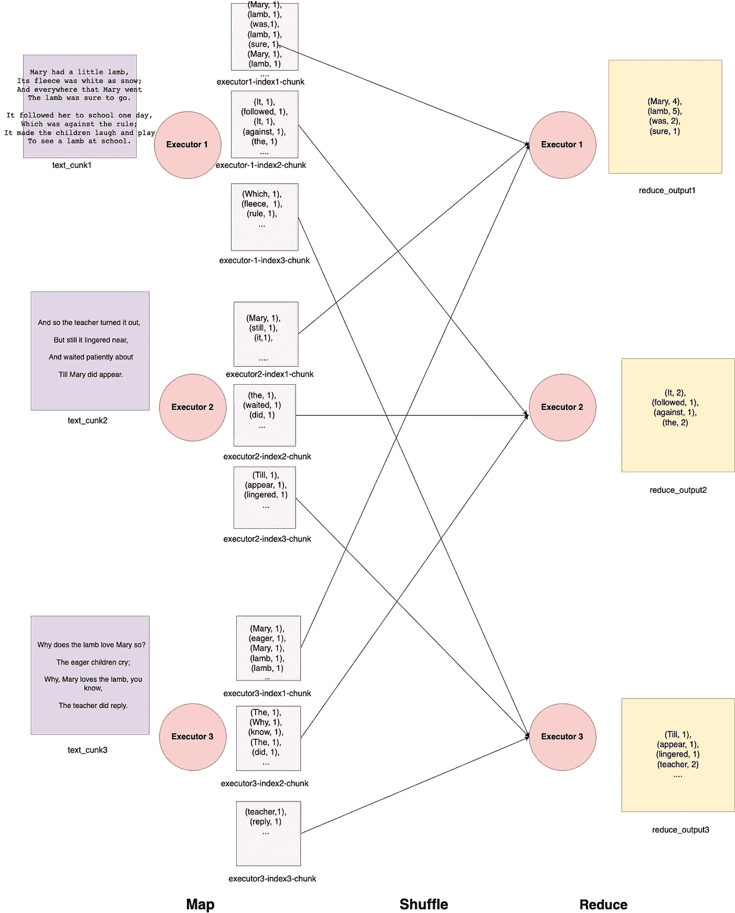

# 火花地图，减少和洗牌魔术

> 原文：<https://blog.devgenius.io/spark-map-reduce-shuffle-magic-4946cbb300ec?source=collection_archive---------9----------------------->

在这篇文章中，我将解释地图，减少和洗牌的内在魔力。

Map，reduce 是一种用于分布式系统的代码范例，可以解决某些类型的问题。记住不是所有的程序都可以用 Map，reduce 解决。



让我们借助一个例子来理解地图，洗牌，减魔。下面是大数据 **HelloWord** 的 spark 代码——字数统计程序:

```
package org.apache.spark.examples;

import scala.Tuple2;

import org.apache.spark.api.java.JavaPairRDD;
import org.apache.spark.api.java.JavaRDD;
import org.apache.spark.sql.SparkSession;

import java.util.Arrays;
import java.util.List;
import java.util.regex.Pattern;

public final class JavaWordCount {
  private static final Pattern SPACE = Pattern.compile(" ");

  public static void main(String[] args) throws Exception {

    if (args.length < 1) {
      System.err.println("Usage: JavaWordCount <file>");
      System.exit(1);
    }

    SparkSession spark = SparkSession
      .builder()
      .appName("JavaWordCount")
      .getOrCreate();

    // This reads the text file
    JavaRDD<String> lines = spark.read().textFile(args[0]).javaRDD();

    JavaRDD<String> words = lines.flatMap(s -> Arrays.asList(SPACE.split(s)).iterator());

    JavaPairRDD<String, Integer> ones = words.mapToPair(s -> new Tuple2<>(s, 1));

    JavaPairRDD<String, Integer> counts = ones.reduceByKey((i1, i2) -> i1 + i2);

    List<Tuple2<String, Integer>> output = counts.collect();
    for (Tuple2<?,?> tuple : output) {
      System.out.println(tuple._1() + ": " + tuple._2());
    }
    spark.stop();
  }
}
```

Apache spark 程序的目标是处理大数据，这意味着它需要自己处理的所有数据或文件都无法放入主内存。想想 1 GB 的文件，如果我们需要处理它，整个文件将放不进内存。

现在，让我们布置小组工作。假设给我们统计单词的文件如下:

```
Mary had a little lamb,
Its fleece was white as snow;
And everywhere that Mary went
The lamb was sure to go.

It followed her to school one day,
Which was against the rule;
It made the children laugh and play
To see a lamb at school.

And so the teacher turned it out,
But still it lingered near,
And waited patiently about
Till Mary did appear.

Why does the lamb love Mary so?
The eager children cry;
Why, Mary loves the lamb, you know,
The teacher did reply.
```

假设 spark 程序将它分成三个分区(实际上，理论上我们可以告诉 spark 程序它应该分成多少个分区，但稍后会详细说明)。请注意，分区会将数据文件分割得足够大，以便可以同时将所有数据文件放入内存中。

**分区 1**

```
Mary had a little lamb,
Its fleece was white as snow;
And everywhere that Mary went
The lamb was sure to go.

It followed her to school one day,
Which was against the rule;
It made the children laugh and play
To see a lamb at school.
```

**隔断 2**

```
And so the teacher turned it out,
But still it lingered near,
And waited patiently about
Till Mary did appear.
```

**分区 3**

```
Why does the lamb love Mary so?
The eager children cry;
Why, Mary loves the lamb, you know,
The teacher did reply.
```

分区完成后，映射阶段开始执行。

# 地图

Map 是 spark 计划中通常运行的第一个阶段。它的目标是将输入从一种形式转换成另一种形式，这种形式对于 spark 程序的计算操作来说更容易管理。在上面的 JavaWordCount 程序中，映射阶段发生在这两行中:

```
JavaRDD<String> words = lines.flatMap(s -> Arrays.asList(SPACE.split(s)).iterator());

JavaPairRDD<String, Integer> ones = words.mapToPair(s -> new Tuple2<>(s, 1));
```

请记住，由于这是一个分布式系统问题，Map 阶段在所有计算节点上以完全相同的方式发生。执行器(spark 的计算单元)获取文件块，并将数据转换成 apache spark 程序可以处理的其他有意义的方式。在本例中，在贴图阶段首先删除空格。然后，每个映射器创建三个混排文件(针对 reduce 阶段的每个 reduce)。

**我们怎么知道哪个词元组会去哪个 shuffle 文件？**

这是通过哈希分区方案实现的。键(在我们的例子中是字符串)是以归约器的数量为模散列的。所以，

```
int index = hash(word) % num_of_reducers

int index = hash(Mary) % 3

Let's say this index value comes out to be 0.
```

因此我们看到文件—**executor 1-index 1-chunk**看起来像这样

```
(Mary, 1),
(lamb, 1),
(was,1),
(lamb, 1),
(sure, 1),
(Mary, 1),
(lamb, 1)
....
```

这一过程对其他执行者也同样重复。最后，每个遗嘱执行人将有 3 个文件。这也可以被称为混洗写入过程。注意，这些只是临时文件，一旦相应的减少阶段完成，这些文件将被 spark 驱动程序删除。有关更多详细信息，请参见上图中的详细信息。

# 洗牌

当映射阶段完成时，会发生随机写入，这会创建与缩减器数量相等的临时(键、值)文件。现在，每个 reducer 都需要相应的相同的索引混洗文件。所以，假设 spark 驱动程序分配了执行器 1 —索引 1 文件，执行器 2 —索引 2 文件和执行器 3 —执行器 3 文件。这些文件需要被传送到每个执行者 1。例如，执行程序 1 已经有了执行程序 1-索引 1-块文件，只需要执行程序 2-索引 1-块和执行程序 3-索引 1-块就可以进行归约阶段。一旦每个执行者都有了所有的文件，就可以开始 reduce 阶段了。

# 减少

reduce 阶段逐个值地聚合数据。在我们的代码简化操作中

```
JavaPairRDD<String, Integer> counts = ones.reduceByKey((i1, i2) -> i1 + i2)
```

从随机播放阶段收集的每个文件现在应该有相同的键。它的意思是，如果执行人一上有“玛丽”这个词，那么其他的缩减者就不会得到这个词。当然，元组(“Mary，1”)可以在同一个执行程序的不同文件中，但不会在任何其他执行程序中重复。这就是它的妙处！现在，reducers 将开始聚合单词并更新它们的计数。在内部，spark 可以实现所有键的映射，并在每次看到相同的单词时更新计数器。因此，最终我们会在每个执行器上看到一个最终输出文件，如下所示:

```
(Mary, 4),
(lamb, 5),
(was, 2),
(sure, 1)

...
```

忠太..这就是火花贴图和减少的工作原理！！