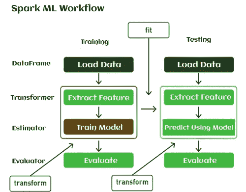

# 火花毫升

> 原文：<https://blog.devgenius.io/spark-ml-685df3d76736?source=collection_archive---------5----------------------->

本文将解释使用 spark 构建 ML 模型所需的不同组件。将以 iris [数据集](https://www.kaggle.com/datasets/uciml/iris)上的逻辑回归为例介绍不同的组成部分。

Spark ML 的早期版本处理的是一个基于 RDD 的 API [sharan add link]，对用户不是很友好。从 Spark 2.0 开始，spark.mllib 包中基于 RDD 的 API 进入了维护模式。Spark 的主要机器学习 API 现在是 [spark.ml](https://spark.apache.org/docs/latest/ml-guide.html) 包中基于 DataFrame 的 API。要使用任何 pyspark 模块，都需要从 pyspark.ml 导入库。

ML 模型的典型训练包括读取数据、特征提取、训练模型和评估。用 [spark](https://spark.apache.org/docs/1.6.0/ml-guide.html) 的话说，这个过程被表述为数据帧、转换器、估算器和评估器。



PC: [图片链接](https://www.javatpoint.com/machine-learning-pipeline)

读取数据帧:

Spark ML 允许使用各种数据源，如关系表、CSV 等。例如，一个数据帧可以有不同的列来存储文本、特征向量、真实标签和预测。

```
df = spark.read.csv('./irisdata.csv', header=True, inferSchema=True)
df.printSchema()
root
 |-- sepal_length: double (nullable = true)
 |-- sepal_width: double (nullable = true)
 |-- petal_length: double (nullable = true)
 |-- petal_widthCm: double (nullable = true)
 |-- species: string (nullable = true)
```

```
df.show(5)
+------------+-----------+------------+-------------+-----------+
|sepal_length|sepal_width|petal_length|petal_widthCm|    species|
+------------+-----------+------------+-------------+-----------+
|         5.1|        3.5|         1.4|          0.2|Iris-setosa|
|         4.9|        3.0|         1.4|          0.2|Iris-setosa|
|         4.7|        3.2|         1.3|          0.2|Iris-setosa|
|         4.6|        3.1|         1.5|          0.2|Iris-setosa|
|         5.0|        3.6|         1.4|          0.2|Iris-setosa|
+------------+-----------+------------+-------------+-----------+
only showing top 5 rows
```

特征转换:

[特征转换器](https://spark.apache.org/docs/latest/ml-features.html#feature-transformers)转换存储在数据帧中的数据，并将数据存储回新的数据帧。这种转换通常通过向现有数据框追加一列或多列来实现。它可以分解成简单的下列序列 data frame =[transform]=>data frame。转换器方法通常在准备和处理数据集的步骤中执行。转换器是 Spark ML 的一部分，通过 transformer 基类在 Java 中实现。的。transform()方法用于将一个数据帧转换为另一个数据帧，该方法可通过该类获得。

(I)字符串索引器:String Indexer 将标签的字符串列编码成标签索引的列。StringIndexer 可以对多列进行编码。

```
from pyspark.ml.feature import StringIndexer

indexer = StringIndexer(inputCol='species', outputCol='speciesIndex')
iris = indexer.fit(df).transform(df)
iris.sample(fraction=0.1).show()

+------------+-----------+------------+-------------+---------------+------------+
|sepal_length|sepal_width|petal_length|petal_widthCm|        species|speciesIndex|
+------------+-----------+------------+-------------+---------------+------------+
|         4.6|        3.4|         1.4|          0.3|    Iris-setosa|         0.0|
|         4.4|        2.9|         1.4|          0.2|    Iris-setosa|         0.0|
|         5.2|        3.4|         1.4|          0.2|    Iris-setosa|         0.0|
|         5.0|        3.2|         1.2|          0.2|    Iris-setosa|         0.0|
|         5.1|        3.8|         1.6|          0.2|    Iris-setosa|         0.0|
|         6.7|        3.1|         4.4|          1.4|Iris-versicolor|         1.0|
|         5.8|        2.7|         4.1|          1.0|Iris-versicolor|         1.0|
|         5.4|        3.0|         4.5|          1.5|Iris-versicolor|         1.0|
|         5.5|        2.6|         4.4|          1.2|Iris-versicolor|         1.0|
|         4.9|        2.5|         4.5|          1.7| Iris-virginica|         2.0|
|         6.0|        2.2|         5.0|          1.5| Iris-virginica|         2.0|
+------------+-----------+------------+-------------+---------------+------------+
```

(II) OneHotEncoder: One-hot 编码将分类特征(表示为标签索引)映射到二进制向量，该向量最多具有单个 1 值，指示所有特征值集合中特定特征值的存在。这种编码允许期望连续特征的算法(如逻辑回归)使用分类特征。对于字符串类型的输入数据，通常首先使用 StringIndexer 对分类特征进行编码。

```
from pyspark.ml.feature import OneHotEncoder

encoded = OneHotEncoder(inputCol="speciesIndex", outputCol="species_vec")
new_df = encoded.fit(iris).transform(iris)
new_df.show()

+------------+-----------+------------+-------------+-----------+------------+-------------+
|sepal_length|sepal_width|petal_length|petal_widthCm|    species|speciesIndex|  species_vec|
+------------+-----------+------------+-------------+-----------+------------+-------------+
|         5.1|        3.5|         1.4|          0.2|Iris-setosa|         0.0|(2,[0],[1.0])|
|         4.9|        3.0|         1.4|          0.2|Iris-setosa|         0.0|(2,[0],[1.0])|
|         4.7|        3.2|         1.3|          0.2|Iris-setosa|         0.0|(2,[0],[1.0])|
|         4.6|        3.1|         1.5|          0.2|Iris-setosa|         0.0|(2,[0],[1.0])|
|         5.0|        3.6|         1.4|          0.2|Iris-setosa|         0.0|(2,[0],[1.0])|
|         5.4|        3.9|         1.7|          0.4|Iris-setosa|         0.0|(2,[0],[1.0])|
|         4.6|        3.4|         1.4|          0.3|Iris-setosa|         0.0|(2,[0],[1.0])|
|         5.0|        3.4|         1.5|          0.2|Iris-setosa|         0.0|(2,[0],[1.0])|
|         4.4|        2.9|         1.4|          0.2|Iris-setosa|         0.0|(2,[0],[1.0])|
|         4.9|        3.1|         1.5|          0.1|Iris-setosa|         0.0|(2,[0],[1.0])|
|         5.4|        3.7|         1.5|          0.2|Iris-setosa|         0.0|(2,[0],[1.0])|
|         4.8|        3.4|         1.6|          0.2|Iris-setosa|         0.0|(2,[0],[1.0])|
|         4.8|        3.0|         1.4|          0.1|Iris-setosa|         0.0|(2,[0],[1.0])|
|         4.3|        3.0|         1.1|          0.1|Iris-setosa|         0.0|(2,[0],[1.0])|
|         5.8|        4.0|         1.2|          0.2|Iris-setosa|         0.0|(2,[0],[1.0])|
|         5.7|        4.4|         1.5|          0.4|Iris-setosa|         0.0|(2,[0],[1.0])|
|         5.4|        3.9|         1.3|          0.4|Iris-setosa|         0.0|(2,[0],[1.0])|
|         5.1|        3.5|         1.4|          0.3|Iris-setosa|         0.0|(2,[0],[1.0])|
|         5.7|        3.8|         1.7|          0.3|Iris-setosa|         0.0|(2,[0],[1.0])|
|         5.1|        3.8|         1.5|          0.3|Iris-setosa|         0.0|(2,[0],[1.0])|
+------------+-----------+------------+-------------+-----------+------------+-------------+
only showing top 20 rows
```

向量汇编程序:

VectorAssembler 是一个转换器，它将给定的列列表组合成一个向量列。这有助于将原始特征和由不同特征转换器生成的特征组合成单个特征向量，以便训练像逻辑回归和决策树这样的 ML 模型。VectorAssembler 接受以下输入列类型:所有数字类型、一个布尔类型和一个向量类型。在每一行中，输入列的值将按照指定的顺序连接成一个向量。

```
from pyspark.ml.feature import VectorAssembler

assembler = VectorAssembler(
    inputCols=["sepal_length", "sepal_width", "petal_length", "petal_widthCm"], 
    outputCol="features")

dataset = assembler.transform(new_df)
dataset.show()

+------------+-----------+------------+-------------+-----------+------------+-------------+-----------------+
|sepal_length|sepal_width|petal_length|petal_widthCm|    species|speciesIndex|  species_vec|         features|
+------------+-----------+------------+-------------+-----------+------------+-------------+-----------------+
|         5.1|        3.5|         1.4|          0.2|Iris-setosa|         0.0|(2,[0],[1.0])|[5.1,3.5,1.4,0.2]|
|         4.9|        3.0|         1.4|          0.2|Iris-setosa|         0.0|(2,[0],[1.0])|[4.9,3.0,1.4,0.2]|
|         4.7|        3.2|         1.3|          0.2|Iris-setosa|         0.0|(2,[0],[1.0])|[4.7,3.2,1.3,0.2]|
|         4.6|        3.1|         1.5|          0.2|Iris-setosa|         0.0|(2,[0],[1.0])|[4.6,3.1,1.5,0.2]|
|         5.0|        3.6|         1.4|          0.2|Iris-setosa|         0.0|(2,[0],[1.0])|[5.0,3.6,1.4,0.2]|
|         5.4|        3.9|         1.7|          0.4|Iris-setosa|         0.0|(2,[0],[1.0])|[5.4,3.9,1.7,0.4]|
|         4.6|        3.4|         1.4|          0.3|Iris-setosa|         0.0|(2,[0],[1.0])|[4.6,3.4,1.4,0.3]|
|         5.0|        3.4|         1.5|          0.2|Iris-setosa|         0.0|(2,[0],[1.0])|[5.0,3.4,1.5,0.2]|
|         4.4|        2.9|         1.4|          0.2|Iris-setosa|         0.0|(2,[0],[1.0])|[4.4,2.9,1.4,0.2]|
|         4.9|        3.1|         1.5|          0.1|Iris-setosa|         0.0|(2,[0],[1.0])|[4.9,3.1,1.5,0.1]|
|         5.4|        3.7|         1.5|          0.2|Iris-setosa|         0.0|(2,[0],[1.0])|[5.4,3.7,1.5,0.2]|
|         4.8|        3.4|         1.6|          0.2|Iris-setosa|         0.0|(2,[0],[1.0])|[4.8,3.4,1.6,0.2]|
|         4.8|        3.0|         1.4|          0.1|Iris-setosa|         0.0|(2,[0],[1.0])|[4.8,3.0,1.4,0.1]|
|         4.3|        3.0|         1.1|          0.1|Iris-setosa|         0.0|(2,[0],[1.0])|[4.3,3.0,1.1,0.1]|
|         5.8|        4.0|         1.2|          0.2|Iris-setosa|         0.0|(2,[0],[1.0])|[5.8,4.0,1.2,0.2]|
|         5.7|        4.4|         1.5|          0.4|Iris-setosa|         0.0|(2,[0],[1.0])|[5.7,4.4,1.5,0.4]|
|         5.4|        3.9|         1.3|          0.4|Iris-setosa|         0.0|(2,[0],[1.0])|[5.4,3.9,1.3,0.4]|
|         5.1|        3.5|         1.4|          0.3|Iris-setosa|         0.0|(2,[0],[1.0])|[5.1,3.5,1.4,0.3]|
|         5.7|        3.8|         1.7|          0.3|Iris-setosa|         0.0|(2,[0],[1.0])|[5.7,3.8,1.7,0.3]|
|         5.1|        3.8|         1.5|          0.3|Iris-setosa|         0.0|(2,[0],[1.0])|[5.1,3.8,1.5,0.3]|
+------------+-----------+------------+-------------+-----------+------------+-------------+-----------------+
only showing top 20 rows
```

```
dataset.printSchema()

root
 |-- sepal_length: double (nullable = true)
 |-- sepal_width: double (nullable = true)
 |-- petal_length: double (nullable = true)
 |-- petal_widthCm: double (nullable = true)
 |-- species: string (nullable = true)
 |-- speciesIndex: double (nullable = false)
 |-- species_vec: vector (nullable = true)
 |-- features: vector (nullable = true)
```

评估者:

估计器是学习算法的一个阶段，用于拟合数据集上的模型。整个过程可以表示为如下 DataFrame =[fit]= >模型。在使用现有数据建立模型的步骤期间，执行估计器。由评估者制作的模型本身就作为一个转换器。此外，Java 中通过 estimator 类提供了一个估算器。的。用于构建模型的 fit()方法可通过该类获得。

```
from pyspark.ml.classification import LogisticRegression

lr = LogisticRegression(featuresCol='features', labelCol='speciesIndex')
trainData, testData = dataset.randomSplit([0.7, 0.3])
model = lr.fit(trainData)
summary = model.evaluate(testData)
```

评估者:

已建模型的评估阶段。

```
summary.accuracy

0.9361702127659575
```

火花中的管道:

管道是一系列的活动或转换。机器学习是通过实现一组任务来执行的，即收集数据、清理数据、构建模型、评估模型等。所有这些步骤都需要按照特定的顺序一个接一个地执行。简而言之，为了更好地表示，可以将管道视为包装在一起的一系列活动。流水线主要有四个主要对象——数据帧、转换器、估计器和评估器。

```
#Using Pipeline #import module
from pyspark.ml import Pipeline

df = spark.read.csv('./irisdata.csv', header=True, inferSchema=True)

#feature transformers
indexer = StringIndexer(inputCol='species', outputCol='speciesIndex')

#Apply OneHotEncoder to Species column
encoded = OneHotEncoder(inputCol="speciesIndex", outputCol="species_vec")

#Merge multiple columns into a vector column
assembler = VectorAssembler(
    inputCols=["sepal_length", "sepal_width", "petal_length", "petal_widthCm"], 
    outputCol="features")

#model
lr = LogisticRegression(featuresCol='features', labelCol='speciesIndex')

#Create pipeline and pass it to stages
pipeline = Pipeline(stages=[ indexer, encoded,
           assembler, lr
])

trainData, testData = df.randomSplit([0.7, 0.3])

#Use .fit() and .transform() on the pipeline
df_transformed = pipeline.fit(trainData).transform(trainData)

df_transformed.select("species", "features", "probability", "prediction").show() 
```

```
+---------------+-----------------+--------------------+----------+
|        species|         features|         probability|prediction|
+---------------+-----------------+--------------------+----------+
|    Iris-setosa|[4.3,3.0,1.1,0.1]|       [1.0,0.0,0.0]|       0.0|
|    Iris-setosa|[4.4,2.9,1.4,0.2]|       [1.0,0.0,0.0]|       0.0|
|    Iris-setosa|[4.4,3.0,1.3,0.2]|       [1.0,0.0,0.0]|       0.0|
|    Iris-setosa|[4.4,3.2,1.3,0.2]|       [1.0,0.0,0.0]|       0.0|
|    Iris-setosa|[4.5,2.3,1.3,0.3]|[1.0,5.1584556500...|       0.0|
|    Iris-setosa|[4.6,3.1,1.5,0.2]|       [1.0,0.0,0.0]|       0.0|
|    Iris-setosa|[4.6,3.4,1.4,0.3]|       [1.0,0.0,0.0]|       0.0|
|    Iris-setosa|[4.6,3.6,1.0,0.2]|       [1.0,0.0,0.0]|       0.0|
|    Iris-setosa|[4.7,3.2,1.3,0.2]|       [1.0,0.0,0.0]|       0.0|
|    Iris-setosa|[4.7,3.2,1.6,0.2]|       [1.0,0.0,0.0]|       0.0|
|    Iris-setosa|[4.8,3.0,1.4,0.1]|       [1.0,0.0,0.0]|       0.0|
|    Iris-setosa|[4.8,3.0,1.4,0.3]|       [1.0,0.0,0.0]|       0.0|
|    Iris-setosa|[4.8,3.1,1.6,0.2]|       [1.0,0.0,0.0]|       0.0|
|    Iris-setosa|[4.8,3.4,1.6,0.2]|       [1.0,0.0,0.0]|       0.0|
|    Iris-setosa|[4.8,3.4,1.9,0.2]|       [1.0,0.0,0.0]|       0.0|
|Iris-versicolor|[4.9,2.4,3.3,1.0]|       [0.0,1.0,0.0]|       1.0|
| Iris-virginica|[4.9,2.5,4.5,1.7]|[0.0,2.0755096241...|       2.0|
|    Iris-setosa|[4.9,3.0,1.4,0.2]|       [1.0,0.0,0.0]|       0.0|
|    Iris-setosa|[4.9,3.1,1.5,0.1]|       [1.0,0.0,0.0]|       0.0|
|    Iris-setosa|[4.9,3.1,1.5,0.1]|       [1.0,0.0,0.0]|       0.0|
+---------------+-----------------+--------------------+----------+
only showing top 20 rows
```

上述预测模型正确地对不同物种进行了分类，例如:鸢尾的值为 0，杂色鸢尾的值为 1，海滨鸢尾的值为 2。

完整笔记本:

[Github](https://github.com/sharanharsoor/experiments/blob/main/pyspark_ml_example/pyspark_simple_ML_example.ipynb)

参考资料:

1.  https://www.javatpoint.com/machine-learning-pipeline
2.  Apache spark 的官方文件。