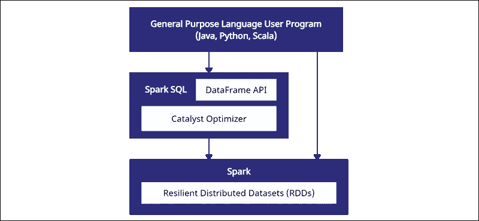

# Spark 结构化 API

> 原文：<https://blog.devgenius.io/spark-structured-api-6a931407ff1e?source=collection_archive---------14----------------------->

spark 大数据架构从 Map Reduce 等其他大数据框架中脱颖而出，因为 Spark 的基本核心数据结构 RDD(弹性分布式数据集)内存处理。因为 RDD 本身可以成为讨论的话题，所以基本上 rdd 是不可变的分布式对象集合，它们通常不受模式的限制。在某种意义上，rdd 有助于处理非结构化数据。酪当结构化数据可用时，由于采用了无模式方法，RDD API 很难使用。为了使开发变得容易和直观，Spark 结构化 API 来拯救。在本文中，我们将看到不同的 spark 结构的 API。

结构化数据包括模式，数据以行和列的形式存储。结构化 API 是低级 RDD API 的高级抽象(在某种程度上，结构化 API 建立在 RDD 数据结构之上)。

Spark 支持三种类型的结构化 API。

1.  DataFrames:这个数据集合以表格的形式组织，表格中有行和列，允许处理大量的结构化数据。数据帧中的数据是按行和列组织的，而在 rdd 中则不是这样。但是，DataFrame 没有编译时类型安全。
2.  数据集:这种结构是数据帧的扩展，包括数据帧和 rdd 的特性。数据集为安全处理数据提供了面向对象的接口。面向对象的接口指的是这样一种接口，其中所有的实体都被视为一个对象，要访问它们，必须调用该对象。请注意，数据集仅在基于 Java 虚拟机(JVM)的语言中可用，如 Scala 和 Java，但在 Python 和 r 中不可用。
3.  SQL 表和视图(Spark SQL):使用 Spark SQL，您可以对组织到数据库中的视图或表运行类似 SQL 的查询。

数据帧:

DataFrame API 是 Spark SQL 模块的一部分。Spark 中的数据帧与 Pandas 中的数据帧非常相似，除了它们也遵循 rdd 之类的惰性求值。数据以列和行的形式提供，数据帧中的每一列都有与之相关联的特定数据类型。



[图片由](https://phoenixnap.com/kb/spark-dataframe#:~:text=What%20is%20a%20DataFrame%3F,and%20columns%20of%20different%20datatypes.)提供

数据帧的优势。

高级 API:数据帧抽象由于它的结构与 Pandas 中的数据帧非常相似，所以代码可读性很高，并且易于编写。

优化器:DataFrames 可以使用 Catalyst optimizer 或自适应查询执行引擎之类的优化器在内部优化代码。

内存:更好的内存管理和堆外内存的使用[存储](https://www.databricks.com/session/deep-dive-apache-spark-memory-management)。

Dataframe 对象的工作方式有点类似于类似熊猫的数据框。

```
# To initiate the spark session:
from pyspark.sql import SparkSession
spark = SparkSession.builder.appName("Name of the app").getOrCreate()
```

```
# As Dataframe is a structured datatype code to check the scheme. 
df.printSchema()
root
 |-- name: string (nullable = true)
 |-- salary: double (nullable = true)
 |-- age: double (nullable = true)
```

```
# To print the dataframe.
df.show()
+-------+--------+----+
|   name|  salary| age|
+-------+--------+----+
|Michael| 40000.0|29.0|
|   Andy| 50000.0|30.0|
| Justin| 30000.0|19.0|
|Michael| 45000.0|45.0|
|  Sandy| 57000.0|37.0|
|  Rocky| 88000.0|60.0|
+-------+--------+----+
```

dataframe 支持广泛的 API，用于过滤、分组和摆弄列和行([官方文档](https://spark.apache.org/docs/3.1.1/api/python/reference/api/pyspark.sql.DataFrame.html))。

熊猫 API:

熊猫为 Python 语言在数据科学领域的出名做出了巨大贡献。[熊猫 API](https://spark.apache.org/docs/latest/api/python/user_guide/pandas_on_spark/index.html) 启用 python 用户

在星火上经营熊猫。通常开发人员更喜欢亲自使用 pandas 而不是 pyspark，所以为了避免开发人员学习 pysprk，pandas API over spark(也称为 pandas-on-spark)有助于编写代码 pandas API

(类似于本地 pandas 的语法)但是在 pyspark 集群上执行。

熊猫 API 与本土熊猫的区别如下。

*   节点:Pandas API 运行在 Spark 上，与本机 Pandas 的单个节点相比，Spark 提供了多个执行节点。
*   执行:与原生 Pandas 相比，Pandas API 允许延迟执行，而原生 Pandas 是为急切执行而提供的。
*   可伸缩性:与本地 Pandas 相比，Pandas API 通过向集群中添加更多的节点，实现了简单的可伸缩性。
*   类型支持:Pandas API 有类型支持，允许在 Pandas/PySpark 之间转换。将 pandas-on-Spark 数据帧转换为 PySpark 数据帧时，数据类型会自动转换为适当的类型。

```
# Importing pandas on pyspark as 
import pyspark.pandas as ps
```

```
# Pandas API for creating a series 
panAPI_series = ps.Series([1, 3, 5, np.nan, 6, 8])
```

```
# Pandas API for creating dataframe
panAPI_dataframe = ps.DataFrame(
{'a': [1, 2, 3, 4, 5, 6],
'b': [100, 200, 300, 400, 500, 600],
'c': ["one", "two", "three", "four", "five", "six"]},
index=[10, 20, 30, 40, 50, 60])
```

Spark 和 pandas-API 一起支持数据帧的内部对话。

```
# Existing Spark DataFrame can be converted to native pandas DataFrame.
spark_topandas_dataframe = spark_dataframe.toPandas()
```

```
# Existing native pandas DataFrame can be converted to pandas-on-spark 
# DataFrame.
pandasAPI_datframe = ps.from_pandas(spark_topandas_dataframe)
```

Spark SQL:

借助 Spark SQL 模块，Spark 能够在数据帧和数据集上运行类似 SQL 的查询。
Spark SQL 为 Spark 带来了对 SQL 的本地支持，并简化了查询存储在 rdd(Spark 的分布式数据集)和外部数据源中的数据的过程。

要在数据帧上运行 SQL 查询，需要将其转换为表。

```
createOrReplaceTempView("table_name")
```

示例:

```
data = spark.read.options(inferSchema='True',header='True').csv("./<file>.csv")
data.createOrReplaceTempView('table_name')
spark.sql("select * from table_name limit 10").show()
```

参考资料:

[https://phoenix nap . com/kb/spark-data frame #:~:text = What % 20 is % 20a % 20 data frame % 3F，and % 20 columns % 20 of % 20 different % 20 data types](https://phoenixnap.com/kb/spark-dataframe#:~:text=What%20is%20a%20DataFrame%3F,and%20columns%20of%20different%20datatypes)。

[https://www . data bricks . com/glossary/what-is-Spark-SQL #:~:text = Spark % 20 SQL % 20 is % 20a % 20 Spark，on % 20 existing % 20 deployment % 20 和%20data](https://www.databricks.com/glossary/what-is-spark-sql#:~:text=Spark%20SQL%20is%20a%20Spark,on%20existing%20deployments%20and%20data) 。

火花官方文档。