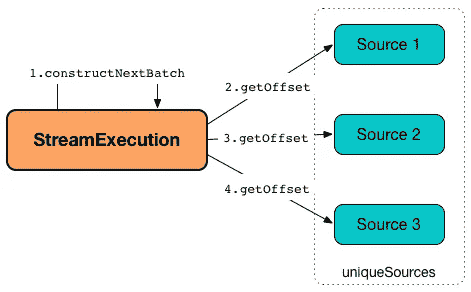
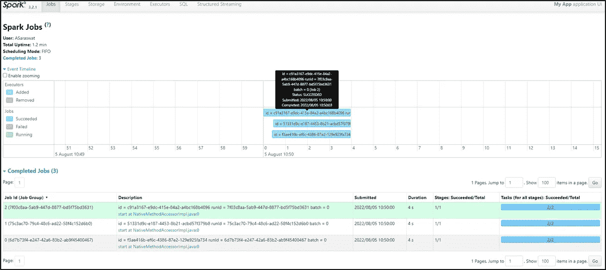

# Spark 结构化流:多个接收器

> 原文：<https://blog.devgenius.io/spark-structured-streaming-multiple-sinks-writes-5dea139d4920?source=collection_archive---------0----------------------->

ref:[https://qimia . io/en/blog/developing-streaming-applications-spark-structured-streaming/](https://qimia.io/en/blog/developing-streaming-applications-spark-structured-streaming/)

在创建接近实时执行的数据管道时，有一个有趣的场景，我在读取源时遇到过，转换复杂的数据，直到将数据写入多个接收器/写入。在寻找解决方案的同时，我阅读了许多解释管道创建和执行的概念的文章，我相信这是大多数开发人员在实时执行期间与流的约束进行斗争的场景。

在本文中，我将介绍 spark 结构在单输入和多输出场景中的行为，并深入探讨它的执行。

# 问题陈述

当我们从单个源读取数据到多个接收器/写入时，会创建多个作业，这导致从源多次读取相同的数据。

参赛:https://www.scnsoft.com/services/big-data/spark

# 火花行为:当将流分成多个接收器时

为了生成可能的场景，我们使用结构化流从 Kafka 消费数据，并将处理后的数据集写入 s3，同时在单个作业中使用多个写入器。

ref:[https://jaceklaskowski . git books . io/spark-structured-streaming/content/spark-SQL-streaming-microbatchexecution . html](https://jaceklaskowski.gitbooks.io/spark-structured-streaming/content/spark-sql-streaming-MicroBatchExecution.html)

当编写从 Kafka 输入源创建的数据集时，根据执行中的基本理解，我们应该让单个作业包含单个输入和多个输出，但是当我检查 spark-UI 时，为每个输出创建了多个作业。

因为我们将输出分支到多个接收器，所以我们必须为每个接收器/写入提供检查点。因为我们正在分叉输出，这会导致创建多个流查询(作业)。

由于 spark 并行性，这些作业可以独立调度，并可以维护其自己的检查点位置，由于这种行为，数据从输入源独立读取(根据接收器/写入的数量多次读取)，同样的事情也反映在 spark-UI 中。

总之，即使从输入主题创建了相同的数据集，并且将数据写入多个接收器/写入，也应该从输入主题多次读取数据。

下面是观察截图，让我们更好地了解在单次读取上执行多个写入器时，spark 结构化流在内部是如何工作的。

在上面的图像中，时间线部分准确地显示了相同的响应，其中每个接收器都有自己的作业 ID，它将开始从源重复读取数据。

对于同一个批处理，它使用相同的查询计划创建多个作业，因此显示在写入多个接收器时发生了多个读取尝试。

如果我们有 N 个接收器，这意味着您有 N 个查询。每个查询都有自己的检查点，并独立地从数据源获取数据。

每个接收/写入创建新的流，它们独立运行，并且从它们自己的检查点位置选取偏移量。为每个流创建不同的组 ID，就好像您正在运行不同的读+写流一样

**缺点:**当我们处理源/输入中的巨大数据集时，这会导致性能下降。上述用例在 Kafka 主题中测试了超过 51K 条消息，显示单个写流花费了 4 秒。

下面是多重接收/写入的实现。

# 解决方案:使用 forEachBatch writer 实现对多个接收器的写入

可以使用 forEachBatch writer 处理上述场景。

在执行过程中，我们使用结构化流从 Kafka 消费数据，并将处理后的数据集写入 s3，同时使用 forEachBatch writer 在单个作业中使用多个 writer。

ref:[https://jaceklaskowski . git books . io/spark-structured-streaming/content/spark-SQL-streaming-microbatchexecution . html](https://jaceklaskowski.gitbooks.io/spark-structured-streaming/content/spark-sql-streaming-MicroBatchExecution.html)

正常数据执行与 forEachBatch 的区别在于，在 forEachBatch 单流查询执行期间，直到 forEachBatch 流程执行。

在 forEachBatch 中，我们将获得流的批处理数据帧行为，在这里我们可以写入多个目的地。

由于单一流查询，我们维护单一检查点位置。

使用 forEachBatch writer，我们有机会缓存数据帧。

下面是我们对相同数量的记录(51K)运行后得到的性能观察结果:

**缺点:**这只支持顺序执行。虽然我们导致了最大计算消耗问题。

下面是使用 forEachBatch write 的代码实现。

在 spark-UI 中，我们看到了可以使用多线程并行执行的顺序执行……..但这将是另一篇文章了。

感谢阅读。

欢迎在 LinkedIn 上关注我，获取更多文章。

参考资料:[https://stack overflow . com/questions/45642904/spark-structured-streaming-multiple-sinks？rq=1](https://stackoverflow.com/questions/45642904/spark-structured-streaming-multiple-sinks?rq=1)