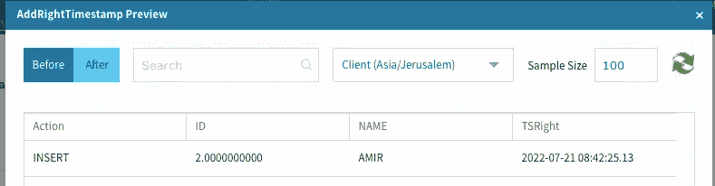

# Spark 结构化流—外部连接警告

> 原文：<https://blog.devgenius.io/spark-structured-streaming-outer-joins-caveats-41971a1937cf?source=collection_archive---------10----------------------->

在 Spark Streaming 中，我有机会处理的最棘手的主题之一是外部连接。当我开始使用 spark 和外部连接时，这种行为对我来说非常意外。有时行匹配，有时不匹配，有时行从不写入接收器，有时执行程序会用尽内存。

Spark 文档很清楚，但是您需要深入了解它的位和字节才能真正理解它的行为。

我将使用 [Equalum](http://equalum.io) UI 来可视化演示，稍后将写下我们如何在 [Equalum](http://equalum.io) 为我们的客户解决一些 Spark 警告。

所以让我们开始吧。假设我想在两个流之间做一个简单的左连接。


要理解 join 配置，我们需要理解 Spark 中什么是 [**水印**](https://spark.apache.org/docs/latest/structured-streaming-programming-guide.html#outer-joins-with-watermarking) 和什么是**状态**。

> **Spark 支持在存储中保存流状态的有状态操作。**
> 
> **状态存储占用内存、磁盘空间等资源来存储状态。**
> 
> **有状态操作:连接&聚合**


> **水印——让 spark 引擎自动跟踪数据中的当前事件时间，并尝试相应地清除旧状态。**
> 
> 没有水印，状态将永远变得越来越大…
> 
> **水印基本上是指示何时丢弃“旧”数据**
> 
> **火花引擎将保持状态，并允许后期数据更新状态，直到(火花-后期阈值看到的最大事件时间> T)。换句话说，在阈值范围内的晚数据将被加入，但是晚于阈值的数据将开始被丢弃**

我们将使用以下配置来配置连接:

水印字段将是该行进入 kafka 主题的时间。

1 分钟水印用于左侧和右侧，2 分钟延迟(右侧将等待 2 分钟以“延迟”左侧事件)。

在 [Equalum](http://equalum.io) UI 上看起来是这样的:


在 Scala 中是这样的:

```
dfLeft.withWatermark("**TSLeft**", "60 seconds")
dfRight.withWatermark("**TSRight"**, "60 seconds")
```

2 分钟的延迟是连接条件的一部分:

```
val joinCondition = "ID=IDRight AND **TSLeft** >= **TSRight** AND **TSLeft** <= **TSRight** + interval **120** seconds"dfLeft
 .join(dfRight, *expr*(joinCondition), "left")
```

让我们看看左边和右边的流数据:

**左:**


**右:**



因此，如果我问你“左外部连接的预期输出是什么”,你可能会这样说:


这只是 Equalum 预览版，它实际上以批处理模式运行 spark(不是流到流连接)

因此，让我们看看流式查询输出。在我们开始流式查询后，查看 Kafka(sink)中的数据:


什么？“YAIR”一行是在哪里消失的？！它在哪里，为什么不写到接收器？！

让我们看看 Spark UI，并尝试理解丢失的行在哪里:


***“更新状态行数:3”***—到目前为止输入了 3 行(左边两行，右边一行)

***“输出行数:1”***->这是我们在水槽里看到的。“阿米尔”加入了排写。

因此，我们仍然有 1 行从左边保持在状态。

您可能想知道:“那么让我们等 1 分钟，没有匹配的行将被写入接收器”，对吗？水印过期后。

这并不简单，因为 Spark Streaming 有两个警告:

1.  如果您希望将数据从状态中推出，您需要一个微批处理来触发。这意味着你需要在 kafka 中有一个新的数据来触发新的微批处理。真扫兴。
2.  您需要连接两端的数据，因此水印将被推进(与*spark . SQL . streaming . multiplewatermarkpolicy = min 相关)，我们将在稍后讨论。*


因此，如果出于某种原因，您有一个流查询，其中的数据只来自右边(或左边)，您可能会丢失数据，并有可能在执行器上遇到 OOM，因为状态会变得越来越大…

在 Equalum，我们为用户提供了克服 Spark 警告的能力，如果他们愿意的话(就像在简单的流执行中，当数据一直在流动时，没有真正的问题，除了在某些情况下可能会出现停滞的数据)

在运行查询之前，我们已经为用户添加了一个可选配置。用户可以选择查询中联接的前导端和/或非前导端的心跳(对于左联接，前导端是左侧)。


因此 heartbeat 实际上是一个虚拟事件(被过滤掉)，我们将它推送到查询中任何 join 的左侧和/或右侧的每个微批处理上。在这种情况下，在每个 spark 流微批次间隔中，即使 kafka 主题中没有新数据，也将有**成为微批次。我们基本上实现了一个 spark 数据源，它在每个触发器上生成虚拟事件(以 join 的右/左模式为例)。**

这样，我们首先要确保:

1.  每隔一段时间就会创建一个新的微型计算机
2.  数据正在进入连接的两端(如果选中了 lead + non lead)

在 spark ui 中，它看起来像这样:


您可以看到两个额外的源，它们在连接之前与每个流合并。每个新源都生成 1 个事件“输出行数”。

这个特性非常棘手，用户应该知道他们在做什么:

1.  与以前相比，更多的微批次将在火花簇上被触发。
2.  如果只选择心跳的一侧— OOM 是一个潜在的风险，因为我们不断将数据推入状态(以防没有来自 kafka 源的新数据)
3.  水印——它仅适用于水印为“现在”的“真实”流处理，因为心跳将“现在”用于 ts 字段，它基本上将水印递增到当前时间。因此，如果处理旧数据—可能会导致行不等待“非前导端”的“延迟”时间。
4.  全局水印-如果在查询中有另一个 spark 操作，如 GroupBy with watermark 字段在过去，该解决方案将不起作用，因为 spark 默认将最小水印值作为全局水印，并且心跳将不起作用，迟早会导致 OOM。对于 equalum 客户，我们建议使用"*spark . SQL . streaming . multiplewatermarkpolicy = max "配置运行这些查询，这可以解决此问题，但在某些情况下可能会导致数据问题:)*