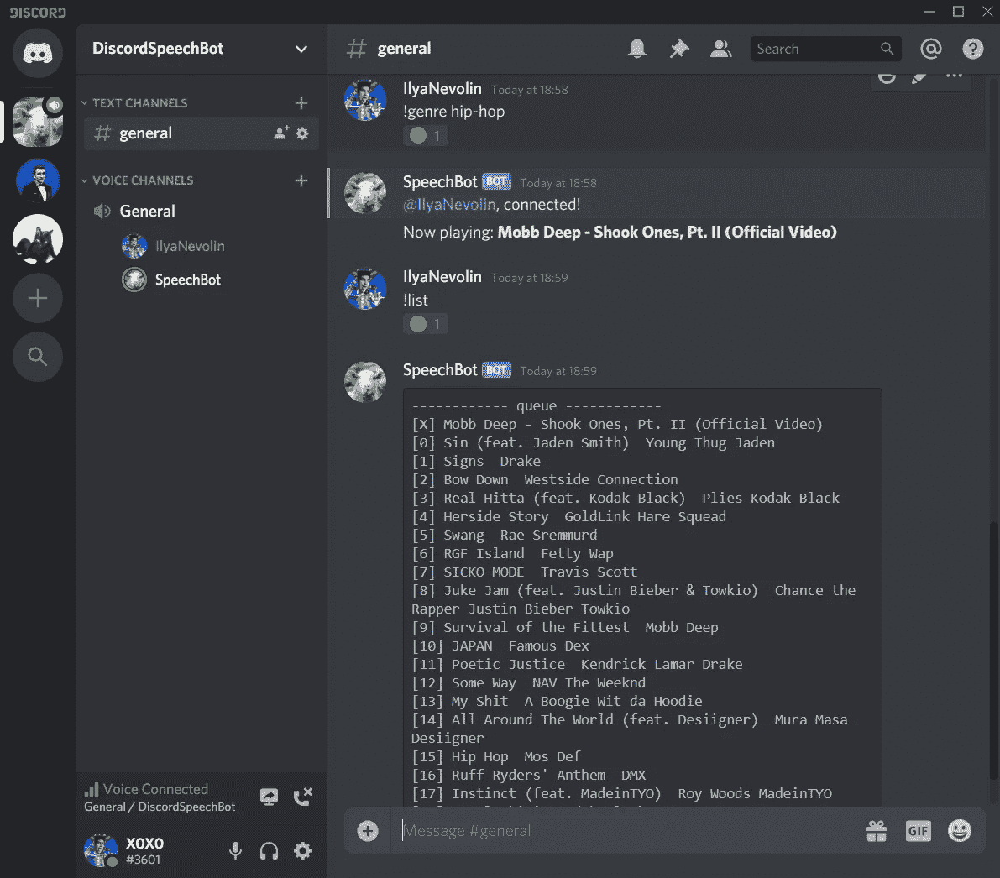

# 不和谐的语音机器人

> 原文：<https://blog.devgenius.io/speech-bot-for-discord-c46fed9c1fe5?source=collection_archive---------0----------------------->

如果你是一个经常玩 Discord 的用户，你一定希望有语音命令，尤其是当你和朋友一起玩游戏的时候。尤其是管理你的不和谐音乐。

我花了很多时间试图找到一个有语音命令的机器人，但找不到。所以我体内的工程师必须行动起来。

我开始在 NodeJS 中构建我的 Discord 机器人，它会倾听用户并解释他们所说的话。幸运的是，现在有一些开源的语音转文本解决方案，比如 PocketSphinx。然而，这些给了我相当差的精度，所以我不得不看其他地方。Google Speech API 运行得又好又快，但是我很快就超过了每日限额，而且付费计划太贵了。

幸运的是，有一些很好的免费语音转文本 API 可用，我决定使用的是 https://wit.ai/的 T2。他们是完全免费的，他们唯一的限制是保持你的音量低于每秒一个请求。

现在我有了一个语音到文本的解决方案，我不得不写一堆“商业”代码来连接所有的东西。从今天起，我将我的代码开源，供所有人使用(包括一个 docker 文件)。

出于测试目的，我使用的是 DigitalOcean (Ubuntu v18)每月 5 美元的 droplet，但你可以在几乎任何 Linux 发行版上运行它。请记住，您确实需要安装一些依赖项来使它工作。

GitHub:【https://github.com/healzer/DiscordSpeechBot 

# 演示:

# 截图:

