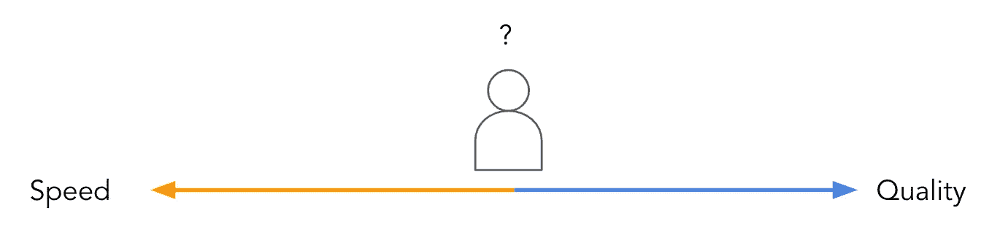
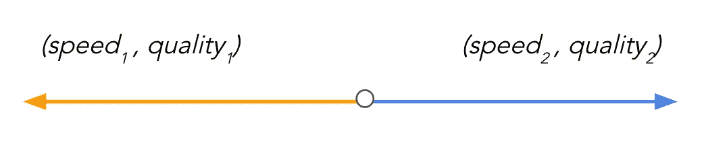
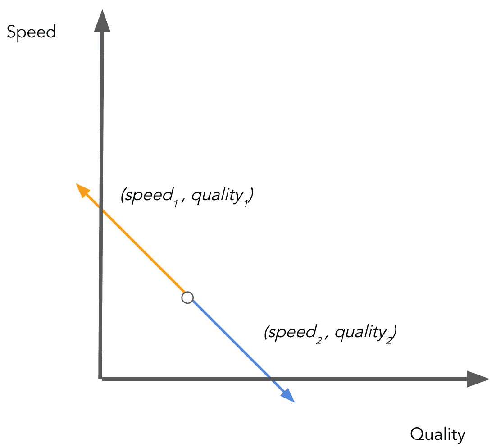
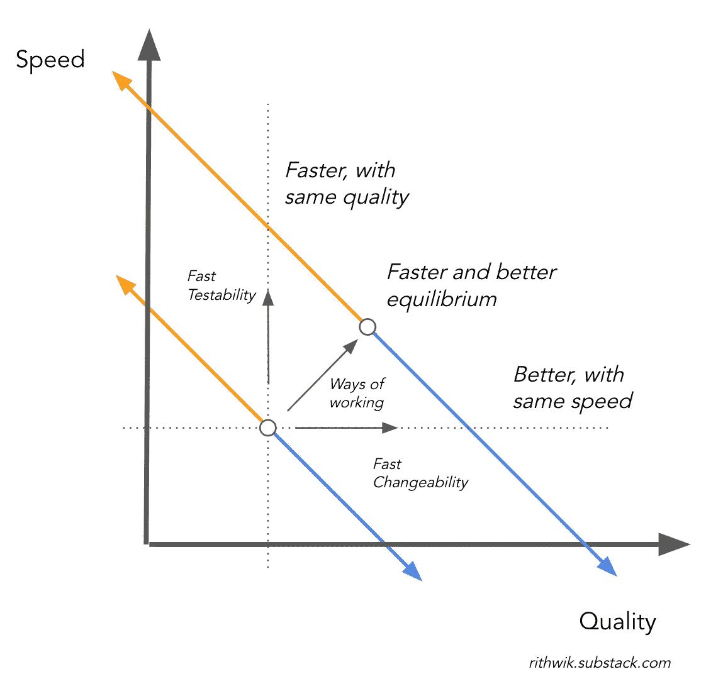
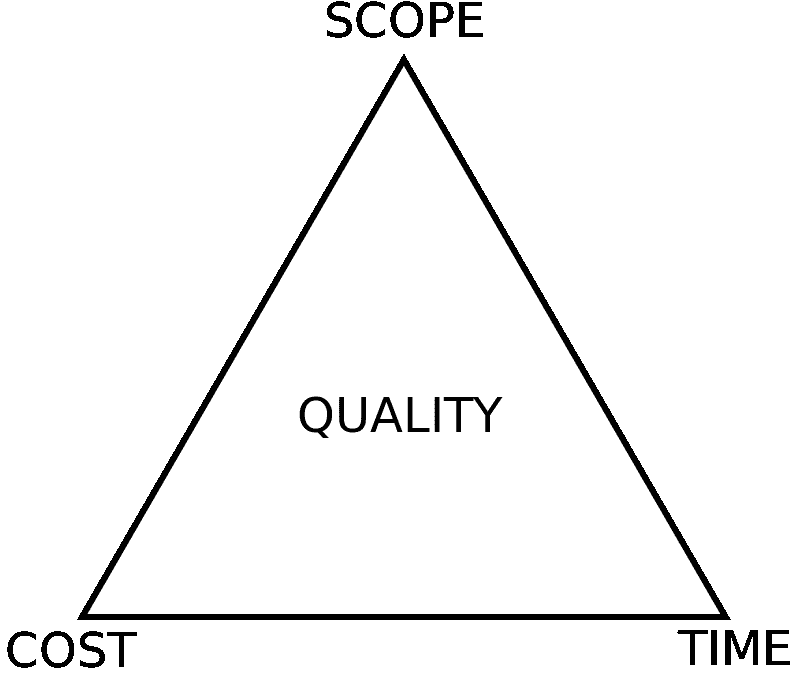
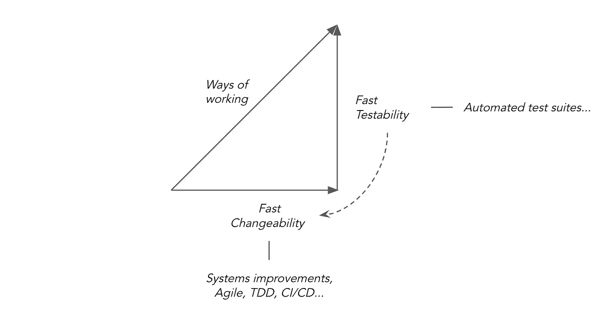

# 速度和质量

> 原文：<https://blog.devgenius.io/speed-and-quality-2245bb6e12ae?source=collection_archive---------11----------------------->

最近看了*丰田生产体系*。后来有一些书对其进行了更全面的探索，但是阅读大野泰一本人揭示该系统的本质是很棒的。令人着迷的是，仅仅几个简单的想法就发展到了最终的程度。

无论如何，这让我想到了速度和质量。当我们谈论概念时，脑海中常常会形成模糊的图像。它们很有用，但也很危险，因为它们会限制我们的思维。我的猜测是，很多时候我们把速度和质量放在一条线的两端。一个人可以向其中一个移动，从而远离另一个。快，不好的工作或慢，好的工作。

这是简单化了。毕竟，一个更熟练的工人可以更快更高质量地交付*和*。建立标准操作程序也是如此。我们如何将它们融入这个模型？

我们会看看是否可以用别的东西来代替这个心理图像。请注意，所有的模型都是错误的，我们只是试图通过更丰富的心理图像来增加效用。

第一步是戴上数据帽子，看到两个量出现在一条线上感到不舒服。以下是比较真实的。

一旦我们到了这里，把线放到 2D 的情节中就不是一个跳跃了。

这很有意思，而且正如我们将看到的，这赋予了我们力量。

沿着这条线，一切都如我们所料:速度越快意味着质量越差，反之亦然。但是请注意，现在可以画更多的线。抬起的新线条代表了我们无法融入旧款车型的改进。

我们已经对这种权衡有了更丰富的表述，但我们也可以对提升线条的力进行理论化。对个人来说，我们默认为“技能”，但这对群体来说似乎不太合适，所以现在让我们确定“工作方式”。

项目管理三角形说你只能从好、快、便宜中选择两个。因为我们已经说过我们想要又好又快，这意味着更多的成本。

这似乎与我们的模型不一致，因为我们试图用同样的资源增加两者，但前提是你狭义地解释“成本”。通常成本被认为是更多/更好的机器和工人。但是考虑扩大你对成本的解释，包括改变行为的心理和社会成本。*工作方式*是免费的(除非你自愿花在教练、培训等方面。)在传统意义上，但在心理社会意义上代价更高。

数据人应该对戴明很熟悉，因为他自己就是一名统计学家，但主要是因为他说了一些在太多演讲开始时就出现的话。关于质量问题，他说 95%是系统缺陷。然后合乎逻辑的是让*在*系统上工作。传统的成本集中在系统的组成部分，而更有影响力的干预 [2](https://rithwik.substack.com/p/speed-and-quality#footnote-2) 倾向于规则、目标和文化，这就是工作方式。

让我们放大并重新排列新模型中描绘的力。工作方式是针对质量的一个方面的两种干预的结合。

不要对什么是质量过于哲学化，假设它有两个方面:*设计质量*和*构建质量*。换句话说，建造正确的东西，并且建造正确的东西。为此，你需要让你的工作更快*可改变*和*可测试*。

质量保证的测试方面在我们的脑海中是如此的突出和重要，以至于我们只注意到了*构建质量*的角度，而忽略了保证*设计质量*的准备变更的角度。从这个不完整的角度来看，质量实践确实让我们慢了下来。但是如果你从两个角度看，明显的缓慢是一种错觉。想象有两辆车，一辆慢，一辆快，行驶在一条有很多弯道的路上。跑得快的人会不停地撞上铁轨，在重新定位的过程中浪费时间，而跑得慢的人会平稳地向前行驶，更快地到达终点。就像特别行动组说的，慢就是顺，顺就是快。

自动化加速了测试，但是我们如何加速变化呢？答案似乎是将质量提升到早期流程的上游，并减少批量。这是精益、敏捷、丰田生产系统、测试驱动开发、持续集成等框架的核心。请注意，当我们谈论质量时，我们通常不会想到这些。正如我所说的，构建质量得到了不成比例的关注。为了设计的质量，也就是为了更快的变化，我们必须缩小一个专门的 QA 组来查看系统。

说到数据科学，可变性更加重要。过程中的每一步都是暂时的。变更是由涉众、分析想法、模型结果和数据本身决定的。然而，数据科学的代码库往往是最不容易改变的。

以下是一些补救的初步想法:

编写函数。它通过将功能打包成可重用的部分，使代码可测试和可更改。

没有测试，可测试性是没有用的，有了测试，您可以更快、更自信地改变事情。

只要有意义，就将代码从易碎的笔记本中取出。

[先素描，后上色。](https://rithwik.substack.com/p/sketch-first)交付低保真度版本和迭代使事情变得更加多变，因为你推迟了更永久的决定。

如果你喜欢这篇文章，可以考虑在 https://rithwik.substack.com/*订阅*