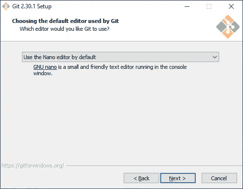
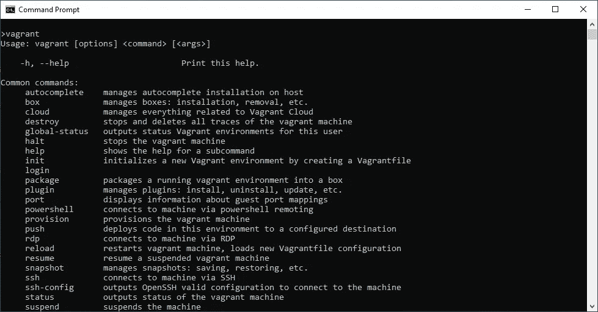
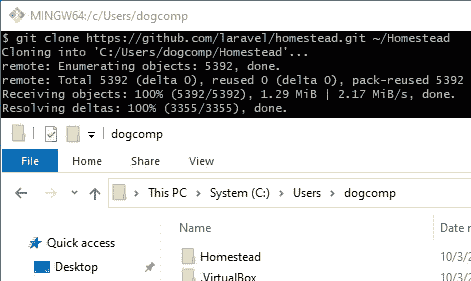
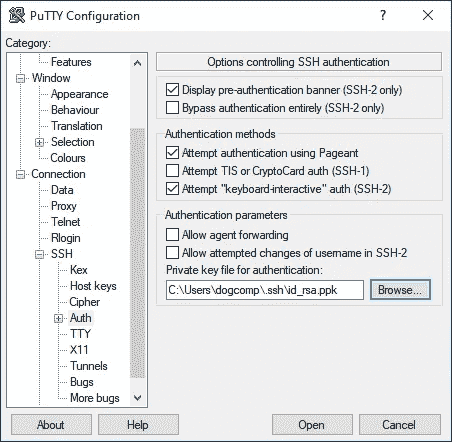
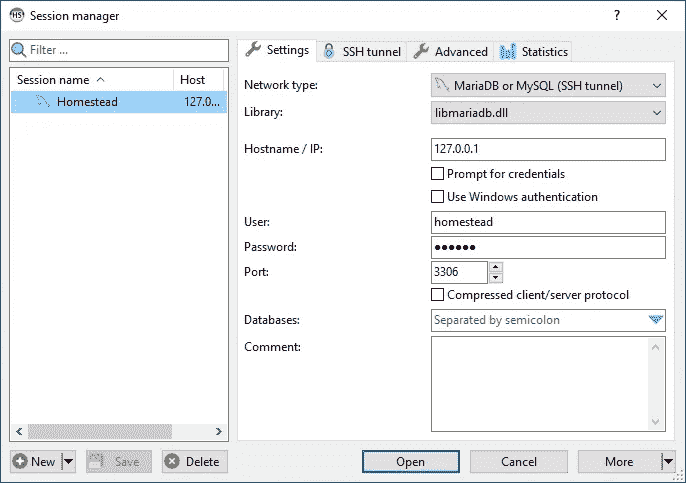
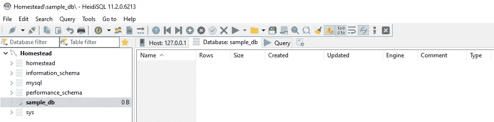
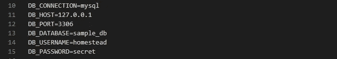
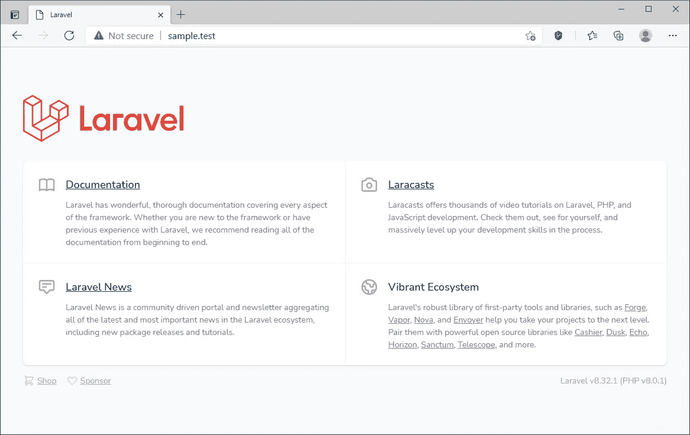

# 使用 Hyper-V 加速 Laravel 8 Homestead(分步指南)

> 原文：<https://blog.devgenius.io/speed-up-laravel-8-homestead-with-hyper-v-step-by-step-guide-99505199d003?source=collection_archive---------1----------------------->

L 阿拉维尔家园是许多阿拉维尔开发商的共同出发点。对于许多开发人员来说，Oracle VirtualBox 是 Homestead box 托管的实际选择，但它是第 2 类(托管的)虚拟机管理程序，与第 1 类(裸机)虚拟机管理程序相比，性能较差。

如果你是 Windows 10 Pro 用户，为什么不拿这个内置的功能来加速你的日常编码呢？让我们开始吧…


**要求:**

*   Windows 10 企业版、专业版或教育版
*   在 BIOS 中启用了虚拟化(VT)功能的现代 CPU
*   至少 4GB 内存

有关更多信息，请参见 [Windows 10 Hyper-V 系统要求](https://docs.microsoft.com/en-us/virtualization/hyper-v-on-windows/reference/hyper-v-requirements)。

# 1.启用超级虚拟化

以管理员权限运行 PowerShell，然后执行

```
Enable-WindowsOptionalFeature -Online -FeatureName Microsoft-Hyper-V -All
```

安装后重新启动计算机。

# 1a。(可选)启用 Windows 虚拟机管理程序平台

如果您仍在使用 VirtualBox 或其他第三方虚拟化软件(如 VMware)，您必须打开此可选功能。

以管理员权限运行 PowerShell，然后执行

```
Enable-WindowsOptionalFeature -Online -FeatureName HypervisorPlatform
```


家园设置概览图

请确保您的 Windows 上安装了以下软件:

*   Git(下载[链接](https://git-scm.com/downloads))
*   流浪(下载[链接](https://www.vagrantup.com/downloads))
*   PuTTY(下载[链接](https://www.chiark.greenend.org.uk/~sgtatham/putty/latest.html)
*   HeidiSQL(下载[链接](https://www.heidisql.com/download.php)
*   VS 代码(下载[链接](https://code.visualstudio.com/)

# 2.饭桶

通常，只需遵循安装向导(接受默认选项)并完成安装。



对于初学者，推荐 Nano 编辑器。

> 您可能会注意到 *Git* 在上图中没有提到，但是它是您日常开发程序背后的一个重要软件。

# 2.1 生成您的 SSH 密钥

> 注意:如果您之前已经创建了 SSH 密钥对，请跳过这一步。

使用 RSA 算法，为了更好地兼容不同系统，
执行此命令:
`ssh-keygen -t rsa -b 4096 -C “your_email@example.com”`

强烈建议使用密码，但不要忘记😉


".ssh”文件夹是用位于其中的公钥和私钥创建的

# 2.2 IDE 和实用程序

安装 VS 代码，PuTTY，HeidiSQL，SourceTree，以及所有你喜欢的开发工具。

# 3.无赖

安装并遵循安装向导，然后在安装完成后重新启动。



在命令提示符中键入“vagger ”,然后您应该会看到输出

# 4.安装家园

> 提示:请始终参考最新的官方文档[https://laravel.com/docs/8.x/homestead](https://laravel.com/docs/8.x/homestead)

从开始菜单启动你的 *Git Bash* ，然后执行命令
`git clone https://github.com/laravel/homestead.git ~/Homestead`



“家园”文件夹是在您的用户目录中创建的

然后结账`release`分支
`cd ~/Homestead`
`git checkout release`

# 4.1 下载家园流浪箱

在 Windows 命令提示符下执行命令
`vagrant box add laravel/homestead`


为 Hyper-V 选择 1

> 你可能会遇到下载速度极慢的情况，所以我创建了可以从我的 [Google Drive](http://bit.ly/3l2HvKi) 下载的盒子镜像(v11.3.0)。
> a)将内容提取到`*C:\Users\<username>\.vagrant.d\boxes*` b)然后通过命令`*vagrant box list*`进行验证


验证是否下载了家园盒

> 或者，您可以发出命令下载[流浪者](https://app.vagrantup.com/laravel/boxes/homestead)网站上声明的确切版本

```
vagrant box add --box-version 11.5.0 laravel/homestead --provider hyperv
```

# 4.2 创建 SMB 共享文件夹

首先，建议创建一个单独的帐户供您的流浪者访问。在 Windows 开始菜单搜索框中键入`lusrmgr.msc`，然后创建一个用户`vagrant`并配置密码。


为你的流浪者创建一个专用用户

您需要给用户`vagrant`两个文件夹“完全控制”的访问权限。
**文件夹 1** :宅地脚本文件夹(即`*C:\Users\<username>\****Homestead***` *)* **文件夹 2** :代码文件夹(即`*C:\Users\<username>\****code***` *)*


流浪者工作所需的权限

文件夹的位置由您自己选择。

# 4.3 配置宅基地

双击并执行家园文件夹中的`init.bat`


用你最喜欢的编辑器编辑`Homestead.yaml`


第一部分:虚拟机规范


第二部分:SSH 密钥对

> 您必须创建要映射到虚拟机的共享文件夹。注意:如果字符串包含空格或特殊字符，请在字符串两边加上引号


第三部分:共享文件夹映射，

类型是`smb`，用户名和密码是[你刚才创建的](#0389)。

> 注意:为了在 Linux 和 Windows 环境中获得最好的兼容性，总是推荐使用小写字母


第四部分:Nginx、MySQL 和特性设置

> 确保`*mysql*`功能设置为`*true*`，并保存`*Homestead.yaml*`。
> 
> 【更新:2021 年 3 月 29 日】
> 一个非常有用的指南谈到了`*Homestead.yaml*`
> [https://abbasharoon.me/homestead-yaml-explained-a-z/](https://abbasharoon.me/homestead-yaml-explained-a-z/)

# 5.流浪主机管理器插件

安装用于自动配置 Windows 主机文件的主机管理器插件。

```
vagrant plugin install vagrant-hostmanager
```

如果您是在`vagrant up`之后安装的，那么您可以在插件安装后再次运行`vagrant halt`和`vagrant up`。

# 6.设置虚拟交换机

取决于您是使用局域网还是 WiFi 连接互联网:

**答:您使用的是局域网(有线网络)**

I)打开 **Hyper-V 管理器** II)在右侧，点击**虚拟交换机管理器** III) 选择**外部，**然后点击**创建虚拟交换机** IV)选择您的网卡然后点击**确定**


为互联网连接创建虚拟交换机

**B .你正在使用 WiFi(无线网络)——事情变得棘手了……**

> 注:您可以在您的 Wi-Fi 网卡上尝试上述方法，如果不起作用(即错误或没有互联网连接)，则尝试以下步骤。

I)打开 **Hyper-V 管理器** II)在右侧，点击**虚拟交换机管理器** III) 选择**外部，**然后点击**创建虚拟交换机** IV)选择您的 Wi-Fi 网卡
V)在您的开始菜单中输入`ncpa.cpl`搜索，
并打开**网络连接**窗口
❗技巧部分:当


让 Wi-Fi 外部开关正常工作的技巧

如果一切顺利，你应该会看到这三项:
A. **你的 Wi-Fi 连接(桥接)**，
B. A **网桥**，
C. A **vEthernet(外部开关)**


为 WiFi 适配器创建虚拟交换机的工作示例

speedtest.net 现在去[测试你的网络连接](https://www.speedtest.net/)

如果你注意到你的互联网连接明显变慢，你可以根据微软的 [Q & A 禁用**大型发送卸载(LSO)** 。](https://docs.microsoft.com/en-us/answers/questions/80403/win10-server-2019-slow-files-transfer-interesting.html)

为您的 **vEthernet(外部交换机)**找到相应的适配器，然后禁用**大发送卸载版本 2 (IPv4)** & **大发送卸载版本 2 (IPv6)**


禁用大量发送卸载(LSO)


通过禁用 LSO 恢复你的带宽(由[speedtest.net](https://www.speedtest.net/)测试)

# 7.启动你的家园！

⚠️用管理员权限**运行你的命令提示符** ⚠️

将目录`cd`更改为你的`Homestead`目录
例如`cd C:\Users\<username>\Homestead`
在你的命令提示符下执行`vagrant up`

> 注意:您必须在`*Vagrantfile*`目录下执行您的`*vagrant up*`命令

选择新创建的**外部开关** …


输入外部开关的号码

> 如果您遇到任何错误，这可能是由于反病毒，检查这个来自微软的[指南以了解更多细节。](https://docs.microsoft.com/en-US/troubleshoot/windows-server/virtualization/antivirus-exclusions-for-hyper-v-hosts)


第一次启动需要一些时间，请耐心等待…

> 注意:正确设置您的 [SMB 共享文件夹](#dfef)，否则您无法继续。

# 8.通过 SSH 连接您的家园


用你的 IP 或本地域名连接到你的家园


[流浪主机管理器](#b571)应该会为你配置你的 Windows Hosts 文件。

您可以通过用户名(`*vagrant*` ) &密码(`*vagrant*`)进行连接

或者，您可以通过 SSH 密钥连接



> 您必须使用“PuTTYgen”将您的 SSH 密钥转换为 PuTTY 格式 a)从开始菜单打开“PuTTY gen”
> b)从程序菜单，转换>导入密钥
> c)选择私钥(它应该在 C:\Users\ < username > \。ssh\id_rsa)
> d)点击“保存私钥”
> e)用 **id_rsa.ppk** ( **不要覆盖**已有的私钥！)


成功连接家园

# 9.通过 SSH 隧道连接您的 MySQL

a)打开 HeidiSQL >单击“新建”创建新会话

b)单击“SSH 隧道”选项卡

> 使用用户名(`*vagrant*` ) &密码(`*vagrant*`)或您的私钥进行连接


使用 SSH 隧道

c)单击 MySQL(或 MariaDB)凭证的“设置”选项卡

> 使用用户名(`*homestead*` ) &密码(`*secret*`)连接

d)通过右键单击会话>重命名来重命名您的会话

e)最后，点击“保存”



点击“打开”,你应该可以在 Homestead 虚拟机中连接 MySQL 了



在 Homestead.yaml 中配置的数据库已创建

# 10.安装 Laravel 8.x

通过 PuTTY 登录，并在`cd code`之前转到您的项目文件夹

**选项 1:通过 Composer 安装**

```
composer create-project laravel/laravel sample
```

**选项 2:通过 Laravel 安装程序安装(推荐)**

```
composer global update laravel/installerlaravel new sample
```

> 提示:如果您编辑了您的`*Homestead.yaml*`，您可以运行`*vagrant provision*`来应用您的新配置
> 
> 提示:如果您面临任何性能问题，您可以通过运行`*vagrant reload*`来尝试重启 Homestead VM

一旦安装完成，`cd sample`然后运行`php artisan --version`


# 10.1 在开发前更新您的`.env`



在中更新您的数据库配置。项目根目录中的 env 文件

# 编码快乐！

Git 提交您的全新安装，然后用 VSCode/PhpStorm 打开您的项目文件夹，开始您的 Artisan 之旅！



键入您的本地域，然后您应该会看到 Laravel 欢迎页面

> 提示:在你关闭窗口之前，记得运行`*vagrant halt*`

# 视频演示

如果你喜欢我的文章，请关注并分享我的文章(或者你可以💲[成为我的赞助商](https://buy.stripe.com/7sI03C9S56Upcpi8ww)💲 ).保重，再见！