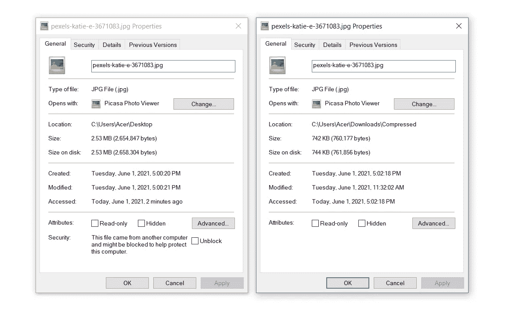
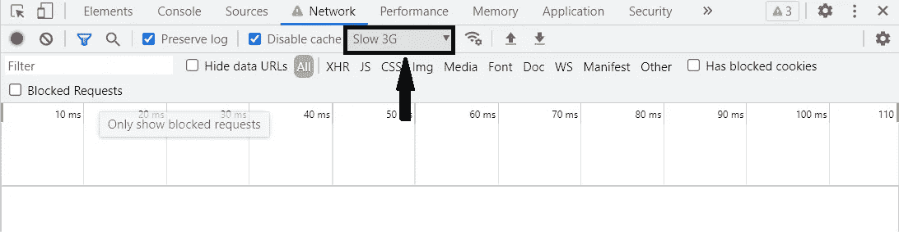

# 加快你的网页加载时间

> 原文：<https://blog.devgenius.io/speed-up-the-web-page-loading-time-be3efa42414a?source=collection_archive---------7----------------------->

马丁·丹博尔特从[派克斯](https://www.pexels.com/photo/grayscale-photo-of-group-of-horse-with-carriage-running-on-body-of-water-802861/?utm_content=attributionCopyText&utm_medium=referral&utm_source=pexels)拍摄的照片

现代世界的人们需要用更少的时间更准确地完成他们的工作。因为他们重视时间。所以作为网页开发者，我们有责任保持网页加载时间的速度。因为最终用户需要对网站感到满意。如果用户对网站不满意，那么我们在开发时使用的技术、方法都是无用的。由于性能不佳，用户可能会转向替代产品。在这篇文章中，我将告诉你一些加快网页速度的技巧，这将有助于你的开发过程。

我们知道一个网页通常由 HTML、CSS 和 JavaScript 组成。所以我们来谈谈提高这些文件速度的方法。

## 丑陋/缩小

我们在 Web 开发中使用 HTML 和 CSS 文件来为网页添加样式和布局。因此，当用户试图访问页面时，所有的 HTML 和 CSS 文件都应该加载给用户。这些文件应该通过网络提供给用户。所以我们需要最小化这些文件的大小来快速加载它们。因此，作为一个解决方案，最小化或压缩 CSS 和 HTML 文件，我们可以使用[缩小](http://minifycode.com/css-minifier/)和[丑陋](https://www.uglifycss.com/)。他们将 HTML 和 CSS 文件压缩成小文件。

## TinyPNG

我们使用图像来设计网页。有时我们并不关注图像的大小。我们只是简单地添加它们，没有任何压缩。因此，在托管网页后，加载时间可能会因此而增加。因此，在将它们添加到您的网页之前，您需要使用一些压缩技术。因此 [TinyPNG](https://tinypng.com/) 是一个很好的压缩图像的解决方案，不会对图像造成任何损害。你可以在网上或网下找到许多这类工具。

照片由[凯蒂·E](https://www.pexels.com/@katie?utm_content=attributionCopyText&utm_medium=referral&utm_source=pexels)从[派克斯](https://www.pexels.com/photo/woman-in-white-and-black-striped-shirt-wearing-black-sunglasses-3671083/?utm_content=attributionCopyText&utm_medium=referral&utm_source=pexels)拍摄

**使用 TinyPNG 压缩图片**

**压缩后的尺寸差异**

## 使用矢量图像

我们可以在网站上使用许多类型的图片。所以我们需要尽量在合适的地方使用矢量图像。因为它们体积小，我们可以在不影响质量的情况下对它们做任何改动。

## 使用图像 CDN

CDN 的含义是内容交付网络。我认为这对我们中的一些人来说是一件新鲜事。但作为一名 Web 开发人员，这是一件好事。在这种情况下，我们只需将视频和图像上传到 CDN 服务器。然后他们提供我们的图片和视频的链接。所以我们只需要添加链接到我们的网页。你可以用 [Cloudinary](https://cloudinary.com/) 和 [Sirv](https://sirv.com/) 来做这个。通过使用这种技术，我们可以减少大量的网页加载时间。因为在 CDN 中，他们使用了更好的方法来优化。因此可以减少装载时间。

## 排列文件

我认为这是一个众所周知的因素，但我认为增加这一点也是一件好事。因为有时人们会忽略这一点。所以你需要在 HTML 文件的头部添加 CSS 和其他 CDN 链接。然后，您需要在主体底部添加 JavaScript 文件。因为有时 JavaScript 会阻止 CSS 文件的加载，直到 JS 文件执行完毕。作为一个例子，我只是简单地说，当我们在 JavaScript 中添加一个警告脚本时，整个过程是阻塞的，直到我们关闭警告框。这是一个简单的例子。但是有时这些简单的事情会造成巨大的错误。

## 附加工作

在这里，我希望告诉你一些额外的工作，你可以遵循，而发展。我们知道大多数网络浏览器都有开发者控制台的选项。因此，在“Network”选项卡中，我们有一项功能可以选择限制。所以我可以说我们需要考虑最坏的情况。因此，我们可以简单地将预设设置为慢速 3G。因为我们知道我们有不同的互联网连接和覆盖范围。因此，当我们为最坏的情况开发网页时，我们可以确保我们的网页运行良好。

**在网络选项卡中选择慢速 3G 选项**

# 结论

在这篇文章中，我展示了一些加快网页速度的方法，这些方法可能对你有用。有很多方法可以加快速度，你需要选择适合你的方法。那么用户的网络在考虑网页加载时间的时候也是一个很大的因素。所以我们需要做最坏的打算。然后我需要告诉你另一件重要的事情。这并不总是尽可能地提高网页的性能。因为这对你来说是一项耗时的任务。在开发过程中，你需要确保你遵循开发的时间线。否则，你会坚持提高业绩，而不完成工作。所以在做这类任务时，你需要遵守一些规则。

我也通过阅读文档和观看关于这些东西的视频来收集这些东西。所以你也可以用这些东西自学。希望这篇文章能对你有所帮助。

对于软件开发人员来说，更好地理解这些简单的技巧非常重要。所以你应该对这些东西有很好的了解，并且应该有能力与它们一起工作。这将有助于你作为软件开发人员的职业发展。

本文探讨了加速网页加载的方法，希望能帮助您更准确地完成工作。我想感谢你阅读我的文章，我希望在未来写更多关于新趋势话题的文章，以关注我的帐户，如果你喜欢你今天所读的！

**参考文献:**

 [## 页面速度- 2021 网站最佳实践

### 页面速度是衡量页面内容加载速度的指标。谷歌刚刚宣布页面速度将是一个…

moz.com](https://moz.com/learn/seo/page-speed)  [## TinyPNG -压缩 PNG 图像，同时保持透明度

### 问得好！让我给你一个并排的比较。下面是我表妹的两张照片。左图是…

tinypng.com](https://tinypng.com/) 

https://cloudinary.com/