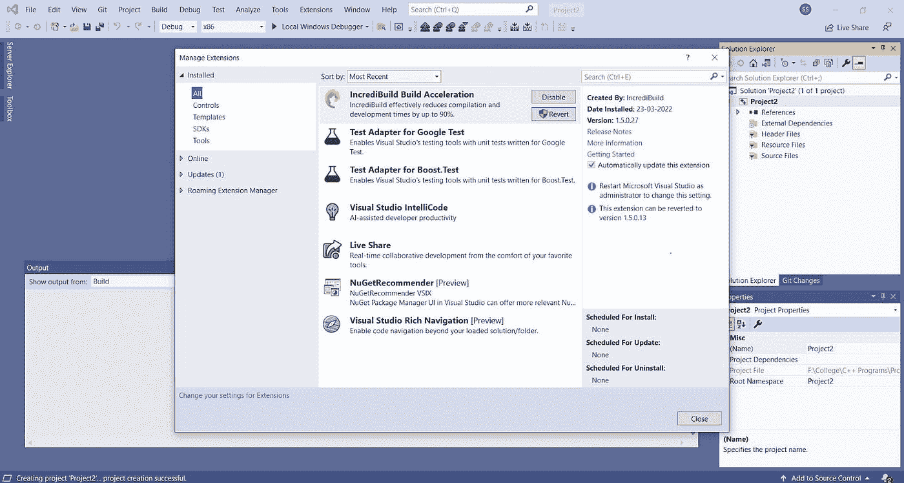
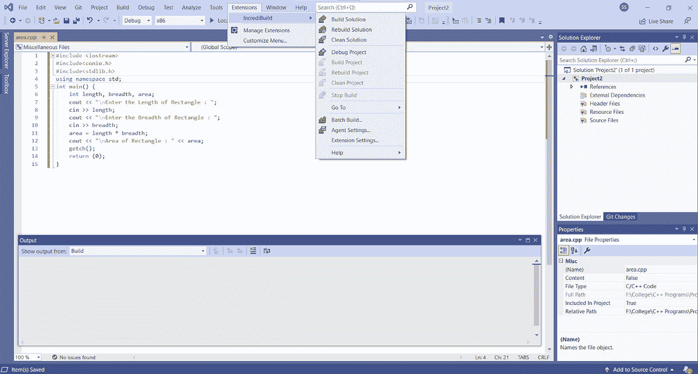
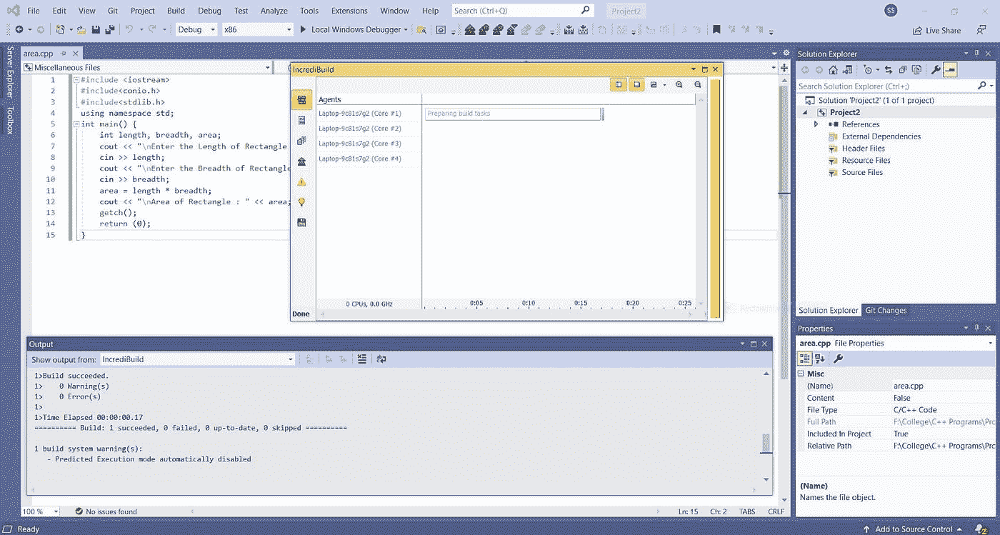
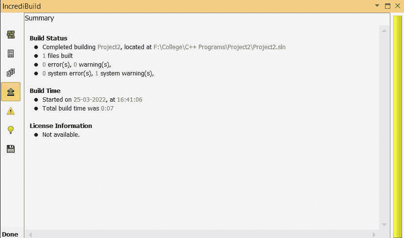

# 加快 C++应用的合规性

> 原文：<https://blog.devgenius.io/speeding-up-compliance-for-c-applications-bdb116cbd79c?source=collection_archive---------11----------------------->


[照片](https://unsplash.com/photos/m_HRfLhgABo)由[麦克斯韦·尼尔森](https://unsplash.com/@maxcodes)在 Unsplash 上拍摄

C++是最广泛使用和流行的编程语言之一。它是一种高级编程语言，是 C 语言的扩展。而且由于 C 是低级语言，所以 C++也可以用来做低级编程。然而，作为一种面向对象的语言，C++允许使用数据封装、抽象、多态和继承，这使得代码可以重用，节省了开发人员的时间。

由于 C++程序可以在多种接口和操作系统上运行，它已经成为大多数开发人员的首选。因此，C++被大量用于大多数现实世界的应用程序，如开发 3D 游戏、GUI 应用程序、数据库软件、操作系统、浏览器、云系统等。

# 应用速度

为了开发如此复杂的应用程序，开发人员需要花时间处理应用程序的逻辑，并将逻辑实现到程序中，并遵循适当的标准，以便代码在不同的平台上是安全、可靠和可移植的。据[微软](https://devblogs.microsoft.com/cppblog/cpp-build-throughput-investigation-and-tune-up/)称，开发人员的大部分时间都花在编译、构建项目和维护合规标准上，因为与其他语言相比，构建 C++项目的源代码需要更长的时间。因此，开发人员将大部分时间花在构建和编译项目上，这可能会让开发人员感到沮丧，并导致项目完成的延迟。

# 服从

像所有的程序和应用程序一样，C++应用程序在符合标准方面也有很高的标准。法规遵从性标准是为了解决一致性和可移植性问题，以及软件开发生命周期早期阶段的安全性和法规遵从性问题，这些问题会影响整个过程。

当考虑有助于符合 C++标准和一般构建速度的最佳实践时，有一些关键的想法需要记住。首先是确保你的编码风格是最新的和一致的。当组织中的所有代码都遵循相同的格式和标准时，人类解析和理解代码就变得容易多了。沿着这些思路，让代码有清晰的注释和自我文档化也会有所帮助。

在一些 DevOps 圈子里，人们创造了术语“ [compliance”作为代码](https://www.nexastack.com/blog/compliance-as-code)，以显示更快的审计和安全性的遵从的完整性。法规遵从性是根据安全先决条件来衡量的，如法规遵从性和内部治理、基准和最佳实践。在遵循法规遵从性的同时，您希望确定您必须遵循的安全基准和最佳实践，以及您的应用程序必须遵循的监管性&内部治理要求。一旦您决定了所有的需求和适当的控制，您希望通过利用代码将那些需求和指示的控制传递到明确的标准中。最后，您应该集成或执行这些代码来验证预先确定的资源/服务，并决定该预先确定的资源/服务是否符合先前决定的需求和控制。

# 加速一切

有许多方法可以减少编译时间，比如使用更快的编译器、进行并行编译或者创建更小的文件，但是这些解决方案并不是非常有效和经济的。我为 C++应用程序找到的一个免费工具是 [Incredibuild](https://www.incredibuild.com/) 。它可以在本地开发系统和构建服务器上使用，因为它使用计算机中的空闲 CPU 周期，这提高了系统的效率。它还可以轻松地与其他 ide 和平台集成，如 Visual Studio、Android C++、CMake、Xbox、Azure 和其他游戏平台，而无需更改任何文件或源代码。

除了加速开发过程，Incredibuild 还有助于可视化输出和构建过程，这有助于开发人员修复错误和构建项目。随着 Incredibuild 加速构建过程，让我们看看如何将其与大多数开发人员常用的 Visual Studio 集成。

对于本文，我们使用免费许可证来进行开发和构建过程。您可以根据您的操作系统按照 [Incredibuild 文档](https://docs.incredibuild.com/)中的步骤进行安装。安装后，打开 Visual Studio 配置 Incredibuild。在菜单栏中，单击“扩展”选项卡，并通过单击“管理扩展”检查是否安装了 Incredibuild，如下所示。



检查后，创建一个新的项目或打开一个项目，你想建立，我已经创建了一个简单的程序来寻找一个矩形的面积如下所示:

```
#include <iostream>
#include<conio.h>
#include<stdlib.h>
using namespace std;int main() {
    int length, breadth, area;
    cout << "\nEnter the Length of Rectangle : ";
    cin >> length;
    cout << "\n Enter the Breadth of Rectangle : ";
    cin >> breadth;
    area = length * breadth;
    cout << "\n Area of Rectangle : " << area;
    getch();
    return (0);
}
```

要构建程序，单击菜单栏上的 Extension 选项卡，导航到 Incredibuild，然后单击 Build solution，这将构建我们的程序。



更大的项目或应用程序也可以用同样的方式构建。您需要单击 build project，随后会弹出一个 Incredibuild 窗口，显示构建过程。在此窗口中，您可以通过单击窗口左侧面板，在控制台或图形界面中检查构建进度。

左侧面板还有查看摘要和保存构建监视器文件的选项，可以根据开发人员的需要在以后使用。Incredibuild 的窗口如下所示:



使用 Incredibuild 窗口，开发人员还可以检查构建和调试的输出，如果它给出任何警告或错误。



可以通过进入 Incredibuild 窗口中的 summary 选项卡来检查构建时间。在这里，它表明我们的程序寻找矩形的面积花了 0.07 秒。如果没有 Incredibuild，这可能需要 50-100 秒。

# 摘要

最终，合规性标准是为了保持您的应用程序快速和可靠，并且与 Incredibuild 等工具结合使用，可以大大减少编译、测试和代码分析时间。这提高了开发人员的生产力，加快了项目的进度，而没有任何额外的安装、维护或硬件成本。