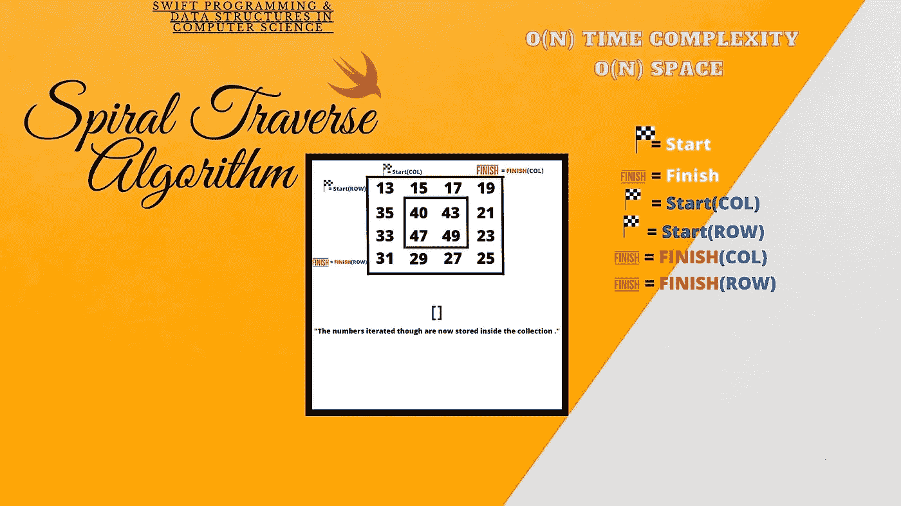
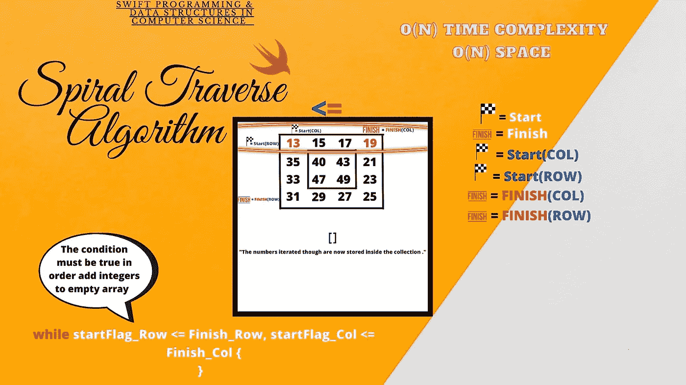
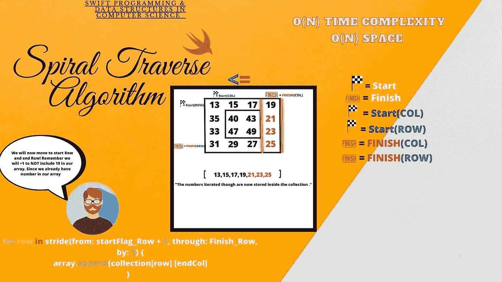
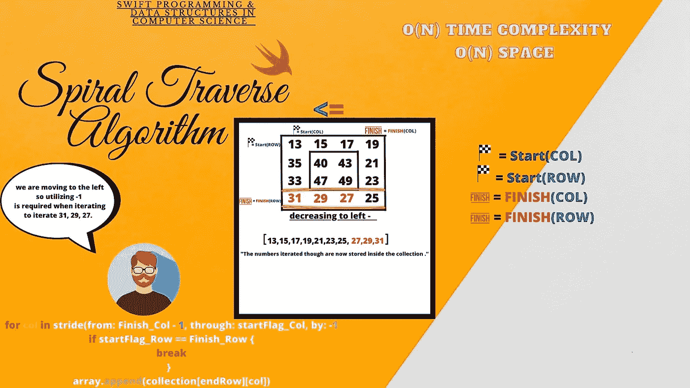
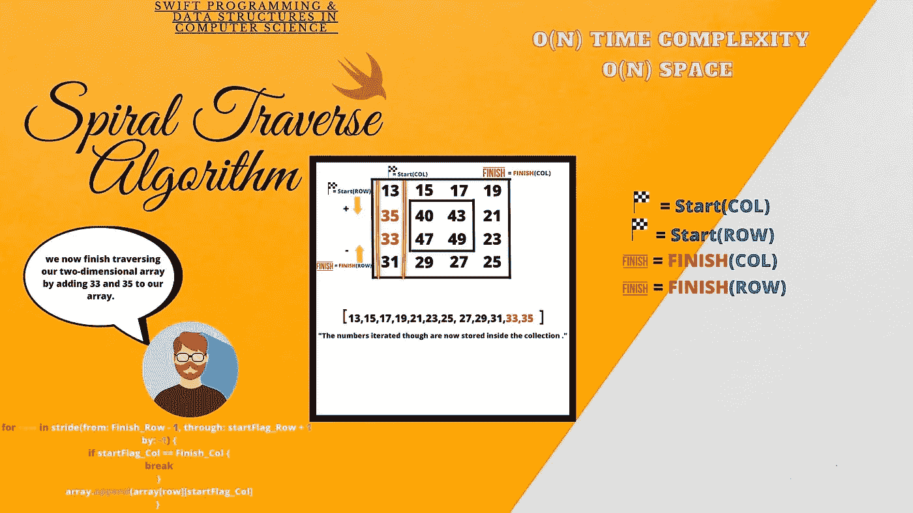

# 螺旋遍历算法

> 原文：<https://blog.devgenius.io/spiral-traverse-algorithm-6cf19073783b?source=collection_archive---------5----------------------->

*Swift 算法&计算机科学中的数据结构*

> 算法和数据结构常用于网站和移动应用。今天，我们将讨论计算机科学理论中使用的标准算法。螺旋遍历算法通过遍历二维数组来工作。我们将分解这个算法，并讨论其工作的关键组成部分。

上面列出的是我们算法的开始。我们首先创建一个接受名为“集合”的参数的函数以及返回整数数组的二维整数数组。接下来，我们声明一个包含空数组的变量。

上面列出的是我们的图表；我们有显示二维数组的每个区域的键。

> 这将是我们的算法如何工作的图表；请做好笔记，注意它是如何遍历一组数字的。我们的算法将以 O(N)复杂度和 O(N)空间运行，因为我们将遍历一个二维数组并将每个整数添加到一个空数组中。列出的是我们的二维数组中的起始行和结束列。

我们首先开始初始化我们的行和列变量，允许我们遍历二维数组的不同部分。

> 正如我们所看到的，当我们准备遍历二维数组的外侧时，我们为二维数组的每个点创建单独的变量。

我们首先开始遍历二维数组的右侧。

> 我们首先在代码中声明一个 while 循环，它将允许我们遍历二维数组的顶部。整数 13、15、17 和 19 将被添加到我们的空集合中。stride 方法将允许我们遍历每个顶部整数一次。接下来，我们利用 append 方法将每个整数添加到数组中，如下所示。

注意，我们使用< =操作符来决定是否可以迭代和执行上面列出的 rest 代码。我们从 startFlag_Col 开始，一直到 Finish_Col，一个一个地将每个整数添加到我们的空数组中。

接下来，我们继续处理二维数组的下一个外侧。仔细看。由于我们不会在 startingFlag_Row 中使用+ 1 再次计数到 19，因此我们将跳过 19，继续到 23、24 和 25。

> 接下来，我们开始遍历二维数组的下一边。startFlag_Row 处的+1 将允许我们跳过 19，因为它已经被添加到我们的集合中。我们仍然使用 stride 方法来遍历二维数组的这一侧。

我们现在声明一个 For-In 循环，它遍历二维数组的下一面。

接下来我们移动到二维数组的下一边。我们将遍历到二维数组外侧的左侧。

> 接下来，我们从 Finish_Col 开始遍历，并穿过 Finish_Row 的左侧。我们向左递增-1。如上所示，我们从-1 开始，避免重复到 25。整数 27、29 和 31 将被添加到我们的数组中。

上面列出的是我们的代码。注意 if 语句，这将有助于避免数组中出现任何相同的数字。如果我们找到相同的数字，并且它已经被添加到我们的集合中，它将自动中断代码的执行。

我们接下来遍历二维数组的最后一个外侧。查看上面列出的示例，我们将从 Finish_Row 和 startFlag_Row 开始。参考上面的例子。

> 在这之后，最后一步是遍历二维数组的内部。我们将通过在 startFlag_Col 和 startFlag_Row、Finish_Row、Finish_Col 处使用+=和-=操作符来推进我们的内部集合。

# 螺旋遍历算法

螺旋遍历算法

# 结论

今天，我们讲述了一个使用 Swift 编程语言的非常复杂而美丽的算法。理解算法需要很多时间，但在用编程语言编写算法之前，要完全掌握算法的运行方式。编程并不容易，需要牺牲时间和耐心；通过每天花时间学习新的算法或数据结构，你已经为未来的成功做好了充分的准备。编码快乐！

 [## Michael Balsa -系统管理员-美国海军陆战队| LinkedIn

### 经验丰富的数据专家和系统管理员，监督维护飞机数据和信息管理…

www.linkedin.com](https://www.linkedin.com/in/michael-balsa-9474431b0/)