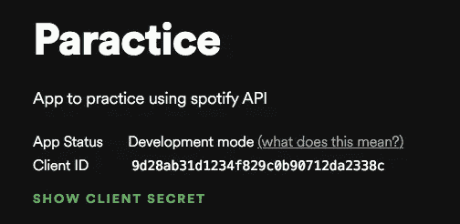
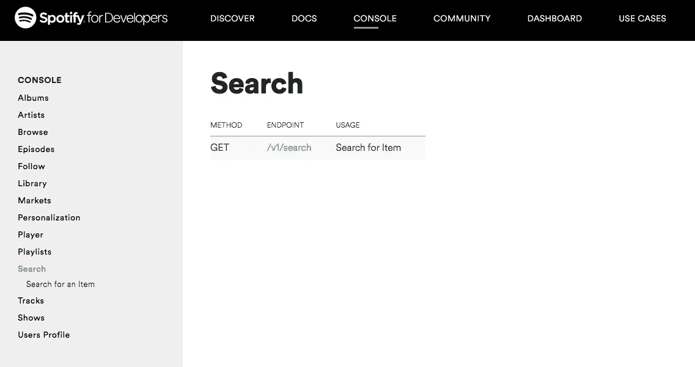
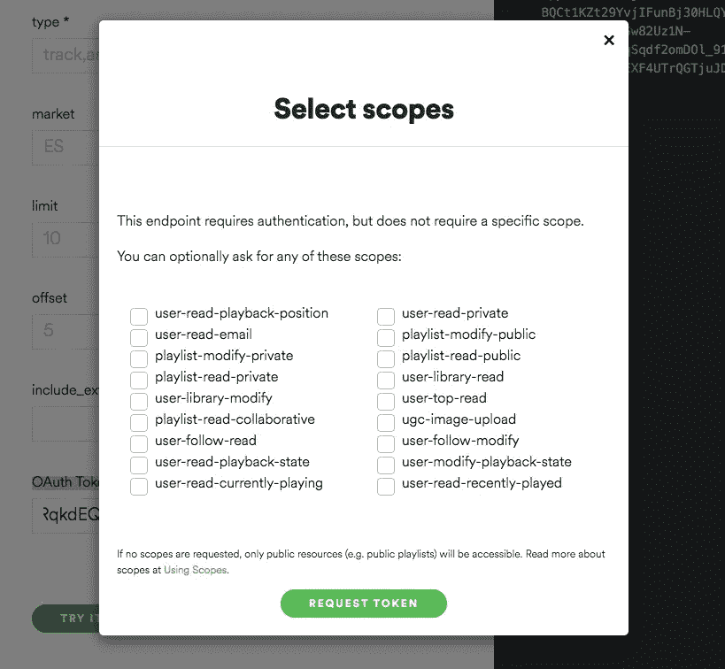
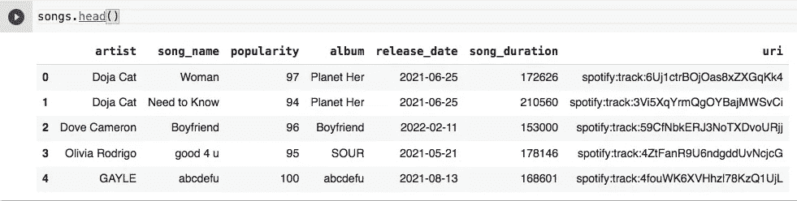

# 使用 Python 和 AWS 的 Spotify API。

> 原文：<https://blog.devgenius.io/spotify-api-with-python-and-aws-d9b3d0f78e8b?source=collection_archive---------4----------------------->

因此，我在这个项目上的目标是从 Spotify API 获取数据，将其保存到 pandas data frame，然后将数据上传到 AWS 上 MYSQL RDS 内的一个表中。

第一篇文章将介绍如何使用 Python 连接 Spotify API 并从中获取数据。第二篇文章将介绍如何创建一个 AWS MYSQL RDS，用 Python 连接到它，然后上传 spotify 数据。


**关键词:**

**API:** 应用程序编程接口——允许两个应用程序相互连接的软件中介。在这个项目中，我通过 Spotify API 获取音乐数据。

AWS :亚马逊网络服务——云计算平台，提供数据库存储、内容交付和计算能力等工具。

**RDS:** 关系数据库服务——托管服务的集合，简化了云中数据库的设置、操作和扩展。

**MYSQL:** 世界上最流行的开源关系数据库。

# **Spotify 开发者账户**

要从 Spotify 获取数据，首先你需要设置一个[开发者账户](https://developer.spotify.com/)。这只是我第二次使用 API 和开发者账户，所以如果一开始看起来像个迷宫也不用担心。

这个视频的前 10 分钟真的帮助我理解了文档的结构。关键在于，要将数据下载到 python 脚本中，您需要 WEB API 文档，其中[WEB API-Reference](https://developer.spotify.com/documentation/web-api/reference/#/)文档是关键。

一旦我创建了我的帐户和一个项目(称为实践),我就可以看到我的客户 ID 和客户秘密。



spotify 设置的最后一个关键步骤是生成一个范围令牌。如果您正在创建一个需要 spotify 用户详细信息的应用程序(例如，当您使用一些应用程序创建一个帐户并注册 facebook 时，您必须提供对您的朋友列表和电子邮件的访问权限，在这里将需要一个特定的范围令牌来确认用户信息将被适当使用)。在这个项目中，我们不使用 spotify 用户的信息，所以不需要特殊的范围令牌。因此，要生成“基本”令牌，请执行以下操作:

*   转到标题选项卡中的控制台。
*   在左侧的控制台选项卡上，选择您想要使用的服务(在本例中，我们使用的是搜索服务，它允许我们搜索艺术家、歌曲、专辑、流派等。).



*   单击/v1/search 链接。
*   滚动到 OAuth 令牌框的底部。


OAuth 令牌盒。

*   我已经生成了令牌，但是您的盒子可能是空的。不要担心填写上面的任何一个框。单击“获取令牌”按钮。



此端点需要身份验证，但不需要特定的作用域。

*   从出现的框中可以清楚地看到，我们不需要任何特定的范围，只需要我们的客户端 ID 和客户端密码(我们已经有了)，因此我们只需单击 generate token。

# 用 Python 连接

现在我们可以去我们的 Jupyter 笔记本，从 Spotify 下载数据。为此，我们将使用 [Spotipy](https://spotipy.readthedocs.io/en/2.19.0/#examples) 库。让我们导入所需的库。

```
import spotipyfrom spotipy.oauth2 import SpotifyClientCredentialsimport pandas as pd
```

首先，我们需要保存我们的 Spotify 凭据(客户端 ID，在 Spotify 开发者平台上创建的项目的客户端机密)。

```
cid = 'your client id'
secret = 'your client secret'client_credentials_manager = SpotifyClientCredentials(client_id=cid, client_secret=secret)sp = spotipy.Spotify(client_credentials_manager = client_credentials_manager)
```

现在我们可以使用 sp 变量访问 Spotify 并下载数据。以下是你可以提出的一些简单请求，更多关于 q 搜索参数的信息请点击[这里](https://developer.spotify.com/documentation/web-api/reference/#/operations/search)。

```
# Downloads 50 tracks under the genre pop.track_results_Pop = sp.search(q="genre: Pop", type='track', limit=50)# Downloads 50 artists under the genre pop.artist_results_Pop = sp.search(q="genre: Pop", type='artist', limit=50)# Download 50 albums from 1991.albums_results_1991 = sp.search(q="year: 1991", type='album', limit=50)# Donwload albums from Kanye West. 
albums_kanywest = sp.search(q = 'artist: Kanye West', type = 'album', limit = 50)
```

数据以 JSON 格式返回。你需要知道如何访问它的不同部分。幸运的是，对于所有的搜索调用，这种结构几乎都是重复的，一旦知道了 JSON 中关键数据的位置，就可以重复访问它们所需的代码。

我建议调用一个限制为 1 的搜索，然后分析您得到的结果，尝试理解 JSON 中的数据是如何构造的，以及您想要的关键数据在哪里。

不过，我用来访问关键数据的代码对此有所帮助:

```
# All information about the first track. 
track_results_Pop['tracks']['items'][0]# All information about the 10 track. 
track_results_Pop['tracks']['items'][10]# Track name of the first track. 
track_results_Pop['tracks']['items'][0]['name']# Track id of track 10\. 
track_results_Pop['tracks']['items'][10]['id']# Popularity of track 30\. 
track_results_Pop['tracks']['items'][30]['popularity']# Release data of album that track 30 is on. 
track_results_Pop['tracks']['items'][30]['album']['release_date']# You can access the artist name two ways:# 1) Via the album information
track_results_Pop['tracks']['items'][0]['album']['artists'][0]['name']# 2) Via the artist information
track_results_Pop['tracks']['items'][0]['artists'][0]['name']# Note - you always need to put [0] or [a number] after ['artists'] to specify which artist you want information about - ['artists'][0] will give the main artist and [1] for any features. Even if there aren't features you need to specify [0]. 
```

我们也可以使用一个快速的 for 循环来获取所有音轨的信息。

```
for i in track_results_Pop['tracks']['items']:
    print(i['name'])
    print(i['album']['artists'][0]['name'])
```

我们可以使用多个 for 循环将 JSON 中的所有信息保存到 pandas 数据框中。

```
album = [i['album']['name'] for i in track_results_Pop['tracks']['items']]release_date = [i['album']['release_date'] for i in track_results_Pop['tracks']['items']]artist_name = [i['artists'][0]['name'] for i in track_results_Pop['tracks']['items']]song_duration = [i['duration_ms'] for i in track_results_Pop['tracks']['items']]song_name = [i['name'] for i in track_results_Pop['tracks']['items']]popularity = [i['popularity'] for i in track_results_Pop['tracks']['items']]uri = [i['uri'] for i in track_results_Pop['tracks']['items']]
```

然后，我们将这些保存的 for 循环保存到一个字典中，然后转换成一个数据帧。

```
# empty dictionary created songs = {} # each for loop added to dictionarysongs['artist'] = artist_namesongs['song_name'] = song_namesongs['popularity'] = popularitysongs['album'] = albumsongs['release_date'] = release_datesongs['song_duration'] = song_durationsongs['uri'] = uri # data frame created with info from dictionarysongs = pd.DataFrame(songs)
```

现在，我们已经保存了一个数据框，可以使用了。



然而，我们最初进行的调用有 50 行的限制。我们可以通过创建一个 for 循环并使用 omit 值来避免这个限制。使用这种方法让我每次通话可以获得大约 1000 首曲目。为了与良好的软件开发原则保持一致，我将这段代码包装在一个函数中，并对所有关键代码行进行了注释。

```
def genre_data(genre = 'cumbia peruana'):#function to search tracks from spotify api according to specified genre. # Empty lists to append track information toartist_name = []track_name = []popularity = []track_id = []released = []duration = [] # for loop for offset valuefor i in range(0,1000, 50):track_results = sp.search(q="genre:" + genre, type='track',                 limit=50, offset=i) # for loop to get information for all tracks with info appended to empty lists created above. for i, t in enumerate(track_results['tracks']['items']):artist_name.append(t['artists'][0]['name'])track_name.append(t['name'])track_id.append(t['id'])popularity.append(t['popularity'])released.append(t['album']['release_date'])duration.append(t['duration_ms']) # dictionary created with lists saved to dictionary. songs = {}songs['artist'] = artist_namesongs['track_name'] = track_namesongs['track_id'] = track_idsongs['popularity'] = popularitysongs['release_date'] = releasedsongs['song_duration'] = durationsongs['genre'] = genre # dictionary saved as data frame.songs = pd.DataFrame(songs)return songs
```

该功能允许用户确定他们想要搜索曲目的流派，并获取关键信息(艺术家名称、曲目名称、曲目 id、流行度、发行日期、歌曲持续时间、流派)并将其保存为数据帧。

如果您想要多种风格，您可以针对不同的风格运行该函数 n 次，然后使用 pd.concat 合并数据帧。

```
cumbia_peruana = genre_data() # data base of tracks for cumbiahip_hop_latino = genre_data(genre = 'hip hop latino') # data base of tracks for latino hip hoptrap_latino = genre_data(genre = 'trap latino') # data base of trap latino tracksdatabase_final = pd.concat([cumbia_peruana, hip_hop_latino, trap_latino], axis = 0) #combine the three databases into one
```

# 摘要

我们现在已经学习了如何使用 Spotify 创建开发者帐户，如何使用 python 连接到它，如何调用以 JSON 格式获取数据，如何查询 JSON 数据，以及如何在 pandas 中将其保存为数据帧。

预计学习时间:半天。

感谢您的阅读。