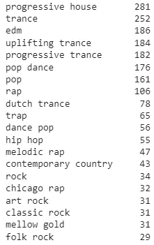

# 使用 Python 实现 Spotify 数据分析和可视化

> 原文：<https://blog.devgenius.io/spotify-data-analysis-with-python-a727542beaa7?source=collection_archive---------0----------------------->

# 介绍

事实证明，Spotify 有一个出色的 API，可以将你连接到其无处不在的歌曲数据库及其功能。例如，您可以从喜爱的歌曲中获得视觉体验，或者将回放功能集成到您的 web 应用程序中。还有一个强大的歌曲搜索引擎和一个推荐系统，可以帮助你听更多你喜欢的东西。

# 先决条件

让我们从零成本、不费吹灰之力地在 Spotify 官方[网站](https://www.spotify.com/uk/signup)注册开始。

接下来，打开你的[应用仪表板](https://developer.spotify.com/dashboard/applications)，点击“创建应用”按钮。输入必要的细节，准备探索。

获取您的客户端 ID 和客户端密码，并启动您最喜欢的 Python IDE。是时候编码了。

我们将围绕 Spotify API 使用一个名为 SpotiPy 的包装实用程序来发出一行长的请求，而不是显式地到达端点。让我们安装它。

然后我们初始化 spotipy。Spotify 对象，包含 Spotify 开发人员的凭据，存储在变量 CLIENT_ID 和 CLIENT_SECRET 中。

# 获取曲目和艺术家

下一步是数据查询。请注意，我们一次只能获取大约 50 个或更少轨道的信息。sp.search()方法中的 *q* 参数是您可以搜索特定项目的地方。这里的参考是[这里是](https://developer.spotify.com/documentation/web-api/reference/#/operations/search)。

将查询的数据放入 Pandas 数据框架。

前一个单元格的输出示例

让我们添加表演 1000 首曲目的艺术家的信息。

现在将其添加到 track_df 数据框中。

单个数据框中的曲目和艺术家

# 提取轨迹的数字特征

我们现在要对我们的歌曲进行数字研究，但首先，我们需要获取一些数据。幸运的是，Spotify 为我们提供了关于 8200 万首歌曲的透彻见解，这正好符合我们的目的。

首先，在 Spotify API [参考页面](https://developer.spotify.com/documentation/web-api/reference/#/operations/get-audio-features)发现哪些功能有助于音轨的简介。

其次，提取轨迹的要素并将其添加到数据框中。

轨道的要素数据框如下所示:

我们将在以下单元格中删除一些冗余列

让我们删除一些无用的列，并检查数据框的结构:

数据探索和可视化之前的最后一步是列类型的推断。这是手动完成的:

生成的数据帧具有以下结构:

无聊的东西在后面。让我们更好地了解我们的数据。

# 探索 2021 年的趋势

寻找 2021 年最受欢迎的曲目？给你:

谁被关注的最多？

让我们看看 track_df 数据帧中有多少个流派:

想象上面的结果:

查找前 20 名艺术家，按前 10 个流派的粉丝数量排序:

查找前 10 个流派中按流行程度排序的前 20 首歌曲:

# 可视化轨道的特征

这是轨迹特征的相关矩阵:

您还可以为特定的一对变量绘制二元 KDE:

最受欢迎的曲目与数据集中的所有曲目有何不同？给定所选特征的平均值，让我们通过绘制相应集合的特征肖像来找出答案。

看起来最受欢迎的歌曲更适合跳舞，也更有特点。他们也没有工具性和活力。

# 获取推荐

我们分析的最后一步是获得给定艺术家 id、流派和曲目 id 的曲目推荐。输出是随机的，所以 Spotify 永远不会缺少内容建议。

# 结论

本文简要概述了 Spotify Web API 的方法，并展示了如何分析和绘制提取的数据。

*本文代码笔记本* [*此处*](https://github.com/Vice10/ds_notebooks/blob/main/spotify_analysis.ipynb) *。*