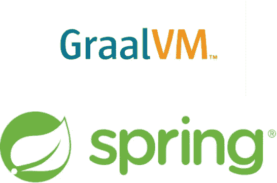
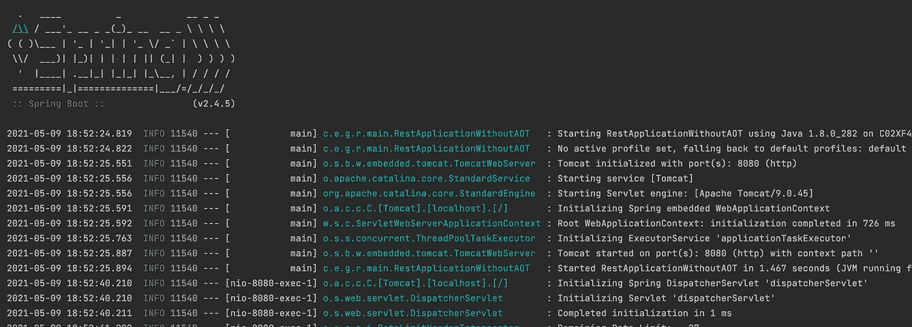
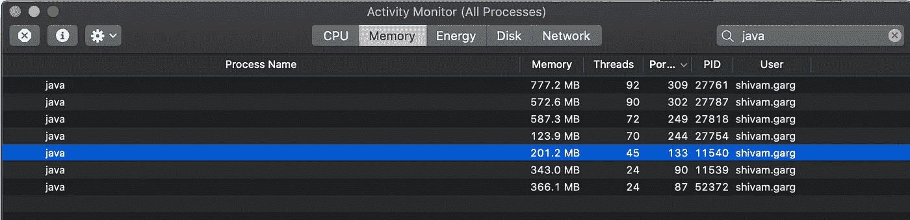
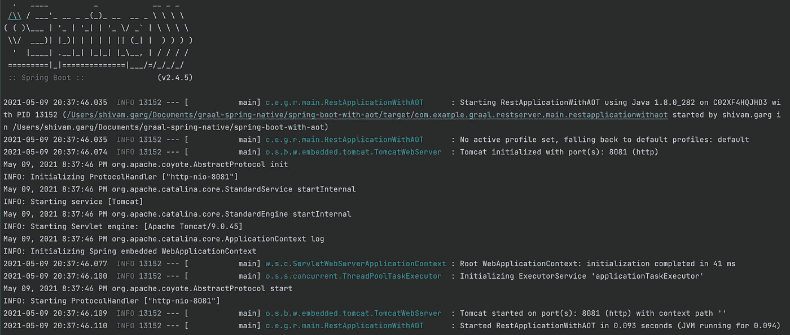
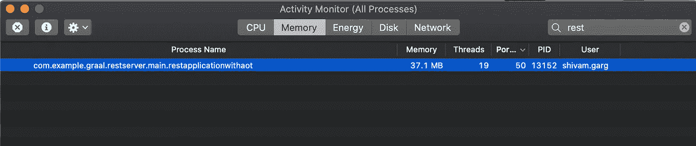
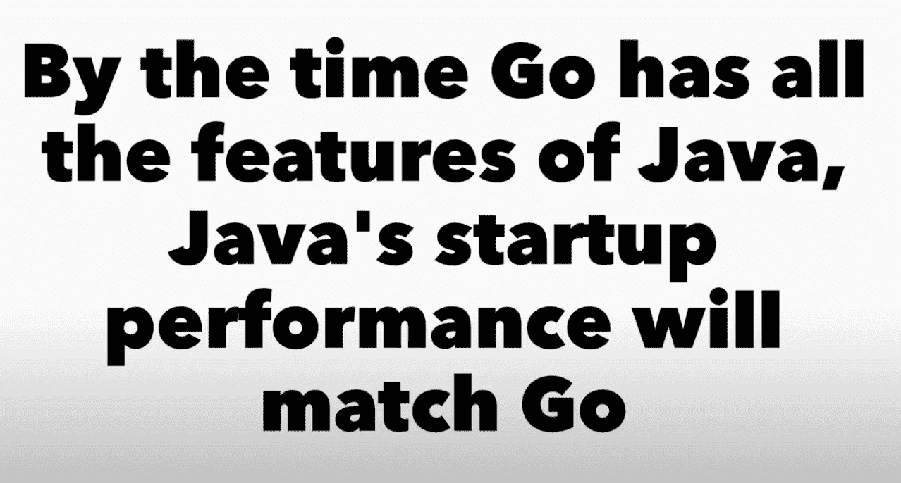

# 具有 GraalVM 本机映像的 Spring Boot 应用程序

> 原文：<https://blog.devgenius.io/spring-boot-application-with-graalvm-native-image-8074034ba35f?source=collection_archive---------0----------------------->



作为一名 JAVA 开发人员，进程有时会遭受较长的启动时间和相对较高的内存使用率😞。我们将寻找一个令人兴奋的解决方案。

在本文中，我们将检查一个简单的 **Spring Boot** 应用程序，然后使用 GraalVM 将它转换成一个**本机映像。**

如果您不知道 GraalVM，不要担心。我们一会儿会讨论这个问题。现在，只要记住它是一个 JVM，在运行时**提供 ***提前*** 编译，结合编译 ***即时*** 。**

让我们首先讨论一下我们今天要编写的 Spring Boot 应用程序。(这里我们将使用 Maven，但是您也可以使用 Gradle)。

应用程序将公开两个 REST 端点，这两个端点都将接受 HTTP GET 请求。

*   第一个端点应该提供对应于 Github 用户 **( /users/{githubUserName})的信息。**
*   第二个端点应该提供一个 Github 存储库的贡献者
    **(**[**/contributors/{ githubOrgName }/{ githubRepoName }**](http://localhost:8081/contributors/%7BgithubOrgName%7D/%7BgithubRepoName%7D)**)对应的信息。**

`GithubController`可以定义如下—

我们在控制器中有自动连线的类，并使用它来获取用户或贡献者的详细信息。

这里，我们使用`RestTemplate`来调用 Github APIs。

现在，让我们看看`User` DTO 类，它将被用作 REST 响应。

这对于完成任务来说肯定是足够了，但是让我们给我们的应用程序增加一些趣味。

Github API **强加了一个速率限制**，因此你不能在一个小时内从一个给定的 IP 发出超过`60`个请求。我们可以使用 Github 身份验证令牌来提高这个速率限制。

让我们将`GithubProperties`定义为 Spring Boot `ConfigurationProperties`。

所以，现在我们可以在`application.properties` / `application.yaml`中添加一个名为`github.token`的属性。由于使用了`@ Validated`和
`@ Pattern`注释，在应用程序启动时，将确保属性遵循所述的正则表达式。

现在，在尝试调用 Github API 时，如何使用这个令牌呢？好吧，让我们实现一个 Spring `RestTemplate`拦截器。

这里，`GithubAppTokenInterceptor`的`intercept`函数添加了一个`Authorization`请求头，其中包含所提供令牌的编码值。

`RateLimitHeaderInterceptor`的`intercept`功能提取
`X-RateLimit-Remaining`响应报头并提供`log`语句以提供关于剩余速率限制的信息。

为了使用这两个拦截器，我们只需要在初始化`restTemplate`对象时提供它们

代码的最后一部分是应用程序的入口点。

到目前为止我们讨论过的代码可以在这里找到—

[](https://github.com/shivamgarg7276/graal-spring-native/tree/main/spring-boot-without-aot) [## shivamgarg 7276/graal-spring-native

### 您可以简单地使用这个命令来构建模块——mvn clean install。一旦构建成功，运行——mvn…

github.com](https://github.com/shivamgarg7276/graal-spring-native/tree/main/spring-boot-without-aot) 

现在，使用`mvn clean install`进行构建。然后运行`mvn spring-boot:run`命令，应用程序将在端口`8080`启动。



点击[http://localhost:8080/users/shivamgarg 7276](http://localhost:8080/users/shivamgarg7276)给出—

```
{
    "login": "shivamgarg7276",
    "name": "Shivam Garg",
    "company": "Nutanix",
    "avatarUrl": "https://avatars.githubusercontent.com/u/49524850?v=4",
    "blogUrl": "https://www.linkedin.com/in/shivam-garg-067b46141/",
    "numPublicRepos": 1,
    "htmlUrl": "https://github.com/shivamgarg7276"
}
```

因此，在我的机器上启动大约需要`**1.5 sec**`时间，内存消耗大约需要`**200 MB**`时间。这就完成了任务，但是我们将看到如何使用 GraalVM 来大规模改进它。

# 什么是 GraalVM，为什么它是 JAVA 应用程序的未来？

**“GraalVM—字节码到位码”😀😀**

GraalVM 是一个高性能的多语言编译器，有助于实现-

1.  提高应用吞吐量并减少延迟
2.  将应用程序编译成小型独立的本机二进制文件
3.  无缝使用多种语言和库

它既可以用于 Java JIT，也可以用于 AOT 编译。

对于 AOT 编译，它使用**本机映像构建器**或`native-image`技术将*Java 代码提前编译*为独立的可执行文件。它处理应用程序的所有类及其依赖项，包括来自 JDK 的类。它静态地分析这些数据，以确定在应用程序执行期间哪些类和方法是可访问的。

您可以使用我在这里强调的步骤在您的系统上安装 GraalVM

[](https://github.com/shivamgarg7276/graal-spring-native/blob/main/README.md) [## shivamgarg 7276/graal-spring-native

### 示例项目展示了一个没有 AOT 的 Spring Boot 应用程序，然后使用 GraalVM 将它转换为本机映像…

github.com](https://github.com/shivamgarg7276/graal-spring-native/blob/main/README.md) 

# 春季原生测试版

不久前，Spring 团队宣布了一个名为*Spring Native Beta**的项目，该项目支持使用 GraalVM 将 Spring 应用程序编译成本地映像。*

***内存消耗承诺低很多，启动几乎是瞬间的。***

*现在，让我们换个方式，在我们最初的 Spring Boot 应用程序中做一些改变，将它转换成一个*本地可执行的 Spring 应用程序*。😉*

*一旦在您的机器上安装了 GraalVM，您需要在原始应用程序中进行这些更改——*

*   *添加`org.springframework.experimental:spring-native-image` maven 依赖项。*

```
*<dependency>
  <groupId>org.springframework.experimental</groupId>
  <artifactId>spring-native</artifactId>
  <version>0.9.2</version>
</dependency>*
```

*   *添加 Spring AOT 插件*

```
*<plugin>
  <groupId>org.springframework.experimental</groupId>
  <artifactId>spring-aot-maven-plugin</artifactId>
  <version>0.9.2</version>
  <executions>
    <execution>
      <id>test-generate</id>
      <goals>
        <goal>test-generate</goal>
      </goals>
    </execution>
    <execution>
      <id>generate</id>
      <goals>
        <goal>generate</goal>
      </goals>
    </execution>
  </executions>
</plugin>*
```

*   *添加在`package`阶段触发插件的 GraalVM `native-image`概要文件*

```
*<profiles>
  <profile>
    <id>native-image</id>
    <build>
      <plugins>
        <plugin>
          <groupId>org.graalvm.nativeimage</groupId>
          <artifactId>native-image-maven-plugin</artifactId>
          <version>21.0.0.2</version>
          <configuration>
            <!-- The native image build needs to know the entry point to your application -->
            <mainClass>com.example.graal.restserver.main.RestApplicationWithAOT</mainClass>
            <buildArgs>
              <buildArg>--enable-https</buildArg>
            </buildArgs>
          </configuration>
          <executions>
            <execution>
              <goals>
                <goal>native-image</goal>
              </goals>
              <phase>package</phase>
            </execution>
          </executions>
        </plugin>
      </plugins>
    </build>
  </profile>
</profiles>*
```

*这里提供了`mainClass`参数，它指向应用程序的入口点，即用`SpringBootApplication`标注的类。
同样，`buildArgs`有`--enable-https`，因为我们使用`RestTemplate`调用基于 HTTPS 的 Github URLs。*

*到目前为止，我们讨论的代码更改可以在这里找到—*

*[](https://github.com/shivamgarg7276/graal-spring-native/tree/main/spring-boot-with-aot) [## shivamgarg 7276/graal-spring-native

### 你可以简单地使用这个命令来构建这个模块——mvn——Pnative——image clean package

github.com](https://github.com/shivamgarg7276/graal-spring-native/tree/main/spring-boot-with-aot) 

您可以简单地使用这个命令-
`mvn -Pnative-image clean package`来构建这个模块

这将在模块的`target`文件夹下创建一个包含 Spring Boot 应用程序的本地可执行文件。

简单地调用-
-`target/com.example.graal.restserver.main.restapplicationwithaot`

这将在端口`8081`启动 Spring Boot 服务器。



如果你现在看到，我机器的启动时间是`**0.093 sec**`😳 😯

那真是超级快。

此外，内存消耗显示低于`**40 MB**` **。**👌

**您还可以使用 GraalVM + Spring Native 生成一个优化的容器映像，该映像可以轻松部署并包含一个最小的操作系统层。*** 

# ***结论***

*显然，您应该在您的机器上进行测试，以比较这些数字。但是，**这清楚地展示了 GraalVM 的真正力量，以及它将成为 Java 应用程序未来的原因。**😄*

*正如一些行业专家提到的—*

**

*原生图像有许多方面我还没有讨论，将在这篇文章接下来的部分讨论。我们将研究一些需要高级配置设置的极限情况，以及其他一些优化。*

*在[https://www.graalvm.org/](https://www.graalvm.org/)看看很酷的东西。*

*可以在评论里发表自己的看法，给出建议。*

*谢谢😊*

****编辑:查看本文第二部分—****

*[](/micronaut-application-comparison-with-spring-boot-and-support-for-graalvm-d0fb0d933d55) [## Spring 的问题，Micronaut 如何解决它，以及后者对 GraalVM 的支持

### 微型机器人在春天证明了它的勇气

blog.devgenius.io](/micronaut-application-comparison-with-spring-boot-and-support-for-graalvm-d0fb0d933d55)*