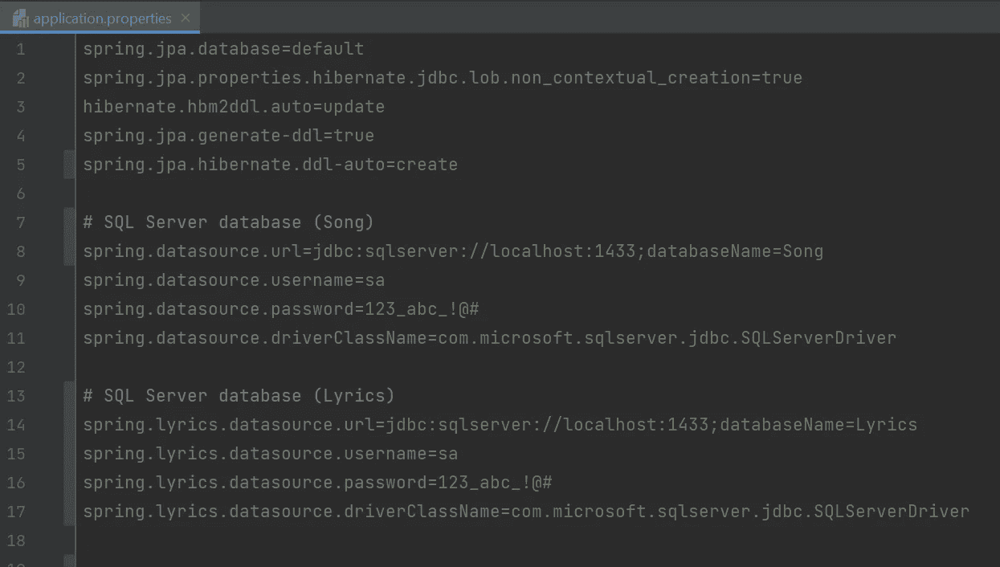
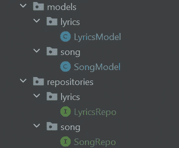
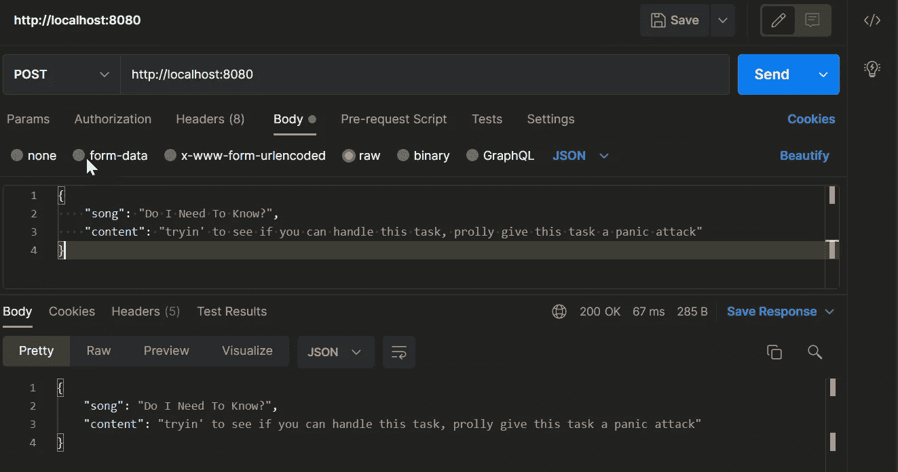
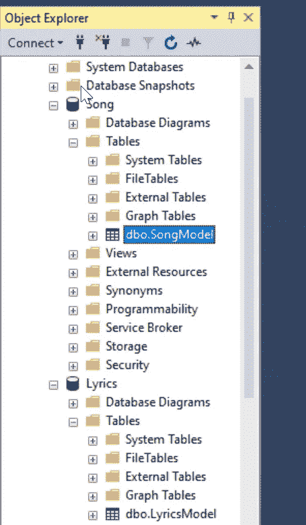
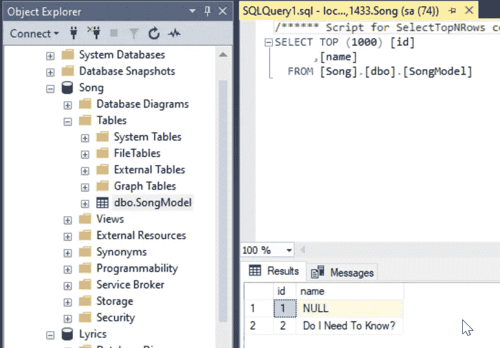
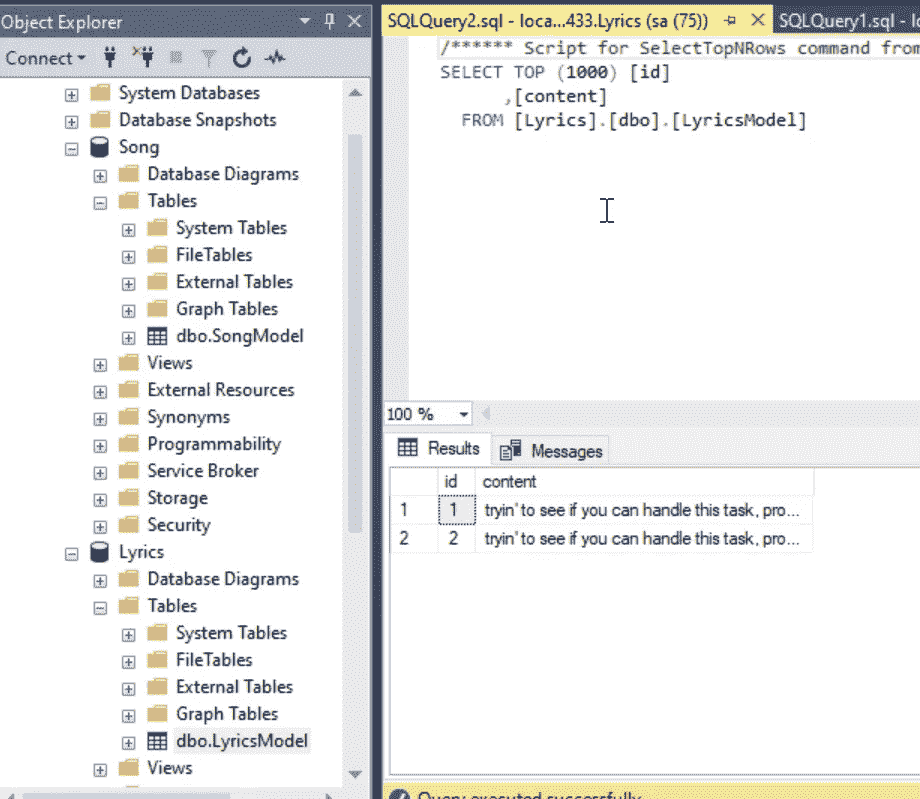

# 具有多个数据源的 Spring Boot 应用程序

> 原文：<https://blog.devgenius.io/spring-boot-application-with-multiple-data-sources-9ccfbd6a0085?source=collection_archive---------2----------------------->

要使 spring boot 应用程序能够与多个数据库通信，您需要定义一些配置，让 spring 在执行每个源代码时启动。

让我们首先同意，你的/ **模型**和/ **储存库**和/ **控制器**已经像你一直做的那样被定义了。

现在让我们浏览一下 **application.properties** 文件



如您所见，我已经为两个数据库设置了配置。第一个是给**歌**的，第二个是给**歌词**的。请注意，以 **(spring.datasource.*)** 为前缀的歌曲配置和以**(spring . Lyrics . data source . *)**为前缀的歌词配置，使歌曲以(spring.song.datasource)为前缀将会由于未提供(spring.datasource.*)而导致错误，因此至少有一个数据库应该像默认数据库一样工作。

您应该像这样组织您的模型和存储库目录；以便让配置代码知道将数据源应用到哪个模型和 repo。



现在我们已经组织好了目录，并在 application.properties 中提交了数据库配置，剩下的是数据源的 spring boot 配置代码。

首先，创建一个目录/ **config** ，并为每个数据源创建两个 java 文件。我的将是**SongDBConfig.java**和**LyricsDBConfig.java**

让我们从 SongDBConfig.java 开始

```
@Primary
@Bean(name="songProps")
@ConfigurationProperties("spring.datasource")
public DataSourceProperties dataSourceProperties() {
    return new DataSourceProperties();
}

@Primary
@Bean(name="datasource")
@ConfigurationProperties(prefix = "spring.datasource")
public DataSource datasource(@Qualifier("songProps") DataSourceProperties properties){
    return properties.initializeDataSourceBuilder().build();
}

@Primary
@Bean(name="entityManagerFactory")
public LocalContainerEntityManagerFactoryBean entityManagerFactoryBean
        (EntityManagerFactoryBuilder builder,
         @Qualifier("datasource") DataSource dataSource){
    return builder.dataSource(dataSource)
            .packages("com.example.multipledb.models.song")
            .persistenceUnit("Song").build();
}

@Primary
@Bean(name = "transactionManager")
@ConfigurationProperties("spring.jpa")
public PlatformTransactionManager transactionManager(
        @Qualifier("entityManagerFactory") EntityManagerFactory entityManagerFactory) {
    return new JpaTransactionManager(entityManagerFactory);
}
```

因为 Song db 是我们的**默认**数据源，所以必须包含“ **Primary** ”注释，该注释定义了这个 bean 将被注册多次，但是我希望这个版本是主版本。所以，在 LyricsDBConfig.java 的另一类豆子中**不会**有“初级”的注解。

对于“ConfigurationProperties”注释，我们使用它来让 spring boot 知道应该使用 application.properties 中的哪个配置。

让我们不要忘记用这些注释来注释我们的类

```
@Configuration
@EnableTransactionManagement
@EnableJpaRepositories(
        entityManagerFactoryRef = "entityManagerFactory",
        transactionManagerRef = "transactionManager",
        basePackages = { "com.example.multipledb.repositories.song" })
public class SongDBConfig {

    @Primary
    @Bean(name="songProps")
    @ConfigurationProperties("spring.datasource")
    public DataSourceProperties dataSourceProperties() {
        return new DataSourceProperties();
    }

    @Primary
    @Bean(name="datasource")
    @ConfigurationProperties(prefix = "spring.datasource")
    public DataSource datasource(@Qualifier("songProps") DataSourceProperties properties){
        return properties.initializeDataSourceBuilder().build();
    }

    @Primary
    @Bean(name="entityManagerFactory")
    public LocalContainerEntityManagerFactoryBean entityManagerFactoryBean
            (EntityManagerFactoryBuilder builder,
             @Qualifier("datasource") DataSource dataSource){
        return builder.dataSource(dataSource)
                .packages("com.example.multipledb.models.song")
                .persistenceUnit("Song").build();
    }

    @Primary
    @Bean(name = "transactionManager")
    @ConfigurationProperties("spring.jpa")
    public PlatformTransactionManager transactionManager(
            @Qualifier("entityManagerFactory") EntityManagerFactory entityManagerFactory) {
        return new JpaTransactionManager(entityManagerFactory);
    }
}
```

对于 LyricsDBConfig.java，它将与 SongDBConfig.java 相同，但我们将在 entityManagerFactory 和 transactionManager 前面加上“**歌词**”前缀，因为它们已经被 SongDBConfig.java 占用

```
@Configuration
@EnableTransactionManagement
@EnableJpaRepositories(
        entityManagerFactoryRef = "lyricsEntityManagerFactory",
        transactionManagerRef = "lyricsTransactionManager",
        basePackages = { "com.example.multipledb.repositories.lyrics" })
public class LyricsDBConfig {

    @Bean(name="lyricsProps")
    @ConfigurationProperties("spring.lyrics.datasource")
    public DataSourceProperties dataSourceProperties() {
        return new DataSourceProperties();
    }

    @Bean(name="lyricsDatasource")
    @ConfigurationProperties(prefix = "spring.lyrics.datasource")
    public DataSource datasource(@Qualifier("lyricsProps") DataSourceProperties properties){
        return properties.initializeDataSourceBuilder().build();
    }

    @Bean(name="lyricsEntityManagerFactory")
    public LocalContainerEntityManagerFactoryBean entityManagerFactoryBean
            (EntityManagerFactoryBuilder builder,
             @Qualifier("lyricsDatasource") DataSource dataSource){
        return builder.dataSource(dataSource)
                .packages("com.example.multipledb.models.lyrics")
                .persistenceUnit("Lyrics").build();
    }

    @Bean(name = "lyricsTransactionManager")
    @ConfigurationProperties("spring.jpa")
    public PlatformTransactionManager transactionManager(
            @Qualifier("lyricsEntityManagerFactory") EntityManagerFactory entityManagerFactory) {
        return new JpaTransactionManager(entityManagerFactory);
    }
}
```

现在，控制器将调用每个回购协议，并依次传达选定的数据库。

```
@RestController
public class Controller {
    @Autowired
    LyricsRepo lyricsRepo;
    @Autowired
    SongRepo songRepo;

    @PostMapping
    public ResponseEntity add(@RequestBody request body){
        SongModel songModel = new SongModel();
        LyricsModel lyricsModel = new LyricsModel();
        songModel.setName(body.getSong());
        lyricsModel.setContent(body.getContent());

//        will insert in Song DB
        songRepo.save(songModel);
//        will insert in Lyrics DB
        lyricsRepo.save(lyricsModel);

        return ResponseEntity.*ok*(body);
    }
}
```



源代码:[https://git lab . com/lamo boos 223/spring-boot-multiple-data source-song-project](https://gitlab.com/lamoboos223/spring-boot-multiple-datasource-song-project)