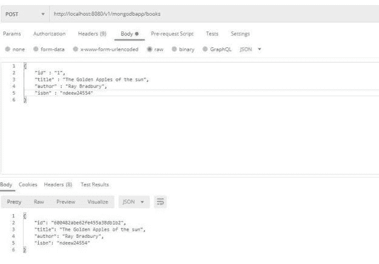
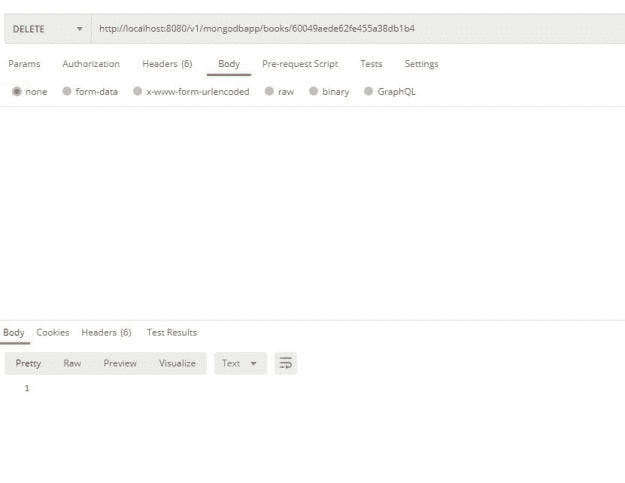
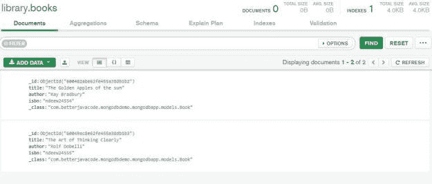

# 使用 MongoDB 的 Spring Boot CRUD 应用示例

> 原文：<https://blog.devgenius.io/spring-boot-crud-application-example-with-mongodb-7ae133da8ad0?source=collection_archive---------2----------------------->


# 介绍

在这篇文章中，我将展示如何使用 Spring Boot 通过 MongoDB 构建一个简单的 CRUD REST 应用程序示例。我知道你的第一个问题会是什么是 MongoDB？

# 什么是 MongoDB？

MongoDB 是一个 NoSQL 文档数据库。在这个数据库中，记录是行为很像 JSON 对象的文档。所以大多是键值对。

使用 MongoDB 作为数据库的主要优势是:

*   MongoDB 是一个无模式文档数据库。一个集合包含不同的文档。
*   单个对象的结构是清楚的。
*   没有复杂的连接
*   深度查询能力。
*   易于横向扩展

以下是在企业应用程序中使用 MongoDB 或类似的 NoSQL 数据库的几个原因:

*   如果您需要更快的 JSON 风格的数据检索
*   很容易在属性上添加索引
*   出于[分片](https://blog.yugabyte.com/how-data-sharding-works-in-a-distributed-sql-database/#:~:text=Sharding%20is%20the%20process%20of,portion%20of%20the%20overall%20workload.)的目的，分片是跨多台机器存储数据记录的过程。当跨多台机器存储时，您通常会根据一些标准对这些数据进行分区。
*   快速就地更新
*   更容易查询

# 先决条件

要创建这个示例应用程序，您需要:

*   Spring Boot 版本 2.4.1
*   MongoDB
*   格拉德勒
*   Java 版本 8

# Spring Boot CRUD 应用程序

作为这篇文章的一部分，我将构建一个 REST CRUD 应用程序。这包括

*   一个图书馆——我们将在我们的 MongoDB 数据库中创建一个收藏库`library`。
*   我们将按作者存放书籍的图书馆
*   用户可以调用 REST API 按作者检索图书
*   用户可以调用 REST API 来检索图书馆中的所有书籍
*   POST — /v1/mongodbapp/books —将图书添加到库中
*   GET — /v1/mongodbapp/books —从库中检索所有的书籍
*   GET — /v1/mongodbapp/books/id —检索特定的图书
*   DELETE—/v1/mongodbapp/books/id—从库中删除一本书

# 如何在 MongoDB 中使用 Spring Boot CRUD

为了开始创建这个应用程序，我们将使用 gradle 来处理我们的依赖项并构建这个应用程序。在我们的 Spring Boot 应用程序中添加以下依赖项:

```
implementation 'org.springframework.boot:spring-boot-starter-data-mongodb' 
implementation 'org.springframework.boot:spring-boot-starter-web'
```

一旦我们有了这些依赖项，我们将能够连接到 mongo db 数据库。但是我们仍然需要添加数据库的位置。我们将在`application.properties`文件中添加所需的属性，如下所示:

```
spring.data.mongodb.host = localhost 
spring.data.mongodb.port=27017 
spring.data.mongodb.database=library
```

这将允许我们在端口`27017`上连接到运行在主机`localhost`上的 MongoDB 数据库，数据库模式是`library`。

# 定义数据模型

作为图书馆的一部分，我们需要书籍。所以我们的主要数据对象是书。这个数据模型将包括书名、作者和 ISBN。这将如下:

```
package com.betterjavacode.mongodbdemo.mongodbapp.models; import org.springframework.data.annotation.Id; 
import org.springframework.data.mongodb.core.mapping.Document; @Document(collection = "books") 
public class Book { 
@Id 
private String id; 
private String title; 
private String author; 
private String isbn; 
public Book() { } 
public Book(String title, String author, String isbn) 
{ 
    this.title = title; 
    this.author = author;  
    this.isbn = isbn; 
} public String getId () 
{ 
  return id; 
} public void setId (String id) 
{ 
   this.id = id; 
} public String getTitle () 
{ 
  return title; 
} public void setTitle (String title) 
{ 
   this.title = title; 
} public String getAuthor () 
{ 
   return author; 
} public void setAuthor (String author) 
{ 
  this.author = author; 
} public String getIsbn () 
{ 
  return isbn; 
} public void setIsbn (String isbn) 
{ 
  this.isbn = isbn; 
} 
}
```

由于我们使用的是 MongoDB，`@Document`注释覆盖了集合`books`。

# 添加存储库接口

我们需要一个存储库接口来获取、保存或删除我们的 book 对象。在`repositories`包中，我们将增加`BookRepository`接口

```
package com.betterjavacode.mongodbdemo.mongodbapp.repositories; import com.betterjavacode.mongodbdemo.mongodbapp.models.Book; 
import org.springframework.data.mongodb.repository.MongoRepository; import java.util.List; public interface BookRepository extends MongoRepository<Book, String> 
{ 
   List findByTitleContaining(String title); 
   List findByAuthor(String name); 
}
```

这个存储库有两种方法来按书名或作者名获取图书列表。

# 添加 Spring REST API 控制器

现在，为了让我们的应用程序 REST CRUD，我们将添加一个 REST 控制器。该控制器将包含`POST`、`PUT`、`GET`和`DELETE`API。

```
package com.betterjavacode.mongodbdemo.mongodbapp.controller; import com.betterjavacode.mongodbdemo.mongodbapp.models.Book; 
import com.betterjavacode.mongodbdemo.mongodbapp.repositories.BookRepository; 
import org.springframework.beans.factory.annotation.Autowired; import org.springframework.http.HttpStatus; 
import org.springframework.http.ResponseEntity; 
import org.springframework.web.bind.annotation.*; 
import java.util.ArrayList; import java.util.List; 
import java.util.Optional; @CrossOrigin("http://localhost:8080") 
@RestController 
@RequestMapping("/v1/mongodbapp") 
public class BookController 
{ 
   @Autowired 
   BookRepository bookRepository;    @GetMapping("/books") 
   public ResponseEntity<List> getAllBooks(@RequestParam(required = false) String bookTitle) 
   { 
      try 
      { 
         List listOfBooks = new ArrayList<>(); 
         if(bookTitle == null || bookTitle.isEmpty()) 
         { 
           bookRepository.findAll().forEach(listOfBooks::add); 
         } 
         else 
         {

bookRepository.findByTitleContaining(bookTitle).forEach(listOfBooks::add);   } 
         if(listOfBooks.isEmpty()) 
         { 
           return new ResponseEntity<>(HttpStatus.NO_CONTENT); 
         } 
         return new ResponseEntity<>(listOfBooks, HttpStatus.OK); 
       } 
       catch (Exception e) 
       { 
          return new ResponseEntity<>(null, HttpStatus.INTERNAL_SERVER_ERROR); 
       } 
   } 

   @GetMapping("/books/{id}") 
   public ResponseEntity getBookById(@PathVariable("id") String id) 
   { 
      try
      { 
         Optional bookOptional = bookRepository.findById(id); 
         return new ResponseEntity<>(bookOptional.get(), HttpStatus.OK); 
      } 
      catch (Exception e) 
      { 
        return new ResponseEntity<>(null, HttpStatus.INTERNAL_SERVER_ERROR); 
      } 
    } 

    @PostMapping("/books") 
     public ResponseEntity addABookToLibrary(@RequestBody Book book)
     { 
        try 
        { 
          Book createdBook = bookRepository.save(new Book(book.getTitle(), book.getAuthor(), book.getIsbn())); 
          return new ResponseEntity<>(createdBook, HttpStatus.CREATED); 
        } 
        catch (Exception e) 
        { 
          return new ResponseEntity<>(null, HttpStatus.INTERNAL_SERVER_ERROR); 
        } 
     }      @PutMapping("/books/{id}") 
     public ResponseEntity updateABook(@PathVariable("id") String id, @RequestBody Book book) 
     { 
       Optional bookOptional = bookRepository.findById(id); 
       if(bookOptional.isPresent()) 
       { 
          Book updatedBook = bookOptional.get(); 
          updatedBook.setTitle(book.getTitle()); 
          updatedBook.setAuthor(book.getAuthor()); 
          updatedBook.setIsbn(book.getIsbn()); 
          return new ResponseEntity<>(bookRepository.save(updatedBook), HttpStatus.OK); 
       } 
       else 
       { 
          return new ResponseEntity<>(HttpStatus.NOT_FOUND); 
       } 
     }      @DeleteMapping("/books/{id}") 
     public ResponseEntity deleteABook(@PathVariable("id") String id)  
     { 
        try 
        { 
          bookRepository.deleteById(id); 
          return new ResponseEntity<>(HttpStatus.NO_CONTENT); 
        } 
        catch (Exception e) 
        { 
          return new ResponseEntity<>(HttpStatus.INTERNAL_SERVER_ERROR); 
        } 
      } 
}
```

“BookController”是我们的 REST 控制器类。它包括

*   `@RestController` -将此标记为休息控制器。
*   `@CrossOrigin` -该注释允许跨来源资源共享(CORS)。这将在 REST 响应中添加 CORS 访问控制报头。这些头是必要的，因为它允许服务器不仅指定谁可以访问资源，还可以指定如何访问资源。
*   我们添加了不同的方法— `addABookToLibrary`将图书添加到数据库中，`getAllBooks`从数据库中检索图书。

# 完整的演示

现在我们已经添加了 REST 控制器、存储库方法，我们将构建并运行这个应用程序。作为演示的一部分，我将使用 POSTMAN 来访问 API。

您可以从命令行或正在使用的代码编辑器中构建应用程序。我更喜欢命令行，所以我已经构建了应用程序。构建完成后，您可以按如下方式运行程序:

`java -jar mongodbapp-0.0.1-SNAPSHOT.jar`。

让我们用邮递员给我们的图书馆添加书籍。



如上所示，我们添加了一本书，响应显示数据库中添加了一本书。

下面的 API 是一个 GET API，用于从数据库中获取所有的书籍。


现在，为了显示从库中删除图书，我们将使用 DELETE API。



这个示例应用程序的代码可以在我的 [github 资源库](https://github.com/yogsma/mongodbapp)中找到。

如果想在 MongoDB 数据库中看到这些数据，可以访问 MongoDB compass 工具，访问图书馆数据库中的馆藏书籍。



# 结论

在这篇文章中，我展示了如何在使用 MongoDB 数据库的同时使用 Spring Boot 创建 REST API。我们使用的方法与我们使用常规 SQL 数据库的方法非常相似。使用 NoSQL 数据库时，我们必须添加一些更改。如果你觉得这篇文章有用，或者有任何我可以帮助你的问题，你可以在这里订阅我的博客[。](https://betterjavacode.com/subscribe)

*原载于 2021 年 1 月 17 日*[*【https://betterjavacode.com】*](https://betterjavacode.com/spring-boot/spring-boot-crud-application-example-with-mongodb)*。*