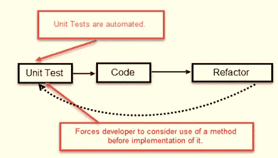

# 使用 JUnit 和 Mockito 进行控制器、服务和存储库层单元测试

> 原文：<https://blog.devgenius.io/spring-boot-deep-dive-on-unit-testing-92bbdf549594?source=collection_archive---------0----------------------->

## 软件测试的主要目标是给软件以信心。—匿名。


[自由股](https://unsplash.com/@freestocks?utm_source=medium&utm_medium=referral)在 [Unsplash](https://unsplash.com?utm_source=medium&utm_medium=referral) 上的照片

**单元测试**是一种软件测试，其中测试软件的单个单元或组件。目的是验证软件代码的每个单元都如预期的那样执行。

单元测试由开发人员在应用程序的开发(编码阶段)过程中完成。

今天，我将涵盖以下主题

1.  软件测试的重要性，测试驱动开发(TDD)基础，以及测试用例的各个方面
2.  测试用例相关术语的细节:单元测试、集成测试、模仿、刺探、存根
3.  在 spring boot apps 控制器、服务和存储库层单元测试中
4.  编写可测试代码的技巧
5.  共享代码库和相关文件

## **先决条件**

在开始本教程之前，您必须了解关于 spring boot 和 JPA 的详细信息。要了解这一点，你可以阅读我下面的文章。

[](https://mesukcse08.medium.com/spring-data-jpa-a-to-z-6c957ed17a66) [## 深入探讨 Spring Boot 和 JPA 实施:从头到尾

### Spring Data JPA 是更大的 Spring Data 家族的一部分，它使得实现基于 JPA 的存储库变得很容易。

mesukcse08.medium.com](https://mesukcse08.medium.com/spring-data-jpa-a-to-z-6c957ed17a66) 

## **软件测试的重要性，测试驱动开发(TDD)基础，以及测试用例的各个方面**

测试用例是一组特定的指令，测试人员应该遵循这些指令来实现特定的输出。牢记客户提供的需求，记录测试用例。测试用例的主要目的是确保应用程序中的不同特性是否如预期的那样工作。它帮助测试人员验证软件是否没有缺陷，是否按照最终用户的期望工作。测试用例的其他好处包括:

*   测试用例确保良好的测试覆盖率
*   帮助提高软件质量
*   降低维护和软件支持成本
*   帮助验证软件是否满足最终用户的要求
*   单元测试是产品的一种活文档。为了了解一个模块或另一个模块提供了什么功能，开发人员可以参考单元测试来获得模块和系统整体逻辑的基本情况
*   允许测试人员彻底思考并从尽可能多的角度进行测试
*   测试用例在未来是可重用的——任何人都可以引用它们并执行测试。
*   最佳实践建议开发人员首先在本地运行所有单元测试或一组测试，以确保任何编码更改不会中断现有代码。
*   然而，考虑到人的因素:开发人员可能会在做出更改后忘记运行单元测试，并将潜在的无效代码提交到公共分支。为了避免这种情况，许多公司采用了持续开发的方法。持续集成工具用于此，允许开发人员自动运行单元测试。因此，代码中任何不想要的变化都会被一台冷的逻辑机器检测到。

## **测试驱动开发(TDD)**

**测试驱动开发(TDD)** 是一种软件开发方法，在这种方法中，开发测试用例来指定和验证代码将做什么。简而言之，首先创建并测试每个功能的测试用例，如果测试失败，则编写新代码以通过测试，并使代码简单且无错误。



图片来自:【https://www.guru99.com/test-driven-development.html 

测试驱动开发从为应用程序的每个小功能设计和开发测试开始。TDD 指导开发人员只有在自动化测试失败时才编写新代码。这避免了代码的重复。TDD 的完整形式是测试驱动开发。

TDD 的简单概念是在编写新代码之前(开发之前)编写并纠正失败的测试。这有助于避免代码的重复，因为我们一次只写少量的代码来通过测试。(测试只不过是我们需要测试来实现的需求条件)。

## 测试用例包含哪些方面？

测试用例主要包含以下部分

*   目标这里测试人员提到了他计划用那个特定的测试用例实现什么。测试人员必须拥有该代码单元的端到端业务逻辑。
*   **先决条件** 此处应列出适用于测试的任何假设以及执行测试前必须满足的任何先决条件。任何依赖项、任何预初始化都必须留在这里。
*   **测试用例步骤** 这里测试人员提到了实现目标需要遵循的步骤。测试步骤应该包括关于如何执行测试的必要数据和信息。这些步骤应该清晰简洁，不遗漏重要的事实。
*   **测试数据
    选定的数据集必须涵盖所有可能的正面和负面情景/案例。增加测试用例的数量，以确保更高的软件稳定性。**
*   **预期和实际结果** 测试人员必须清楚地了解业务逻辑和数据行为。预期的结果告诉测试人员，作为测试步骤的结果，他们应该经历什么。它们还指定了测试用例执行时应用程序的实际行为。
*   **通过/失败** 如果测试人员未能按照步骤实现“预期输出”,那么他将针对该特定测试用例提及“失败”。类似地，如果测试人员能够达到“预期的输出”，那么他会提到“通过”测试用例。

## 2.测试用例相关术语详情:单元测试、集成测试、模仿、刺探、存根

*   **单元测试**

1.  单元测试是一种软件测试，其中测试软件的单个单元或组件。
2.  目的是验证软件代码的每个单元都如预期的那样执行。
3.  单元测试由开发人员在应用程序的开发(编码阶段)过程中完成。
4.  单元测试隔离一段代码并验证其正确性。
5.  单元可以是单独的函数、方法、过程、模块或对象。

*   **集成测试**

1.  **集成测试**被定义为一种测试类型，其中软件模块被逻辑集成并作为一组进行测试
2.  这一级别的测试的目的是在集成这些软件模块时，暴露它们之间交互中的缺陷
3.  集成测试侧重于检查这些模块之间的数据通信。
4.  它处理软件需求规范/数据和软件设计文档中规定的高级和低级软件需求的验证。

*   **jUnit**

1.  JUnit 是一个开源的 JAVA 单元测试框架。对于 Java 开发人员来说，编写和运行可重复的测试是很有用的。
2.  顾名思义，它用于一小块代码的单元测试。
3.  在 java 中，TestNG 也是 jUnit 的一个很好的替代品

*   **嘲讽**

1.  模仿是从单元测试中移除外部依赖的行为，目的是围绕它创建一个受控的环境。
2.  当被测试的单元具有外部依赖性时，模仿是单元测试中使用的过程。
3.  模仿的目的是隔离并关注被测试的代码，而不是外部依赖的行为或状态。
4.  在模拟中，依赖关系被模拟真实对象行为的严密控制的替换对象所替代。

通常，我们模拟所有其他与我们想要测试的类交互的类。嘲讽的常见目标是:

*   数据库连接，
*   网络服务，
*   速度慢的课程，
*   有副作用的类，以及
*   具有不确定行为的类。
*   具有遗留代码且不可测试的类/方法
*   模仿和存根是替代这些外部依赖的假 Java 类。然后，在测试开始之前，这些假类会按照您预期的方式运行。

1.  存根是一个伪类，带有预编程的返回值。
2.  **Stubbing** 意味着用产生硬编码响应的版本替换一个方法、函数或整个对象。
3.  这通常用于将组件彼此隔离，并将您的代码与外界隔离。
4.  它被注入到被测试的类中，让您可以绝对控制作为输入被测试的内容。
5.  典型的存根是一个数据库连接，它允许您在没有真实数据库的情况下模拟任何场景。
6.  例如，存根经常用于将测试从存储系统中分离出来，并将 HTTP 请求的结果硬编码到依赖于来自互联网的数据的测试代码中。

*   **刺探**

1.  可用于将 Mockito 间谍应用于 Spring ApplicationContext 的注释。
2.  一个间谍*将*包装在被测试类的一个*现有的*对象上。
3.  它包含了模仿和存根两种优点
4.  意思是:当你创建一个 spy 时，你可以决定是否应该“拦截”发送给 spy 的方法调用(这样你就可以像使用一个 mock 一样使用 spy)；或者被“传递”到间谍包裹的实际物体。

## **3。控制器、服务和存储库层每个术语的实际实现**

在典型的项目中，遵循 MVC 模式，其中有一些控制器、一些服务和一些用于数据访问的存储库。在这一节，我们将写所有的层。


图片来自[www.mitrais.com](http://www.mitrais.com)

**设置环境** 我们将致力于基于 Gradle 的项目。我们只需要三个依赖项来覆盖测试

我们用**spring-boot-starter-test**测试框架， **mockito** 和 **Jupiter。**我们还对 jpa 使用了**spring-boot-starter-data-JPA**，对内存数据库使用了 **h2database** 。项目结构如下所示


在这个文件夹结构中，我们将所有控制器保存在控制器包中，将服务保存在服务包中，将存储库保存在存储库包中。

## **1。测试存储库层**

这里的库是基于 spring **@Repository** 注解**的。使用 repository，我们在数据库上执行一些简单的 CRUD 操作。下面给出我们的域类。**

在这个实体类中，我们主要有 firstName、lastName 和 mobileNumber 字段。为了从这个表中访问数据，我们的存储库类如下所示

从这个存储库类中，我们可以对实体**客户**执行 CRUD 操作

我们的测试代码如下。

从我们的测试用例类中，我们要知道一些关键词。

1.  **@ extend with(mockito extension . class)**:启用 mockito 扩展。
2.  **@DataJpaTest:** 将准备春季数据 JPA 的标注。它将支持基于实体的保存、获取和其他环境。
3.  **@BeforeEach** :在执行开始之前，我们可以初始化一些任务。在这里，我们保存一个默认客户。
4.  **@AfterEach** :执行完所有案例后，我们在这里做一些任务。在这里，我们将删除所有已更改的数据。

**保存表上的数据
保存实体列表**代码如下图

```
<S **extends** Customer> Iterable<S> saveAll(Iterable<S> entities);
```

看看测试用例

```
**void** saveAll_success() {
    List<Customer> customers = Arrays.*asList*(
            **new** Customer(**"sajedul"**, **"karim"**, **"01737186095"**),
            **new** Customer(**"nafis"**, **"khan"**, **"01737186096"**),
            **new** Customer(**"aayan"**, **"karim"**, **"01737186097"**)
    );
    Iterable<Customer> allCustomer = **customerRepository**.saveAll(customers);

    AtomicInteger validIdFound = **new** AtomicInteger();
    allCustomer.forEach(customer -> {
        **if**(customer.getId()>0){
            validIdFound.getAndIncrement();
        }
    });

    *assertThat*(validIdFound.intValue()).isEqualTo(3);
}
```

这里，我们正在使用客户存储库构建 3 个客户对象和节约。保存数据后，我们将检查保存数据的大小。这里，有效性是指保存新数据后每个实体 id 必须大于 0。这里正在发生真正的数据库事务。

**获取并匹配数据** 储存库获取方法如下

```
@Override
List<Customer> findAll();
```

我们的测试代码如下

```
@Test
**void** findAll_success() {
    List<Customer> allCustomer = **customerRepository**.findAll();
    *assertThat*(allCustomer.size()).isGreaterThanOrEqualTo(1);
}
```

在这里，我们获取数据并检查大小 1。我们的最大客户数据量大约是 1 到 4。因为对于默认情况，测试用例的执行不保持任何顺序。在@ **BeforeEach** 命令中，我们只插入一个客户。所以我们正在检查 **isGreaterThanOrEqualTo(1)。**

## **2。测试服务层**

这里的服务是基于 spring **@Service** 注解**的。使用服务，我们检查一些业务逻辑，将数据保存到数据库或从数据库中提取数据，然后返回给我们的控制器。**

***注意:我们正在测试服务层。所以我们不需要数据库层的实际操作。所以我们会让数据库层模拟。***

我们的服务层代码如下

在这里，我们有一些方法，如保存或更新，获取数据。我们将使用单元测试来测试所有这些方法。

我们的单元测试代码如下

在这段代码中，我们通过 annotation @**Mock****customer repository**来模拟数据库层。这里，mocking 表示这是一个虚拟层，在数据库保存或获取期间不会发生任何实际操作。为了模仿数据库层，我们使用了一些**存根**

**保存或更新** 我们的保存或更新测试代码如下

```
@Test
**public void** savedCustomer_Success() {
    Customer customer = **new** Customer();
    customer.setFirstName(**"sajedul"**);
    customer.setLastName(**"karim"**);
    customer.setMobileNumber(**"01737186095"**);

    *// providing knowledge
    when*(**customerRepository**.save(*any*(Customer.**class**))).thenReturn(customer);

    Customer savedCustomer = **customerRepository**.save(customer);
    *assertThat*(savedCustomer.getFirstName()).isNotNull();
}
```

这里，我们正在构建一个客户对象。这里，存储库保存对象在成功保存到数据库后返回一个对象。因此，我们告诉 mockito，如果我们试图保存任何客户对象，那么您将返回我们提供的客户对象。最后，我们检查这个返回的对象。通过存根，我们用预定义的操作来转换数据库操作。

**从数据库中获取数据** 我们获取数据的代码如下

```
@Test
**public void** customer_exists_in_db_success() {
    Customer customer = **new** Customer();
    customer.setFirstName(**"sajedul"**);
    customer.setLastName(**"karim"**);
    customer.setMobileNumber(**"01737186095"**);
    List<Customer> customerList = **new** ArrayList<>();
    customerList.add(customer);

    *// providing knowledge
    when*(**customerRepository**.findAll()).thenReturn(customerList);

    List<Customer> fetchedCustomers = **customerService**.fetchAllCustomer();
    *assertThat*(fetchedCustomers.size()).isGreaterThan(0);
}
```

这里，存储库 **findAll()** 方法返回一个客户列表。因此，我们正在构建一个客户列表，并停止使用 **findAll()** 方法，并在操作后检查数据大小。

## **3。测试控制器层**

在控制器层，我们模仿服务层，测试 API。控制器层代码如下所示

这里，我们有两个端点，一个用于保存，另一个用于从服务层获取数据。

我们的测试代码如下

在这里，我们模拟了 **CustomerService** ，并且为了测试 API，我们使用了 **MockMvc。**这里，我们也是在剔除服务层方法。

在测试期间，我们构建请求，并在执行后检查状态

## **4。编写可测试代码的技巧**

对于可测试的代码，我们必须遵循一些编码规则。这些在下面给出

*   严格遵循坚实的原则
*   正确使用依赖注入。使用构造函数注入或 setter 注入，而不是自动连接。对于难以测试的自动连线 beans。
*   分离对象创建和应用程序逻辑。否则，您必须在编写测试用例之前重写代码
*   移除全局状态。全局状态使得代码更难理解，因为这些类的用户可能不知道哪些变量需要实例化。
*   避免静态方法和变量。静态方法是程序代码，应该在面向对象的范例中避免，因为它们不提供单元测试所需的接缝。
*   严格遵循命名约定。编写单元测试时，重要的是能够确定对象的哪些属性和方法是公共的，哪些是对象本身的私有实现细节。这是因为单元测试应该只测试公共定义的 API，因为它们是唯一保证存在并产生稳定结果的 API。
*   干净的代码和良好的文档。测试不能代替清晰的、维护良好的代码库。事实上，为了编写准确的测试，代码保持足够干净是必要的，以便测试作者和未来的维护人员能够快速理解被测试的每个代码单元的目的，以及它如何适应整个应用程序。
*   代码必须很快。开发人员编写单元测试，这样他们可以重复运行它们，并检查是否引入了错误。如果单元测试很慢，开发人员很可能会跳过在他们自己的机器上运行它们。
*   不要混淆单元测试和集成测试。正如我们已经讨论过的，单元测试和集成测试有不同的目的。单元测试和被测系统都不应该访问网络资源、数据库、文件系统等。，消除外界因素的影响。

## **5。源代码详情**

所有的源代码都在 [**这个 GitHub**](https://github.com/mesuk/SpringReadyApp) 资源库中。
**控制器名称** : CustomerController
**服务名称**:CustomerServiceImpl
**存储库名称**:customer Repository
**测试类:**CustomerServiceLayerTest、CustomerControllerLayerTest

**Swagger 网址**:[**http://localhost:8181/springreadyapp/Swagger-ui . html #/main controller**](http://localhost:8181/springreadyapp/swagger-ui.html#/MainController)

提前感谢:)

[](https://levelup.gitconnected.com/overview-of-solid-principles-and-its-java-implementations-4ae37fa5bb1b) [## 固体原理及其 JAVA 实现概述

### 创建可理解的、可读的和可测试的代码，许多开发人员可以协作工作。

levelup.gitconnected.com](https://levelup.gitconnected.com/overview-of-solid-principles-and-its-java-implementations-4ae37fa5bb1b)