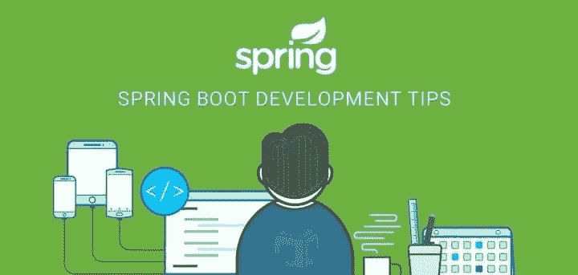

# Spring Boot 发展提示

> 原文：<https://blog.devgenius.io/spring-boot-development-tips-31aa2729615b?source=collection_archive---------3----------------------->

## 如何和 Spring Boot 一起成为职业程序员

大家好，

在我的一个朋友在 Twitter 上问我，如果他想学习 Spring 应该从什么开始之后，我决定写这篇文章来和大家分享我在这个框架中的一点微薄的经验，大家都受益。

你必须知道，像任何其他人一样，我在解释时可能会犯错误，但我会试着谈论我知道的事情和我现在脑海中的事情，之后，如果我想起了其他事情，我会将它们添加到文章中。如果你看到任何错误，任何批评都是欢迎的。预先感谢，让我们开始吧。

**1-首先，什么是 Spring Boot？**

在我回答这个问题之前，任何听说过春天的人都想知道春天和 Spring Boot 之间是否有区别？春天和 Spring Boot 是两回事，但同时又是相辅相成的，我们可以说 Spring Boot 与春天相辅相成。

那么 Spring Boot 和春天有什么不同呢？

春草草是一个框架。
Spring Boot 是一个大大加快我们 Spring 工作的工具……例如，我们可以指定我们将要设计的工件的名称，SpringBot 会为我们进行必要的设置，例如，它会自己为我们创建一个 Spring 框架，它会为我们加载和配置服务器(Spring 里面有一个服务器，可以是 tomcat 或 jetty，等等。)plus 将在 XML 文件中为我们进行必要的设置，然后我们必须依赖这个文件来添加我们将手动创建的其他 bean。换句话说，SpringBot 为我们创造了那些必要的设置，它们总是重复。

当你读到一个新的术语时，不要担心，我会尽可能地解释它们。重要的是我们现在理解了什么是 Spring Boot，现在我们将解释弹簧，它是什么？Spring 是 Java EE 的一个框架，它将帮助我们开发网站和 web 应用程序，无论是用它的接口编程一个网站还是仅仅一个 API，这个 API 将被一个用 angular、react 或 vue 或任何其他接口框架制作的应用程序使用。

**春天有什么区别？**

Spring 致力于控制反转的哲学。这种理念告诉我们，框架本身就是控制某个用户请求的生命周期的框架，在这种情况下，应用这种理念 Spring 依赖于依赖注入。

💡作为参考，如果您很好地理解了如何使用依赖注入，那么您将在 Spring 中学习到基础知识。

**什么是依赖注入？**

为了理解这个技术术语，我们必须理解由它组成的每个单词，不是语言意义，而是 Spring 框架中的改革派意义。

java 的依赖关系是某个 object1 依赖于另一个 object2，换句话说，不多也不少，这个 object2 是 object1 的属性，但不是每个属性，我们用依赖注入来处理它们，只是其中的一部分。
第二个词是注射...注射的后果如何？
和我一起想象一下，比如我们需要一个对象，通过它我们可以控制数据库，另一个对象控制缓存。现在，在使用这些对象之前，我们必须在类中向它们报告，除此之外，我们还必须为它们创建一个实例:
class object obj = new
class object()
想象一下，如果我们需要一个这样的对象，对于很多类，我们总是必须创建一个实例？？？也许你会说是的，为什么不呢？没有问题。是的，有...
当一个项目非常大的时候，每个新实例占用随机内存，也就是 RAM。

> 因此，我们在这篇文章的结尾，但我们还没有完成，它将是其他文章来解释这个主题，我希望你喜欢这篇文章，你发现它是有用的。
> 
> 感谢阅读。