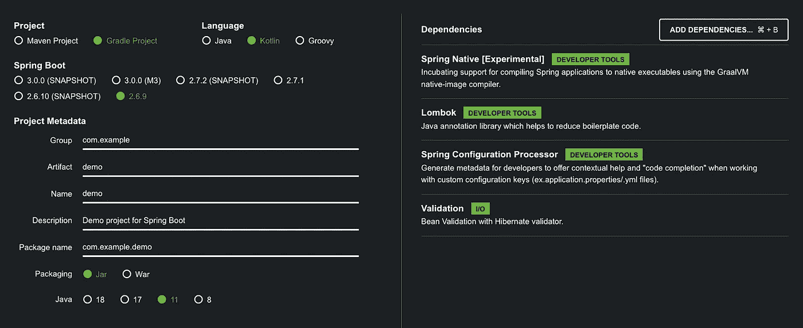

# Spring Boot 外在化配置:要避免的 4 件事

> 原文：<https://blog.devgenius.io/spring-boot-externalised-configurations-4-things-to-avoid-7f045b2d721b?source=collection_archive---------0----------------------->


照片由 [Toa Heftiba](https://unsplash.com/@heftiba?utm_source=unsplash&utm_medium=referral&utm_content=creditCopyText) 在 [Unsplash](https://unsplash.com/s/photos/furniture?utm_source=unsplash&utm_medium=referral&utm_content=creditCopyText) 上拍摄

## 以及你能做些什么

*变更日志:
2022 年 12 月 30 日—使用 Medium 的新代码块来突出显示语法*

在 Spring Boot，配置可以很容易地外部化，这样我们就可以在不同的部署中使用相同的应用程序代码。

然而，有一些地方你可能会因为你的设置而搬起石头砸自己的脚。

在这篇文章中，我将分享 4 件事，我们应该避免设置 Spring Boot 的外部化配置。我认为这是一篇相当固执己见的文章，因为我没有看到很多关于这方面的文章，但请随意分享您的观点。

对于本文，我将使用 Spring Boot 2.6.9 和科特林 1.6.21。至于外部配置，我将使用 YAML 文件和`@ConfigurationProperties`限定符进行属性绑定。



我的春季初始化设置。点击此处的[按钮](https://start.spring.io/#!type=gradle-project&language=kotlin&platformVersion=2.6.9&packaging=jar&jvmVersion=11&groupId=com.example&artifactId=demo&name=demo&description=Demo%20project%20for%20Spring%20Boot&packageName=com.example.demo&dependencies=native,lombok,configuration-processor,validation)获得与上述相同的设置。

## 内容

1.  [弱 POJO 分型](#100f)
2.  [可变 POJO](#b072)
3.  [惰性初始化](#66e6)
4.  `[@Value](#c05b)` [注解](#c05b)

# 1.弱 POJO 分型

假设你有以下`application.yml`:

```
person:
  name: raimi
  age: 2O
  website: https:///remykarem.medium.com
  hobbies: swimming,drawing
  email: hello@gmail.com
```

绑定结构化属性的弱类型 POJO 的一个例子是这样的(注意所有的`String`类型):

```
@ConstructorBinding
@ConfigurationProperties(prefix = "person")
data class PersonProperties(
  val name: String,
  val age: String, 
  val website: String,
  val hobbies: String,
  val email: String,
)
```

⚠️ **有什么问题吗？**

任何属性都可以是`String`类型，因为输入是一串字符。但是如果您打算在应用程序代码中使用一个属性作为另一种类型，那么`String`类型可能不是绑定属性的最佳选择。原因如下:

*   财产类型(`String`)可能是一个**虚假陈述**，并且不是自我记录的。例如，`hobbies`最好用`List<*>`来表示它是一个集合。
*   **属性**没有验证。例如，如果`age`被定义为一个`String`，而你将其定义为`2O`而不是`20`，你在启动时不会得到任何验证错误。(你注意到上面 YAML 文件中的错别字了吗😏？)
*   在代码中使用属性**之前，必须对其进行转换。这意味着你需要将`age`转换成`Int`类型。为什么要自己经历转换的麻烦呢？**

✅你能做什么？

*   使用您希望在代码中使用的类型。它可以是集合、枚举或嵌套的 POJO。如果不是原始类型，你很可能需要一个[自定义](https://docs.spring.io/spring-boot/docs/current/reference/htmlsingle/#features.external-config.typesafe-configuration-properties.conversion) `[Converter](https://docs.spring.io/spring-boot/docs/current/reference/htmlsingle/#features.external-config.typesafe-configuration-properties.conversion)`。在这里，我邀请您探索其他类型，如`URL` ( `java.net`)或`Inet4Address` ( `java.net`)。
*   如果你需要最终类型是一个`String`，使用`javax.validation`约束注释，比如`@Email`和`@Url`。

这里有一种方法可以改进`PersonProperties`的 POJO 类型:

```
@Validated
@ConstructorBinding
@ConfigurationProperties(prefix = "person")
data class PersonProperties(
  val name: String,
  val age: Int, 
  val website: URL,
  val hobbies: List<String>,
  @field:Email 
  val email: String,
)
```

**📕阅读更多**

[配置属性验证](https://docs.spring.io/spring-boot/docs/current/reference/htmlsingle/#features.external-config.typesafe-configuration-properties.validation)，[合并复杂类型](https://docs.spring.io/spring-boot/docs/current/reference/htmlsingle/#features.external-config.typesafe-configuration-properties.merging-complex-types)

# 2.可变 POJO

假设你有以下`application.yml`:

```
person:
  name: raimi
  website: https://remykarem.medium.com
```

下面是一个没有只读访问权限的可变 POJO 的示例:

```
@Configuration
@ConfigurationProperties(prefix = "person")
class PersonProperties {
  lateinit var name: String
  lateinit var website: URL
}
```

⚠️ **有什么问题吗？**

`var`属性`name`和`website`可能会在代码库中的其他地方被意外更改，并且可能会被忽略。这种无意的(或有意的🤔)改动**会造成整个 app 的副作用**。

一个应用的配置**在其生命周期内不应该改变**。如配置的 [12 因素应用方法中所述，配置应仅在部署之间有所不同。](https://12factor.net/config)

**✅你能做什么？**

Spring Boot 通过 [**构造函数绑定方法**](https://docs.spring.io/spring-boot/docs/current/reference/htmlsingle/#features.external-config.typesafe-configuration-properties.constructor-binding) 提供了一种定义 POJOs 的不可变方法。它结合了`data class`、`val`、`@ConfigurationProperties`和`@ConstructorBinding`关键字。

这里有一个改进 POJO 的方法。

```
@ConstructorBinding
@ConfigurationProperties(prefix = "person")
data class PersonProperties(
  val name: String,
  val website: URL,
)
```

**📕阅读更多**

[类型安全配置属性:构造函数绑定](https://docs.spring.io/spring-boot/docs/current/reference/htmlsingle/#features.external-config.typesafe-configuration-properties.constructor-binding)

# 3.惰性初始化

假设你有以下`application.yml`:

```
api-credentials:
  private-key-string: MIIExBvr
```

下面是相应的数据类，它包含一个从`privateKeyString`派生的惰性属性`privateKey`:

```
@ConstructorBinding
@ConfigurationProperties(prefix = "person")
data class ApiCredentialsProperties(
  val privateKeyString: String
) {
  val privateKey: PrivateKey by lazy {
    convertStringToPrivateKey(privateKeyString)
  }
}
```

⚠️ **有什么问题吗？**

这里我们看到，惰性初始化可能是克服从`String`到`PrivateKey`的转换问题所需要的。这个问题与上面关于[弱 POJO 类型化](#100f)的第一部分有关，在这里我们讨论了在属性被绑定后数据转换的需要。

在这里，我们看一下为什么惰性初始化不是最佳选择的两个原因:

*   惰性初始化是危险的，因为**延迟反馈**。如果在运行时初始化`privateKey`属性有任何问题(特别是如果有一些逻辑的话)，你的应用程序可能会崩溃，并且要修复它已经太晚了。
*   这两个性质**违反了干原理**因为`privateKey`的知识是重复的。参见*实用程序员*中的*干违数据*。

**✅你能做什么？**

将属性直接绑定到最终类型，并使用用`@ConfigurationPropertiesBinding`限定的自定义`Converter`。

这里有一个改进`ApiCredentialsProperties` POJO 的方法。

```
@ConstructorBinding
@ConfigurationProperties(prefix = "person")
data class ApiCredentialsProperties(
  val privateKey: PrivateKey
)
```

及其相应的转换器:

```
@ConfigurationPropertiesBinding
class PrivateKeyConverter: Converter<String, PrivateKey> {
  override fun convert(privateKeyString: String): PrivateKey {
    return convertStringToPrivateKey(privateKeyString)
  }
}
```

**📕阅读更多信息**

[属性转换](https://docs.spring.io/spring-boot/docs/current/reference/htmlsingle/#features.external-config.typesafe-configuration-properties.conversion)

# 4.@值注释

假设你有以下`application.yml`:

```
person:
  name: raimi
```

以及下列使用此属性的服务:

```
@Service
class GreetingService(
   @Value("\${person.name}")
   private val name: String
) {
  ...
}

@Service
class UserInfoService(
   @Value("\${person.name}")
   private val name: String
) {
  ...
}
```

⚠️ **有什么问题吗？**

*   `@Value`-在较大的代码库中或者当数据是分层的时候，带注释的属性变得**不太容易管理**。一个例子是，在重构过程中，一些属性被意外遗漏了(可能是因为 IDE 没有发现这些属性)。Spring Boot 的文档中提到了这一点:*“使用* `*@Value("${property}")*` *注释来注入配置属性有时会很麻烦，尤其是当您处理多个属性或者您的数据本质上是分层的时候。”*
*   复制属性的类型违反了 DRY 原则。这里我们可以看到`person.name`被用在两个服务中，每次都重新声明它的`String`类型和表达式。

✅你能做什么？

不要使用`@Value`注释。请改用类型安全的配置属性。这当然不适用于 OpenFeign 客户端。

**📕阅读更多**

[类型安全配置属性](https://docs.spring.io/spring-boot/docs/current/reference/htmlsingle/#features.external-config.typesafe-configuration-properties)

伙计们，现在就到这里吧！欢迎在下面的评论中分享你的观点。

我发表关于人工智能、机器学习、编程语言、网络框架和生产力的文章。

*如果你喜欢阅读更多关于 web 框架的内容，你可以通过我的推荐链接* [*订阅*](https://remykarem.medium.com/subscribe) *随时接收更新或者* [*注册*](https://remykarem.medium.com/membership) *！请注意，您的会员费的一部分将作为介绍费分摊给我。*