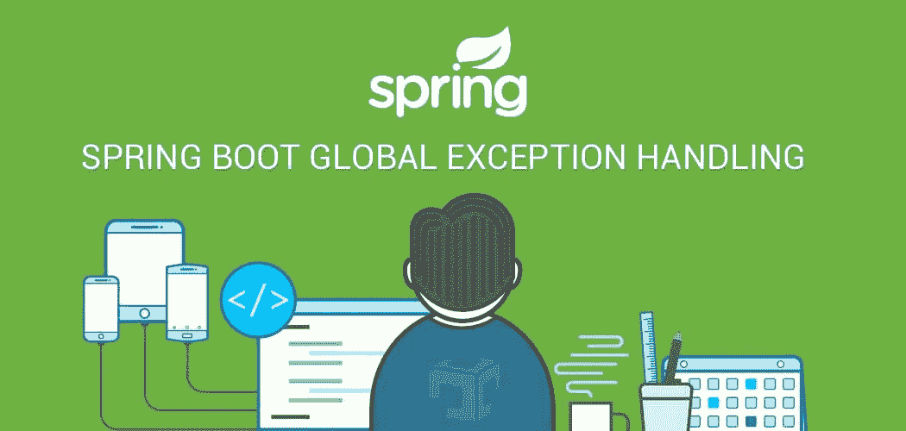
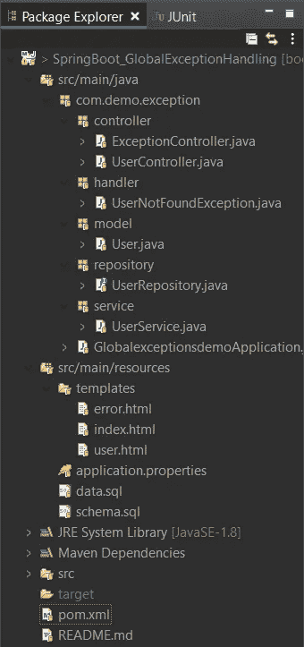
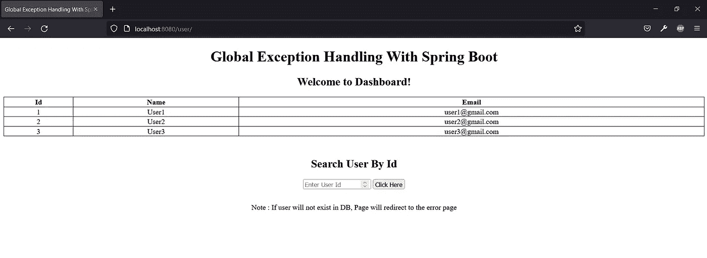
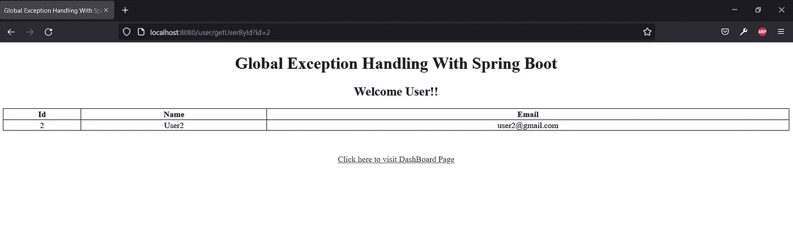
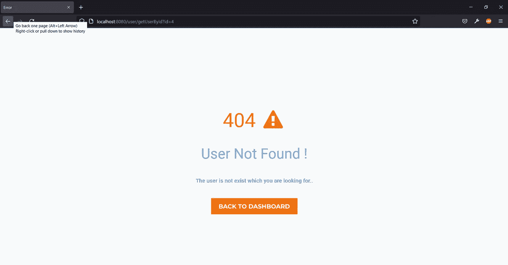
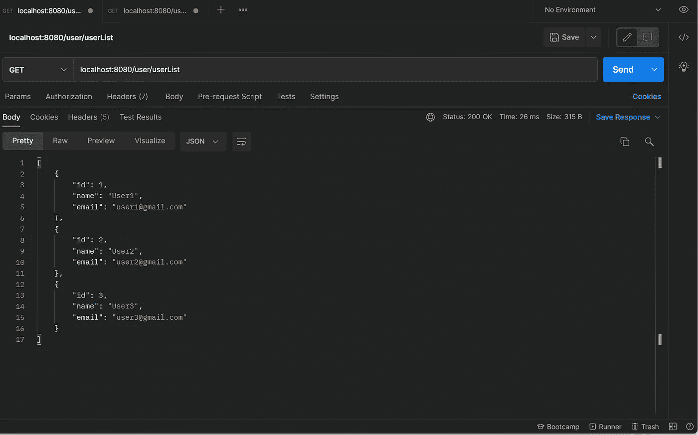
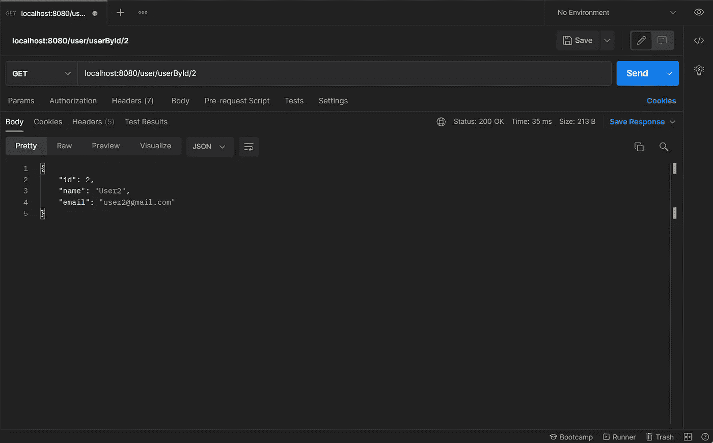

# 用百里香叶和 REST APIs 处理 Spring Boot 全局异常

> 原文：<https://blog.devgenius.io/spring-boot-global-exception-handling-with-thymeleaf-rest-apis-96f61ff62dda?source=collection_archive---------0----------------------->

在本文中，我将使用 UI 页面和 REST APIs 处理全局异常。对于 UI 页面，如果发生任何错误/异常，页面将重定向到常见错误页面。对于 REST APIs，如果发生任何错误/异常，将会向用户提供准确的消息。我将介绍以下内容:

*   如何处理项目中的全局异常？
*   用 UI 页面处理全局异常。
*   用 REST APIs 处理全局异常。
*   如何在我们的 Spring Boot 应用程序中使用 H2 数据库？

# 初步的

在开始之前，如果你想了解 Spring Boot &如何创建一个 Spring Boot 应用程序，请访问这篇文章。

# 使用的工具和技术

*   Java 1.8
*   Spring Boot 2.5.4
*   H2 数据库和 JPA:数据库和交互
*   用于网页的 Java 模板引擎
*   Eclipse IDE:用于编写代码
*   Maven:提供构建环境
*   邮递员:API 测试

让我简单解释一下上述项目结构的各个部分。

*   **ExceptionController** 类用于处理所有异常。
*   **UserController** 类是一个为用户请求提供请求映射方法的控制器。
*   **UserNotFoundException** 类用于返回特定异常的消息。
*   **用户**类是包含用户特定数据的实体。
*   **userrepository**是一个为所有 CRUD 方法扩展 JpaRepository 的接口。它将在 UserService 类中自动连接。
*   **UserService** 类用于在执行用户操作时管理业务逻辑。
*   类是由 Spring 创建的，它包含运行我们的应用程序的 main 方法。
*   **error.html**用于在出现错误/异常时重定向页面。
*   **index.html**用作用户的仪表板页面。
*   **user.html**用于获取用户的详细信息
*   **application.properties** 文件包含 H2 数据源、JPA、Hibernate、端口号、上下文路径等配置。
*   pom.xml 包含对 Spring Boot、H2、JPA、百里香等的依赖。
*   **schema.sql** 用于创建一个表，因为我们正在使用 H2 数据库。
*   **data.sql** 用于在程序运行时在创建的表中插入一些数据。

# 为 API 创建和设置项目

创建 Spring Boot 项目后，打开 **pom.xml** 并添加这些依赖项:

**pom.xml**

# 配置端口、上下文路径和 H2 数据源

应用程序.属性

*   `server.port`属性用于改变默认端口号。
*   `server.servlet.context-path` properties 用于为你的应用程序定义根路径。我已经将 **/user** 定义为我根路径。
*   `spring.datasource.url` 属性用于定义与 h2 数据库连接的数据库 url。
*   Spring Boot 使用 Hibernate 实现 JPA，我们为 PostgreSQL 配置了`PostgreSQLDialect`。
*   `spring.jpa.hibernate.ddl-auto`用于数据库初始化。我们将该值设置为`update`值，以便在数据库中自动创建一个与定义的数据模型对应的表。对模型的任何更改也会触发表的更新。
*   `spring.jpa.show-sql =false`用于从控制台隐藏 sql 查询。
*   `spring.h2.console.enabled=true`用于嵌入式 GUI 控制台，用于浏览内容和运行 SQL 查询。
*   `spring.jpa.database.platform` 用于指定数据库。

# 定义数据模型

*   我们的数据模型是**User.java**，有五个字段:id、姓名&电子邮件。
*   在**com . demo . exception . model**包下，我们定义用户类。

**model/User.java**

**User.java**

*   `@Entity`注释表明该类是一个持久的 Java 类。
*   `@Id`标注是针对主键的。
*   `@GeneratedValue`注释用于定义主键的生成策略。
*   `GenerationType.AUTO`表示自动增量字段。

# 定义服务来处理业务逻辑

*   在**服务**包中，创建一个 UserService 类。
*   我们的服务类是 UserService.java，它包含了所有处理仓库操作的方法，并将响应返回给 UserController.java。

**service/user service . Java**

**UserService.java**

*   `@Service`注释用于将类标记为提供某些业务功能的服务提供者。
*   `@Autowired`用于将**用户存储库** bean 注入局部变量。

# 定义存储库接口

创建一个存储库，以便与数据库中的用户进行交互。
在**仓库**包中，创建扩展`JpaRepository`的`UserRepository`接口

**repository/user repository . Java**

**UserRepository.java**

# 创建一个全局异常类&处理异常

*   首先，我将创建一个自定义异常类 **UserNotFoundException** ，它扩展了 **IllegalArgumentException** 类&来定义一个参数化的构造函数。

handler/usernotfoundexception . Java

**UserNotFoundException.java**

现在，创建另一个类**exception controller**&**用 **@ControllerAdvice** 注释对该类进行注释。**

**控制器/异常控制器. java**

****ExceptionController.java****

*   **注释允许我们处理整个应用程序中的异常。这个注释是`@Component`注释的专门化，因此它可以通过类路径扫描自动检测。**
*   **`@ExceptionHandler`注释表明我们想要处理哪种类型的异常。**
*   **正如你在上面看到的，我已经定义了方法，即**userNotFoundException()**&**illegalArgumentException()**，它将根据类型处理异常。**
*   **`userNotFoundException()`方法用 **@ExceptionHandler** 注释&增加了**usernotfoundexception . class**来确定该方法的异常类型。我也已经将方法返回到**错误页面。**因此，我使用百里香叶作为视图，这样它将返回到**error.html**页面。下面我附上了 error.html 代码。**
*   **`illegalArgumentException()`方法用于处理非法参数的异常，因为我在这个方法中添加了**illegalargumentexception . class**。我们将通过 REST APIs 测试这个方法。**

## **让我们创建一些 UI 页面来测试我们的`"userNotFoundException()”`方法**

*   **首先，我将创建一个 index.html 页面，这将是一个登陆页面，包含所有的用户列表。**

**资源/模板/索引. html**

****index.html****

*   **在 index.html，我添加了一个字段，我们可以根据他们的 id 搜索用户。**
*   **现在，创建另一个包含用户详细信息的 user.html 页面。**

**resources/templates/user.html**

****user.html****

*   **最后，创建一个**error.html**页面，它将在错误/异常时执行。在我们当前的场景中，它将在我们搜索数据库中不存在的用户时执行。**

**资源/模板/错误. html**

**【error.html **

# **用于创建表格和插入数据的 SQL 脚本**

**我将创建两个文件 **schema.sql & data.sql** ，其中包含创建表格的脚本&在内存中插入一些数据，因为我们正在使用 H2 数据库。**

**resources/schema.sql**

****schema.sql****

**资源/数据. sql**

****data.sql****

# **运行应用程序**

*   **要通过 IDE 运行 Spring Boot 应用，**右键单击项目- >运行- > Spring Boot 应用**或者您可以通过 CLI 运行您的项目。使用 CLI 运行**打开你的终端- >进入你的项目的根文件夹- >输入“mvn spring-boot:run”。****
*   **一旦应用程序成功运行，将在模式中自动创建包含 3 个用户记录的用户表，因为我们已经在 application.properties 文件中将值设置为 **update** 。**

# **通过 UI 页面测试应用程序**

*   **现在，从您的浏览器&转到`localhost:8080/user/`，它将如下所示:**

****

*   **正如您可以看到的，在仪表板页面中有 3 个用户记录(我们之前在 data.sql 文件中写的用户详细信息)。**
*   **我们可以通过在搜索框中输入用户 Id 来搜索任何特定用户的详细信息。**

****

*   **当我们传递任何在我们的模式中不存在的 ID 时，它将重定向到**错误页面**，因为我们已经在后端处理了 **UserNotFoundException** 异常。**

****

*   **你可以在 url 栏中看到，我传递了一个在我们的模式中不存在的 Id，因此它被重定向到**错误页面**。我们可以通过点击**返回仪表板**按钮返回仪表板页面。**

# **通过 REST APIs 测试应用程序**

## **我们在本文中创建的 REST APIs:**

*   **`localhost:8080/user/userList`将获取已创建用户的列表。**
*   **`localhost:8080/user/userById`将通过 Id 获取特定用户的详细信息。**

************

**正如你所看到的，当我们在我们的`localhost:8080/user/userById` api 中传递无效数据时，它会给出带有 **400 状态代码**的错误消息，因为我们已经在后端处理了**IllegalArgumentException**。**

> ****资源**:**[**https://spring . io/blog/2013/11/01/exception-handling-in-spring-MVC**](https://spring.io/blog/2013/11/01/exception-handling-in-spring-mvc)****
> 
> ****[***点击这里下载源代码***](https://github.com/pritam73/SpringBoot_GlobalExceptionHandling)****

# ****#结论****

****在本文中，我使用 Spring Boot & H2 数据库和 UI 页面以及 REST APIs 处理了全局异常。****

****我希望这是有用的。一声‘拍手’一定会鼓励我多写文章，多分享我的知识。****

****你可以在 LinkedIn 上 [**联系我，讨论更多。所以请随意连接。**](https://www.linkedin.com/in/pritam-kumar-85b64316b)****