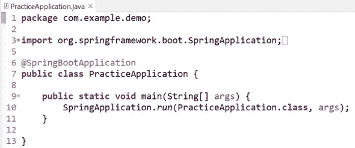

# 15 分钟内 Spring Boot + JPA + MySQL

> 原文：<https://blog.devgenius.io/spring-boot-jpa-mysql-in-15-min-8c246120fd62?source=collection_archive---------10----------------------->

这个博客将有助于理解主要的 Spring boot 和 JPA Hibernate 注释。将会详细讨论 Spring Boot + JPA + MySQL 的集成，以及它如何与 RESTFul web 服务一起工作。

这篇文章将有助于学习、修改和准备关于 Spring Boot 和 JPA 实际上是如何一步一步工作的面试。

这是先决条件，但不是强制要求，在开始实施之前需要安装 Java 和 MySQL。

下面是 Spring Boot 和 JPA 项目的代码结构，我们将构建它作为本文的一部分。我们将在突出显示的包和文件中进行更改。

作为本文的一部分，我们将使用 Spring 工具包，要下载和设置 Spring 工具包，请点击此[链接](https://medium.com/@toimrank/spring-boot-project-setup-in-5-min-c1e6d2541027)。

按照下面的步骤创建我们的第一个 Spring 应用程序项目。

1.  打开我们安装在这里的弹簧工具包。
2.  点击顶部导航菜单中的**文件**，然后点击**新建**。一旦我们点击 create **new** 选项，就会有一个选项 **Spring Starter Project** 开始出现。

下面的窗口将开始出现。

为项目的**组**和**工件**提供下面突出显示的值，并点击**下一步**。

3.在下面的屏幕中选择打开**网**选项，并选择**弹簧网。**点击**完成**将创建 Spring 项目。

4.创建 User.java 类，如下图所示，用 setter getter 创建 id 和 name 变量。

**User** 类具有 **@Entity** 和 **@Table** 注释，将 User 类与 MySQL 数据库中的 **user** 表进行映射。

**@Entity** 批注会将类标记为实体。

**@Table** 注释将用提供的表映射类。name 属性可用于将类名与数据库表名进行映射。如果没有提供，默认情况下它会将表名作为类名。

**@Id** 注释是一个实体标识符

**@GeneratedValue** 用于生成值。这主要有助于自动创建唯一主键。

5.创建扩展包含所有 CRUD 操作的 **JpaRepository** 接口的 UserRepository.java 类。

**@Repository** 注释提供了对对象执行所有 CRUD 操作的机制。

6.用下面的内容创建另一个 UserDao.java 类

**@Service** 注释帮助我们将任何类转换成服务，所有其他类都可以在 **@Autowired** 注释的帮助下轻松使用它。

**repository.findAll()** 是 JpaRepository 接口的内置函数，它将帮助我们从用户表中获取数据。

**repository.findById(id)。get()** 也是 JpaRepository 接口的内置函数，它将获取特定 id 的用户记录。

**repository.save(user)** 也是 JpaRepository 的内置函数，允许我们保存或更新 MySQL 数据库中的用户对象

**repository . delete byId(id)**也是 JpaRepository 的内置函数，允许我们从 MySQL 数据库中删除特定 id 的用户对象。

7.用下面的内容再创建一个 UserController.java 类

8.当我们使用 STS 或 initializr 创建项目时，下面的类默认被创建。

9.更新 application.properties 文件以提供连接 MySQL 数据库的详细信息。

10.让我们创建一个数据库，并使用下面的查询将数据插入 MySQL 数据库

*创建表用户(id int NOT NULL AUTO_INCREMENT，name varchar(255) NOT NULL，PRIMARY KEY(id))；*

*插入用户值(1，“约翰”)；*

11.选择根项目文件夹，右键单击并选择运行方式-> Spring Boot 应用程序将启动服务器。

# 输出

## 获取所有用户列表

点击以下 URL 将返回具有以下内联输出的所有用户列表
[http://localhost:8080/user](http://localhost:8080/user)

## 按 Id 获取用户

点击下面的 URL 将返回 id 为 1
的特定用户 http://localhost:8080/user/1

## 按 Id 创建用户

对于**帖子或在数据库中保存**数据，我们将使用 chrome 插件 postman。提供所有以红色突出显示的输入。点击发送会将数据保存在数据库中，并返回以绿色突出显示的响应。

它将从 UserController.java 类调用下面的方法:

> @ post mapping(path = "/User ")
> public response entity<User>save User(@ request body User User){

## 按 Id 更新用户详细信息

为了**上传或更新数据库中的**数据，我们将使用 chrome 插件 postman。提供所有以红色突出显示的输入。点击发送将更新数据库中的数据，并返回以绿色突出显示的响应。

Put 将从 UserController.java 类调用下面的方法，从 URL 中选择用户 id 为 2，从请求体中选择数据，如下面的函数定义中所述。

## 按 Id 删除用户

要从数据库中删除用户记录，我们将使用 chrome 插件 postman。提供所有以红色突出显示的输入。点击发送将从数据库中删除特定 Id 的用户，并返回以绿色突出显示的响应。

删除将从 UserController.java 类中调用下面的方法，从 URL 中选择用户 id 为 2:

我希望你发现这篇文章有趣且内容丰富。请分享给你的朋友来传播知识。

您可以关注我即将发布的博客[关注](https://medium.com/@toimrank)。
谢谢你！