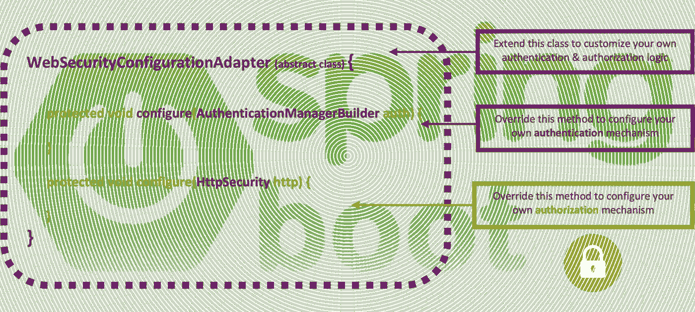
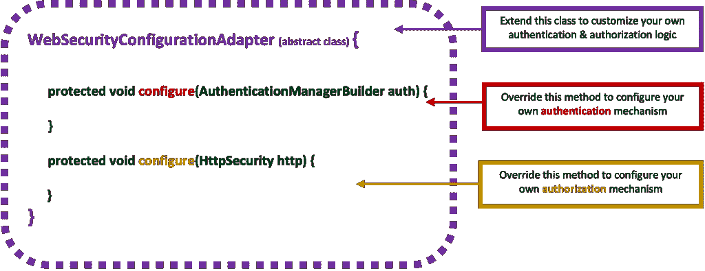
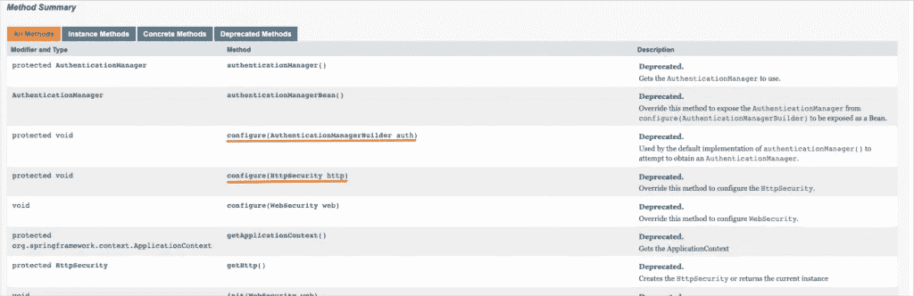

# Spring Boot 安全配置，实用讲解—第 1 部分:从 Spring Boot 安全和基本 HTTP 认证开始

> 原文：<https://blog.devgenius.io/spring-boot-security-configuration-practically-explained-part1-starting-with-spring-boot-35667265f498?source=collection_archive---------0----------------------->

这是关于 Spring 安全定制的系列文章的第一篇，它基于扩展抽象类的定制类的实现。



# 介绍

遗留的 Spring Boot 安全配置，扩展了[**WebSecurityConfigurerAdapte**r](https://docs.spring.io/spring-security/site/docs/current/api/org/springframework/security/config/annotation/web/configuration/WebSecurityConfigurerAdapter.html)抽象类，被认为 [**已经过时，正被基于组件的安全配置**](https://spring.io/blog/2022/02/21/spring-security-without-the-websecurityconfigureradapter) 所取代。然而，由于现有的编码基础是巨大的，在这里，我们将坚持定制**WebSecurityConfigurerAdapter**，并且我们将使用实际的例子来提供更好的理解。

> 注 1:如果您希望使用 SecurityFilterChain beans(不实现 WebSecurityConfigurerAdapter)以“新的方式”开始使用 Spring Security，您可以阅读我的以下帖子:

[](/spring-boot-security-configuration-practically-explained-part5-from-bfb87adc1a58) [## Spring Boot 安全配置，实用讲解—第五部分:来自…

### 从废弃的 WebSecurityConfigurerAdapter 传递到新的基于组件(基于 bean)的安全配置，在…

blog.devgenius.io](/spring-boot-security-configuration-practically-explained-part5-from-bfb87adc1a58) 

> 注意 2:如果你不希望在使用最新版本的 Spring Boot 时在你的 IDE 中继续看到黄色的警告卷线，你应该使用(切换到)早期版本的 Spring Security(Spring . Security dependency)。 [**这里的**](https://www.devxperiences.com/pzwp1/2022/05/23/spring-boot-security-the-websecurityconfigureradapter-is-not-the-case-anymore/) 是怎么做到的。

# 先决条件

既然我们要关注这个主题，那么假设你已经开始熟悉了[**【Spring Boot】**](https://spring.io/guides/gs/spring-boot/)[**REST API**](https://spring.io/guides/tutorials/rest/)[**Maven**](https://maven.apache.org/what-is-maven.html)依赖管理和 [**POM**](https://maven.apache.org/guides/introduction/introduction-to-the-pom.html) 文件、 [**JSON**](https://www.json.org/json-en.html) 以及其他相关主题(Spring 注解，例如 [**@Bean**](https://docs.spring.io/spring-javaconfig/docs/1.0.0.M4/reference/html/ch02s02.html) Spring [**验证**](https://hibernate.org/validator/documentation/getting-started/) ， [**异常处理**](https://spring.io/blog/2013/11/01/exception-handling-in-spring-mvc) ， [**DTO**](https://en.wikipedia.org/wiki/Data_transfer_object) ， [**应用属性**](https://docs.spring.io/spring-boot/docs/current/reference/html/application-properties.html) ，连接数据库使用[**【JDBC**](https://spring.io/guides/gs/relational-data-access/)等。 ).如果您还没有，那么现在是一个开始深入研究 Spring / Spring Boot 的好机会，它是目前最好的 Java 开发框架。

# 从 Spring Boot 安全和基本 HTTP 认证开始

## 从 Spring Boot 安全部门开始

为 SPRING Boot 应用程序添加安全性非常简单。您所需要做的就是向您的 Maven POM 添加一个依赖项。

添加的依赖项***spring-boot-starter-security***负责所有与 spring 安全性相关的依赖项。实际上，这些依赖关系是:

1.  **spring-security-core** :实现 Spring Security 的核心特性
2.  **spring-security-config** :提供 spring 安全名称空间
3.  spring-security-web :提供过滤器和其他保护 web 应用程序所需的特性

当安全依赖关系在类路径上时，Spring 提供一些自动配置缺省值，包括所有端点的安全性，以及将内容协商策略设置为“http base”——基本认证。

此外，在不做任何进一步配置的情况下，添加了一个默认用户名(= 'user ')和一个随机生成的密码。这些凭证可用于登录应用程序。因此，在运行应用程序后，我们可以注意到输出日志控制台中有一些新条目:

> 注意:上面实际显示的是一些有序的安全过滤器，由 Spring Framework 自动生成/强加。其中一个在上面，有序过滤器链是**BasicAuthenticationFilter**。稍后，我们将看到更多的安全过滤器和安全过滤器链，以及我们如何定制它们。


在 Spring 中，默认启用安全性(到目前为止)，登录入口点自动用于重定向未经身份验证的请求。重定向位于默认登录页面上。然而，在 Rest 服务中，显示登录页面没有任何意义，因为 REST 服务大多数时候会被一些定制的客户端应用程序调用，而不是浏览器请求。

因此，对于 solo REST 服务(没有 Web 应用程序)来说，当请求没有经过身份验证时，最好发送 **401 未授权**响应，而不是重定向到默认生成的登录页面来获得身份验证。请注意，在这种情况下，401 未授权实际上意味着**未认证**！

## 开始定制 Spring 安全性—使用定制的安全性配置类

到目前为止，我们还没有写任何一行代码！！！但是，如果我们想继续设置我们的自定义安全设置，我们必须创建一个主安全配置类。我们可以给这样一个类起任何名字(下面我们使用名字' SecurityConfig ')，但是这里重要的是这个类必须扩展基本的 Spring 类:'[**W**ebSecurityConfigurerAdapter](https://docs.spring.io/spring-security/site/docs/current/api/org/springframework/security/config/annotation/web/configuration/WebSecurityConfigurerAdapter.html)'。

**WebSecurityConfigureradapter**类是实现 web security configurer 接口的抽象类。这个类的自定义实现允许我们定义应用程序所需的安全配置。注意，我们还必须用[@配置](https://docs.spring.io/spring-javaconfig/docs/1.0.0.M4/reference/html/ch03.html)和 [@EnableWebSecurity](https://docs.spring.io/spring-security/site/docs/current/api/org/springframework/security/config/annotation/web/configuration/EnableWebSecurity.html) 来注释我们的安全配置类。

为了定制我们的安全配置，基本上，我们必须处理两件事:1-我们必须提供一个认证机制，2-保护(或者更好地授权)我们希望应用程序使用的 HTTP 路径/端点。



希望 Spring[**WebSecurityConfigurerAdapter**](https://docs.spring.io/spring-security/site/docs/current/api/org/springframework/security/config/annotation/web/configuration/WebSecurityConfigurerAdapter.html)类为我们提供了两个受保护的方法，允许我们处理这两个问题:构建(或定义)我们的**认证机制**(使用[AuthenticationManagerBuilder](https://docs.spring.io/spring-security/site/docs/4.0.x/apidocs/org/springframework/security/config/annotation/authentication/builders/AuthenticationManagerBuilder.html))和配置 [HttpSecurity](https://docs.spring.io/spring-security/site/docs/current/api/org/springframework/security/config/annotation/web/builders/HttpSecurity.html) ，用于认证用户的授权。

[](https://docs.spring.io/spring-security/site/docs/current/api/org/springframework/security/config/annotation/web/configuration/WebSecurityConfigurerAdapter.html)

下面可能是您可以实现的最基本、最简单的自定义安全配置类。

上述实现实际上是一种基于表单的配置，适用于其他 web MVC 应用程序。但是，我们可以将其配置为无表单 REST API 应用程序，只需删除.和. formlogin()，并添加 httBasic()配置即可:

上面的配置要求任何请求访问的 URL 都应该使用基本身份验证进行身份验证，提供用户名“user”和密码“mypassword”。

第一个 **configure** ()方法负责配置访问应用资源的限制(URL 路径和端点)。限制是用许多过滤器配置的。例如，使用带有端点(url 模式)和授权(用户的角色或权限)的 antMatchers，我们可以限制经过身份验证的用户访问我们的应用程序资源。

👉在回购 [**这里**](https://github.com/zzpzaf/restapidemo_base_in-memory_security) 找到目前为止的代码。

第二个**配置**()方法负责配置认证机制。这里，认证机制使用 Spring Security 提供的简单的**内存**认证方案。如果身份验证通过(用户名和密码匹配)，那么它将角色“ROLE_USER”分配给该用户(主体)。这个被授予的角色是授权特定用户(主体)访问(或不访问)在前面的第一个 configure()方法中通过 antMatchers 配置的路径和端点所必需的。

此外，我们必须注意到第二个 configure()方法使用了 Spring 安全类:[AuthenticationManagerBuilder](https://docs.spring.io/spring-security/site/docs/4.0.x/apidocs/org/springframework/security/config/annotation/authentication/builders/AuthenticationManagerBuilder.html)。这个类使用了许多方法= " **配置器"**(其中之一是我们在上面的例子中使用的**inMemoryAuthentication()**)。这些“配置器”允许我们更详细地配置我们的身份验证。

👉请注意，我们可以创建一个@Bean 注释方法，使用并配置 AuthenticationManagerBuilder 来构建 AuthenticationManager 并将其作为 Bean 返回，而不是覆盖第二个 **configure** ()来构建 AuthenticationManager。所以，上面的例子可以改写成这样:

其他一些广泛使用的提供身份验证提供者配置的方法(通过 AuthenticationManagerBuilder)有:
–**authenticationProvider()**
根据传入的自定义 [AuthenticationProvider](https://docs.spring.io/spring-security/site/docs/4.0.x/apidocs/org/springframework/security/authentication/AuthenticationProvider.html) 添加身份验证。
–**JDBC authentic ation()**
将 JDBC 认证添加到[AuthenticationManagerBuilder](https://docs.spring.io/spring-security/site/docs/4.0.x/apidocs/org/springframework/security/config/annotation/authentication/builders/AuthenticationManagerBuilder.html)中，并返回一个[jdbcuserdailsmanagerconfigurer](https://docs.spring.io/spring-security/site/docs/4.0.x/apidocs/org/springframework/security/config/annotation/authentication/configurers/provisioning/JdbcUserDetailsManagerConfigurer.html)以允许定制 JDBC 认证。
–**ldapAuthentication()**
将 LDAP 认证添加到[AuthenticationManagerBuilder](https://docs.spring.io/spring-security/site/docs/4.0.x/apidocs/org/springframework/security/config/annotation/authentication/builders/AuthenticationManagerBuilder.html)中，并返回一个[LdapAuthenticationProviderConfigurer](https://docs.spring.io/spring-security/site/docs/4.0.x/apidocs/org/springframework/security/config/annotation/authentication/configurers/ldap/LdapAuthenticationProviderConfigurer.html)以允许定制 LDAP 认证。

此外，值得一提的是，身份验证提供者可以与 UserDetailsService 合作来检索和验证用户详细信息。我们还可以通过 AuthenticationManagerBuilder 配置 **userDetailsService()** 来配置“UserDetailsService”。我们可以通过给它传递一个自定义的 [UserDetailsService](https://docs.spring.io/spring-security/site/docs/4.0.x/apidocs/org/springframework/security/core/userdetails/UserDetailsService.html) 来实现。

所有这些都允许我们定制身份验证机制来满足我们的需求。然而，我们稍后会看到它们。因此，在继续之前，有必要看一下关于基本 HTTP 认证的基础信息以及它在 Spring 中是如何工作的。然后，我们将逐步熟悉并向我们的安全配置添加更多定制。

## 基本 HTTP 认证简介

验证用户身份最常见的方法之一是验证用户名和密码。因此，Spring Security 为使用用户名和密码进行身份验证提供了全面的支持。如前所述，这是默认的 Spring 安全认证方案。

在 RESTfull 应用程序中，[基本 HTTP 认证](https://tools.ietf.org/html/rfc7617)是一种非常常见的做法。基本的 HTTP 认证实现了一个简单的询问和响应机制，通过该机制，服务器可以从客户端请求认证信息(用户 ID，即用户名和密码)。客户端在授权头中将身份验证信息传递给服务器。身份验证信息采用 base-64 编码。

如果客户端发出请求，而服务器需要该请求的身份验证信息，则服务器会发送一个 HTTP 响应，其中包含 401 状态代码、指示身份验证错误的原因短语和 WWW-Authenticate 标头。

下面的图片取自 Spring 官方文档[这里](https://docs.spring.io/spring-security/reference/servlet/authentication/passwords/basic.html)，很好地描述了 Spring Security 是如何进行挑战过程的。


摘自 Spring 官方文档[此处](https://docs.spring.io/spring-security/reference/servlet/authentication/passwords/basic.html)

1.  首先，用户向未授权的资源端路径“/private”发出未经身份验证的请求。
2.  Spring Security 的 FilterSecurityInterceptor 通过抛出 AccessDeniedException 来表示未经身份验证的请求被拒绝。
3.  由于用户没有经过身份验证，因此 ExceptionTranslationFilter 启动开始身份验证。配置的 AuthenticationEntryPoint 是一个实例`[BasicAuthenticationEntryPoint](https://docs.spring.io/spring-security/site/docs/5.6.3/api/org/springframework/security/web/authentication/www/BasicAuthenticationEntryPoint.html)`，它发送一个 **WWW-Authenticate 头**。`RequestCache`通常是一个不保存请求的`NullRequestCache`，因为客户端能够重放它最初请求的请求。

HTTP 基本身份验证的 WWW-Authenticate 头的格式是:

```
WWW-Authenticate: Basic realm=”My Site”
```

然后，客户端重新发送带有授权头的原始请求。或者，客户端可以在发出原始请求时发送授权头，这个头可能会被服务器接受，从而避免质询和响应过程。

授权头的格式是:

```
Authorization: Basic username:password
```

浏览器使用上面的头发送用户名和密码。用户名和密码用冒号连接在一起，然后使用 **base-64** 编码方法进行编码。因此，如果用户名为“panos ”,密码为“password1 ”,则会生成一个字符串“panos:password1 ”,然后使用 base-64 编码进行编码。在我们的例子中，结果是:“cGFub3M6cGFzc3dvcmQx”。

请注意，Base64 只是一种编码机制，而不是加密机制。这意味着 MITM(中间人)攻击可以很容易地解码编码字符串。(尝试使用任何免费的在线工具，例如在 https://passwords-generator.org/base64-decode 的。所以，这是完全不安全的，因此我们总是只能使用安全连接(HTTPS/TLS)。此外，基本 HTTP 身份验证还有一些其他问题，例如:

*   对于每个请求，都会重复发送密码。(更大的攻击窗口)
*   网络浏览器缓存密码，至少在窗口/进程的长度内。(可以被服务器的任何其他请求静默重用，例如 CSRF)。
*   如果用户要求，密码可以永久存储在浏览器中。(与上一点相同，此外，可能会被共享机器上的另一个用户窃取)。

更好的解决方案是结合使用基本的 HTTP 认证(仅一次)和不记名令牌，例如加密 JWT，但是这可能是另一篇文章的主题。

## 具有基本认证的 Spring 安全性

当客户端收到 WWW-Authenticate 报头时，它知道应该使用用户名和密码重试。下面是正在处理的用户名和密码的流程。

Spring 的官方文档永远是我们的支持助手。所以下图(你可以在这里[看到](https://docs.spring.io/spring-security/reference/servlet/authentication/passwords/basic.html))很好地解释了 Spring Boot 基本认证背后的机制:


摘自官方文件[此处](https://docs.spring.io/spring-security/reference/servlet/authentication/passwords/basic.html)

1.  当用户提交他/她的用户名和密码时，BasicAuthenticationFilter 通过从 HttpServletRequest(例如，从请求头中)提取用户名和密码来创建 usernamepasswordeuthenticationtoken，这是一种认证类型。
2.  接下来，usernamepasswordtauthenticationtoken 被传递到一个 **AuthenticationManager** 中进行身份验证。AuthenticationManager 的详细信息取决于用户信息的存储方式/位置。
3.  如果认证失败，则失败
4.  SecurityContextHolder 已被清除。
5.  调用 RememberMeServices.loginFail。如果没有配置记住我，这是不行的。
6.  AuthenticationEntryPoint 被调用以触发 WWW-Authenticate 被再次发送。
7.  如果认证成功，则成功。
8.  在 SecurityContextHolder 上设置身份验证。
9.  remember meservices . log in access 被调用。如果没有配置记住我，这是不行的。
10.  BasicAuthenticationFilter 调用 FilterChain.doFilter(request，response)来继续其余的应用程序逻辑。

注意，[authenticationmanager](https://docs.spring.io/spring-security/site/docs/current/api/org/springframework/security/authentication/AuthenticationManager.html)是一个 Spring 安全接口，可以由 Spring 安全 [ProviderManager](https://docs.spring.io/spring-security/site/docs/current/api/org/springframework/security/authentication/ProviderManager.html) 类实现。ProviderManager 的工作是通过一列 **AuthenticationProviders** 迭代认证请求(基本 HTTP 认证)，这些是实现 [AuthenticationProvider](https://docs.spring.io/spring-security/site/docs/current/api/org/springframework/security/authentication/AuthenticationProvider.html) 接口的类。

Spring 为我们提供了大量的 **AuthenticationProviders，可用于用户认证，通常，我们只使用其中的一种。下面是一些常用的认证提供者的列表。**

*   [LdapAuthenticationProvider](https://docs.spring.io/spring-security/site/docs/current/api/org/springframework/security/ldap/authentication/LdapAuthenticationProvider.html)
*   [ActiveDirectoryLdapAuthenticationProvider](https://docs.spring.io/spring-security/site/docs/current/api/org/springframework/security/ldap/authentication/ad/ActiveDirectoryLdapAuthenticationProvider.html)
*   [DaoAuthenticationProvider](https://docs.spring.io/spring-security/site/docs/current/api/org/springframework/security/authentication/dao/DaoAuthenticationProvider.html)
*   [JwtAuthenticationProvider](https://docs.spring.io/spring-security/site/docs/current/api/org/springframework/security/oauth2/server/resource/authentication/JwtAuthenticationProvider.html)
*   [oauth 2 loginauthenticationprovider](https://docs.spring.io/spring-security/site/docs/current/api/org/springframework/security/oauth2/client/authentication/OAuth2LoginAuthenticationProvider.html)

我们还可以使用任何一个 **AuthenticationProvider** ，并在我们之前提到的自定义安全配置类的第二个 **configure** ()方法的[authenticationmanager builder](https://docs.spring.io/spring-security/site/docs/4.0.x/apidocs/org/springframework/security/config/annotation/authentication/builders/AuthenticationManagerBuilder.html)中将其作为参数传递。为了做到这一点，我们可以定义一个 **bean** (例如，在我们将由 Spring 管理的自定义安全配置类中使用 [@Bean](https://docs.spring.io/spring-javaconfig/docs/1.0.0.M4/reference/html/ch02s02.html) 注释的方法)，它返回我们定义的 AuthenticationProvider。(我们将在后面看到这样的例子)。

这里值得一提的是，AuthenticationProvider 的目的是通过其 **authenticate** 方法对用户进行身份验证，并提供一个“包括凭证的完全验证对象”——一个“主体”令牌，它是[身份验证](https://docs.spring.io/spring-security/site/docs/current/api/org/springframework/security/core/Authentication.html) Spring 安全接口的一个(类似于所选的 AuthenticationProvider)实现。因此，AuthenticationProvider 在成功进行身份验证后，会产生一组用户(主体)详细信息(一个对象),包括他/她被授予的任何权限/角色的集合。正如官方文档所述:“许多身份验证提供者将创建一个 **UserDetails** 对象作为主体”。

实际上，经过身份验证的用户(主体)的用户细节对象(身份验证对象)对于 Spring 安全配置非常重要，它们被用来控制对应用程序资源的访问。希望 Spring Security 为我们提供了许多选项来获取经过身份验证的用户的详细信息，无论是在用户身份验证之后还是在用户身份验证过程中。

就是这样！
享受，感谢阅读！

PS:在下面找到系列文章的第二篇:

[](/spring-boot-security-configuration-practically-explained-part2-jdbc-authentication-6c0c7bd8d53e) [## Spring Boot 安全配置实用讲解第二部分:JDBC 认证

### 本系列的第二篇文章是关于基于 WebSecurityConfigurerAdapter 的 Spring 安全定制的

blog.devgenius.io](/spring-boot-security-configuration-practically-explained-part2-jdbc-authentication-6c0c7bd8d53e)