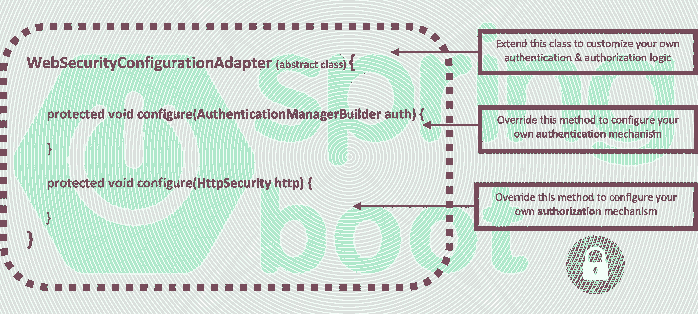
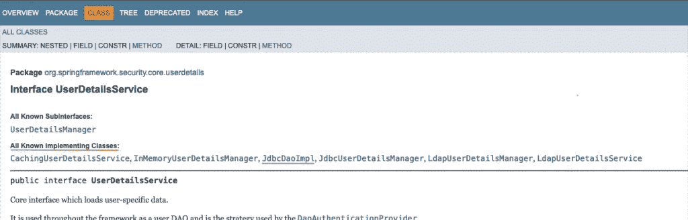
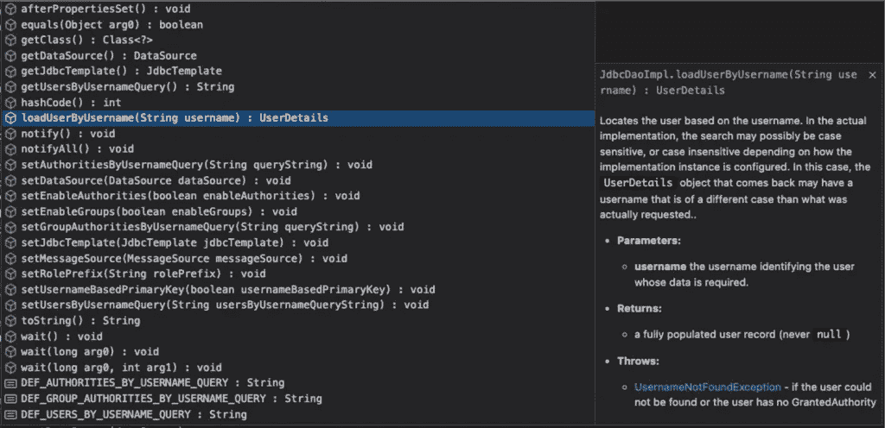
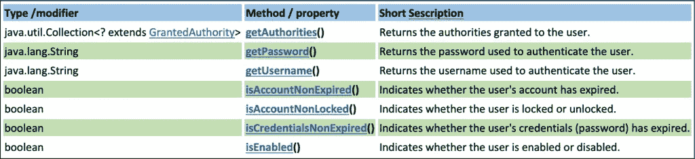
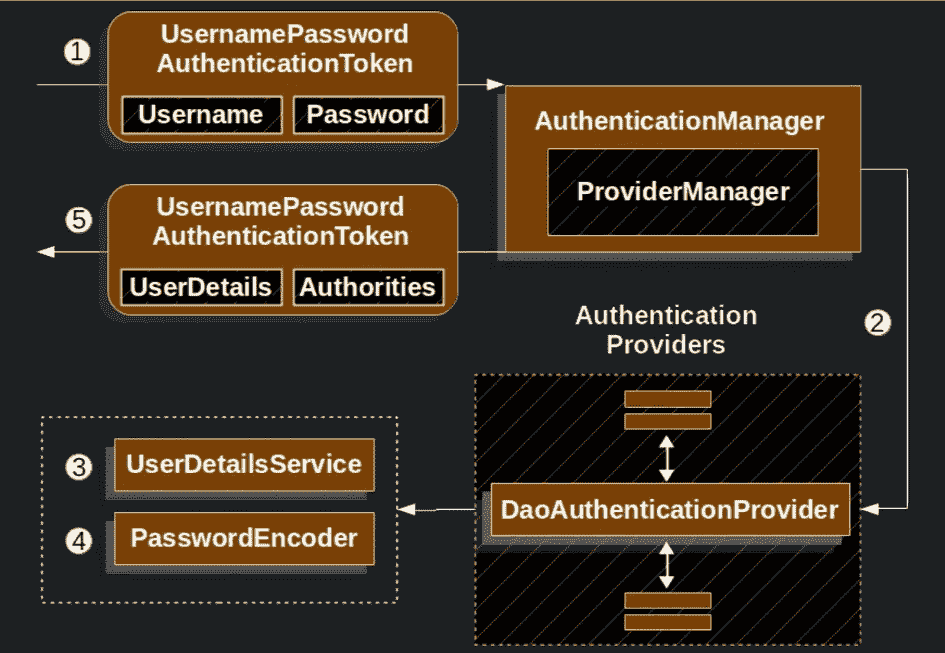

# Spring Boot 安全配置实用讲解第二部分:JDBC 认证

> 原文：<https://blog.devgenius.io/spring-boot-security-configuration-practically-explained-part2-jdbc-authentication-6c0c7bd8d53e?source=collection_archive---------1----------------------->

本系列的第二篇文章是关于基于**WebSecurityConfigurerAdapte**r 抽象类的 Spring 安全定制。

# 介绍

这是关于 Spring 安全定制的系列文章中的第二篇，该系列文章基于扩展了**WebSecurityConfigurerAdapte**r 抽象类的定制类的实现。你可以阅读下面的第一篇文章:

 [## Spring Boot 安全配置，实用讲解—第一部分:从 Spring Boot 开始…

### 这是关于 Spring 安全定制的系列文章的第一篇，基于一个定制的实现…

medium.com](https://medium.com/@zzpzaf.se/spring-boot-security-configuration-practically-explained-part1-starting-with-spring-boot-35667265f498) 

> *注:
> 遗留的 Spring Boot 安全配置(扩展了*[***WebSecurityConfigurerAdapte****r*](https://docs.spring.io/spring-security/site/docs/current/api/org/springframework/security/config/annotation/web/configuration/WebSecurityConfigurerAdapter.html)*抽象类)，已经被* [***弃用，正在被基于组件的安全配置***](https://spring.io/blog/2022/02/21/spring-security-without-the-websecurityconfigureradapter) *所取代。但是，由于现有的编码基数庞大，在这里，我们仍然使用****WebSecurityConfigurerAdapter****，并且我们将尝试使用实际例子来提供更好的理解。如果您不希望在使用最新版本的 Spring Boot 时继续在您的 IDE 中看到黄色的警告卷线，您应该使用(切换到)早期版本的 Spring Security(Spring . Security dependency)。* [***这里的***](https://www.devxperiences.com/pzwp1/2022/05/23/spring-boot-security-the-websecurityconfigureradapter-is-not-the-case-anymore/) *是怎么做到的。*

# JDBC 认证

## 先决条件

您应该已经知道， **JDBC** 代表 **Java 数据库连接**，因此，在这里，JDBC 认证预先假定了与数据库层的正常连接，以及适当的工作数据库模式。在这篇文章中，我们将使用 MariaDB 作为 MySQL 数据库的二进制替代。所以，如果你还没有访问过这样的数据库，这里有我的两个帖子可以帮助你:
–[通过 Docker](https://www.devxperiences.com/pzwp1/2022/05/21/installing-and-using-mariadb-via-docker/)
–[安装 MariaDB (10.5.8。-GA)通过 macOS 上的自制软件](https://www.devxperiences.com/pzwp1/2021/01/08/install-mariadb-10-5-8-ga-via-homebrew-on-macos/)

此外，出于我们这里工作的目的，您还可以访问 [**这个** **GitHub 存储库**](https://github.com/zzpzaf/restapidemo_mysql_in-memory_security) 。所提供的代码是为 MariaDB 连接准备的(如本帖所述， [**此处**](https://www.devxperiences.com/pzwp1/2022/05/22/quick-intro-to-rest-api-development-with-spring-boot/#mysql-real-database-restapi) )。此外，它还被配置为简单的内存认证(如本系列的第 1 部分， [**，这里是**](https://www.devxperiences.com/pzwp1/2022/05/17/spring-boot-security-configuration-practically-explained/#in-memory) )。使用存储库中的代码作为本文的基础。

## JDBC 认证简介

Spring 安全框架提供了多种方式来实现 JDBC 认证。在这里，我们将介绍 3 种不同的方法:

1.  使用**默认** JDBC 认证和一个纯 UserDetailsService Bean
2.  使用 **jdbcAuthentication()** 和 JdbcUserDetailsManagerConfigurer
3.  将**DaoAuthenticationProvider**与自定义用户详细信息服务一起使用

# 1.对 UserDetailsService 使用默认的 JDBC 身份验证

我们已经说过，Spring Security 提供了一个名为 [UsersDetailsService](https://docs.spring.io/spring-security/site/docs/5.6.3/api/org/springframework/security/core/userdetails/UserDetailsService.html) 的接口。这是加载用户特定数据(用户详细信息)的核心接口。UsersDetailsService 的实现只需要实现一个方法，即**loaduserbysusername**方法。UsersDetailsService 实现可用于根据提供的用户名查找用户。正如我们之前所介绍的，Spring security 可以通过 DaoAuthenticationProvider 使用 UsersDetailsService，根据基本身份验证中的用户凭证、用户名和密码来检索用户对象/实体。

## 默认 JDBC 身份验证简介

如果我们使用 JDBC 数据源，我们可以使用**默认的** [JDBC 认证](https://docs.spring.io/spring-security/reference/servlet/authentication/passwords/jdbc.html)机制。这包括 [JdbcDaoImpl](https://docs.spring.io/spring-security/site/docs/current/api/org/springframework/security/core/userdetails/jdbc/JdbcDaoImpl.html) **类**，它是 UserDetailsService 接口的一个实现类。

默认情况下，对于用户认证， [JdbcDaoImpl](https://docs.spring.io/spring-security/site/docs/current/api/org/springframework/security/core/userdetails/jdbc/JdbcDaoImpl.html) 需要一个特定的[数据库模式](https://docs.spring.io/spring-security/reference/servlet/authentication/passwords/jdbc.html#servlet-authentication-jdbc-schema-user)和两个表(以及它们的关系)。这些表是:**用户**和**权限**。

**用户**表列

*   用户名
*   密码
*   使能够

**机关**表格栏目

*   用户名
*   权威

创建数据库表并插入一些数据

例如，下面的 SQL 语句用上面的两个表定义了这样一个简单的模式:

当然，我们总是可以为每个表使用更多的列以及它们之间更多的关系。例如，在上面的例子中，我们使用了另外两个字段/列: **id** 和 **email** 。这是可以的，因为缺省 JSON 认证机制的强制字段(用户名、密码和 enabled)包含在表中。

然后，我们必须向表格中添加一些数据。例如，使用以下 SQL 语句:

***备注:***

***用户表中的 id 列没有值*** *我们不在用户表中插入 id 字段的值，因为我们已经将其创建为'****AUTO _ INCREMENT****'*

***密码加密*** *正如您可能已经注意到的，我们使用哈希密码，用* [*编码；用*](https://en.wikipedia.org/wiki/Bcrypt) *编码。这是必要的，因为我们不能再使用普通密码了(正如我们在前面的帖子* [***中所说的***](https://www.devxperiences.com/pzwp1/2022/05/17/spring-boot-security-configuration-practically-explained/#plain-password) *)。要使用 BCrypt 算法对任何密码进行编码，您可以使用*[*encoddepassword*](https://docs.spring.io/spring-security/reference/features/authentication/password-storage.html#authentication-password-storage-boot-cli)*命令与*[*Spring Boot CLI*](https://docs.spring.io/spring-boot/docs/current/reference/html/cli.html)*或其中一种可用的免费在线服务，如* [*此处的*](https://appdevtools.com/bcrypt-generator) *。以后，我们还将使用* [*密码编码*](https://docs.spring.io/spring-security/site/docs/current/api/org/springframework/security/crypto/bcrypt/BCryptPasswordEncoder.html) [*密码编码器，将*](https://docs.spring.io/spring-security/reference/servlet/authentication/passwords/password-encoder.html#servlet-authentication-password-storage) *定义为@Bean。
此外，这里值得强调的是，使用后端层——就像 Spring Boot 应用程序(正如我们在这里所做的)——可能不是最佳实践。另一种选择是在数据库层内部进行，使用一些其他的数据库对象，比如* [*触发器*](https://en.wikipedia.org/wiki/Database_trigger) *和/或* [*存储过程/函数*](https://en.wikipedia.org/wiki/Stored_procedure) *。这被认为更安全，因为所使用的密码和密码哈希算法都不会暴露在数据库之外(当后端服务器和数据库服务器位于同一内部网络和/或防火墙之后时)。*

权限表 *中权限列的 ***值对于* ***权限*** *列* ***值也有默认的命名要求。*** *它们前面应该有前缀“* ***【角色 _*** *”。正如我们将在后面看到的，当我们使用。蚂蚁匹配器。hasRole，在我们的 WebSecurityConfig 类中重写 HttpSecurity configure 方法(当然扩展了 WebSecurityConfigurerAdapter)。你可以在这里* *了解一下蚂蚁匹配器和蚂蚁权限概念* [*。*](https://www.devxperiences.com/pzwp1/2022/12/09/spring-boot-antmatchers-and-user-roles-and-authorities/)***

**应用程序设置**

确保必要的**依赖关系**包含在 **pom.xml** 文件中:

同样，这些是应用程序的 **application.properties** 文件中 MariaDB 数据库的连接设置:

## 在 Spring 安全配置中定义 UsersDetailsService 的 Bean

因此，我们准备通过 HTTPSecurity 配置器进一步进行定制。我们可以通过授权传入请求(http.authorizeRequests())，禁止或允许更多端点/路径和/或角色的访问来做到这一点。这取决于您和您的应用需求。

但是现在，我们将继续使用比不被接受的 IinMemoryAuthentication()更明智的方法来配置身份验证。实际上，我们将使用**基于 JDBC 的**认证实现。我们将通过定义一个基于 Spring 注释的 [**@Bean**](https://docs.spring.io/spring-javaconfig/docs/1.0.0.M4/reference/html/ch02s02.html) 来实现。

**通过**[**JdbcDaoImpl**](https://docs.spring.io/spring-security/site/docs/current/api/org/springframework/security/core/userdetails/jdbc/JdbcDaoImpl.html)**类**实现 UserDetailsService Bean

我们要做的是使用 UserDetailsService 的默认 **Bean** ，实例化它并向它传递 **datasource** 对象。

datasource 对象

注意，数据源对象通过 Spring 从应用程序上下文中自动**出来**。这意味着你不必为它写一些代码。下面你可以看看关于它的文档:

> javax.sql.DataSource
> 一个工厂，用于连接到这个 DataSource 对象所代表的物理数据源。作为 DriverManager 工具的替代，DataSource 对象是获取连接的首选方式。实现数据源接口的对象通常会向基于 Java 命名和目录(JNDI) API 的命名服务注册。
> data source 接口由驱动厂商实现。有三种类型的实现:
> 1 .基本实现—产生一个标准连接对象
> 2。连接池实现—生成将自动参与连接池的连接对象。这个实现与中间层连接池管理器一起工作。
> 3。分布式事务实现—生成可用于分布式事务的连接对象，并且几乎总是参与连接池。这个实现与中间层事务管理器一起工作，并且几乎总是与连接池管理器一起工作。
> data source 对象具有可在必要时修改的属性。例如，如果数据源被移动到不同的服务器，则该服务器的属性可以更改。好处是因为数据源的属性可以更改，所以访问该数据源的任何代码都不需要更改。通过 DataSource 对象访问的驱动程序不会向 DriverManager 注册自己。相反，DataSource 对象是通过查找操作检索的，然后用于创建连接对象。对于基本实现，通过 DataSource 对象获得的连接与通过 DriverManager 工具获得的连接是相同的。
> data source 的实现必须包含一个公共的无参数构造函数。
> 自:1.4

实际上，datasource 对象是基于我们在 **pom.xml** 文件中定义的**数据库**，以及它的**连接参数**——正如我们之前在[**application . properties**](https://docs.spring.io/spring-boot/docs/current/reference/html/application-properties.html)文件中看到的。

在对 datatsource 对象的简短引用之后，下面是一个使用**默认** JdbcDaoImpl 类的实例化的 UserDetailsService Bean 的示例:

或者，既然 [JdbcDaoImpl](https://docs.spring.io/spring-security/site/docs/current/api/org/springframework/security/core/userdetails/jdbc/JdbcDaoImpl.html) **类** **实现了**[**user detailsservice**](http://userdetailsservice/)**接口**我们可以使用这个接口，在 Bean 的“签名”中，改为:

这是一个我们如何从 Spring 框架提供的“现成”实现中获益的例子，它“大量”遵循 Java [OOP](https://en.wikipedia.org/wiki/Object-oriented_programming) 。在上面的第一个代码片段中，我们可以只使用提供的 JdbcDaoImpl 类，而无需深入研究。

如果你访问过 UserDeatilsService 的官方文档，你可能会注意到 Spring 提供了许多其他的实现类，(其中之一是 JdbcDaoImpl 类):

因此，在第二个代码片段中，我们使用了 UserDetailsService 接口，而不是 JdbcDaoImpl 类。这是因为我们的目的是以一步一步的方式展示我们如何进一步进行定制，最后不是使用“现成的”类，而是实现我们自己的 UserDetailsService。

## 通过 jdbcuserdailmanager 实现**一个 UserDetailsService Bean**

正如你在上面看到的，还有另一个有趣的“现成”类，它也实现了 user details service-[**jdbcuserdailsmanager**](https://docs.spring.io/spring-security/site/docs/current/api/org/springframework/security/provisioning/JdbcUserDetailsManager.html)。所以，作为下一步，我们可以使用这个类，它扩展了 [JdbcDaoImpl](https://docs.spring.io/spring-security/site/docs/current/api/org/springframework/security/core/userdetails/jdbc/JdbcDaoImpl.html) 并直接实现了默认 [UserDetailsService](https://docs.spring.io/spring-security/site/docs/current/api/org/springframework/security/core/userdetails/UserDetailsService.html) 接口的一个实例(通过 [UserDetailsManager](https://docs.spring.io/spring-security/site/docs/current/api/org/springframework/security/provisioning/UserDetailsManager.html) 接口)。为了实例化它，我们只需要传递它，datasource 对象:

或者更好——代码更少:

干得好！现在我们可以使用上面的@Bean，让 Spring 为我们完成剩下的工作。Bean 只返回一个 UserDetailsService 对象(它实际上是一个 JdbcDaoImpl 对象)，通过 JdbcUserDetailsManager(它接受我们的 datasource 作为参数)创建它。现在不需要进一步的配置(通过 AuthenticationManagerBuilder)。但是，我们可以进一步配置 http.authorizeRequests()。

## 自定义 Spring 安全配置类

综上所述，以下是基于 WebSecurityConfigurerAdapter 接口的 Spring 安全配置的工作自定义实现，并且仅使用 Spring 框架提供的 JDBC 身份验证的默认设置:

***备注:***

***密码编码器 Bean*** *你应该已经注意到了，我们还添加了一个* [*密码编码器*](https://docs.spring.io/spring-security/reference/servlet/authentication/passwords/password-encoder.html#servlet-authentication-password-storage) *Bean，它返回一个*[*BCryptPasswordEncoder*](https://docs.spring.io/spring-security/site/docs/current/api/org/springframework/security/crypto/bcrypt/BCryptPasswordEncoder.html)[*，*](https://docs.spring.io/spring-security/reference/servlet/authentication/passwords/password-encoder.html#servlet-authentication-password-storage) *对象。正如我们已经提到的，这是使用*[*BCrypt*](https://en.wikipedia.org/wiki/Bcrypt)*算法对密码进行编码/解码所必需的。*

***Session:无状态*** *还有，注意我们已经把我们的 Session 做成无状态:
。。。
。和()。sessionManagement()。sessionCreationPolicy(sessionCreationPolicy。
无国籍)。。。
如果我们没有这样做，我们会让会话保持全状态(默认)。因此，当用户只通过一次身份验证后，他可以继续访问端点，甚至无需再次提供凭据(用户名/密码)或提供错误的凭据。这对于 WEB 应用程序来说可能是可以的(允许用户使用各种页面，而不需要一次又一次地提供他的凭证)。但是让会话无状态是 REST API 服务中最合适的方法。*

> 在这里找到回购[中的最终代码。](https://github.com/zzpzaf/restapidemo_mysql_ldap-LdapAuthenticationProvider-Bean-with-BindAuthenticator)

我们将在这里多呆一会儿，看一看进行更多定制的有趣选项。

**检索用户详细信息的查询的定制**

到目前为止，我们只使用了 JDBC 身份验证默认值。然而，我们可以再走一步，应用某种定制。即使使用 JDBC 身份验证默认值，这也是可行的。实际上，这要归功于 **JdbcDaoImpl** 类(它当然实现了**userdailsservice**接口)。JdbcDaoImpl 实现/使用接口方法**loaduserbysusername**在默认模式中定位用户(记住: **users** 和 **authorities** 表)。这意味着我们可以覆盖这个方法，因此，例如，我们可以检索一个用户名不同于所提供的用户名的用户对象，例如，区分大小写等。此外，JdbcDaoImpl 类提供了许多其他可以使用的方法，以及对**用户**组的支持。这是所提供的属性/方法以及正在使用的查询字符串常量的列表:

详情请见:[https://docs . spring . io/spring-security/site/docs/current/API/org/spring framework/security/core/user details/JDBC/jdbcdaoimpl . htm](https://docs.spring.io/spring-security/site/docs/current/api/org/springframework/security/core/userdetails/jdbc/JdbcDaoImpl.html)

这里，重要的是，正如你在上面看到的，我们可以进行一些定制，定义和设置我们自己的查询**而不是使用默认的查询。例如，我们可以使用 setUsersByUsernameQuery 属性传递我们自己的查询字符串。例如，当您对数据库对象使用不同的名称(表名、列名等)时，这很有用。):**

不过，这没什么大不了的，它给了我们更多的灵活性来使用我们的自定义模式，处理具有不同/自定义名称的表和列，以及为用户检索添加更多的要求(例如，enabled = true)。因此，您可以根据需要使用它，例如，用于一些更简单的实现。

# 2.使用 jdbcAuthentication()和 JdbcUserDetailsManagerConfigurer

到目前为止，我们已经在自定义安全配置中提供了一个 UserDetailsService @ Bean，而没有使用**。用于直接定制的 configure()** 方法。

下一步是使用 **jdbcAuthentication()** 和 JdbcUserDetailsManager **配置器**来实现安全配置。然而，在继续之前，有必要再次提及**用户详细信息**的重要性。

**用户详情**

理解这一点非常重要，UserDetailsService 接口的任何实现(比如前面提到的使用**loaduserbysusername**方法的 **JdbcDaoImpl** 实现类)都会返回一个 [UserDetails](https://docs.spring.io/spring-security/site/docs/5.6.3/api/org/springframework/security/core/userdetails/UserDetails.html) 接口类型的已验证用户对象的实例，提供用户核心信息。 *UserDetails* 接口定义了以下方法/属性:

详情请见:[https://docs . spring . io/spring-security/site/docs/5 . 6 . 3/API/org/spring framework/security/core/user details/user details . html](https://docs.spring.io/spring-security/site/docs/5.6.3/api/org/springframework/security/core/userdetails/UserDetails.html)

正如上面的官方文档所述，Spring Security 出于安全目的并不直接使用该接口的实现。它们只是存储用户信息，这些信息随后被封装到认证对象中。这还允许将非安全相关的用户信息(如电子邮件地址、电话号码等)存储在方便的位置。

特别感兴趣的是 **getAuthorities** ()方法，该方法返回授予(或应该授予)给经过身份验证的用户的**权限**。您可能知道，身份验证是一回事，授权是另一回事。因此，除了用户的存在/验证/认证之外，安全概念还包括**授权规则**，在此基础上，通过认证的用户可以拥有/授予对应用资源(端点、页面等)的访问权。).授予用户的一组权限正好扮演这个角色。权限(和/或角色)正在 spring HTTP security 中使用(通过 **antMatcher** s 和。**具有角色**或。 **hasAuthority** 允许或限制经过身份验证的用户访问应用资源。稍后，我们将看到如何实现这一点。

因此，**使用他/她的权限**创建用户对象的 UserDetailsService 实现是**在**自定义 Spring 安全配置类**中应该可用的**。

当我们使用 DaoAuthenticationProvider 时，我们还将创建并使用一个定制的**userdailsservice 类。这将是后面的步骤。现在我们将使用 **jdbcAuthentication** ()和**jdbcuserdailsmanagerconfigurer**。**

**jdbcAuthentication()和 jdbcuserdailsmanagerconfigurer**

在这篇文章的最开始，我们将 inMemoryAuthentication() **配置器**与 AuthenticationManagerBuilder 一起使用。这是一个非常基本的例子。但是重要的是我们使用了 AuthenticationManagerBuilder**配置器**。使用**配置器**，除了适用于相对简单的安全配置之外，它还允许我们在自定义安全配置类中直接构建/配置认证模式。

这里我们将使用**JDBC authentic ation()****配置**。下面你可以看看关于它的[文档](https://docs.spring.io/spring-security/site/docs/4.0.x/apidocs/org/springframework/security/config/annotation/authentication/builders/AuthenticationManagerBuilder.html#jdbcAuthentication--):

> **JDBC authentic ation**
> public[jdbcuserdailsmanagerconfigurer](https://docs.spring.io/spring-security/site/docs/4.0.x/apidocs/org/springframework/security/config/annotation/authentication/configurers/provisioning/JdbcUserDetailsManagerConfigurer.html)<[AuthenticationManagerBuilder](https://docs.spring.io/spring-security/site/docs/4.0.x/apidocs/org/springframework/security/config/annotation/authentication/builders/AuthenticationManagerBuilder.html)>JDBC authentic ation()
> throws[Exception](https://download.oracle.com/javase/6/docs/api/java/lang/Exception.html?is-external=true)
> 将 JDBC 认证添加到[AuthenticationManagerBuilder](https://docs.spring.io/spring-security/site/docs/4.0.x/apidocs/org/springframework/security/config/annotation/authentication/builders/AuthenticationManagerBuilder.html)并返回一个[jdbcuserdailsmanagerconfigurer](https://docs.spring.io/spring-security/site/docs/4.0.x/apidocs/org/springframework/security/config/annotation/authentication/configurers/provisioning/JdbcUserDetailsManagerConfigurer.html)以允许定制 JDBC 认证。
> 当使用持久性数据存储时，最好在配置外部添加用户，使用类似于 [Flyway](http://flywaydb.org/) 或 [Liquibase](http://www.liquibase.org/) 的工具来创建模式，并添加用户以确保这些步骤只执行一次，并且使用最佳的 SQL。
> 该方法还确保了 [UserDetailsService](https://docs.spring.io/spring-security/site/docs/4.0.x/apidocs/org/springframework/security/core/userdetails/UserDetailsService.html) 可用于[getDefaultUserDetailsService()](https://docs.spring.io/spring-security/site/docs/4.0.x/apidocs/org/springframework/security/config/annotation/authentication/builders/AuthenticationManagerBuilder.html#getDefaultUserDetailsService--)方法。请注意，额外的[用户详细信息服务](https://docs.spring.io/spring-security/site/docs/4.0.x/apidocs/org/springframework/security/core/userdetails/UserDetailsService.html)可能会覆盖默认的[用户详细信息服务](https://docs.spring.io/spring-security/site/docs/4.0.x/apidocs/org/springframework/security/core/userdetails/UserDetailsService.html)。有关默认模式，请参见参考资料的[用户模式](https://docs.spring.io/spring-security/site/docs/current/reference/htmlsingle/#user-schema)部分。
> **返回:**
> a[jdbcuserdetailsmanager configurer](https://docs.spring.io/spring-security/site/docs/4.0.x/apidocs/org/springframework/security/config/annotation/authentication/configurers/provisioning/JdbcUserDetailsManagerConfigurer.html)允许定制 JDBC 认证
> **抛出:**
> [异常](https://download.oracle.com/javase/6/docs/api/java/lang/Exception.html?is-external=true) —如果添加 JDBC 认证时出现错误

在继续之前，有必要[回忆一下](https://www.devxperiences.com/pzwp1/2022/05/17/spring-boot-security-configuration-practically-explained#jdbcAuthentication)，这可以通过使用 Spring 安全类[authenticationmanager builder](https://docs.spring.io/spring-security/site/docs/4.0.x/apidocs/org/springframework/security/config/annotation/authentication/builders/AuthenticationManagerBuilder.html)提供的 **jdbcAuthentication()** 方法来完成。**T**he**JDBC authentic ation()**方法，将 JDBC 身份验证添加到[AuthenticationManagerBuilder](https://docs.spring.io/spring-security/site/docs/4.0.x/apidocs/org/springframework/security/config/annotation/authentication/builders/AuthenticationManagerBuilder.html)中，并返回一个[jdbcuserdailsmanagerconfigurer](https://docs.spring.io/spring-security/site/docs/4.0.x/apidocs/org/springframework/security/config/annotation/authentication/configurers/provisioning/JdbcUserDetailsManagerConfigurer.html)以允许直接定制 JDBC 身份验证。

下面是一个简单的例子，说明我们如何快速实现 Spring Boot 框架提供的内置“jdbcAuthentication ”:

***备注*** *:*

注意，在上面的例子中，我们也定义了我们自己的定制查询，然后我们将它们传递给配置器。 ***问号“？”查询中的*** *被用作占位符，用于 HTTP 请求的基本授权头中提供的凭证。*

[JdbcTemplate](https://docs.spring.io/spring-framework/docs/current/javadoc-api/org/springframework/jdbc/core/JdbcTemplate.html)

另外，有趣的是我们使用了 [JdbcTemplate](https://docs.spring.io/spring-framework/docs/current/javadoc-api/org/springframework/jdbc/core/JdbcTemplate.html) ，它是 [JDBC 核心包](https://docs.spring.io/spring-framework/docs/current/javadoc-api/org/springframework/jdbc/core/package-summary.html)中的一个中心类。仅仅使用它，我们就可以定义和执行我们自己的**原始** SQL 查询，而不需要任何额外的 [ORM](https://docs.spring.io/spring-framework/docs/3.0.x/spring-framework-reference/html/orm.html) ，例如 [JPA](https://spring.io/projects/spring-data-jpa) / [Hibernate](https://hibernate.org/orm/) 。

jdbcAuthentication 需要一个 [DataSource](https://docs.oracle.com/javase/8/docs/api/javax/sql/DataSource.html?is-external=true) 对象的实例，我们可以通过 jdbcTemplate.getDataSource()方法获得它。正如前面已经提到的，Spring 机制从 [application.properties](https://docs.spring.io/spring-boot/docs/current/reference/html/application-properties.html) 文件中提供的数据库物理连接属性自动创建(并自动连接)一个 datasource bean。(实际上，Spring 可以根据类路径上的可用内容来检测和使用数据库驱动程序)。创建和自动连接 **jdbcTemplate** 对象(bean)也是如此。我们只需在我们的自定义安全配置类中提供(注入)它，使用@Autowire 注释:

回到我们的实现，使用 jdbcAuthentication()和 JdbcUserDetailsManagerConfigurer，我们可以说它给了我们更多的灵活性，但它与默认的 JDBC 身份验证(带有一个简单的 UserDetailsService Bean)相差不远，这在前面已经讨论过了。

从这一步开始，你要记住的最重要的事情是，我们总是可以使用合适的配置器来直接配置我们的认证管理器。

在 这里找到回购 [**中的最终代码。**](https://github.com/zzpzaf/restapidemo_mysql_ldap-LdapAuthenticationProvider-Bean-with-BindAuthenticator)

# 3.将 DaoAuthenticationProvider 与自定义 UserDetailsService 一起使用

到目前为止，我们已经看到了配置 UserDetailsService 的两种方法，使用。configure()方法——配置器——并使用@Bean，认为最后一种方法对于相对较大的项目来说是更好的方法。因此，在这里的下一步中，我们将实现一个 DaoAuthenticationProvider @bean，但是，这一次我们将为 UsersDetailsService 创建自己的自定义类来实现 UserDetailsInterface。

**DaoAuthenticationProvider 机制的简短介绍**

正如我们在之前的文章[这里](https://www.devxperiences.com/pzwp1/2022/05/17/spring-boot-security-configuration-practically-explained#AuthenticationProviders)中提到的，[DaoAuthenticationProvider](https://docs.spring.io/spring-security/site/docs/5.6.3/api/org/springframework/security/authentication/dao/DaoAuthenticationProvider.html)是实现 [AuthenticationProvider](https://docs.spring.io/spring-security/reference/servlet/authentication/architecture.html#servlet-authentication-authenticationprovider) 接口的类之一。DaoAuthenticationProvider 可用于利用 [UserDetailsService](https://docs.spring.io/spring-security/reference/servlet/authentication/passwords/user-details-service.html#servlet-authentication-userdetailsservice) 和/或 [PasswordEncoder](https://docs.spring.io/spring-security/reference/servlet/authentication/passwords/password-encoder.html#servlet-authentication-password-storage) 来验证用户名和密码。

摘自:
[https://docs . spring . io/spring-security/reference/servlet/authentic ation/passwords/Dao-authentic ation-provider . html # servlet-authentic ation-daoauthenticationprovider](https://docs.spring.io/spring-security/reference/servlet/authentication/passwords/dao-authentication-provider.html#servlet-authentication-daoauthenticationprovider)

1.  从[读取用户名&密码](https://docs.spring.io/spring-security/reference/servlet/authentication/passwords/index.html#servlet-authentication-unpwd-input)的认证`Filter`通过一个`UsernamePasswordAuthenticationToken`到`AuthenticationManager`，由`[ProviderManager](https://docs.spring.io/spring-security/reference/servlet/authentication/architecture.html#servlet-authentication-providermanager)`实现。
2.  `ProviderManager`被配置为使用一个[认证提供者](https://docs.spring.io/spring-security/reference/servlet/authentication/architecture.html#servlet-authentication-authenticationprovider)。在我们的例子中，这可能是类型`**DaoAuthenticationProvider**`。
3.  `DaoAuthenticationProvider`从`**UserDetailsService**`中查找`UserDetails`。
4.  `DaoAuthenticationProvider`然后可以使用`[PasswordEncoder](https://docs.spring.io/spring-security/reference/servlet/authentication/passwords/password-encoder.html#servlet-authentication-password-storage)`来验证上一步返回的`UserDetails`上的密码。
5.  当认证成功时，返回的`[Authentication](https://docs.spring.io/spring-security/reference/servlet/authentication/architecture.html#servlet-authentication-authentication)`类型为`UsernamePasswordAuthenticationToken`，并且有一个**主体**，即配置的`UserDetailsService`返回的`UserDetails`。最终，认证`Filter`将返回的`UsernamePasswordAuthenticationToken`设置在`[SecurityContextHolder](https://docs.spring.io/spring-security/reference/servlet/authentication/architecture.html#servlet-authentication-securitycontextholder)`上。

**user details service 接口的自定义实现类**

我们已经看到了 UserDetailsService 接口的默认 **JdbcSaoImpl** 实现的机制。然而，我们总是可以更进一步，实现我们自己的 UserDetailsService，而不考虑 Spring 提供的 JdbcDaoImpl 类。因此，我们现在准备实现我们的自定义 UserDetailsService 类。

然而，UserDetailsService 实现需要从我们的数据库中获取一些数据。我们可以在 UserDetailsService 类的实现中实现，或者实现一个单独的类作为**数据仓库**。除了获取身份验证/授权用户的数据之外，这样的 repo 对于处理我们的数据库执行其他任务也很有用。因此，repo 也可以是处理数据库的各种其他查询的地方，例如，为我们的应用程序的其他端点服务。

在下面的真实例子中，我们使用一个定制的 **UserDetailsClass** (用户服务)，它使用一个存储库 **UsersRepo** 来获取用户的详细信息。

我们所做的，实际上是返回一个新的*org . spring framework . security . core . user details . user*对象。这个用户对象通过向它提供从我们自己的存储库中获得的用户名、密码和权限(角色)来实例化。

下面也是一个存储库(UsersRepo 存储库)的工作示例:

正如您所看到的，UsersRepo 存储库再次只基于 JdbcTemplate 中的，并使用“纯”SQL 查询(正如我们所说的，没有 ORMs，没有 JPA/Hibernate)。

最后，我们准备好自定义安全配置类，并将一个**DaoAuthenticationProvider**定义为一个 bean(向其传递自定义 UserDetailsService)。下面是自定义安全配置类(Security Configuration 类)的示例:

> 在 这里找到回购 [**中的最终代码。**](https://github.com/zzpzaf/restapidemo_mysql_jdbc-DaoAuthenticationProvider-Bean-with-custom-UserDetailsService_security)

正如您所理解的，最终的实现为我们提供了更多的灵活性和良好的关注点分离度。此外，有了我们的自定义 UserDetailsService，我们可以更进一步，将它与其他认证机制结合使用，例如 **LDAP 认证**，我们将在本系列的下一篇文章 [**中看到。**](/spring-boot-security-configuration-practically-explained-part3-ldap-bind-authentication-5fc318a09aeb)

 [## Spring Boot 安全配置实用讲解—第 3 部分:LDAP 绑定认证

### 自定义安全配置类，基于旧的、流行的和广泛使用的 WebSecurityConfigurerAdapter。

blog.devgenius.io](/spring-boot-security-configuration-practically-explained-part3-ldap-bind-authentication-5fc318a09aeb) 

暂时就这样吧！
享受，感谢阅读！