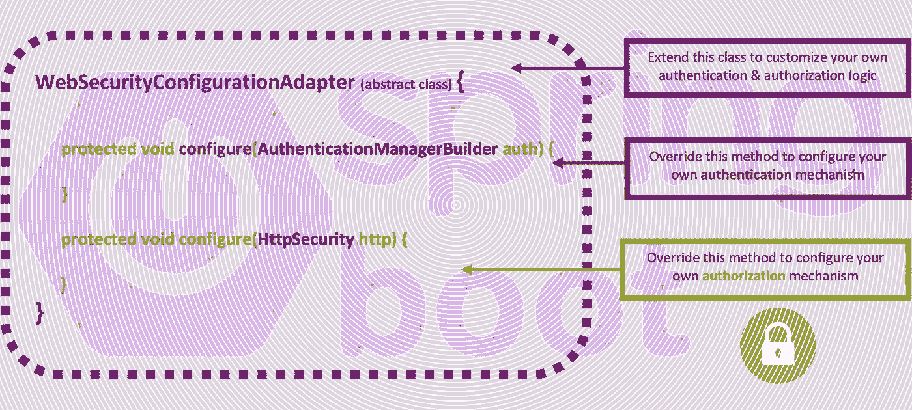
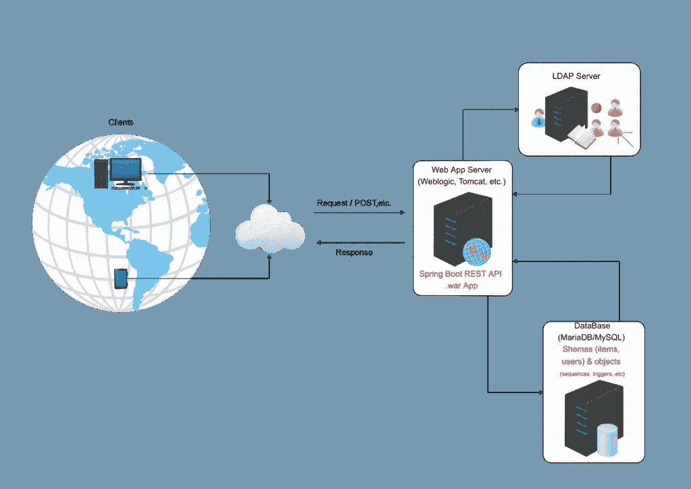
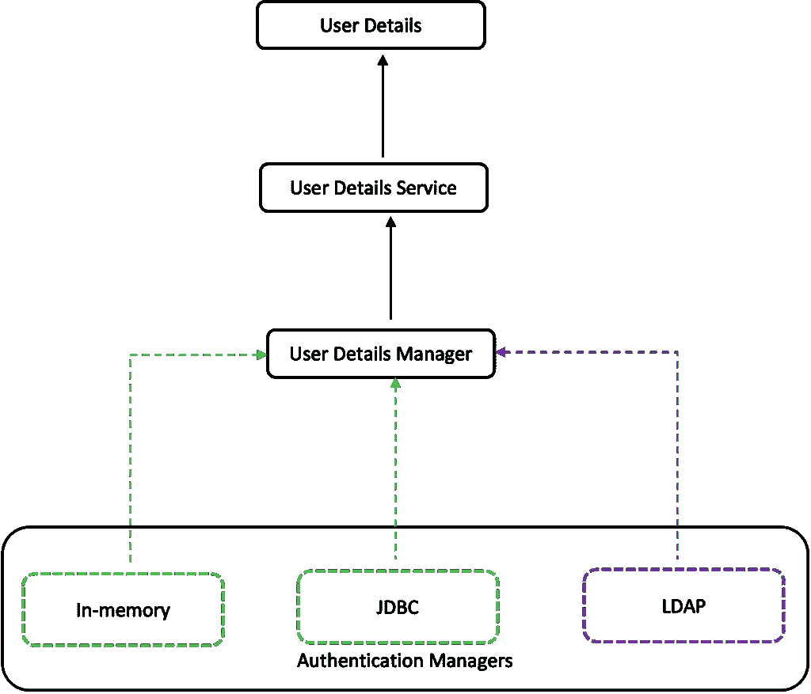

# Spring Boot 安全配置实用讲解—第 3 部分:LDAP 绑定认证

> 原文：<https://blog.devgenius.io/spring-boot-security-configuration-practically-explained-part3-ldap-bind-authentication-5fc318a09aeb?source=collection_archive---------2----------------------->

自定义安全配置类，基于流行和广泛使用的，**WebSecurityConfigurerAdapter。**

# 介绍

这是关于 Spring 安全定制的系列文章中的第 3 篇，该系列文章基于一个定制类的实现，该类扩展了**WebSecurityConfigurerAdapte**r 抽象类。您可以在下面查看以前的帖子:

 [## Spring Boot 安全配置，实用讲解—第一部分:从 Spring Boot 开始…

### 这是关于 Spring 安全定制的系列文章的第一篇，基于一个定制的实现…

medium.com](https://medium.com/@zzpzaf.se/spring-boot-security-configuration-practically-explained-part1-starting-with-spring-boot-35667265f498)  [## Spring Boot 安全配置实用讲解第二部分:JDBC 认证

### 本系列的第二篇文章是关于基于 WebSecurityConfigurerAdapter 的 Spring 安全定制的

medium.com](https://medium.com/@zzpzaf.se/spring-boot-security-configuration-practically-explained-part2-jdbc-authentication-6c0c7bd8d53e) 

> *注:
> 遗留的 Spring Boot 安全配置(扩展了*[***WebSecurityConfigurerAdapte****r*](https://docs.spring.io/spring-security/site/docs/current/api/org/springframework/security/config/annotation/web/configuration/WebSecurityConfigurerAdapter.html)*抽象类)，已经被* [***弃用，正在被基于组件的安全配置***](https://spring.io/blog/2022/02/21/spring-security-without-the-websecurityconfigureradapter) *所取代。但是，由于现有的编码基数庞大，在这里，我们仍然使用****WebSecurityConfigurerAdapter****，并且我们将尝试使用实际例子来提供更好的理解。如果您不希望在使用最新版本的 Spring Boot 时继续在您的 IDE 中看到黄色的警告卷线，您应该使用(切换到)早期版本的 Spring Security(Spring . Security dependency)。* [***这里的***](https://www.devxperiences.com/pzwp1/2022/05/23/spring-boot-security-the-websecurityconfigureradapter-is-not-the-case-anymore/) *是怎么做到的。*

# LDAP 绑定身份验证

## 一般先决条件

既然我们要关注这个主题，那么假设你已经开始熟悉了[**【Spring Boot】**](https://spring.io/guides/gs/spring-boot/)[**REST API**](https://spring.io/guides/tutorials/rest/)[**Maven**](https://maven.apache.org/what-is-maven.html)依赖管理和 [**POM**](https://maven.apache.org/guides/introduction/introduction-to-the-pom.html) 文件、 [**JSON**](https://www.json.org/json-en.html) 以及其他相关主题(Spring 注解，例如 [**@Bean**](https://docs.spring.io/spring-javaconfig/docs/1.0.0.M4/reference/html/ch02s02.html) Spring [**验证**](https://hibernate.org/validator/documentation/getting-started/) ， [**异常处理**](https://spring.io/blog/2013/11/01/exception-handling-in-spring-mvc) ， [**DTO**](https://en.wikipedia.org/wiki/Data_transfer_object) ， [**应用属性**](https://docs.spring.io/spring-boot/docs/current/reference/html/application-properties.html) ，连接数据库使用[**【JDBC**](https://spring.io/guides/gs/relational-data-access/)等。 ).如果您还没有，那么现在是一个开始深入研究 Spring / Spring Boot 的好机会，它是目前最好的 Java 开发框架。

## LDAP 服务器

既然你可以谷歌一下，找到几十个关于 LDAP(轻量级目录访问协议)的帖子，我们就不详细讨论了。此外，我们不打算使用嵌入式 LDAP 服务器，因为很多帖子都提到了它。我们的目的是演示如何使用 Spring Boot 框架实现 LDAP 认证。

但是，您必须能够访问 LDAP 服务器，至少为了测试的目的。这是因为在这篇文章中，我们不会向您展示基于嵌入式 LDAP 服务器的示例(例如，使用[unbound 开源 LDAP 服务器](https://ldap.com/unboundid-ldap-sdk-for-java/)和[unbound LDAP SDK](https://github.com/pingidentity/ldapsdk)for Java)。你可以在网上搜索到几十个帖子(甚至在官方文件[这里](https://spring.io/guides/gs/authenticating-ldap/))。一个好的选择是花一些时间安装免费的 [Apache Directory Studio](https://directory.apache.org/studio/) ，这是一个基于 [Eclipse](https://eclipseide.org/release/) 的 LDAP 浏览器和目录客户端工具，它还捆绑了最新版本的 LDAPV3 认证的 [ApacheDS](https://directory.apache.org/apacheds/) LDAP 服务器。所以用它玩一会儿，您会发现创建和启动一个新的 LDAP 服务器是如此简单！

如果您已经有一个 [Synology NAS](https://www.synology.com/en-global/support/nas_selector) 的话，另一个选择是为 [DSM](https://www.synology.com/en-us/dsm) 设置并使用 [Synology LDAP 服务器](https://www.synology.com/en-global/dsm/packages/DirectoryServer)。它也是基于 LDAPV3 的。使用它的 GUI，您可以在几分钟内设置好您的用户和组。

# LDAP 认证简介

我们将以类似于我们之前看到的方式配置 LDAP 身份验证，即或者通过我们的自定义安全配置类中的 AuthenticationManagerBuilder 使用 ldapAuthentication() **配置器**，或者在同一个类中定义一个[LdapAuthenticationProvider](https://docs.spring.io/spring-security/site/docs/3.0.x/apidocs/org/springframework/security/ldap/authentication/LdapAuthenticationProvider.html)bean。

同样，我们需要两者:验证/认证用户名和密码的**认证器，以及已经授予该用户的**权限/角色**。**

## LDAP 绑定身份验证

你很少会使用 LDAP 服务器来获取用户的密码，并将其与编码器/解码器一起使用，就像我们在之前的帖子中看到的 **Bcrypt** 一样。这种行为肯定是更好的安全选择，因为密码保存在服务器中。因此，这里我们将使用 LDAP [绑定认证](https://docs.spring.io/spring-security/reference/servlet/authentication/passwords/ldap.html#servlet-authentication-ldap-bind)。在[绑定操作](https://ldap.com/the-ldap-bind-operation/)中，LDAP 服务器**不**暴露用户的密码，LDAP 服务器自己负责密码验证/与所提供的用户密码匹配。

Spring Security 的 LDAP 身份验证支持不使用 UserDetailsService(与 JDBC 身份验证一样),因为 LDAP 绑定身份验证不允许客户端读取密码，甚至不允许读取密码的散列版本。这意味着 Spring Security 无法读取和验证密码。因此，在这里，我们将不使用任何 BCryptPasswordEncoder Bean。

然而，Spring 使用了类似的方法，通过 [LdapAuthenticator](https://docs.spring.io/spring-security/site/docs/current/api/org/springframework/security/ldap/authentication/LdapAuthenticator.html) 接口实现了[ldapauthoritiespupulator](https://docs.spring.io/spring-security/site/docs/current/api/org/springframework/security/ldap/userdetails/LdapAuthoritiesPopulator.html)接口。

## LDAP 权限/角色的数量

一旦用户通过了身份验证，LdapAuthenticationProvider 就会使用**ldapaauthoritiespoulator**实现来创建最终的用户详细信息对象。实际上，LdapAuthoritiesPopulator 负责返回授予该用户的权限/角色。

当然，我们可以从 LDAP 服务器获得这些权限或角色，但是，只有在 LDAP 服务器被正确设置为提供这些权限或角色的情况下。**注意，一个组织可以维护几十个甚至几百个应用程序，并且对于给定的用户，授权(权限或角色)因应用程序而异。此外，它们可以保持非常频繁的变化。这对于管理 LDAP 服务器并使其与所有这些应用程序用户和变更保持同步来说是非常痛苦的。**

另一种方法是将用户的集中认证**分配给 LDAP 服务器，并在应用程序数据库**中维护用户的授权。此外，这种方法还提供了其他一些好处，例如可以在应用程序数据库中本地维护的特定应用程序的外部用户的注册，以及用户的权限/角色。

# 履行

所以，我们实际上要做的，是展示如何利用定制的**userdailsservice**类来利用**ldapaauthoritiespoulator**，我们在之前的帖子中已经看到了。

## 实施先决条件

**依赖关系**

有许多可用的依赖项使我们能够使用 LDAP 服务器。然而，这里我们不打算详细讨论 LDAP 对象和/或它们的管理(添加、更改 LDAP 条目等)。).同样，我们不打算使用任何嵌入式 LDAP 服务器进行测试。假设您已经对 LDAP 概念有所熟悉，并且已经可以访问 LDAP 服务器。如果您还没有，您可能会认为这是一个很好的机会来访问官方的 Spring 文档，例如这里，这里，这里的[和这里的](https://docs.spring.io/spring-security/reference/servlet/authentication/passwords/ldap.html#servlet-authentication-ldap-bind)，此外还可以安装 [Apache Directory Studio](https://directory.apache.org/studio/) 并创建/使用 [ApacheDS LDAP 服务器](https://directory.apache.org/apacheds/)的一个实例。

之后，您在项目的 Maven pom.xml 中看到的以下两个依赖项足以满足我们的目的:

application.properties 文件中的连接设置

我们可以使用 LDAP 连接参数，在我们的应用程序中使用文字字符串，但是，将它们放在 **application.properties** 文件中让我们有充分的灵活性。下面只是这些参数的一个例子，你可能需要做一些实验来调整它们以适应你自己的设置。

我们需要的是 LDAP 服务器的访问 URL(LDAP 协议的默认端口是 389)。这是第一行的定义。此外，为了使用绑定身份验证，我们需要在 LDAP 服务器中为我们定义一个管理角色，这将允许我们搜索一个对象，例如一个用户。第 2 行和第 3 行定义了这样做的搜索基础。最后，在第 4 行和第 5 行中，我们提供了经理的凭证。

那些对使用 LDAP 对象有更多经验的人会发现，这里的技巧是我们使用一个过滤器在 LDAP 目录中搜索用户。过滤器本身使用默认的 LDAP 对象( **objectClass** 和 **inetOrgPerson** )，它很可能在大多数简单的情况下都能工作。 **uid={0}** 是请求的基本身份验证标头中的用户凭据中提供的用户名的占位符。

## LdapAuthoritiesPopulator 类的自定义实现

现在，我们可以继续编写代码了。

实现一个自定义的 ldapaauthoritiespoulator 类实际上是 Spring[ldapaauthoritiespoulator](https://docs.spring.io/spring-security/site/docs/current/api/org/springframework/security/ldap/userdetails/LdapAuthoritiesPopulator.html)接口的[**getGrantedAuthorities**](https://docs.spring.io/spring-security/site/apidocs/org/springframework/security/ldap/userdetails/LdapAuthoritiesPopulator.html#getGrantedAuthorities(org.springframework.ldap.core.DirContextOperations,%20java.lang.String))()方法的自定义。

**getGrantedAuthorities** ()方法的实现需要两个参数。在用户被认证之后，userData 对象和用户名都由 Spring 机制自动传入(通过实现来自 LDAP 认证器的 [DirContextOperations](https://docs.spring.io/spring-ldap/docs/current/apidocs/org/springframework/ldap/core/DirContextOperations.html) 接口— [DirContextAdapter](https://docs.spring.io/spring-ldap/docs/current/apidocs/org/springframework/ldap/core/DirContextAdapter.html) 类)。

getGrantedAuthorities()方法的实现应该返回授予经过身份验证的用户的权限列表。该列表被定义为 [GrantedAuthority](https://docs.spring.io/spring-security/site/apidocs/org/springframework/security/core/GrantedAuthority.html) 对象的**集合**。正如官方文档所述:“GrantedAuthority 必须要么将自己表示为一个字符串，要么由一个 [AccessDecisionManager](https://docs.spring.io/spring-security/site/apidocs/org/springframework/security/access/AccessDecisionManager.html) 专门支持。”，我们可以实现 getGrantedAuthorities()方法来返回字符串的数组列表。下面是我们如何做到这一点:

我们实际所做的，无非是重用我们的自定义**用户详细信息服务**，即服务类**自定义用户详细信息服务**。因为这个类实现了 [UserDetailsService](https://docs.spring.io/spring-security/site/docs/current/api/org/springframework/security/core/userdetails/UserDetailsService.html) 接口，所以它也实现了方法**loaduserbysusername**()。loadUserByUsername()方法依次返回一个 [UserDetails](https://docs.spring.io/spring-security/site/docs/current/api/org/springframework/security/core/userdetails/UserDetails.html) 对象。最后，我们通过访问 **getAuthorities** ()方法获得用户的权限。

当然，我们的自定义 UserDetailsService 实现再次使用我们的 **UsersRepo** ，这是真正的工作，通过获得用户权限(角色)的用户对象并调用 Repo 的方法 **findByName** ()。这实际上是通过与我们的 MariaDB/MySQL 通信的 JDBCTemplate 实现的。然而，我们必须在这里强调一下，存储在 MariaDB/MySQL 模式中“users”表的“password”列中的密码与 LDAP 服务器中的密码没有任何关系。只有用户名应该是相同的。

因此，实现一个定制的 LdapAuthoritiesPopulator 非常容易，因为我们重用了已经存在的类 UserService(和 UsersRepo)。正如我们已经说过的，通过这种方式，**我们可以独立于 LDAP 服务器维护用户的授权和角色，此外，我们还可以提供一些预定义的权限/角色，例如为在我们的 UsersRepo 中找不到的用户(例如外部用户)**。

接下来，我们将使用 LdapAuthoritiesPopulator 的自定义实现(即我们的类 LdapUserAuthoritiesPopulator)和两者:一个**LdapAuthenticationProviderConfigurer**和一个**LdapAuthenticationProvider**。

## 通过 AuthenticationManagerBuilder 使用 LdapAuthenticationProviderConfigurer

类似地，与我们之前实现 jdbcAuthentication()一样，这里我们将实现[**ldapAuthentication**](https://docs.spring.io/spring-security/site/docs/4.0.x/apidocs/org/springframework/security/config/annotation/authentication/builders/AuthenticationManagerBuilder.html#ldapAuthentication--)**()**。ldapAuthentication()也是 Spring 安全类[AuthenticationManagerBuilder](https://docs.spring.io/spring-security/site/docs/4.0.x/apidocs/org/springframework/security/config/annotation/authentication/builders/AuthenticationManagerBuilder.html)提供的方法。该方法返回一个[**LdapAuthenticationProviderConfigurer**](https://docs.spring.io/spring-security/site/docs/4.0.x/apidocs/org/springframework/security/config/annotation/authentication/configurers/ldap/LdapAuthenticationProviderConfigurer.html)，允许我们配置/定制 LDAP 认证。

整个安全配置类变成:

的。ldapAuthentication()。 **contextSource** ()允许轻松配置一个[BaseLdapPathContextSource](https://docs.spring.io/spring-ldap/docs/current/apidocs/org/springframework/ldap/core/support/BaseLdapPathContextSource.html)。它返回一个 LdapAuthenticationProviderConfigurer。 **ContextSourceBuilder** 进行进一步定制。真正需要配置的是 LDAP 服务器 URL(。url)以及凭证(。managerDn 和。具有管理权限的 LDAP 用户(例如 LDAP 服务器管理员)的 managerPassword。它们都可以通过一个环境对象从 **application.properties** 文件设置中获得。

之后，我们必须添加搜索和验证应该被认证的用户(主体)的配置，最后，我们使用我们的自定义 UserAuthoritiesPopulator(我们之前已经看到过)为他/她分配权限。

在这里，出于搜索的目的，我们使用一个**用户搜索过滤器**，它也是从**应用程序.属性**文件中的环境变量获得的。

找到这里的 [**回购**](https://github.com/zzpzaf/restapidemo_mysql_ldap-configurer_security) 到目前为止的代码。

## 将 LdapAuthenticationProvider 的 beans 与 BindAuthenticator 一起使用

同样，这里我们将使用 n 身份验证提供者 Bean，但这次它将是 LdapAuthenticationProvider。此外，由于我们将使用绑定身份验证，我们必须相应地配置我们的 LdapAuthenticationProvider。这可以通过配置和使用另一个 bean(绑定验证器 Bean)来完成。authenticator bean 以及自定义的 UserAuthoritiesPopulator(我们之前已经看到过)作为参数传递给我们的 LdapAuthenticationProvider bean。最后，我们还必须配置 Spring 安全上下文，即用于访问我们首选的 LDAP 服务器的 DefaultSpringSecurityContextSource。

实际上，这与我们之前用 DaoAuthenticationProvider Bean 实现 jdbcAuthentication()几乎是一样的。

因此，整个自定义安全配置类变成:

或许，你可以理解逻辑与 jdbc 非常相似的事实，我们使用了配置器。但是这一次，实现了 Java OOP 和 Spring 框架提供的“关注点分离”原则，使得我们的代码更加整洁。对于更复杂的项目来说，这无疑是更好的方法。

在这里找到回购[中的最终代码。](https://github.com/zzpzaf/restapidemo_mysql_ldap-LdapAuthenticationProvider-Bean-with-BindAuthenticator)

# 结论—要点

有一件事必须牢记在心。无论我们使用什么身份验证机制，我们都必须在我们的自定义安全配置类中提供一个身份验证对象，提供经过身份验证的用户(主体)的详细信息。下面的模式描述了认证机制是如何工作的，以及到目前为止我们实际上看到了什么(包括这篇文章以及前两篇文章)。

[Spring Boot 安全配置，实用讲解—第二部分:JDBC 认证](https://www.devxperiences.com/pzwp1/2022/05/19/spring-boot-security-configuration-practically-explained-part2-jdbc-authentication/)

[Spring Boot 安全配置，实用讲解—第一部分:从 Spring Boot 安全和基本 HTTP 认证开始](https://www.devxperiences.com/pzwp1/2022/05/17/spring-boot-security-configuration-practically-explained/)

到此为止！我希望你喜欢它！
感谢您的阅读！

PS:最初发布在我的博客网站上，[这里](https://www.devxperiences.com/pzwp1/2022/05/27/spring-boot-security-configuration-practically-explained-part3-starting-with-spring-boot-security-and-ldap-bind-authentication/)。